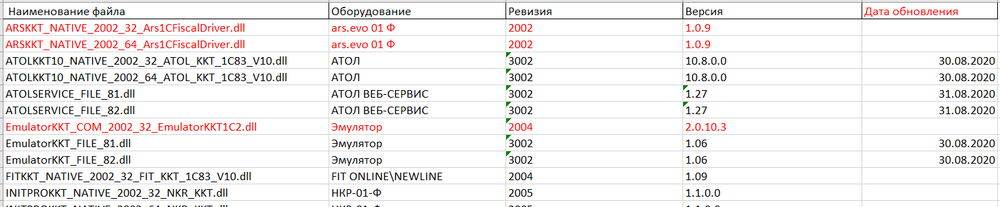
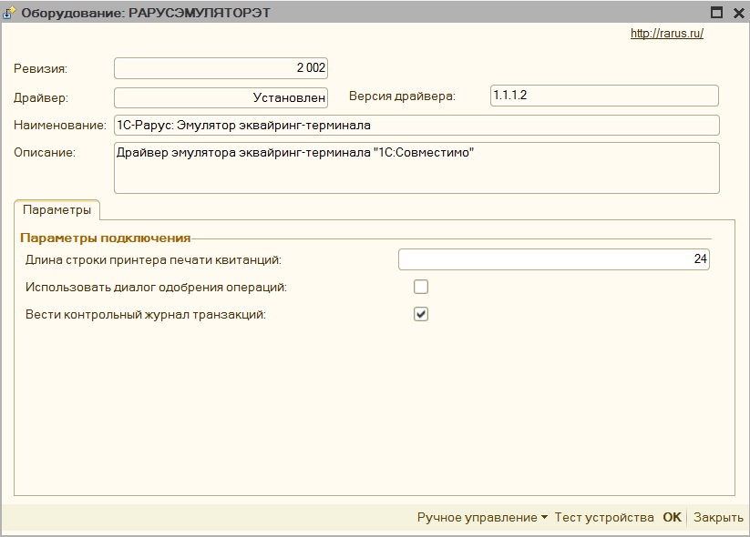

# Подключение #

[в начало](README.md#навигация)

[Видео-пример подключения](https://www.youtube.com/watch?v=i_1eexDzheM)

1. Установите драйвера для вашего оборудования, их можно скачать с официального сайта производителя.

1. Добавить обработку в торговое оборудование, обработка подключается как «**фискальный регистратор**» или как «**ККТ**», если ваша программа поддерживает такой способ подключения. Для Альфа-Авто обработка подключается в справочнике **"Оборудование"**

1. Нажмите **"настроить параметры"** и примите Лицензионное соглашение
   

1. Откроется форма первоначальной настройки:

   

   - укажите **"модель оборудования"**, если вашей модели нет в списке, то просто выберите похожую.
   - укажите **"путь к компонентам ТО"**, если вы их уже скачали, либо нажмите на ссылку **"Скачать компоненты оборудования"** и скачайте компоненты для вашей операционной системы (Windows или Linux), и распакуйте их в доступный каталог, после этого выберите папку с ними в указанном поле.
   - выберите вашу систему налогообложения - "по умолчанию"
   - укажите тип лицензии, которую хотите активировать или "демо"
   - если необходимо активировать лицензию, нажмите на "**Получить ключ**" и воспользуйтесь инструкцией для [формы лицензирования](licensing.md#форма-лицензирования)
   - если по каким-либо причинам при активации появляется ошибка, то можно нажать "**Использовать COM компоненту для обертки NATIVE**", которая будет использовать компоненту [прослойку](#особенность-подключения-81) между обработкой и оборудованием
   - нажмите "**активировать**" - откроется форма [основных настроек обработки](parameters_description.md)

## Компоненты оборудования ##

Для печати фискальных чеков Обработка использует не собственный функционал, а компоненты от производителей этого оборудования, которые были специально разработаны для использования в 1С. Все компоненты расположены в каталоге "Путь к компонентам ТО" и скачиваются отдельно. Компоненты могут различаться:

- способом подключения - COM или NATIVE;
- форматом использования, так называемая ревизия интерфейса.
    >Чем выше ревизия, тем больше данных для передачи на оборудования компонента, а значит и обработка поддерживает. Наиболее актуальная на данный момент ревизия - 3003
- разрядностью компоненты - 32х или 64х битные.
    > Разрядность определяет на какой разрядности платформы 1С они могут работать, и какой разрядности драйвера должны быть установлены. В частности, версия платформы 1С 8.1 и 8.2, всегда 32-х битные, самые последние версии платформы 8.3 уже могут встречаться 64-х битные.

Для того, чтобы компоненты в каталоге можно было обновлять независимо от обработки, их нужно называть особым образом, чтобы программа их могла динамически считать:

\[**Наименование оборудования**\]\_\[**Тип компоненты**\]\_\[**Тип драйверов**\]\_\[**Разрядность компоненты**\]\_\[**Наименование драйвера в реестре**\]

Например, в наименовании компоненты ATOLKKT_COM_2001_32_ATOL_KKM_1C82_54FZ. Наименование оборудования: ATOLKKT, Тип компоненты: COM, Тип драйверов: 2001, Разрядность компонентыС: 32х битная, наименование драйвера в реестре: ATOL_KKM_1C82_54FZ

Вы можете добавить свои компоненты, если сформируете их наименование по данному шаблону. Если модели оборудования нет в списке поддерживаемых, то помимо компоненты ее нужно будет еще добавить в обработку, добавив строку в макет "Список моделей"

Основные поддерживаемые компоненты собраны в одном каталоге, и их можно скачать по [ссылке](https://yadi.sk/d/kGvUG04fjvdBcw), также в этом каталоге находится **"Дайджест компонент"**, где содержится информации о дате обновления компоненты, поддерживаемой операционной системе и поддерживаемом формате.

## Особенность подключения 8.1 ##

Для корректной работы с компонентами Native на платформе 8.1 необходимо дополнительно зарегистрировать 2 компоненты. Они находятся в каталоге с другими компонентами, и называются **WrapperNative.dll** и **UniversalNativeWrapper.dll**. Зарегистрировать их нужно через командную строку командой **regsvr32.** Данные компоненты работают как обертка для **Native** компонент, без их регистрации не будет работать печать QR кодов, и драйвера оборудования, работающие через **Native**, например, АТОЛ.

> **Примечание:**
> **NATIVE** компоненты – это такие dll, использующие внутренний формат 1С, что позволяет их не регистрировать как компоненты com

Пример: [Как зарегистрировать компоненту](http://fb.ru/article/290527/kak-zaregistrirovat-dll-tri-sposoba)

## Особенность подключения Linux ##

Для корректной работы обработки на Linux необходимо скачать вместо «Макеты компонент для Windows» «макеты компонент для Linux», в остальном же способ подключения и активации точно такой же.

## Особенность подключения Рарус ##

[Инструкция](rarus_connecting.md) по подключению обработки в Рарус

## Особенность подключения Далион ##

Если вы хотите встроить обработку для работы онлайн кассами так, чтобы можно было печатать чеки прямо из документов, то нужно скачать [«комплект интеграции Далион»](https://yadi.sk/d/tjh2wiDwnEIewA) и подключить его по этой [видео инструкции](https://www.youtube.com/watch?v=1iRL_sfTyyE)

## Особенность подключения УТ 10.2 ##

Для конфигурации **Управление торговлей 10.2** нет типового способа подключить обработку для печати прямо из документов, поэтому необходимо скачать [«Комплект интеграции УТ 10.2»](https://yadi.sk/d/gj8IquqxJMu49A) и доработать конфигурацию по этой [видео инструкции](https://www.youtube.com/watch?v=P2aMi6Kd7Tc).

>**Обратите внимание** хоть перечисленные конфигурации и требуют комплект интеграции, использовать обработку можно и без них. Для этого откройте обработку через «Файл» - «Открыть». Откроется окно «**формы отладки**», в ней можно добавить новое подключение к оборудованию, и печатать чеки по кнопке «Напечатать фискальный чек» - «Предопределенный»

## Подключение эквайринговых терминалов ##

В обработку можно подключить эквайринговый терминал, минуя стандартный способ подключения. Для этого в форме настройки нужно заполнить «Путь к компонентам», где указывается путь к компонентам эквайринга, данные компоненты можно скачать там же, где была загружена основная обработка.

Для подключения эквайринга, нужно выбрать тип оборудования из списка, и указать произвольное наименование. Затем нажать «**Настроить дополнительное оборудование**», в открывшейся форме указать параметры подключения эквайринга. После этого можно проверить подключение по кнопке «**Тест устройства**». Также в данной форме по кнопке «Ручное управление» можно снять «**Итоги дня по картам**».

Когда подключение успешно, то необходимо будет указать условие, когда применять эквайринговый терминал для этого см. [Механизм распределения](mechanism_distribution.md)

## Подключение дополнительного оборудования ##

К обработке помимо основного фискального регистратора можно подключить и дополнительные, данный функционал можно использовать, когда необходимо, например, разделить акцизный товар с обычным и пробивать его по другой кассе, либо есть другой фискальный регистратор, зарегистрированный на другую организацию. Для этого добавьте новую строку, укажите тип оборудования и произвольное наименование.

Нажмите на кнопку «**Настроить дополнительное оборудование**», откроется окно аналогичное форме с параметрами основного фискального регистратора, однако в нем будут только параметры для физического подключения оборудования, значения остальных полей будут браться из настроек основного оборудования.

Для настройки распределения фискальных регистраторов по чекам см. [Механизм распределения](mechanism_distribution.md)
