# Подключение #

[Актуальная версия программы](https://yadi.sk/d/jcdpGNZ43WQtro)

[Видео-пример подключения](https://www.youtube.com/watch?v=i_1eexDzheM)

1. Установите драйвера для вашего оборудования, их можно скачать с официального сайта производителя.

2. Добавить обработку в торговое оборудование, обработка подключается как «**фискальный регистратор**» или как «**ККТ**», если ваша программа поддерживает такой способ подключения. Для Альфа-Авто обработка подключается в справочнике **"Оборудование"**. [Подробнее](#особенность-подключения-управление-торговлей-103) 


Ниже — переработанный вариант инструкции. Я сохранил ваш смысл, но:

* упростил формулировки;
* логически разложил шаги;
* добавил пояснения «зачем это нужно»;
* привёл текст к ровному, инструктивному стилю;
* использовал **Markdown без сложных конструкций**, как вы просили.

---

# Первоначальная настройка программы

### Шаг 1. Принятие лицензионного соглашения

1. Нажмите кнопку **«Настроить параметры»**.
2. В открывшемся окне примите **Лицензионное соглашение**.

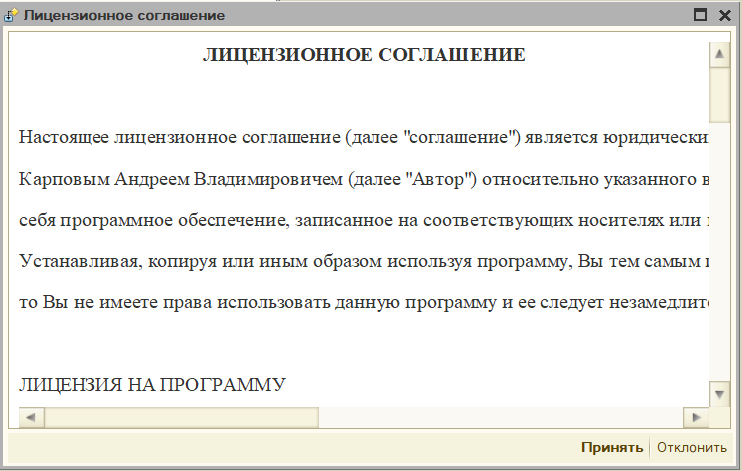

Без принятия лицензионного соглашения дальнейшая настройка недоступна.

---

### Шаг 2. Форма первоначальной настройки

После принятия соглашения откроется форма **первоначальной настройки**.

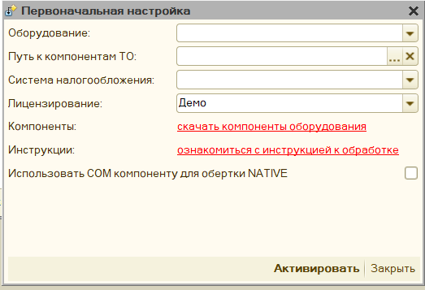

В этой форме необходимо последовательно выполнить следующие действия.

---

### 2.1. Указание пути к компонентам торгового оборудования

В поле **«Путь к компонентам ТО»** укажите каталог с компонентами оборудования.

Возможны два варианта:

* **Компоненты уже скачаны**
  Укажите путь к папке, в которую они были ранее распакованы.

* **Компоненты ещё не скачаны**
  Нажмите ссылку **«Скачать компоненты оборудования»**,
  выберите вашу операционную систему (**Windows** или **Linux**),
  скачайте архив и распакуйте его в любой доступный каталог,
  после чего укажите путь к этой папке.

---

### 2.2. Выбор компоненты торгового оборудования

#### Мастер подключения компонент (начиная с версии 4.10)

Начиная с версии обработки **4.10**, доступен **мастер подключения компонент**.

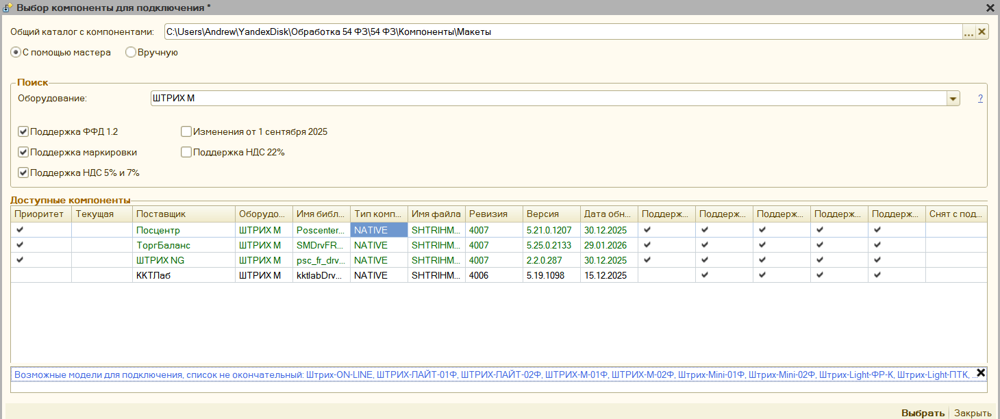

Мастер предназначен для упрощения выбора нужной компоненты, так как:

* список компонент постоянно расширяется;
* одно и то же оборудование может поддерживаться разными поставщиками.

Порядок работы с мастером:

1. **Выберите модель оборудования**
   Модели представлены в обобщённом виде.
   Например, не требуется различать *АТОЛ 30Ф* и *АТОЛ 22Ф* — достаточно выбрать **«АТОЛ»**.

2. **Просмотр списка поддерживаемых моделей (при необходимости)**
   Рядом с выбором оборудования расположен значок **?**.
   Нажатие на него выводит список конкретных поддерживаемых моделей.

3. **Выберите необходимую функциональность**
   Например:

   * поддержка маркировки;
   * поддержка ставки НДС 22%.

   После выбора функциональности список компонент будет автоматически отфильтрован по совместимости.

4. **Выбор конкретной компоненты**

   * Наиболее подходящие компоненты отмечаются **зелёным цветом**
     (обычно это компоненты с наибольшей ревизией).
   * В некоторых случаях доступно несколько компонент от разных поставщиков.
     Например, для оборудования **Штрих** могут быть доступны компоненты от:

     * ККТЛаб
     * ТоргБаланс
     * Посцентр
     * OpenSource-библиотеки

   В этом случае пользователь самостоятельно выбирает наиболее подходящий вариант.

5. Выделите нужную компоненту и нажмите кнопку **«Выбрать»**.

---

#### Выбор компоненты в версиях до 4.10

В версиях обработки **до 4.10** мастер отсутствует.
В этом случае необходимо вручную выбрать значение в поле **«Модель оборудования»** из списка.

---

### 2.3. Выбор системы налогообложения

В поле **«Система налогообложения»** выберите значение **«По умолчанию»**,
если не требуется использование специфических режимов.

---

### 2.4. Выбор и активация лицензии

1. Укажите **тип лицензии**:

   * коммерческая лицензия;
   * либо **демо**.

2. Для активации лицензии нажмите кнопку **«Получить ключ»**
   и следуйте инструкции для
   [формы лицензирования](licensing.md#форма-лицензирования).

---

### 2.5. Использование COM-компоненты (при ошибках активации)

Если при активации лицензии возникают ошибки, можно включить опцию:

**«Использовать COM компоненту для обёртки NATIVE»**

В этом режиме будет использована специальная компонентa-прослойка
между обработкой и торговым оборудованием.

Подробное описание см. в разделе
[Особенности подключения 8.1](#особенность-подключения-81).

---

### Шаг 3. Завершение первоначальной настройки

После заполнения всех параметров нажмите кнопку **«Активировать»**.

Будет открыта форма
[основных настроек обработки](parameters_description.md),
в которой выполняется дальнейшая конфигурация программы.


## Компоненты оборудования ##

Для печати фискальных чеков Обработка использует не собственный функционал, а компоненты от производителей этого оборудования, которые были специально разработаны для использования в 1С. Все компоненты расположены в каталоге "Путь к компонентам ТО" и скачиваются отдельно. Компоненты могут различаться:

- способом подключения - COM или NATIVE;
- форматом использования, так называемая ревизия интерфейса.
    >Чем выше ревизия, тем больше данных для передачи на оборудования компонента, а значит и обработка поддерживает. Наиболее актуальная на данный момент ревизия - 3003
- разрядностью компоненты - 32х или 64х битные.
    > Разрядность определяет на какой разрядности платформы 1С они могут работать, и какой разрядности драйвера должны быть установлены. В частности, версия платформы 1С 8.1 и 8.2, всегда 32-х битные, самые последние версии платформы 8.3 уже могут встречаться 64-х битные.

### Подключение компонент, начиная с версии 4.10

Начиная с версии обработки **4.10**, был добавлен **мастер подключения компонент**.
Это упростило процесс подключения и обновления оборудования.

Теперь:

* **не требуется** называть файлы компонент по строгому шаблону;
* новую компоненту можно подключить:

  * либо указав информацию о ней в файле **`ОписаниеКомпонент.mxl`**;
  * либо подключив компоненту **вручную** через мастер.

Файл **`ОписаниеКомпонент.mxl`** располагается **в каждом каталоге с компонентами**
и содержит описание доступных компонент в данном каталоге.

Также в мастере доступен пункт **ручного подключения компоненты**, если она отсутствует в описании.

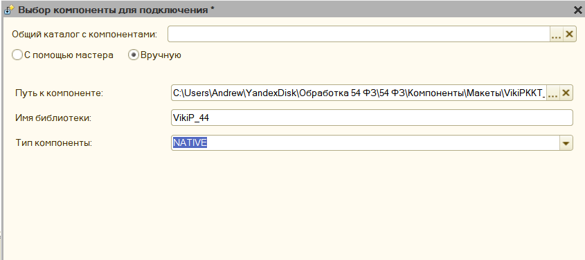

---

### Подключение компонент в версиях до 4.10

В версиях обработки **до 4.10** мастер подключения отсутствует.
Для того чтобы компоненты можно было обновлять **независимо от обработки**,
их необходимо называть **строго по определённому шаблону**.

#### Шаблон наименования компоненты

```
[Наименование оборудования]_[Тип компоненты]_[Тип драйверов]_[Разрядность компоненты]_[Наименование драйвера в реестре]
```

#### Пример

```
ATOLKKT_COM_2001_32_ATOL_KKM_1C82_54FZ
```

Расшифровка примера:

* **Наименование оборудования** — `ATOLKKT`
* **Тип компоненты** — `COM`
* **Тип драйверов** — `2001`
* **Разрядность компоненты** — `32` (32-битная)
* **Наименование драйвера в реестре** — `ATOL_KKM_1C82_54FZ`

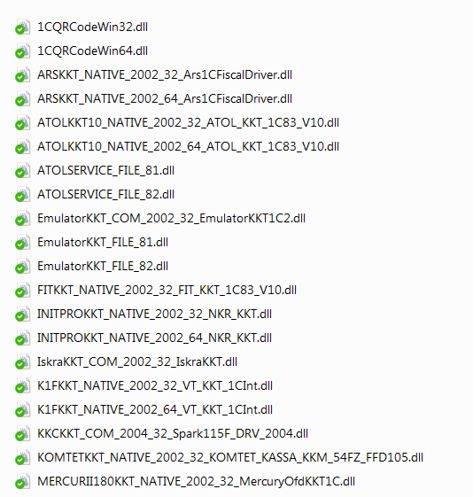

---

### Добавление собственных компонент

Вы можете использовать собственные компоненты, если:

1. Сформируете имя файла компоненты **строго по указанному шаблону**.
2. Если модель оборудования **отсутствует в списке поддерживаемых**,
   необходимо дополнительно добавить её в обработку.

Для этого нужно:

* открыть макет **«Список моделей»**;
* добавить новую строку с описанием модели оборудования.

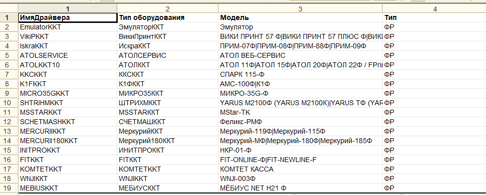

---

### Каталог поддерживаемых компонент

Основные поддерживаемые компоненты собраны в **едином каталоге**
и доступны для скачивания по ссылке:

[https://yadi.sk/d/kGvUG04fjvdBcw](https://yadi.sk/d/kGvUG04fjvdBcw)

В этом же каталоге находится файл **«Дайджест компонент»**, в котором указана:

* дата обновления компоненты;
* поддерживаемая операционная система;
* поддерживаемый формат компоненты.

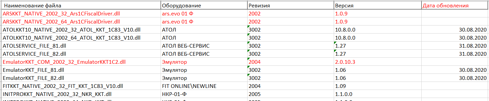

## Что такое ревизия драйвера? ##

Периодически при использовании описания компонент работы с торговым оборудованием, используется слово "**Ревизия**" интерфейса или драйвера. Данным словом описывается какую функциональность поддерживает та или иная компонента, например, поддержка ФФД 1.2 появилась с ревизии 3.4, в обработка она отображается как 3004. Ревизию определяет фирма 1С, выдвигая определенные требования к производителям торгового оборудования, таким образом заявляя, если вы хотите работать с нами, то вы должны поддерживать следующий функционал. Требования описаны на ИТС в разделе ["Требования к разработке драйверов"](https://its.1c.ru/db/metod8dev/content/4829/hdoc). Чем выше ревизия - тем больше возможностей компонента и обработка будут поддерживать. 

Однако надо учитывать, что компоненты с более высокой ревизией могут потребовать новее драйвера, а возможно и прошивку для вашего оборудования. Чтобы увидеть какой ревизии ваша компонента, надо зайти в параметры обработки, Она отображается на первой закладке "Системные параметры" в одноименной поле.
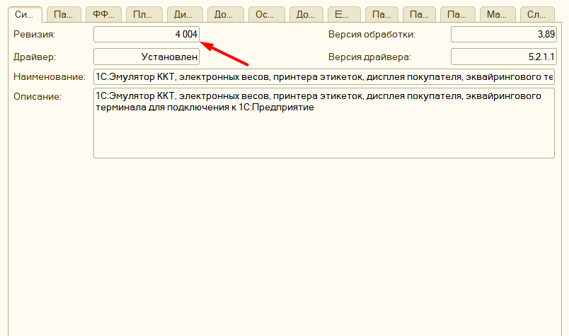 

Далее указанную ревизию можно проверить на актуальность, для этого можно открыть ["дайджест компонент"](https://disk.yandex.ru/i/dUyvw7co3Ctj-g) и найти нужную комоненту для вашего оборудования, в колонке "**ревизия**" будет указана актуальная ревизия для данных драйверов, если нужную компоненту не получилось найти, то возможно она перемещена на лист "Сняты с поддержки"


## Особенность подключения 8.1 ##

Для корректной работы с компонентами Native на платформе 8.1 необходимо дополнительно зарегистрировать 2 компоненты. Они находятся в каталоге с другими компонентами, и называются **WrapperNative.dll** и **UniversalNativeWrapper.dll**. Зарегистрировать их нужно через командную строку командой **regsvr32.** Данные компоненты работают как обертка для **Native** компонент, без их регистрации не будет работать печать QR кодов, и драйвера оборудования, работающие через **Native**, например, АТОЛ.

> **Примечание:**
> **NATIVE** компоненты – это такие dll, использующие внутренний формат 1С, что позволяет их не регистрировать как компоненты com

Пример: [Как зарегистрировать компоненту](http://fb.ru/article/290527/kak-zaregistrirovat-dll-tri-sposoba)

## Особенность подключения Linux ##

Для корректной работы обработки на Linux необходимо скачать вместо «Макеты компонент для Windows» «макеты компонент для Linux», в остальном же способ подключения и активации точно такой же.

## Особенность подключения Рарус ##

[Инструкция](rarus_connecting.md) по подключению обработки в Рарус

## Особенность подключения Далион ##

Если вы хотите встроить обработку для работы онлайн кассами так, чтобы можно было печатать чеки прямо из документов, то нужно скачать [«комплект интеграции Далион»](https://yadi.sk/d/tjh2wiDwnEIewA) и подключить его по этой [видео инструкции](https://www.youtube.com/watch?v=1iRL_sfTyyE)


## Особенность подключения УТ 10.2 ##

Для конфигурации **Управление торговлей 10.2** нет типового способа подключить обработку для печати прямо из документов, поэтому необходимо скачать [«Комплект интеграции УТ 10.2»](https://yadi.sk/d/gj8IquqxJMu49A) и доработать конфигурацию по этой [видео инструкции](https://www.youtube.com/watch?v=P2aMi6Kd7Tc).

>**Обратите внимание** хоть перечисленные конфигурации и требуют комплект интеграции, использовать обработку можно и без них. Для этого откройте обработку через «Файл» - «Открыть». Откроется окно «**формы отладки**», в ней можно добавить новое подключение к оборудованию, и печатать чеки по кнопке «Напечатать фискальный чек» - «Предопределенный»


## Особенность подключения Управление торговлей 10.3  ##

>**Обратите внимание**, данная инструкция применима также для конфигурации Комплексная автоматизация 1 и Управление производственным предприятием 1.3.

Подключение устройства к программе производится в обработке Подключение и настройка торгового оборудования (интерфейс Полный, меню Сервис - Торговое оборудование) на закладке ККТ с передачей данных.
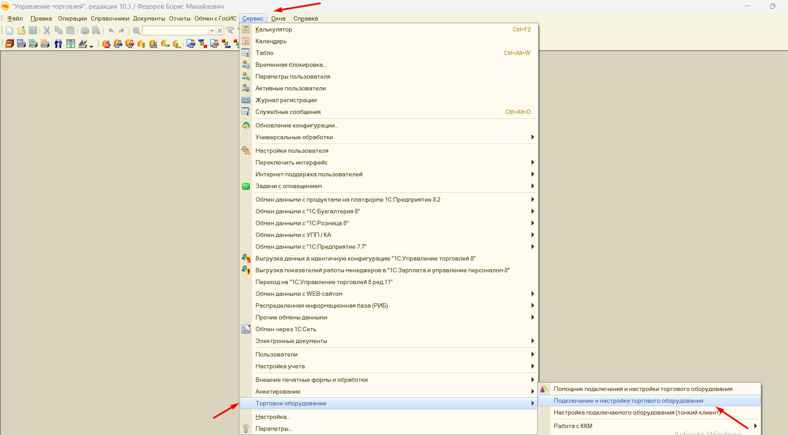

Пользователю необходимо создать новый элемент справочника Торговое оборудование, указав обработку обслуживания с типом оборудования ККТ с передачей данных и модель оборудования, а также заполнить поле Наименование.

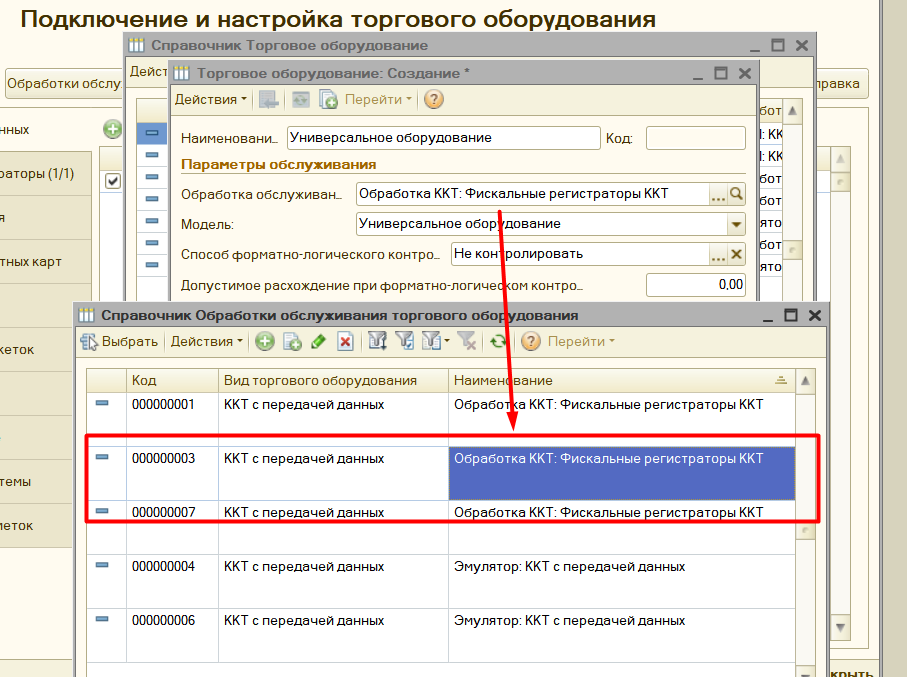

Далее необходимо указать кассу ККМ организации, в которой будет производиться продажа товаров на данном фискальном устройстве.

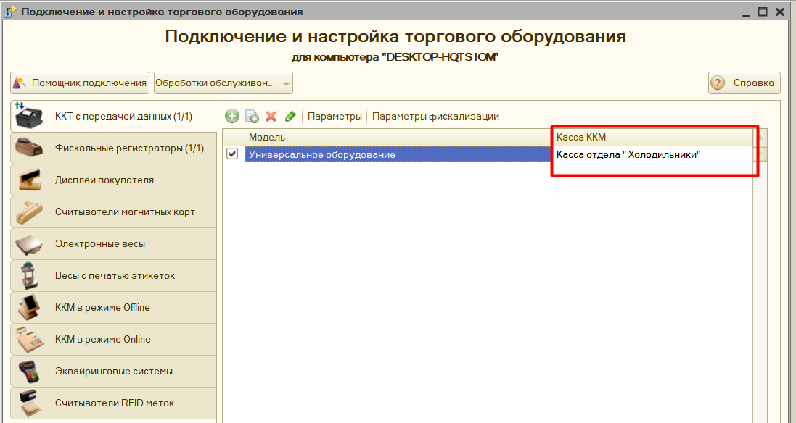


## Структура архива с обработкой ##

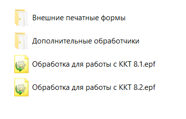

Архив с обработкой состоит из следующих файлов:

- «**Обработка для работы с ККТ 8.2.epf**» - Основная обработка для платформы 1С 8.2 (также подходит для платформы 8.3, но только для обычных форм)

- «**Обработка для работы с ККТ 8.1.epf**» - Основная обработка для платформы 1С 8.1

- «**Дополнительные обработчики\\KKT_DEVELOPE_8_2.epf**» - обработка для платформы 8.2 или 8.3, в которую можно внести свой код и подключить к основной обработке, для изменения функционала печати.

- «**Дополнительные обработчики\\KKT_DEVELOPE_8_1.epf**» - обработка для платформы 8.1, в которую можно внести свой код и подключить к основной обработке, для изменения функционала печати.

- «**Внешние печатные формы\\ВПФ_Чек_8_1.epf**» - обработка для платформы 8.1, является внешней печатной формой, подключается к выбранном документу, через типовой механизм подключения внешних печатных форм. Таким образом можно  добавить функционал печати чеков для тех документов, что его не поддерживают.

- «**Внешние печатные формы\\ВПФ_Чек_8_2.epf**» - для платформы 8.2 или 8.3, является внешней печатной формой, подключается к выбранном документу, через типовой механизм подключения внешних печатных форм. Таким образом можно добавить функционал печати чеков для тех документов, что его не поддерживают.

- «**Внешние печатные формы\\ВПФ_ЧекКоррекции_8_2.epf**» - для платформы 8.2 или 8.3, является внешней печатной формой, подключается к выбранном документу, через типовой механизм подключения внешних печатных форм. Таким образом можно добавить функционал печати чека коррекции для тех документов, что его не поддерживают.

- «**Внешние печатные формы\\ВПФ_ЧекКоррекции_8_1.epf**» - обработка для платформы 8.1, является внешней печатной формой, подключается к выбранном документу, через типовой механизм подключения внешних печатных форм. Таким образом можно добавить функционал печати чека коррекции для тех документов, что его не поддерживают.

## Как обновить ранее приобретенную программу? ##

Обновления на программу привязаны к сроку [технической поддержки](licensing.md#особенность-получения-обновлений-и-технической-поддержки). Если техническая поддержка активна, либо требуется перейти на последнюю доступную версию, то это можно сделать так:

1. Скачайте обновленную обработку, это можно сделать:
   - на сайте, где приобреталась программа
   - через параметры программы по кнопке "Ручное управление" - "Скачать обработку" и выбрав актуальную версию.
   - либо, если параметры недоступны, то открыв обработку, через меню "Файл"- "открыть". В появившемся окне нажать "Лицензирование" - "Скачать обработку"
2. Помимо обработки также необходимо скачать и [актуальные компоненты](connecting.md#компоненты-оборудования). Необходимость обновления компонент связана с тем, что обычно последняя версия программы требуется при изменении законодательства, либо прошивки фискального регистратора, и такая поддержка есть только в новых компонентах.
3. После этого необходимо заменить вашу старую обработку на новую, предварительно нужно распаковать архив, в котором расположена новая версия программы:
   - если конфигурация Управление торговлей 10.3 или похожие:
     - откройте справочник "Обработки обслуживания торгового оборудования";
     - найдите в списке старую обработку;
     - в форме объекта нажмите "открыть файл" и выберите новую версию в каталоге, при этом обновится номер версии в поле "Версия" справочника;
     - перезапустите 1С, чтобы обновился кэш настроек;
     - откройте параметры программы и заново их сохраните, при этом новые поля настроек сохранятся по умолчанию;
     - перезапустите 1С еще раз.

   - если конфигурация Рарус (Альфа-Авто и т.д)
     - Откройте справочник оборудование, найдите там оборудование с моделью "универсальное оборудование";
     - В форме объекта на закладке "Внешняя обработка" нажмите на значок "Папка" и выберите новую версию программы в каталоге;
     - Нажмите "настроить параметры" и заново их сохраните, при этом новые поля настроек сохранятся по умолчанию;
     - Сохраните изменения в справочнике и перезапустите 1С ([подробнее](rarus_connecting.md#подключение-оборудования))

## Подключение эквайринговых терминалов ##

В обработку можно подключить эквайринговый терминал, минуя стандартный способ подключения. Для этого в форме настройки нужно заполнить «Путь к компонентам», где указывается путь к компонентам эквайринга, данные компоненты можно скачать там же, где была загружена основная обработка.

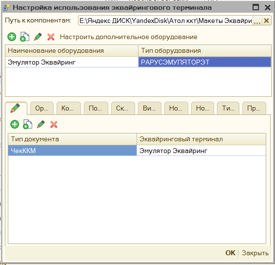

Для подключения эквайринга, нужно выбрать тип оборудования из списка, и указать произвольное наименование. Затем нажать «**Настроить дополнительное оборудование**», в открывшейся форме указать параметры подключения эквайринга. После этого можно проверить подключение по кнопке «**Тест устройства**». Также в данной форме по кнопке «Ручное управление» можно снять «**Итоги дня по картам**».

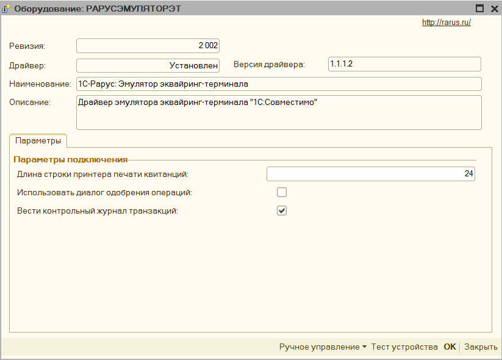

Когда подключение успешно, то необходимо будет указать условие, когда применять эквайринговый терминал для этого см. [Механизм распределения](mechanism_distribution.md)


## Подключение дополнительного оборудования ##

К обработке помимо основного фискального регистратора можно подключить и дополнительные, данный функционал можно использовать, когда необходимо, например, разделить акцизный товар с обычным и пробивать его по другой кассе, либо есть другой фискальный регистратор, зарегистрированный на другую организацию. Для этого добавьте новую строку, укажите тип оборудования и произвольное наименование.

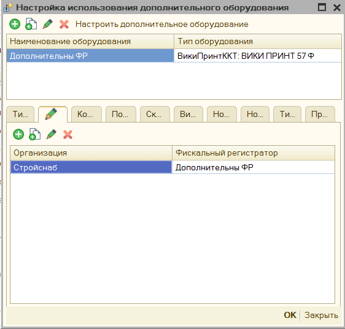

Нажмите на кнопку «**Настроить дополнительное оборудование**», откроется окно аналогичное форме с параметрами основного фискального регистратора, однако в нем будут только параметры для физического подключения оборудования, значения остальных полей будут браться из настроек основного оборудования.

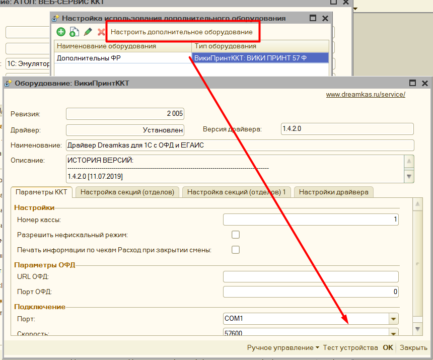

Для настройки распределения фискальных регистраторов по чекам см. [Механизм распределения](mechanism_distribution.md)
