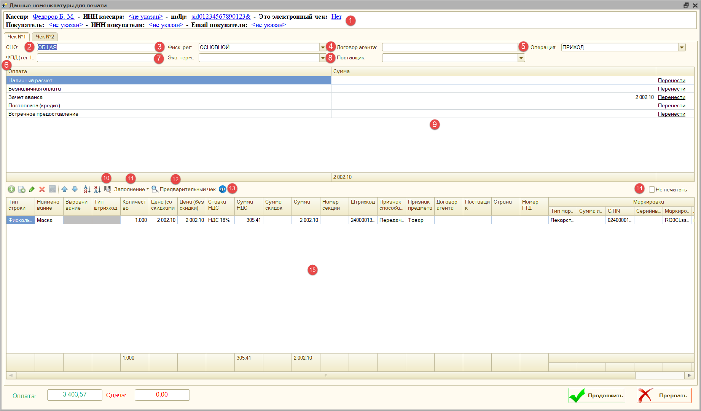
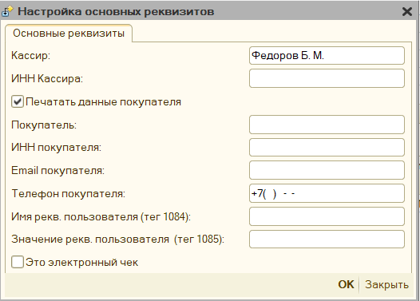
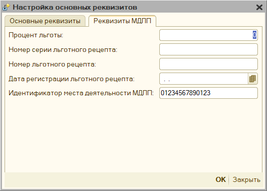
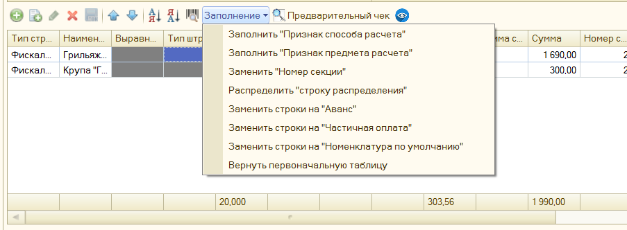
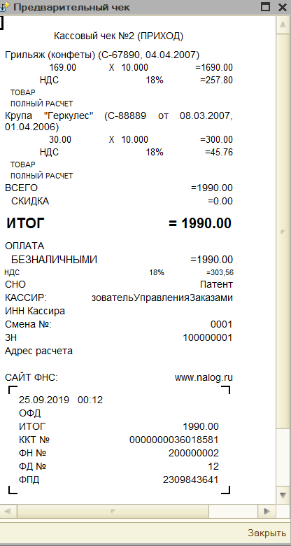
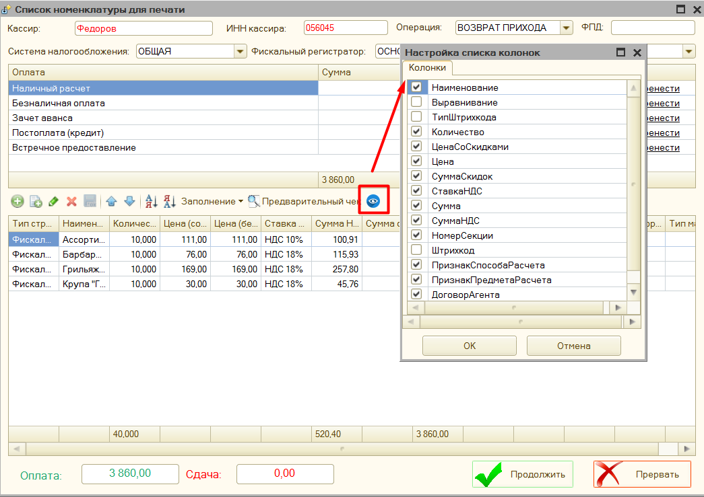
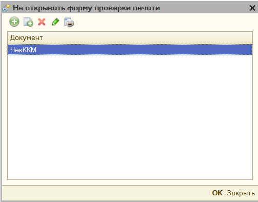
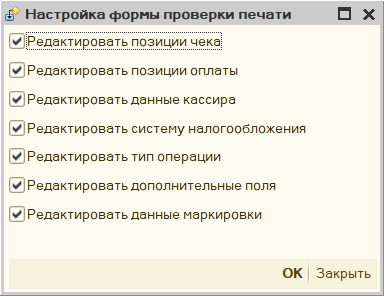
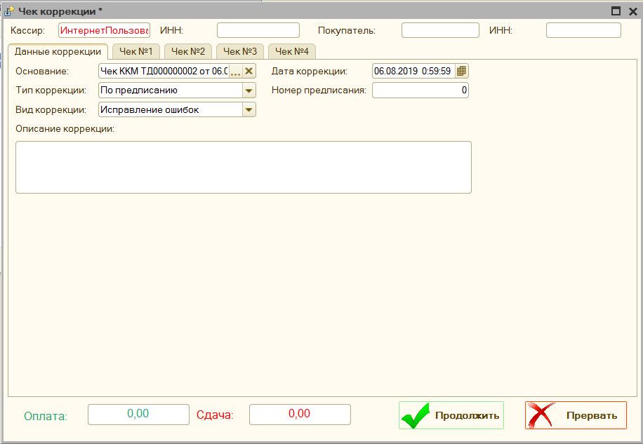
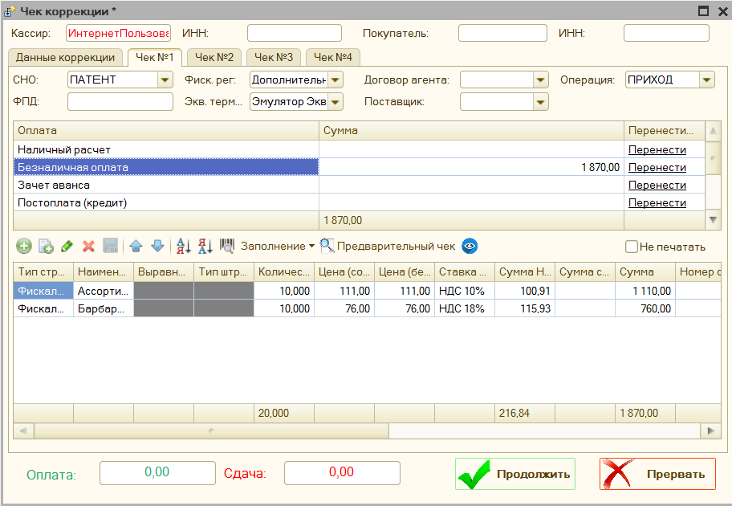

# Форма проверки печати (Рабочее место кассира) #

Форма проверки печати показывает данные будущего фискального чека. Перед продолжением проверьте товары, суммы, оплаты, СНО и кассира. Возможность редактирования зависит от [настроек формы](#настройка-формы-проверки-печати). По умолчанию форма открывается перед печатью; для отдельных документов её можно [отключить](#настройка-открытия-формы-проверки-печати).

1. **Основные реквизиты чека** – позволяет настроить основные реквизиты чека:
   

   К основным реквизитам чека относятся: Кассир, Инн кассира, Покупатель, ИНН Покупателя, Email покупателя, телефон покупателя, Имя реквизита пользователя (тег 1084), Значение реквизита пользователя (тег 1085), электронный чек.

   

   «**Реквизиты МДЛП**» - заполнить эти реквизиты можно при включении параметра «**Использовать маркировку лекарств**», в этом окне можно указать Процент льготы, Номер серии льготного рецепта, Номер льготного рецепта, Дата регистрации льготного рецепта, Идентификатор места деятельности МДЛП.

1. **СНО** – система налогообложения, под которой будет пробит чек.
1. **Фиск. рег.** – фискальный регистратор, на котором будет пробит чек.
1. **Договор агента** – имя заранее добавленного в параметры обработки договора агента.
1. **Операция** – операция фискального чека: приход, возврат прихода, расход или возврат расхода.
1. **ФПД (тег 1192)** – фискальный признак документа, используется для возвратов, когда нужно указать фискальный признак предыдущего документа, это тег 1192
1. **Экв. терминал** – эквайринговый терминал, на котором будет пробита безналичная информация.
1. **Поставщик** – имя заранее добавленного в параметры обработки поставщика, работает в паре с договором агента.
1. **Оплаты** – раздел оплаты, где можно вручную скорректировать суммы оплаты. Кнопка «Перенести» может переносить оплаты между фактическими суммами («наличные» и «безналичная оплата») и виртуальными («постоплата (кредит)», «зачет аванса», «встречное предоставление»)
1. «**Ввести код маркировки вручную**» - открывает форму, где можно указать штрихкод для маркировочного товара. Доступен вызов по кнопке F7
1. **Заполнение** – меню, где можно запустить команды для редактирования позиций чека: 

   - Заполнить «Признак способа расчета» - позволяет указать для всех позиций чека «Признак способа расчета»
   - Заполнить «Признак предмета расчета» - позволяет указать для всех позиций чека «Признак предмета расчета»
   - Заполнить «Номер секции» - позволяет указать для всех позиций чека Номер секции
   - Распределить «строку распределения» - если в чеке присутствует строка с отрицательной суммой с наименованием «Строка распределения», то будет автоматически разнесена на остальные строки, путем уменьшения количества и суммы по остальным позициям чека.
   - Заменить строки на «Аванс» - заменяет все строки чека на одну строку полученную из шаблона строки основания, либо если он не указан, то «Оплата по Покупатель основание такое-то». Устанавливает признак способа расчета «Аванс», признак предмета расчета «Платеж», цена в строке становится равной сумме оплаты, а количество  = 1, также удаляются виртуальные оплаты: «Зачет аванса» и «Постоплата»
   - Заменить строки на «Частичная оплата» - оставляет строки чека на месте, однако во всех заменяет признак способа расчета на "Предоплата частичная", признак предмета расчета "Платеж", количество = 1, цена становится равной сумме, также удаляются виртуальные оплаты: «Зачет аванса» и «Постоплата»
   - Заменить строки на «Номенклатура по умолчанию» - заменяет все строки чека на одну строку с наименование указанным в параметре обработки «Номенклатура по умолчанию», признаком способа расчета «Передача с полной оплатой», признаком предмета расчета «Товар», и удаляются виртуальные оплаты: «Зачет аванса» и «Постоплата»
   - Вернуть первоначальную таблицу – отменяет все внесенные изменения и восстанавливает таблицу с позициями чека.

1. «**Предварительный чек**» - формирует на основании текущих данных предварительный чек и выводит его на экран. 

1. «**Настройка видимости колонок**» – позволяет настроить видимость колонок, в таблице позиции чека, например, можно отключить видимость данных о договоре агента, если он не используется. 

1. «**Не печатать**» исключает выбранный чек из печати. Флажок доступен, если формируются два или больше чеков. Используйте его после проверки результата уже выполненных операций.

1. «**Позиции чека**» - таблица, которая содержит фискальные строки чека, их можно отредактировать вручную

## Настройка открытия формы проверки печати ##

Чтобы отключить форму проверки печати для определённого документа, добавьте его имя в параметр «Настройка открытия формы проверки печати».

## Настройка формы проверки печати ##

Данная форма позволяет настроить доступность полей «**формы проверки печати**», можно открыть через параметры обработки.

- **Редактировать позиции чека** – включает возможность редактировать позиции чека в форме проверки печати. По умолчанию, включено.

- **Редактировать позиции оплаты** – включает возможность редактировать данные об оплате в форме проверки печати. По умолчанию, включено.

- **Редактировать данные кассира** – включает возможность редактировать имя и инн кассира в форме проверки печати. По умолчанию, включено.

- **Редактировать систему налогообложения** – включает возможность редактировать систему налогообложения в форме проверки печати. По умолчанию, включено.

- **Редактировать тип операции** – включает возможность редактировать тип операции в форме проверки печати. По умолчанию, включено.

- **Редактировать дополнительные поля** - включает возможность редактирования полей «Фиск. рег», «Экв. терминал», «ФПД», «Поставщик», «Договор агента» в форме проверки печати. По умолчанию, включено.

- **Редактировать данные маркировки** - включает возможность редактирования полей «Тип маркировки», «GTIN», «Серийный номер», «Маркировка BASE64». По умолчанию, включено.

## Чек коррекции ##

>Не путайте чек коррекции и чек на возврат. Чек коррекции отбивается, если нужно исправить ошибку (факт неприменения ККТ), а если нужно оформить возврат товара, то нужно отбить обычный кассовый чек с указанием признака расчета «возврат прихода».

Обработка поддерживает использование чека коррекции. Если ваша конфигурация содержит в себе такой документ, то печать можно произвести из него. Если же нет, то печать данного чека можно сделать из параметров обработки – Ручное управление - Чек коррекции. См. [Описание параметров - Ручное управление](parameters_description.md#ручное-управление)

Также вы можете добавить чек коррекции в ваш документ, подключив к нему внешнюю печатную форму «ВПФ_ЧекКоррекции», которая находится вместе с основной обработкой.

Обязательными для заполнения являются поля «Основание коррекции» (можно указать числовой номер документа), «номер» и «дата коррекции».

> Способ формирования коррекции зависит от ФФД ККТ, ревизии компоненты и выбранного вида исправления. Одна ревизия не определяет результат. Для исправления ошибочного чека в ФФД 1.05 используются обычные чеки обратной и правильной операции; для ФФД 1.1/1.2 применяются чеки коррекции. Неприменение ККТ исправляется чеком коррекции. Порядок и состав реквизитов приведены в [методических рекомендациях ФНС](https://www.nalog.gov.ru/html/sites/www.rn47.nalog.ru/media/Listovki/kktrekom.pdf). Перед выполнением проверьте, какие документы сформирует обработка.

### Форма чека коррекции ###

Чек коррекции сохраняется в каталог «[Куда сохранять чек](parameters_description.md#дополнительные-параметры)»

## Продажа и проверка результата

1. Откройте документ, из которого требуется пробить чек. При печати через ВПФ документ должен быть проведён, если для него предусмотрено проведение.
2. Запустите команду печати чека вашей конфигурации или ВПФ. Название команды зависит от конфигурации.
3. В форме проверки сверьте операцию, кассира, ККТ, СНО и все позиции. Проверьте количество, цену, НДС, признаки предмета и способа расчёта.
4. Сверьте оплаты: наличные, безналичные, зачёт аванса, постоплата и другие используемые виды. При смешанной оплате проверьте каждую сумму отдельно.
5. Для маркированных товаров заполните коды и выполните [проверку маркировки](marking.md#порядок-проверки-маркированного-товара). Для электронного чека укажите контакт покупателя.
6. При необходимости откройте «Предварительный чек», затем подтвердите фискализацию штатной командой формы.
7. Проверьте результат на ККТ и отметку о пробитии в 1С. При ошибке после начала операции сначала [установите фактический результат](errors.md#чек-напечатался-но-в-1с-возникла-ошибка).

Редактирование данных в форме относится к формируемому чеку. После ручных изменений отдельно проверьте соответствие исходному документу 1С.

## Возврат товара

1. Подготовьте документ возврата и данные исходного чека.
2. Запустите печать и проверьте операцию «Возврат прихода» для возврата ранее проданного товара. Укажите только возвращаемые позиции и количество.
3. Сверьте цены, ставку НДС исходной операции, сумму возврата и способ оплаты. При необходимости укажите фискальный признак исходного документа в поле «ФПД».
4. Для возврата через терминал подготовьте ссылочный номер банковской операции. Проверьте результат на терминале отдельно от результата на ККТ.
5. Для маркированного товара проверьте код возвращаемой позиции и настройку обязательности марки при возврате.
6. После выполнения сопоставьте фискальный чек, банковскую операцию и документ возврата в 1С.

Возврат товара и исправление ошибочного чека решают разные задачи. Для исправления используйте [раздел коррекции](#чек-коррекции).

## Подготовка к коррекции

| Ситуация | Что подготовить |
| --- | --- |
| Расчёт проведён без ККТ | Данные расчёта и основание коррекции |
| В сформированном чеке ошибка | Исходный чек, его фискальные реквизиты и правильные данные |
| Покупатель возвращает товар | Документ возврата и исходный чек; используйте обычный сценарий возврата |

Перед запуском проверьте ФФД через «Ручное управление» → «Параметры фискализации». Откройте коррекцию из документа, ВПФ или ручного управления, заполните предложенные реквизиты и проверьте состав формируемых чеков. При исправлении ошибки может формироваться несколько документов. После выполнения сохраните их реквизиты и сопоставьте суммы.

Коррекция фискальных данных сама по себе не подтверждает возврат денег через терминал. Если требуется банковская операция, её результат проверяют отдельно.

## Оплата картой и СБП

Подключение терминала описано в разделе [эквайринга](connecting.md#подключение-эквайринговых-терминалов). Для СБП включите соответствующий параметр и убедитесь, что выбранная компонента поддерживает этот вид оплаты.

Перед подтверждением проверьте терминал и сумму. Банковская операция выполняется до фискализации. При некоторых последующих ошибках обработка пытается отменить банковскую операцию, но результат отмены зависит от ответа терминала. Сообщение об ошибке ККТ не доказывает, что деньги возвращены.

Если деньги списаны, а чек не получен, следуйте [инструкции по сбою эквайринга](errors.md#деньги-списаны-а-фискальный-чек-не-получен).
