# Дополнительная функциональность #

>**Обратите внимание**, что основной функционал обработки представлен также в видео:

[Первое видео](https://www.youtube.com/watch?v=uVJSKu6wHXE) (_устарело_))

[Второе видео](https://www.youtube.com/watch?v=T3Qr9CJBb48) (_устарело_)

[Третье видео](https://www.youtube.com/watch?v=ZOXDoqp12sk) (_устарело_))

## Поддержка НДС 22% ##

В связи с изменениями законодательства, обработка поддерживает использование ставок НДС 22% с версии 4.08. для полноценного использования данного режима, нужно сделать следующее:

1. [Обновиться](connecting.md#как-обновить-ранее-приобретенную-программу) до версии обработки **4.08** или выше.
   
2. Использовать компоненты на оборудование, что работают на [ревизии](connecting.md#что-такое-ревизия-драйвера) 4007 или выше. Список оборудование, что поддерживает данную ставку будет обновляться.
      
3. Установите драйверы с поддержкой этой ставки и при необходимости обновите прошивку.
  
4. Если ранее уже была подключена обработка, то достаточно на закладке "Служебное" в параметрах обработки выбрать нужную компоненту, например, для ВикиПринт наименование компонента "ВикиПринтККТ НДС", для АТОЛ "АтолККТ НДС"
   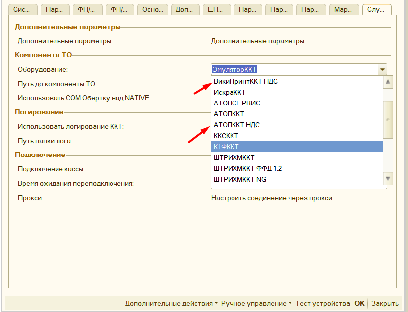 
   Для оборудования, что было подключено через раздел "Дополнительное оборудование", то компоненту нужно поменять уже в окне настройки подключаемого оборудования.
   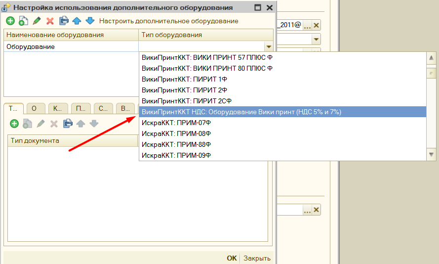 
   
5. Проверить, поддерживает ли ваша конфигурации новые ставки, или при необходимости доработать данный функционал. Вы можете воспользоваться этой [инструкцией](for_programmers.md#изменение-конфигурации-для-поддержки-ндс-5-и-ндс-7), эта рекомендация для ставки НДС 5 и 7%, но подход точно такой же, только меняется наименование ставки НДС.

6. Для более плавного перехода добавлены 2 параметра обработки: [**"Касса не поддерживает НДС 22% (ждем прошивку)"** , **"Автоматически перейти на ставку 22% в конце года"** ](parameters_description.md#енвд-усн-нефискальные-чеки), о которых можно прочитать по [ссылке](parameters_description.md#енвд-усн-нефискальные-чеки).

### Конфигурации без поддержки ставки НДС 22%

Для конфигураций, в которых **отсутствуют поля или справочники для новой ставки НДС**, есть отдельный механизм сопоставления.

Для настройки:
1. В параметрах обработки перейдите в раздел **«Настроить ставки НДС»**.
2. Укажите соответствие:
   - **Номенклатура / группа номенклатуры**
   - **Ставка НДС = 22%**
3. Сохраните настройки.

В этом случае обработка:
- не опирается на данные конфигурации,
- а использует внутреннее соответствие номенклатуры и ставки НДС при формировании чека.

## Изменения в онлайн чеках с 1 сентября 2025 года ##

С 1 сентября 2025 года ФНС вводит расширенный набор реквизитов ([Приказ ФНС России от 26.03.2025 № ЕД-7-20/236@](https://www.nalog.gov.ru/rn77/about_fts/docs/16421640/)) и ужесточает требования к оформлению чеков. В таблица представлено, какие реквизиты поддерживает обработка и с какой версии, а какие будут заполняться только драйвером самой кассы, и от обработки не зависит.
Описание на сайте ИТС [Какие новые реквизиты будут в кассовых чеках с 1 сентября 2025 года?](https://its.1c.ru/db/newsclar#content:495977:hdoc)
 

| Изменения / теги                                                                                                        | Обязательность / случаи применения                                                                                                                                                                                                                                                           | Как использовать в обработке                                                                                                                                         |
| ----------------------------------------------------------------------------------------------------------------------- | -------------------------------------------------------------------------------------------------------------------------------------------------------------------------------------------------------------------------------------------------------------------------------------------- | -------------------------------------------------------------------------------------------------------------------------------------------------------------------- |
| **Планируемый статус товара** (тег 2003) — запрос о коде маркировки                                                     | Уже существующий реквизит, обязателен при продаже маркированных товаров. С 01.09.2025 состав расширен: добавлены значения 5 («штучный товар в стадии реализации») и 6 («мерный в стадии реализации»).                                                                                         | Новые значения не используются. Определяются автоматически, для текущей работы достаточно первых 4 значений.                                                         |
| **Присвоенный статус товара** (тег 2110) — уведомление о реализации маркированного товара                               | Уже существующий реквизит, обязателен в уведомлении о реализации маркированного товара. С 01.09.2025 состав расширен: добавлены значения 5 и 6.                                                                                                                                              | Уведомление о реализации формируется самим драйвером и заполняется на его стороне.                                                                                    |
| **Фискальный номер кассового чека** (тег 2040) — уведомление о реализации маркированного товара / корректировочные чеки | Новый реквизит. По письму ФНС — обязателен в уведомлении о реализации маркированных товаров (содержит значение тега 1040).                                                                                                                             | Поддерживается только на уровне драйвера оборудования, обработка в этом не замешана.                                                                                 |
| **Часовая зона** (тег 1011) — уведомление о реализации маркированного товара и кассовый чек                             | Новый реквизит. Обязателен. Содержит смещение часового пояса от UTC, в котором был сформирован чек. В письме ФНС — для уведомлений о реализации маркированного товара, во втором источнике — для всех чеков.                                                                                 | Доступен начиная с ревизии компоненты 4006, указывается в меню обработки [«Параметры драйвера»](parameters_description.md#параметры-драйвера) → «Часовая зона». Если не задан, часовую зону должен передавать драйвер. |
| **Признак расчета в интернете** (тег 1125) — уведомление и электронный кассовый чек                                     | Новый реквизит. Обязателен в чеке при интернет-расчетах. При офлайн-расчетах не включается. В уведомлении о реализации маркированного товара также обязателен, если расчет онлайн.                                                                      | Доступен начиная с ревизии компоненты 4004, меню обработки [«Параметры драйвера»](parameters_description.md#параметры-драйвера) → «Только расчеты через интернет».                                                    |
| **Место расчетов** (тег 1187) — электронный кассовый чек                                                                | Тег существовал ранее, но с 01.09.2025 становится обязательным при интернет-продажах. Указывается точный URL сайта или приложения, где совершена покупка.                                                                                                                                    | Доступен начиная с ревизии компоненты 4004, меню обработки [«Параметры для ФФД»](parameters_description.md#параметры-для-ффд) → «Только расчеты через интернет».                                                     |
| **Телефон или e-mail покупателя** (тег 1008) — электронный кассовый чек                                                 | Тег существовал ранее, но с 01.09.2025 становится обязательным при интернет-продажах. Указывается контакт для доставки чека.                                                                                                                                                                 | Доступен в ревизии компоненты 4004 и ранее («E-mail покупателя» / «Телефон покупателя»).                                                                             |
| **Сведения обо всех оплатах по чеку безналичными** (тег 1234) — электронный кассовый чек                                | Новый реквизит. В письме ФНС — необязателен (признак обязательности 3, пилотные проекты). Желательно использовать при онлайн-расчетах.                                                                                                                 | Не заполняется в обработке — является необязательным.                                                                                                                |
| **Сведения об оплате безналичными** (тег 1235) — электронный кассовый чек                                               | Новый реквизит. В письме ФНС — необязателен. Используется для каждого способа безналичной оплаты и каждого электронного средства платежа. Желательно включать при онлайн-расчетах.                                                                     | Не заполняется в обработке — является необязательным.                                                                                                                |
| **Сумма оплаты безналичными** (тег 1082) — внутри реквизита 1235                                                        | Новый реквизит. В письме ФНС — необязателен. Желательно включать при онлайн-расчетах.                                                                                                                                                                  | Не заполняется в обработке — является необязательным.                                                                                                                |
| **Признак способа оплаты безналичными** (тег 1236) — внутри реквизита 1235                                              | Новый реквизит. В письме ФНС — необязателен. Желательно включать при онлайн-расчетах.                                                                                                                                                                  | Не заполняется в обработке — является необязательным.                                                                                                                |
| **Идентификаторы безналичной оплаты** (тег 1237) — внутри реквизита 1235                                                | Новый реквизит. В письме ФНС — необязателен. Желательно включать при онлайн-расчетах.                                                                                                                                                                  | Не заполняется в обработке — является необязательным.                                                                                                                |
| **Дополнительные сведения о безналичной оплате** (тег 1238) — внутри реквизита 1235                                     | Новый реквизит. В письме ФНС — необязателен. Желательно включать при онлайн-расчетах.                                                                                                                                                                  | Не заполняется в обработке — является необязательным.                                                                                                                |
| **Обновлены требования к бумажным чекам**                                                                              | При печати чека на бумаге теперь обязательны параметры: высота символов ≥ 2 мм; интервал между строками ≥ 0,5 мм; размер QR-кода ≥ 20×20 мм; контрастность печати ≥ 40%.                                                                                                                       | Поддерживается только на уровне драйвера оборудования, обработка в этом не замешана.                                                                                 |

Для поддержки самых последних изменений, требуется:

1. [Обновиться](connecting.md#как-обновить-ранее-приобретенную-программу) до версии обработки **4.04** или выше.
   
2. Использовать компоненты на оборудование, что работают на [ревизии](connecting.md#что-такое-ревизия-драйвера) 4006 или выше.(Обработите внимание, что ряд полей, уже поддерживается на компоненте 4004, об этом указано в таблице соответствий и возможно обновление компоненты не требуется)
   
3. Установить актуальные драйвера, что поддерживают данную ставку, и при необходимости установить прошивку. Например, если у вас драйвера АТОЛ, то должны быть установлены дравера 10.10.7 или выше. Начиная с версии обработки 4.10, доступен [**мастер подключения**](connecting.md#мастер-подключения-компонент-начиная-с-версии-410)
  
4. Если ранее уже была подключена обработка, то достаточно на закладке "Служебное" в параметрах обработки выбрать нужную компоненту, например, для ВикиПринт наименование компонента "ВикиПринтККТ НДС", для АТОЛ "АтолККТ НДС", для Меркурий, компонента заменила предыдущую и дополнительно ничего не нужно менять, только удалить все ранее скачанные, и скачать компоненты заново.
    
   Для оборудования, что было подключено через раздел "Дополнительное оборудование", то компоненту нужно поменять уже в окне настройки подключаемого оборудования.
    

## Поддержка НДС 5% и 7% ##

В связи с изменениями законодательства, обработка поддерживает использование ставок НДС 5% и 7% с версии 3.90. Однако это еще не значит, что ваша 1С будет формировать чеки с этой ставкой, для полноценного использования данного режима, нужно сделать следующее:

1. [Обновиться](connecting.md#как-обновить-ранее-приобретенную-программу) до версии обработки **3.94** или выше.
   
2. Использовать компоненты на оборудование, что работают на [ревизии](connecting.md#что-такое-ревизия-драйвера) 4004 или выше. На текущй момент данную ревизию поддерживают компоненты АТОЛ, ШтрихМ, ВикиПринт, Меркурий и Эмулятор торгового оборудования.

   
3. Установите драйверы с поддержкой этой ставки и при необходимости установить прошивку. Начиная с версии обработки 4.10, доступен [**мастер подключения**](connecting.md#мастер-подключения-компонент-начиная-с-версии-410)
    - Например, если у вас драйвера АТОЛ, то прошивка должна быть не ниже версии 5.15, и установлены дравера 10.10.6 или выше. Обратите внимание, что для компоненты драйверов АТОЛ зафиксирована проблема, что затираются настройки к серверу ОФД и Честному знаку, эти настройки нужно заново указать в параметрах обработки. Эти настройки также можно получить через утилиту тест драйвера ФР

      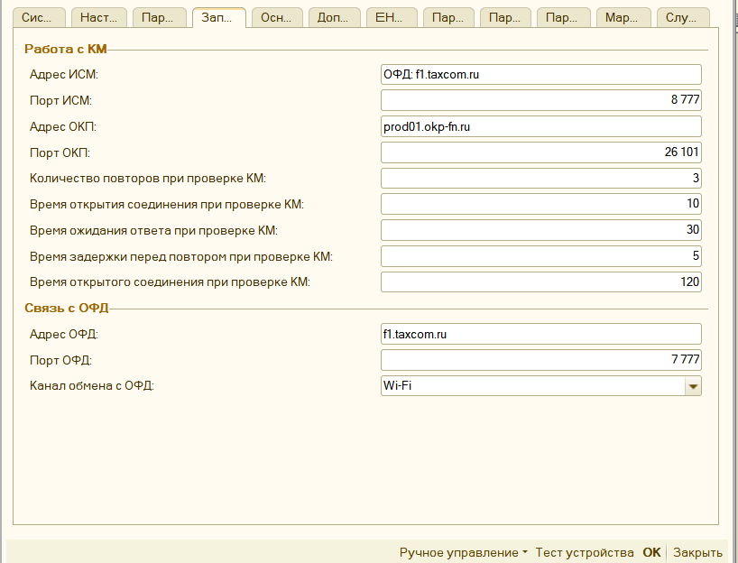
    - Для касс Вики принт: внутреннее программное обеспечение ККТ должно быть обновлено до версии 665.4.32.
    - Также поддерживаются кассы Меркурий, для них также требуется обновить драйвера.
    - Для касс ШтрихМ установите драйвера 5.18.0.1061, в параметрах обработки в поле "оборудование" выберите "Штрих НДС" [дополнительная информация](https://teletype.in/@poscenter/2025). 
  
4. Если ранее уже была подключена обработка, и нужно только обновиться для поддержки ставок НДС 5% и 7%, то достаточно на закладке "Служебное" в параметрах обработки выбрать нужную компоненту, например, для ВикиПринт наименование компонента "ВикиПринтККТ НДС", для АТОЛ "АтолККТ НДС", для Меркурий, компонента заменила предыдущую и дополнительно ничего не нужно менять, только удалить все ранее скачанные, и скачать компоненты заново.
    
   Для оборудования, что было подключено через раздел "Дополнительное оборудование", то компоненту нужно поменять уже в окне настройки подключаемого оборудования.
    
   
5. Проверить, поддерживает ли ваша конфигурации новые ставки, или при необходимости доработать данный функционал. Вы можете воспользоваться этой [инструкцией](for_programmers.md#изменение-конфигурации-для-поддержки-ндс-5-и-ндс-7), как с минимумом знаний доработать вашу 1С для использования указанных ставок.

6. Для более плавного перехода добавлены 2 параметра обработки: [**"Касса не поддерживает НДС 5% и 7%"** , **"Автоматически перейти на новую ставку в конце года"** ](parameters_description.md#енвд-усн-нефискальные-чеки), о которых можно прочитать по [ссылке](parameters_description.md#енвд-усн-нефискальные-чеки).

## Особенность пробития авансовых чеков и установки признаков способа расчета ##

Пример оформления авансовых чеков представлена на сайте 1С [ИТС](https://its.1c.ru/db/kkt#content:133:hdoc). Механизм работы заполнения программы выполнен по тому же принципу, в частности:

При заполнении чека обработка учитывает признак способа расчёта:

Описанное стандартное преобразование применяется, если выключен параметр «Отключить заполнение с учетом признаков способа расчета».

| Признак | Как заполняется чек |
| --- | --- |
| Передача с полной или частичной оплатой, передача без оплаты | Передаётся полная стоимость товара. Оплаты отражают полученные деньги, зачёт аванса и постоплату |
| Аванс | Товарные строки заменяются строкой платежа с количеством 1 и описанием основания |
| Предоплата частичная | Суммы строк уменьшаются пропорционально оплате; количество становится равным 1, признак предмета расчёта — «Платеж» |
| Предоплата полная | Сохраняются наименования позиций, количество становится равным 1, признак предмета расчёта — «Платеж» |
| Оплата кредита | Признак предмета расчёта — «Платеж», количество — 1, цена равна сумме строки. Ставка — «Без НДС», сумма НДС обнуляется |

Для аванса и предоплаты алгоритм преобразует ставки 10%, 20%, 22%, 5% и 7% в соответствующие расчётные ставки, если строке требуется такое преобразование. Это преобразование не ограничено только ОСНО. Итог зависит также от исходной ставки и настроек исключения НДС; ставка «Без НДС» не превращается в расчётную.

Для проверки арифметики: при предоплате 1 220 руб. с НДС 22/122 сумма НДС равна 220 руб.; при 1 050 руб. с НДС 5/105 она равна 50 руб.; при 1 070 руб. с НДС 7/107 она равна 70 руб. Примеры предполагают, что соответствующая ставка уже определена для операции.

Пример зачёта: стоимость товара 1 220 руб., ранее получен аванс 610 руб., при передаче покупатель доплачивает 610 руб. В чеке передачи проверьте товар на 1 220 руб., зачёт аванса 610 руб. и фактическую оплату 610 руб. Признак способа расчёта и суммы оплат должны соответствовать документам 1С.

Для операций на границе изменения ставки отдельно учитывайте дату предоплаты, передачи товара и возврата. [ФНС описывает порядок применения НДС 22% в переходных расчётах](https://www.nalog.gov.ru/rn59/news/activities_fts/16598241/). Автоматическая подмена ставки не заменяет проверку исходной операции.

Если в кассовом документе несколько документов основания, проверяйте признак способа расчёта и распределение оплат по каждому сформированному чеку. При разных признаках не продолжайте печать, пока результат не соответствует исходным документам.

## Печать копии чека ##

В параметрах обработки можно настроить возможность печати копии чека на обычный принтер. Для этого в параметрах обработки нажмите на **«Настроить печать копий чека»** - откроется форма настройки.

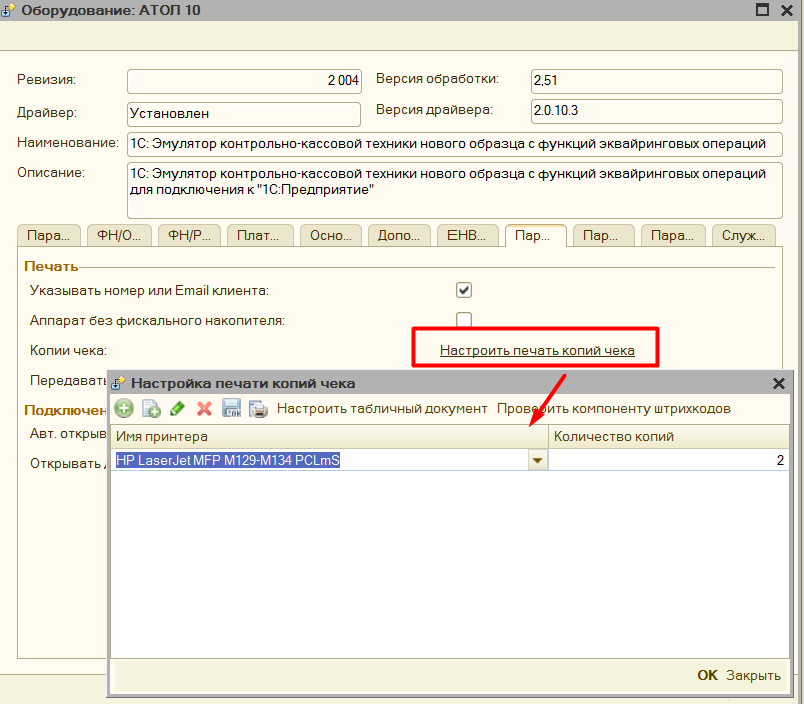

В поле **«Имя принтера»** необходимо выбрать принтер из списка, и указать количество копий, которые нужно напечатать.

По кнопке **«Проверить компоненту штрихкодов»** - обработка проверяет находится ли в папке с макетами компонента для печати штрихкодов.
> **Важно**: без данной компоненты в копию чека не будет выведен QR код фискального чека.

Для настройка выводимого табличного документа, есть кнопка «Настроить табличный документ», где можно указать как должен выводиться чек.

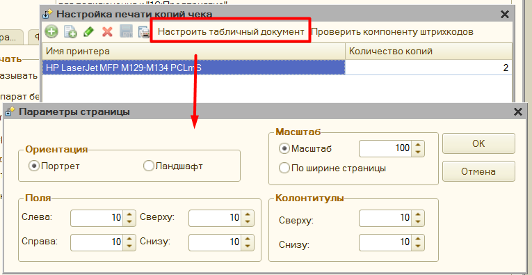

Копия чека заполняется также, как и фискальный чек, и информацию заполнения можно менять, меняя шаблон документа. Однако часть информации невозможно получить из фискального регистратора, поэтому ее нужно указать вручную. Данные настройки находятся в группе «**Нефискальные чеки**» в параметрах обработки

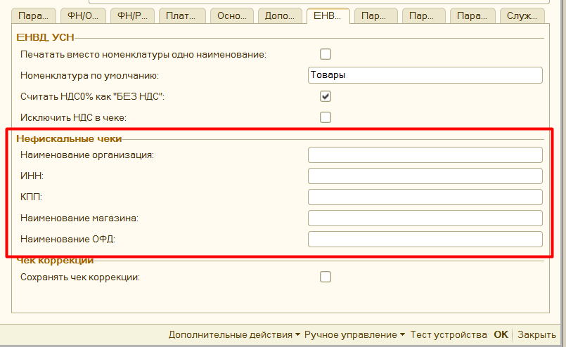

Если вы хотите, чтобы копия чека выводилась корректно, то данные параметры нужно заполнить.

Копия чека будет напечатана в следующем виде.

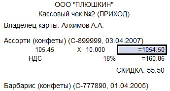

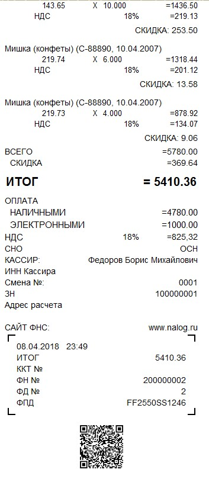

## Редактор произвольного кода ##

Когда в обработке нужно написать код на встроенном языке 1С, открывается редактор произвольного кода. Данный редактор имеет подсветку синтаксиса 1С, можно открыть конструктор запросов, вставить ссылку на объект в базе данных, используются шаблоны кода, используется конструктор форматной строки.

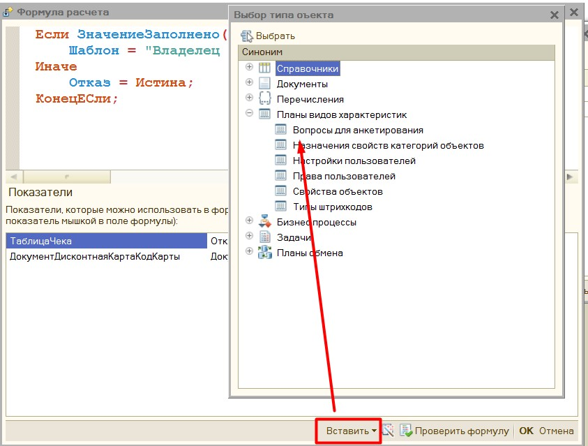

## Подключение через прокси ##

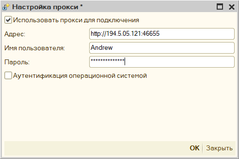

Для подключения к прокси необходимо заполнить:

«**Адрес**» - он заполняется в формате «http://адрес:порт», либо «https://адрес:порт», адрес прокси-сервера можно не заполнять, тогда будут использованы настройки по умолчанию.

«**Имя пользователя**» и «**Пароль**» - пользователя, под которым будет происходить подключение к прокси-серверу.

«**Аутентификация операционной системой**» - если установлен данный флажок, то подключение к прокси будет происходить без указания имени пользователя и пароля.

## Форма отладки ##

Чтобы открыть форму отладки, выберите в 1С «Файл» → «Открыть» и укажите файл обработки. Форма позволяет выбрать оборудование и проверить заполнение чека.

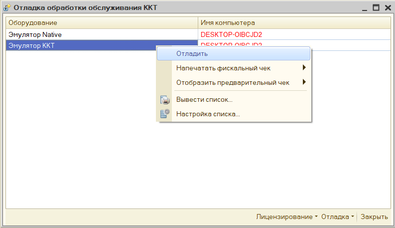

Если конфигурация, в которой была открыта форма отладки не поддерживает работу с торговым оборудованием, то в этом окне можно самостоятельно добавить подключение к новому оборудованию.

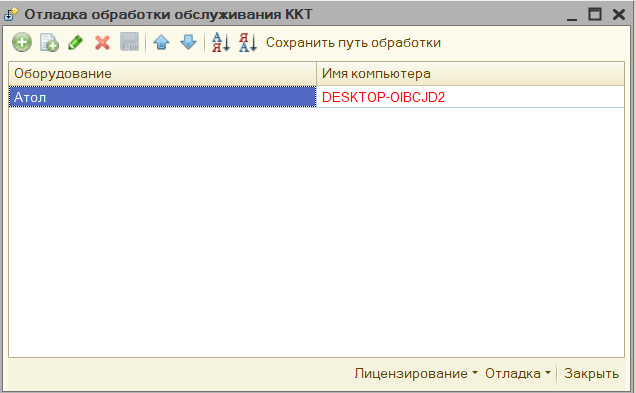

Кнопка «Сохранить путь обработки» используется при печати через внешнюю печатную форму, которая идет в комплекте с обработкой. Она сохраняет путь до файла основной обработки в настройки пользователя, затем при печати через внешнюю
печатную форму проверяется указан ли путь до обработки, и если указан, то используется именно обработка по этому пути.

Если же работа с фискальными регистраторами поддерживается, то в данном списке отобразиться уже подключенное оборудование, которой можно перенастроить здесь же.

В форме можно выбрать документ и вызвать одну из команд:

1. **Напечатать предварительный чек**, который представляет из себя обычную печатную форму
2. **Напечатать фискальный чек.**

Доступно 2 варианта использование:

- **Предопределенный документ** – это тот документ, для которого алгоритм печати заложен в самой обработке

- **Собственный документ** – для такого документа обработка попробует напечатать чек на основании универсального алгоритма, однако желательно для такого реализовать собственный функционал печати через дополнительный обработчик.

Например, в конфигурации **УТ 10.2**, можно печатать полноценные фискальные чеки без доработки конфигурации.

## Отключение печати бумажного чека ##

Чтобы сократить расход фискальной ленты в обработке можно отключить печать бумажного чека, при этом чек должен быть обязательно отправлен в электронном виде покупателю.
Чек может быть сформирован только электронно в 2-х случаях, либо у вас заключен договор с ОФД на рассылку, тогда перед печатью достаточно указать только email или номер телефона покупателя, и отметить флажок электронно. Либо настроить в параметрах программы рассылку чеков встроенными средствами. Рассмотрим каждый случай.

### Формирование электронного чека средствами ОФД ###

Для такой настройки, в параметрах обработки на закладке "Параметры драйвера" включите флажок **"Передавать чеки в ОФД без печати"**
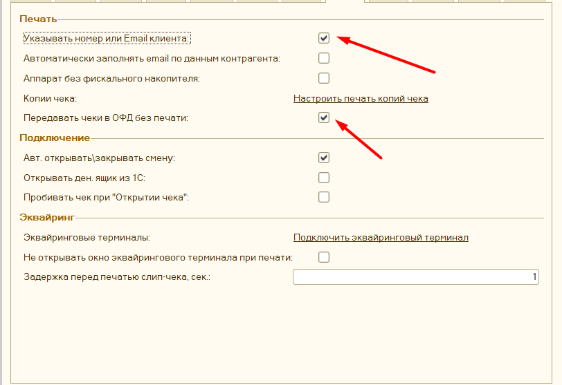 и флажок **"Указывать номер или Email клиента"**. Таким образом перед печатью чека будет предложено ввести данные покупателя и если они будет введены, то чек не напечатается, а будет передан в ОФД и оттуда направлен на указанный адрес клиента.
Данные покупателя можно внести несколькими способами, если включена форма проверки печати, то непосредственно из нее

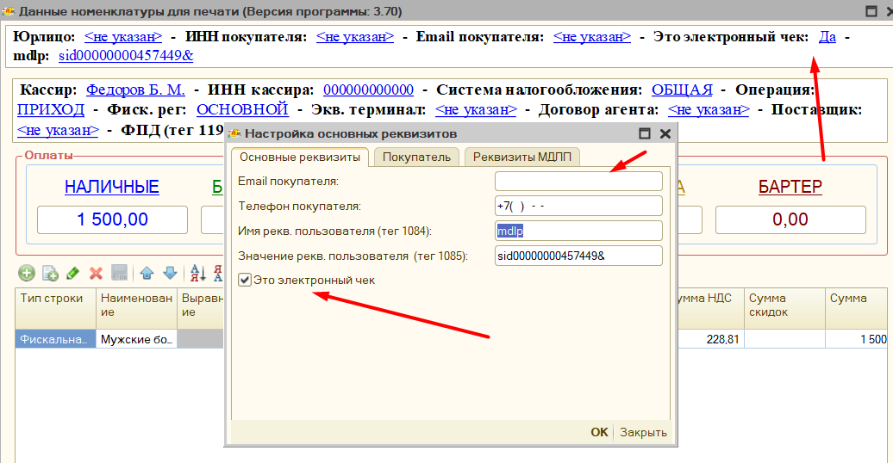

Либо через специальное окно для ввода: [Форма ввода Email и Номера телефона](management_distribution.md#форма-ввода-email-и-номера-телефона).

Помимо этого программа поддерживает автоматическое заполнение email покупателя по данным 1С, для этого необходимо в том же разделе включить флажок **"Автоматически заполнять email по данным контрагента"**, тогда программа попытается найти email в регистре Контактная информация и установить его перед печатью. Также вы можете снимать признак только электронной печати вручную перед фискализацией, если вдруг потребуется именно бумажная печать.

Если email или телефон не указан, бумажный чек будет напечатан. Перед фискализацией проверьте контакт покупателя и признак электронной печати.

### Формирование электронного чека средствами программы ###

Все настройки аналогичны предыдущему пункту, однако при этом дополнительно необходимо указать и проверить параметры рассылки средствами обработки по этой инструкции [**Рассылка чеков средствами обработки**](management_distribution.md). В таком случае чек будет отправлен именно средствами обработки, но при этом в ОФД все-таки уйдут данные о покупателе, поэтому такой способ рассылки следует использовать только если не заключен договор с ОФД на рассылку.

## Начало и завершение кассового дня

Перед началом работы выберите нужную ККТ и выполните «Ручное управление» → «Получить текущее состояние». Проверьте статус смены и количество непереданных фискальных документов. При закрытой смене используйте штатное открытие смены вашей конфигурации или команду обработки «Открыть смену». Если смена уже открыта, повторное открытие не требуется.

В конце дня завершите продажи и проверьте незавершённые операции. Закройте смену штатным способом вашей конфигурации. Команда обработки «Закрыть смену» закрывает смену на ККТ, но сама не создаёт документ отчёта о продажах в 1С.

Для подключённых эквайринговых терминалов отдельно выполните предусмотренные терминалом «Итоги дня по картам». Закрытие смены ККТ и банковские итоги являются разными операциями. Проверьте ответ каждого устройства.

Если смена не закрывается или остались непереданные документы, сохраните сообщение и [сведения о состоянии ККТ](errors.md#смена-не-закрывается-или-есть-непереданные-документы). Параметр автоматического открытия и закрытия смены применяется только при подключении обработки как «Фискальный регистратор»; его описание находится в [параметрах драйвера](parameters_description.md#параметры-драйвера).
