# Маркировка #

Использование маркировки настраивается в параметрах программы раздел ["Маркировка"](parameters_description.md#маркировка)

Актуальная версия программа поддерживает работу со следующими категориями маркируемого товара:
- изделия из меха  
- лекарственные препараты  
- табачная продукция  
- альтернативный табак  
- никотиносодержащая продукция  
- обувные товары  
- средства защиты  
- антисептики  
- соковая продукция  
- духи  
- шины  
- велосипеды  
- лёгкая промышленность  
- кресла-коляски  
- молочная продукция  
- фотоаппараты  
- упакованная вода  
- пиво  
- пиво в потребительских упаковках  
- безалкогольное пиво  
- БАДы  
- морепродукты  
- алкогольная продукция до 9%  
- медицинские изделия  
- технические средства реабилитации  
- дезинфицирующие средства  
- корма для животных влажные  
- корма для животных  
- безалкогольные напитки  
- мясная продукция  
- ветеринарные препараты  
- игры и игрушки для детей  
- печатные платы  
- радиоэлектронная продукция  
- телефоны и ноутбуки  
- титановая металлопродукция  
- консервированная продукция  
- растительные масла  
- оптоволоконная продукция  
- парфюмерные и косметические средства  
- печатная продукция  
- бакалея  
- строительные материалы  
- пиротехнические изделия  
- отопительные приборы  
- кабельная продукция  
- моторные масла  
- полимерные трубы  
- сладости и кондитерские изделия  
- продукция, продаваемая по объёмно-сортовому учёту  

Из-за того, что список возможных видов маркируемой продукции значительно вырос, в настройки был добавлен параметр **«Настроить ограничение доступности отображения маркировки»**, который позволяет указать те типы маркировки, которые фактически используются в компании. Таким образом, уже в настройках использования маркировки и разрешительного режима, а также в форме проверки печати список будет ограничен только указанными ["видами"](parameters_description.md#маркировка)

## Требования к поддержке маркировки ##

- проверить поддерживает ли ваша модель оборудования в принципе работы с маркировкой
- должны быть установлены актуальные драйвера для оборудования
- обновлена прошивка фискального регистратора
- возможно потребуется дополнительно активировать специальные лицензии на оборудовании для поддержки маркировки (в частности такое есть у АТОЛ)
- обновлена текущая обработка для работы с фискальными регистраторами
- обновлены [компоненты](connecting.md#компоненты-оборудования) для работы с оборудованием
  
[Видео-описание](https://youtu.be/LAiJ1Bf3z3U?t=317)

## Разрешительный режим (ТС ПИоТ)

### Общая концепция

**ТС ПИоТ (ЕСМ)** — это отдельное программное обеспечение, которое взаимодействует с фискальным регистратором **напрямую**, минуя прямые обращения кассы или учетной системы к серверам **Честного знака**.
Фактически ТС ПИоТ выступает промежуточным сервисом проверки разрешения на продажу маркированного товара.

Основные особенности:

* ТС ПИоТ требует **отдельной лицензии**.
* Устанавливается как **самостоятельное ПО** (возможная встроенная реализация в 1С обсуждается, но официально не подтверждена).
* Работает как в **онлайн**, так и в **офлайн** режимах.
* Самостоятельно взаимодействует с локальным модулем маркировки.

По функциональному назначению ТС ПИоТ можно рассматривать как **расширенный локальный модуль**, но с возможностью централизованной онлайн-проверки и собственной логикой хранения офлайн-данных.

---

### Архитектура взаимодействия (упрощенно)

1. Учетная система (1С) формирует данные чека.
2. Маркированный товар передается, не напрямую в Честный знак, а в **ТС ПИоТ**.
1. ТС ПИоТ выполняет проверку (онлайн или офлайн), возвращает результат проверки.
2. Результат проверки передается в кассу, далее — фиксируется в фискальных данных.

Таким образом, **вся логика разрешительного режима изолируется в ТС ПИоТ**.

---

### Важные ограничения и текущие проблемы

На текущий момент инфраструктура ТС ПИоТ считается **незрелой**, возможны технические несоответствия:

* Некоторые версии драйверов содержат поддержку gRPC, но не поддерживают НДС 22%.
* Более новые драйверы поддерживают НДС 22%, но могут не содержать необходимых параметров для интеграции с ТС ПИоТ.

Пример:

* Драйверы **АТОЛ 10.10.7.21** — есть поле *gRPC порт*, но нет поддержки НДС 22%.
* Драйверы **10.10.8.2** — поддержка НДС есть, но интеграция с ТС ПИоТ нарушена.

Это следует учитывать при выборе версии драйвера и планировании перехода.

---

### Требования для использования ТС ПИоТ

Для работы разрешительного режима через ТС ПИоТ необходимо:

* Фискальный регистратор - поддерживает **ФФД 1.2** и имеет актуальную прошивку.
* Драйвер ККТ совместим с ТС ПИоТ, корректно поддерживает текущие ставки НДС.
* Версия обработки **не ниже 4.08**.
* Установлен и настроен модуль **ЕСМ (ТС ПИоТ)**.
* Настроена связь между фискальным регистратором и ТС ПИоТ.

Без выполнения всех пунктов корректная работа разрешительного режима не гарантируется.

---

### Использование ТС ПИоТ в обработке

В меню разрешительного режима добавлены параметры, связанные с ТС ПИоТ:

* адрес сервиса ТС ПИоТ;
* дата начала применения.

По умолчанию дата начала установлена на **28 декабря 2025 года**.
Допускается:

* сдвиг даты **раньше** — для тестирования;
* использование **до конца марта 2026 года** старого разрешительного режима.

Это связано с тем, что:

* прежний механизм пока остается технически доступным;
* функциональность ТС ПИоТ находится в стадии доработки.


#### Заполнение настроек

Алгоритм настройки минимален:

1. Указать адрес ТС ПИоТ.
2. Нажать **«Заполнить настройки»**.

Если в самом модуле ТС ПИоТ уже зарегистрировано оборудование:

* автоматически заполняются:

  - номер фискального накопителя;
  - ИНН организации.
* дополнительные параметры вводить **не требуется**.

---

### Работа пользователя

С точки зрения пользователя:

* сценарий продажи **не меняется**;
* интерфейс работы с маркировкой остается прежним.

Отличие только одно:

* вместо прямого обращения в Честный знак:

  - марка передается в ТС ПИоТ;
  - результат проверки возвращается из него.

---

### Важное замечание об офлайн-режиме

> **Важно:**
> При использовании ТС ПИоТ **не требуется** настраивать локальный модуль маркировки внутри обработки.

Причина:

* офлайн-режим уже реализован **в самом ТС ПИоТ**;
* ТС ПИоТ:

  - сам управляет связью,
  - сам хранит офлайн-данные,
  - интегрируется с локальным модулем напрямую.

Дублирование настройки локального модуля может привести к конфликтам.

---

### Проверка работы через демо-сервер

Для тестирования доступен внешний сервис, эмулирующий работу ТС ПИоТ:

* **Официальный демо-сервер:**
  `https://esm-emu.ao-esp.ru`

Он позволяет:

* проверить логику разрешительного режима;
* отладить интеграцию без реального оборудования.

Рекомендуется использовать:

* демо-сервер ТС ПИоТ;
* совместно с **эмулятором фискального регистратора**.

Это упрощает тестирование и снижает риски при внедрении.

### Техническая возможность использовать обычный разрешительный режим до марта 2026

на текущий момент информации об острочке использования ТС ПИОТ не публиковалась, и сроки использовать его с 28 декабря 2025 года сохраняются, однако техническая возможность по использованию старого разрешительного режима сохраняется.

Вот текст ответа от тех поддержки Честного Знака:

> С 28 декабря вступает в действие новое требование (согласно ППР № 515 и 303) для розничных продавцов: на кассовых зонах необходимо предусмотреть установку специализированного программного обеспечения ТС ПИоТ (Технические Средства Получения Информации о Товаре).
Сейчас различные компании продолжают разработку таких решений - как поставщики Программного обеспечения для участников рынка, так и сами розничные компании для себя. Поскольку типов кассовых систем и программного обеспечения много, новые версии появляются постепенно. Проверить, доступно ли решение для вашей кассы, можно в едином реестре по ссылке.
Если подходящего ПО или кассы пока нет — переживать не нужно. По мере появления разработанных решений их можно будет установить без риска наступления ответственности.
Для установки нового ПО вы можете связаться с разработчиками (из реестра ТС ПИоТ) или обратиться в ваш или любой другой центр технического обслуживания касс (их перечень доступен по ссылке).
На текущем этапе наличие или отсутствие ТС ПИоТ не будет проверяться, поэтому поводов для беспокойства или опасений по поводу штрафов нет. Однако если решение для вашей кассы уже доступно, мы рекомендуем установить его заранее — это позволит избежать возможных технических затруднений в дальнейшем.
Кассовое программное обеспечение технически сможет взаимодействовать с ГИС МТ и Локальным Модулем, по существующим протоколам, до окончания срока действия токена X-API-KEY (до 1 марта 2026 года), но с нормативной точки зрения, розничный участник оборота применяющий на кассе разрешительный режим, с 28 декабря обязуется настроить работу через ТС ПИоТ.

## Разрешительный режим продажи маркировки ##

> Устарело, с 28 декабря 2025 года желательно использовать ТС ПИоТ, текущая вариант разрешительного режима остается доступен вплоть до начала марта 2026 г.

Для использования разрешительного режима ваша касса должна использовать: 

- формат фискальных данных **ФФД 1.2**.
- Иметь актуальную версию драйвера и прошивки вашего фискального регистратора.
- Версия данной программы не ниже **3.79**, для использования лекарственных препаратов версия не ниже **4.02**
- Должен быть интернет на рабочем месте кассира или сервере RDP (если пользователи работают через RDP)
- Проверить не заблокирован ли доступ к серверам Честного знака на вашем сервере, также сам Честный знак может блокировать доступ, если клиентское подключение выполняется через VPN


Для того, чтобы включить поддержку **"Разрешительного режим продажи"** в данной программе необходимо в параметрах в разделе "Маркировка" найти "Разрешительный режим". 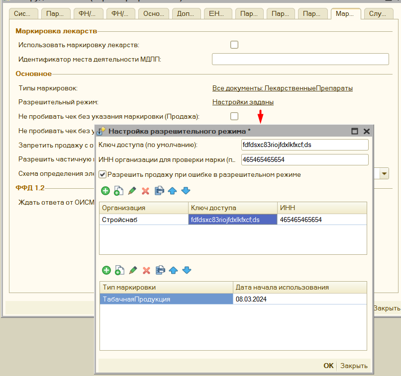

Здесь можно указать:

- **Ключ доступа (по умолчанию)** - Токен доступа к серверу Честного Знака, его можно получить по следующей инструкции [следующей инструкции](https://www.markirovka.ru/knowledge/tovarnye-gruppy/legkaya-promishlennost/kak-poluchit-klyuch-dostupa-dlya-razreshitelnogo-rezhima-proverok-na-kkt)

- **ИНН организации для проверки марки (по умолчанию)** - ИНН организации, которой принадлежит токен доступа, его нужно указывать, так как ИНН используется в качестве параметра запроса на проверку марки в Честном Знаке.

- **Разрешить продажу при ошибке в разрешительном режиме** - позволяет пропустить проверку в разрешительном режиме в случае ошибки, при этом программа вначале попытается проверить через Честный Знак, а затем предложит пропустить проверку. Данная настройка не отключает механизм проверки через ККТ. 
   > **Обратите внимание**, что пропускать проверку товара в разрешительном режиме можно только при недоступности сервера Честного знака, а с появлением проверки через локальный модуль, и вовсе запрещено.

- **Не выполнять проверку маркировки средствами ККТ** - при включении данного параметра, если проверка маркировки через разрешительный режим успешна, то последующая проверка на фискальном регистраторе будет в упрощенном режиме, кассовое ПО не будет дожидаться ответа от ОИСМ, и пробьется чек, однако в итоговом чеке будет отображаться не [M+], что 
соответствует, что маркировка прошла проверку средствами ККТ, а [M] (так как мы проверку пропустили), но ранее марка уже была проверена через сервера Честного знака, то это не является нарушением. Маркировка будет успешно списана через Честный знак.

- Заполнение ключа доступа в разрезе организаций - требуется в том случае, если на одном рабочем месте чеки могут формироваться по разным организациям, и на каждой свой ключ доступа, здесь также можно указать ИНН для отправки запросов, если он не заполнен, то программа попытается получить ИНН из карточки организации, также в разрезе организации указывается подключение к локальному модулю, если в рамках одного рабочего места используются несколько организаций.

- Настройка использования типа маркировки для разрешительного режима, здесь можно указать какая маркировка подлежит проверки и какой даты.
   > **ВАЖНО**, без этой настройки даже если будет заполнен ключ доступа маркировка не будет проверяться, нужно обязательно здесь указать нужную маркировку. Например, с 01 апреля 2024 года требуется проверять "Табачную продукцию" и "Пиво", для этого в этой таблице мы указываем нужный тип маркировкаи, а в поле "**Дата начала использования**" указать 01.04.2024.

Остальные настройки относятся к использованию локального модуля, что описано [здесь](#настройка-локального-модуля-для-офлайн-проверки)

Нужно проверить доступ к серверам Честного знака, для снижения нагрузки Честный Знак предоставляет несколько серверов для проверки маркировки, при этом первым запросом отправляется на основной сервер получение самого списка доступных CDN площадок для проверки маркировки, из них выбирается самая быстрая, и к ней уже отправляется запрос на проверку марки. Сама CDN площадка, например имеет следующий адрес: "https://cdn06.crpt.ru", а их может быть множетсво. Если 1С располагается на сервере, а доступ к ней имеют подключаясь через RDP, то запросы на проверку маркировки по разрешительному режиму будут уходить через сервер, а не клиентскую машину пользователя, это связано с архитектурной особенностью 1С, работающей на обычных формах, поэтому в исключения брандмауэра сервера нужно вносить адреса CDN площадок Честного знака (уточнить их ip адреса), а также основной ip адрес сервера проверки маркировки. Таким образом разешен доступ должны быть для https://markirovka.crpt.ru , https://cdn.crpt.ru  и для адресов CDN площадок по указанному регулярному выражению https:\/\/cdn\d{2}\.crpt\.ru

Для платформы 8.1 на Windows 8 может также остутствовать доступ к серверам Честного знака, независимот от настроек брандмауэра, дело в том, что для отправки запросов используется COM функционал Windows WinHttp.WinHttpRequest.5.1 и на нем могут быть просрочены сертификаты. По умолчанию cacert.pem, который ставится с платформой 8.1 от 2009 года. Его надо обновить, для это скачайте сертификат по [ссылке](bin/cacert.pem), и поместите его в папку 1cv81\bin, куда установлена 1С. Затем перезагрузите компьютер.

#### Особенность Управление торговлей 10.3 ####

Для конфигурации Упавление торговлей 10.3 в частсности с релиза **10.3.88.3** добавлена также поддержка разрешительного режима, однако она конфликтует с функционалом обработки, и если в УТ 10.3 используется функционал ведения учета маркированного товара, то желательно выполнить следующую настройку, чтобы можно было использовать проверку разрешительного режима через обработку:
- Необходимо перейти "Обмен с ГосИС" - "Обмен с ИСМП (одежда, обувь, табак...)" 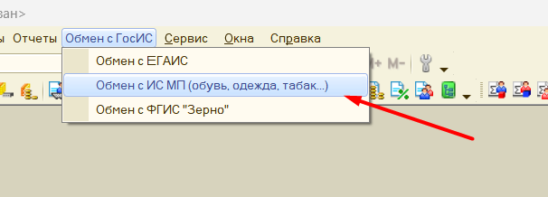
- Далее "Настройки и справочники" - "Интеграция с ИС МП" - в разделе "Вести учет маркируемой продукции" - нужно поставить значение "Разршетельный режим на ККТ" в 01.01.2035 год.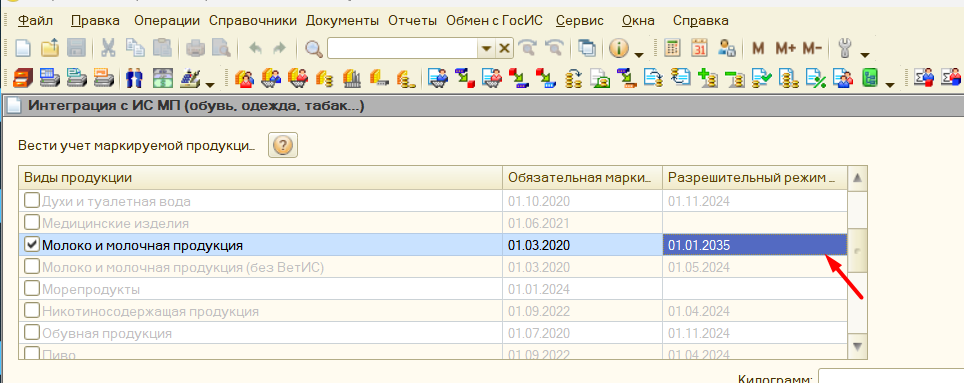


### Как это работает ###

После выполнения настроек выше, при продаже товара в разрешительном режиме в форме проверки маркированного товара появится дополнительная колонка "Статус проверки в разрешительном режиме".
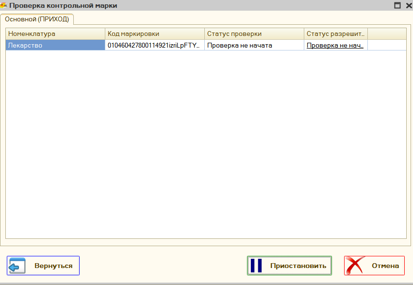
Перед непосредственной фискализацией обработка самостоятельно отправляет запрос в Честный знак и получает статус продажи марки, если товар недоступен к продаже, то в указанном поле дополнительно появится текст ошибки. 

При успешном выполнении информация о времени проверки статуса, и идентификатор этого запроса будет прописан в отраслевой реквизит будущего чека. По сути проверка в разрешительном режиме только дополняет стандартную проверку через ККТ.

> **Обратите внимание**: если товар проверен при разрешительном режиме, то дополнительно ожидать от Честного Знака, что марка верная, нет смысла, поэтому запрос о проверке отправляется без ожидания ответа от Честного Знака, из-за этого в позициях такого товара появляется знак **[M]**, вместо **[M+]**, то есть марка не проверена в Честном знаке, такое поведение является допустимым, так как предварительно марка уже была проверена с помощью другого онлайн сервиса, такое поведение существенно ускоряет продажу маркированной продукции, так как разрешительный режим позволяет проверять сразу несколько марок, а не по одной. Дополнительно можно ознакомиться с [пояснениями](https://markirovka.ru/knowledge/tovarnye-gruppy/obschie-voprosy-gis/znachenie-m-v-fiskalnykh-dokumentakh-chekakh) от самого Честного Знака 

## Настройка локального модуля для офлайн проверки

С **1 марта 2025 года** вводится обязательное использование локального модуля **Честного Знака** для офлайн проверки маркировки. Он используется, если онлайн-проверка невозможна (например, из-за отсутствия интернета или недоступности серверов).

---

### 🚀 Как подключить офлайн режим?

🔗 [Официальная инструкция](https://markirovka.ru/community/rezhim-proverok-nakassakh/oflayn-proverka-na-kassakh-lokalnyy-modul-chz) для Windows.

### 🔧 **Установка локального модуля**
1. Перейдите на страницу **Локального модуля**:  
   👉 [Официальный сайт](https://xn--80ajghhoc2aj1c8b.xn--p1ai/local-module/)
2. В разделе **«Скачать ПО Локальный модуль»** выберите и скачайте нужный файл.
3. Запустите установочный файл и следуйте инструкциям.
4. Обновите обработку до версии **3.98** или новее.
5. Настройте локальный модуль в программе (см. ниже).

---

### Настройка локального модуля в программе

Настройки модуля находятся в разделе обработки, где указываются параметры разрешительного режима.

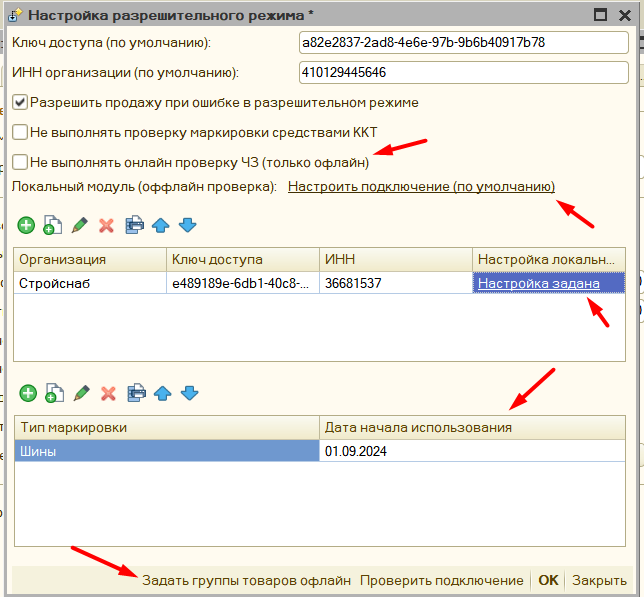

### 📌 **Основные параметры**

- **`не выполнять онлайн проверку ЧЗ (только офлайн)`** – позволяет пропустить онлайн-проверку и сразу проверять маркировку офлайн.  
  🚨 *Рекомендуется только в случаях долгого отсутствия интернета (>1 часа).*

- **Локальный модуль (офлайн проверка) По умолчанию** – указывает параметры подключения к локальному модулю, если не задано иное.

- **Настройка локального модуля для организаций** – если несколько организаций используют кассу, для каждой указывается отдельный модуль.  
  ❌ *Использование одного модуля для нескольких организаций – технически недопустимо!*  
  ✅ *Решение: разнести модули по разным портам или компьютерам.*

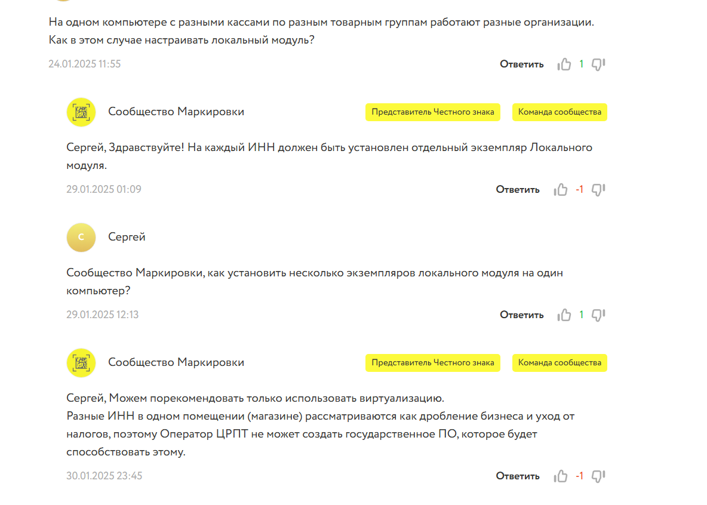

- **`Задать группы товаров офлайн`** – позволяет выбрать, для каких товаров загружать данные о заблокированных марках.

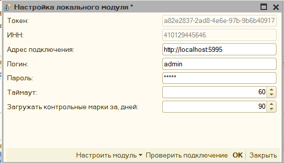

---

### 🔄 Настройка самого модуля

1. Войдите в **меню настройки модуля**.
2. Укажите:
   - **Адрес установленного модуля**
   - **Логин и пароль** (должны соответствовать тем, что были указаны при установке модуля)
3. Нажмите **«Настроить модуль» → «Инициализировать»**.
4. После успешной инициализации, в течение 2-3 минут, нужно дождаться статус `ready`,  и после переходить к его использовани. Чтобы узнать статус подключения или проверить проходит ли синхронизация или нет надо нажать **"проверить подключени"**  
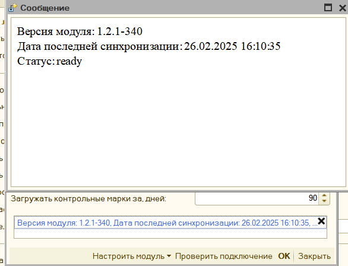

> **Обратите внимание!** Если необходимо перерегистрировать модуль для другой организации, его нужно удалить вместе с настройками и установить заново.

---

### 🔍 Как работает локальный режим (офлайн проверка)?

После настройки система проверяет маркировку в три этапа:

1. 🔍 Проверка доступности **CDN-площадок** (раз в сутки).
2. 🌐 Онлайн-проверка:
   - Если серверы доступны, проверка проходит в интернете.
   - Если серверы недоступны или истек таймаут, активируется офлайн режим.
3. ✅ Офлайн-проверка:
   - Система запрашивает внутреннюю базу.
   - Проверяется **только факт блокировки марки**, дополнительные проверки недоступны.

📌 *Если онлайн или офлайн проверка пройдена – маркировка передается на кассу, которая также выполняет контроль.*

---

### ❓ Часто задаваемые вопросы (FAQ)

### **Что делать, если офлайн проверка не работает?**
1. Убедитесь, что установленная версия локального модуля **актуальна**.
2. Проверьте, что в настройках указан **правильный адрес модуля**.
3. Обновить данную программу, возможно были выпущены исправления для использования локального модуля
4. Если проблема не решена – проверьте настройки сети и файрвола.

### **Можно ли использовать один модуль для нескольких организаций?**
Нет, официальная рекомендация – **разные локальные модули для каждой организации**. Альтернативный вариант – настройка модулей на **разных портах**.


## Настройка типов маркировки ##

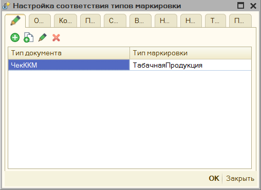

Чтобы указать программе, какой товар является маркированным, необходимо указать это условие в параметре **"Типы маркировок"**. Как задается такое условие описано в разделе инструкции [Механизм распределения](mechanism_distribution.md). Таким образом можно указать, что пробиваемый товар является обувью, табаком, лекарствами или другими группами маркированного товара.
> **Обратите внимание**: если хотите, чтобы для определенной группы товаров программа не проверяла дубли марок по умолчанию, то для нее необходимо установить тип маркировки **"Средства защиты"**. Для данной маркировки проверка на дублирования не осуществляется.

## Продажа лекарств ##

Продажа лекарств отличается небольшими тонкостями при настройке. Вначале в программе необходим включить параметр **"Использовать маркировку лекарств"**, и заполнить **"Идентификатор места деятельности МДЛП"**. Идентификатор будет передавать в составе тегов 1085 и 1086. После этого указать [тип маркировки](#настройка-типов-маркировки) **"Лекарственные препараты"**.

Программа поддерживает работу с льготными рецептами, информацию об использовании льготы заполняется из документа основания, если есть соответствующие реквизиты, либо эту информацию можно указать в форме проверки печати в окне "Настройка основных реквизитов чека" - "Реквизиты МДЛП". При изменении информации о льготах в этом окне - будет автоматически пересчитаны дополнительные реквизита пользователя (теги 1085 и 1086)

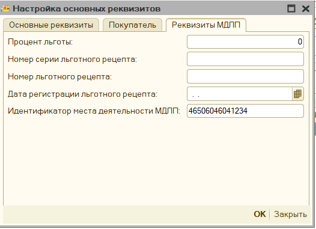

В крайнем случае теги 1085 и 1086 можно отредактировать вручную, тогда данные заполнения льгот будут проигнорированы.

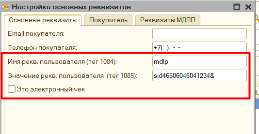

### Разрешительный режим лекарственные препараты с 01 июня 2025г ###

Для использования разрешительного режима для лекарственных препаратов необходимо включить использование маркировки [лекарственных препаратов](#продажа-лекарств) в целом. Далее указываем использование маркировки для разрешительного режима по этой [инструкции](#разрешительный-режим-продажи-маркировки), однако следует учитывать, что нужно использовать версию обработки **4.02** или выше.


### Частичная продажа упаковок маркированного товара ###

Программа поддерживает частичную продажу упаковок лекарств, или парфюмерии на розлив. При этом заполняется дополнительный реквизит предмета расчета (тег 1191) с информацией о содержимом неполной упаковки. Для этого в базе необходимо выполнить следующие действия:

1. Заведите номенклатуру-упаковку лекарства, или тару с большой емкостью для парфюмерии.
2. Помимо основной единицы измерения, заведите вторичную и назовите ее "**Первичная упаковка**", в поле коэффициент укажите сколько штук или миллилитров товара находится в упаковке.
   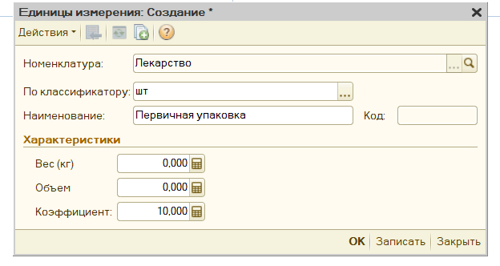
3. При продаже товара-упаковки для частичной продажи, указывайте дробное количество в чеке, тогда при заполнении формы продажи будет проверяться коэффициент единицы измерения "Первичная упаковка", и если он отличается от единицы, то программа будет считать, что продается упаковка.
   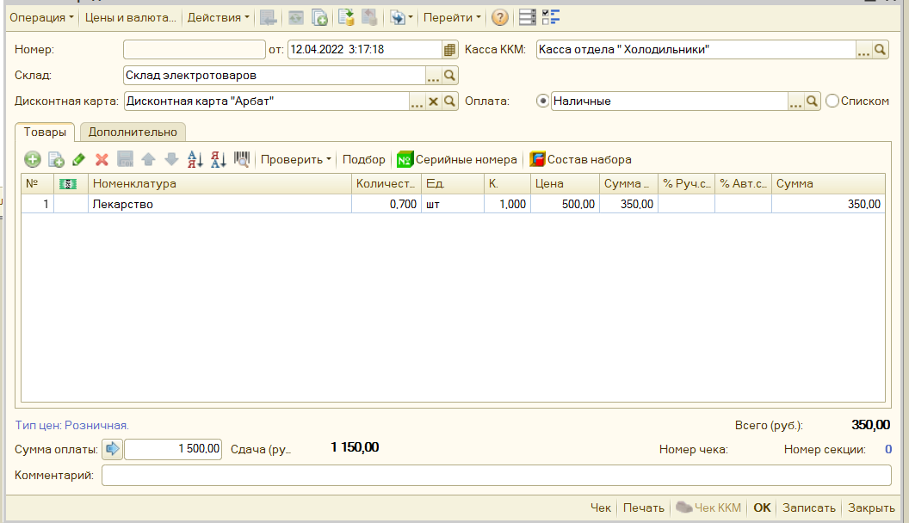

> **Пример**, мы продаем неполную коробку 7 из 10 лекарств, при этом "первичная упаковка" имеет коэффициент - 10, значит в изначальном чеке у нас будет количество 0.7 товара, а в форме проверки печати, это количество автоматически станет равно 1 (так как по закону маркированный товар может передаваться только с количеством 1, и данные о частичной продаже у нас будут отражены только в теге 1191), также в поле "количество единиц в упаковке" будет указано 10, а тег 1191 заполнится как "mdlp7/10&"

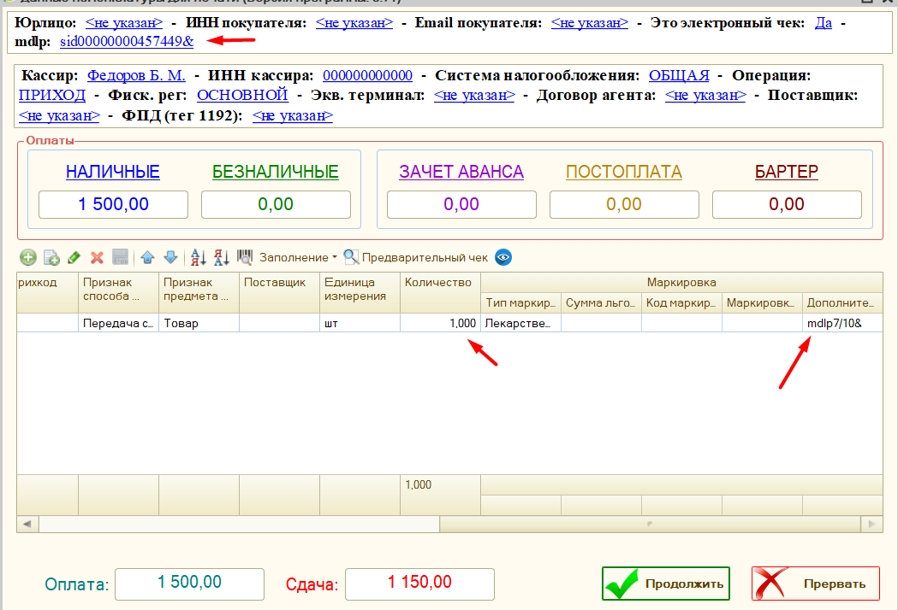

> **ФФД 1.2**: при переходе на форма работы с драйверами торгового оборудования ревизия **3004**, и если фискальный накопитель переключен на ФФД 1.2, то данные о дробном количества будут переданы в составе тега 1291

## Отражение продаж индивидуальных средства защиты ##

Согласно постановлению правительства от 16 апреля 2020 г. N 521, при продаже средств индивидуальной защиты, необходимо заполнять и передавать «код товара». Код товара из себя представляет предопределенный штрихкоды для определенной группы товара, общий перечень штрихкодов можно посмотреть по [ссылке](https://www.garant.ru/hotlaw/federal/1362146/). Таким образом для отражения данных товаров необходимо:

1. В параметрах обработки настроить тип маркировки «**Средства индивидуальной защиты**» для нужной номенклатуры или группы товара.

   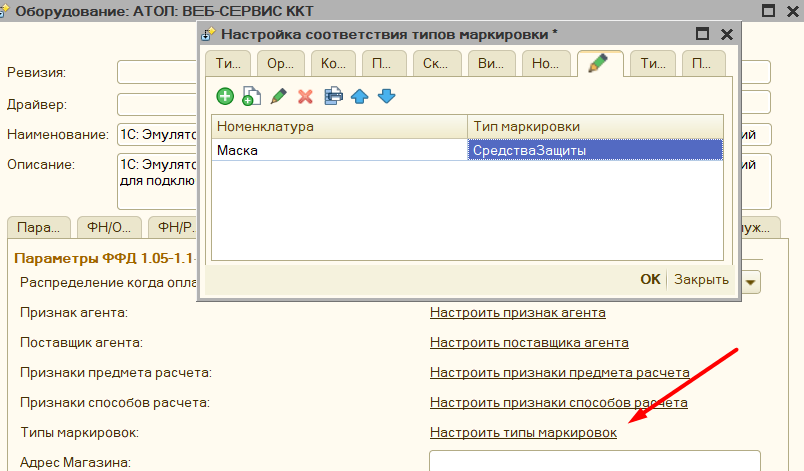

1. Убедиться, что у вас в поле Ревизия интерфейса стоит 3002, 3004 или выше.

    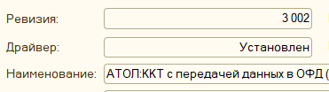

    Это связано с тем, что компоненты с данной ревизией поддерживают передачу маркировки в формате base64.

1. Передайте значение маркировки в чек. Возможно несколько вариантов.Маркировка находится сразу в документе, для этого должно быть заполнено поле «Штрихкод», или «КодМаркировки», если такие поля в вашем документе предусмотрены. Возможно заполнить маркировки через дополнительный обработчик, для этого необходимо заполнить поле «КодМаркировки», или «Штрихкод», в процедуре «ПослеФормированияТаблицыЧека», после этого данная маркировка будет автоматически распознана.

Помимо этого, в типовых конфигурациях 1С добавлена заполнение данных штрихкодов по умолчанию, например в конфигурации Управление Торговлей 10.3

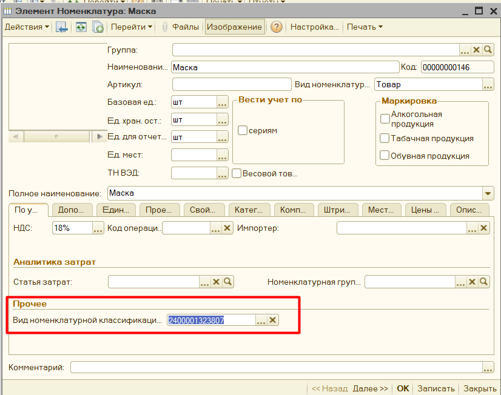

Штрихкоды средств защиты можно вносить интерактивно, для этого их необходимо сохранить, а затем при продаже отсканировать

## Как продавать маркированный товар через обработку ##

Если все настройки по использованию маркировки выполнены, и в чеке присутствует маркированный товар, то при открытии ["Формы проверки печати"](form_check_and_check_correction.md) будет автоматически заполнено поле *"тип маркировки"*, помимо этого программа попытается [найти](#откуда-программа-берет-данные-для-маркировки) заполненную марку в документе основания, если она была там указана. Если же её - нет, либо 1С не поддерживает работу с маркировкой. то марку можно заполнить и вручную в окне данной формы.

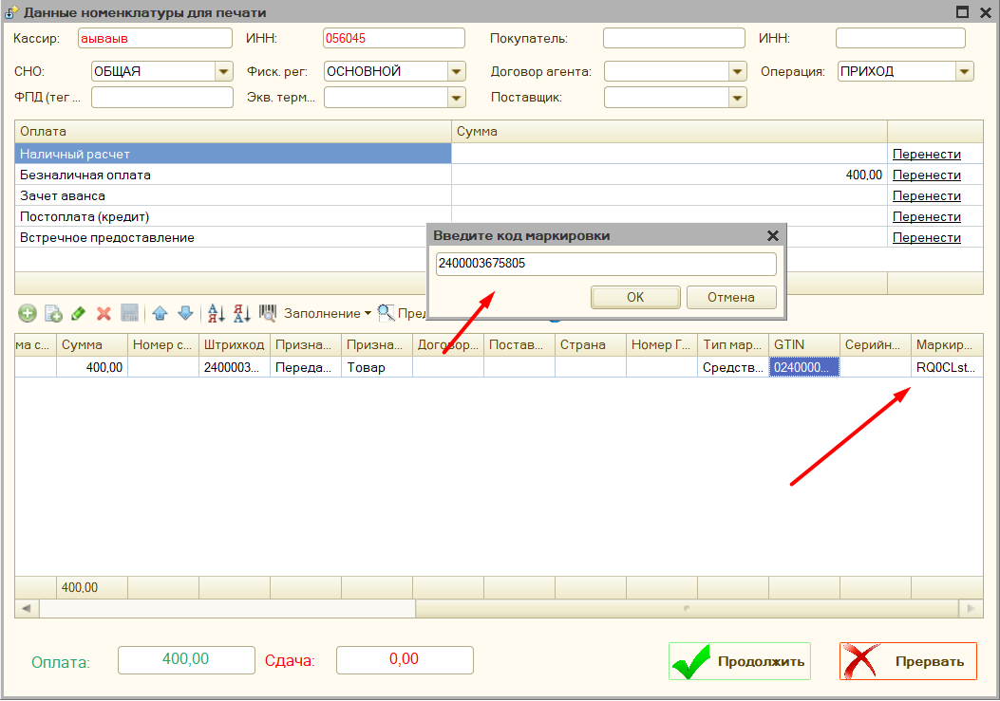

Форма проверки печати поддерживает работу со сканером штрихкодов, если сканер подключен через COM-подключение, то необходимо встать на строку с товаром и отсканировать марку, данные, если они корректны,автоматически попадут в поля *Base64 Маркировка* и *код марки*.
Если сканер штрихкодов подключен как клавиатура, то перед сканированием необходимо нажать кнопку **"F7"** или на значок штрихкода в окне программы, и уже в открывшееся поле отсканировать марку.
Если форма проверки печати отключена, то если в чеке присутствует маркированный товар - откроется специальная форма для указания только данных маркировки, в остальном же способ сканирования такой же.
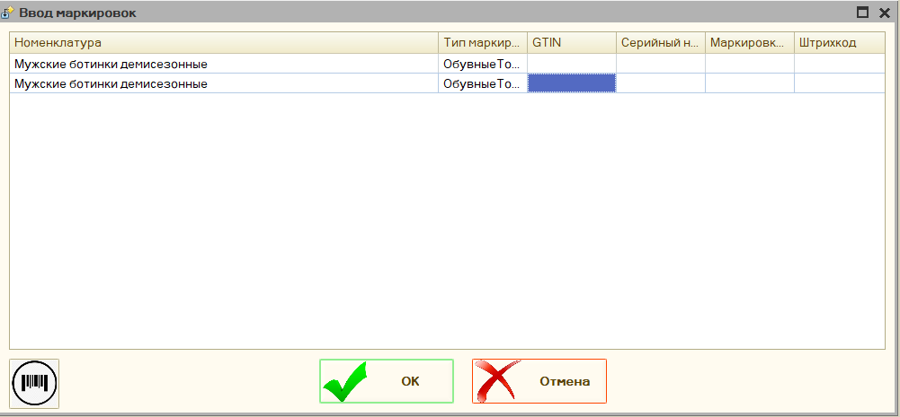

> **Важно**, маркировку можно указать только при фактической продаже товара, на это указывают признак способа расчета позиции - **"Передача"** (без оплаты, с частичной или полной оплатой), если в чеке стоит **"Аванс"**, **"Предоплата"**, либо **"Оплата кредита"**, то предполагается, что передается не товар, а деньги, тогда в позициях товара будет фигурировать "Платеж", а не маркированный товар. Для таких позиций марка не заполняется.

## Поддержка ФФД 1.2 ##

Для поддержки формата фискальных данных 1.2 добавлен интерфейс проверки маркировки. Перед пробитием чека, если включен параметр *Проверять корректность маркировки перед пробитием чека*, И в чеке на момент пробития есть маркированный товар с заполненным кодом марки, то откроется специальное окно, где можно запустить процедуру проверки маркировки средствами ККТ.

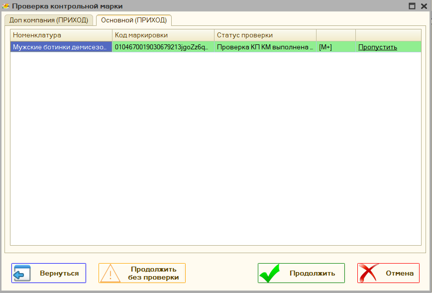

, Дополнительно программа проверяет соответствует ли компонента и версия ФФД оборудования нужному формату, и если нет, то выводит соответствующее сообщение.

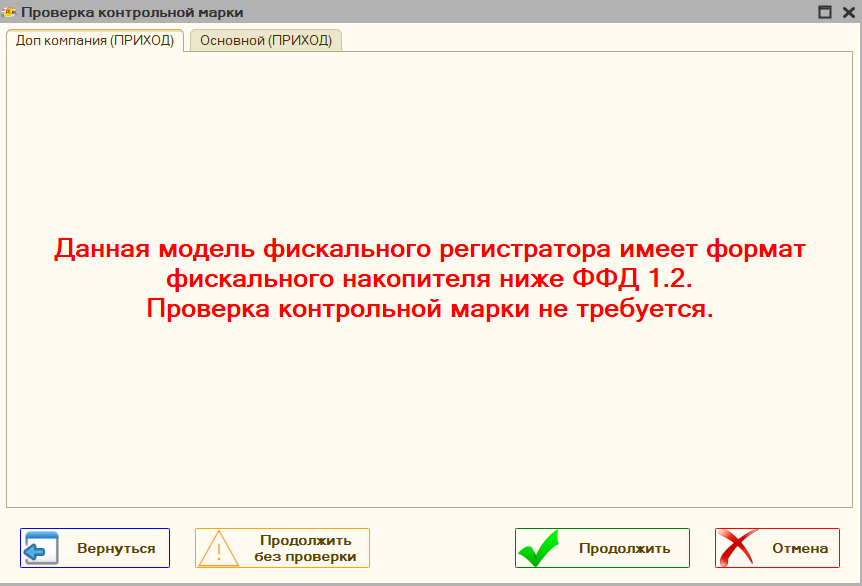

В данном можно пропустить проверку целиком, выбрать какие марки не нужно проверять, нажав на поле в таблице **Пропустить**. Также поддерживается возможность приостановить проверку, если возникла какая-то проблема.

### Контрольная марка не проверена - и что с этим делать? ###

Наиболее частая ошибка, что теперь видят при продаже маркированного товара после перехода на ФФД 1.2. Чтобы ее избежать необходимо:

1. Проверить вашу прошивку, и поддерживает ли она маркировку вообще и переключен ли фискальный регистратора на ФФД 1.2
2. Проверить актуальные ли у вас драйвера, для АТОЛ последние рабочие 10.9.0.9,  можно скачать по [ссылке](http://fs.atol.ru/_layouts/15/atol.templates/Handlers/FileHandler.ashx?guid=e8f4e641-84f3-4548-b522-3b8d0c88d84a&webUrl=) из центра загрузки АТОЛ , для ШтрихМ [тут](https://exam.shtrih-m-partners.ru/base/), для вики принт [тут](https://help.dreamkas.ru/hc/ru/articles/115001745425)
3. Затем полностью удалить старые компоненты обработки, и распаковать [новые](https://yadi.sk/d/jcdpGNZ43WQtro)
4. Включить в параметрах обработки параметр "Проверять марку перед пробитием чека"
5. Проверить, чтобы в параметрах программы стояло "Подключение кассы" - "Стандартно" 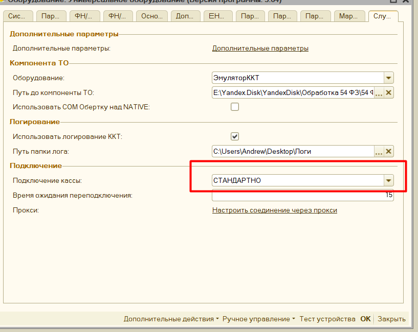
6. И осталось только перезапустить 1С для обновления параметров 1С

### Откуда программа берет данные для маркировки ###

Для автоматического заполнения таблицы с маркировкой программа проверяет есть ли у указанного документа табличная часть "КодыМаркировки", таблица должна содержать 2 поля "КлючСтроки" - "идентификатор" по которому программа сможет найти между маркировкой и строками товара, и поле "КодМаркировки" - содержащее непосредственно маркировку, так сделано например в конфигурации "Рарус: Альфа-Авто". Либо может быть таблица "ШтрихкодыУпаковок", которая имеет поле "ШтрихкодУпаковки", по которому обработка и будет искать соответствие, примером является конфигурация "Управление торговлей 10.3"
> **Важно**, маркировка будет заполняться и передаваться только, если заполнен в соответствии "**тип маркировки**", и указан "**Признак способа расчета**" - "Передача с частичной оплатой", либо "Передача с полной оплатой", либо "Передача без оплаты".

## Продажа сахаросодержащих напитков ##

С **01.07.2023** года вводится акциз на сахарсодержащие напитки, с точки зрения отражения таких продаж в программе - то все довольно просто. Так как передача самой марки не требуется, то достаточно передавать признак предмета расчета **"Подакцизный товар"** для указанных позиций. 
Для этого в параметрах обработки откройте раздел с настройкой признака предмета расчета
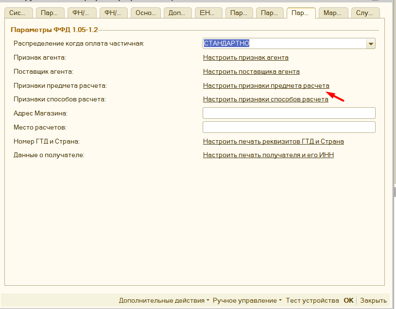
далее в открывшемся окне с настройкой необходимо выбрать для какой номенклатуры передаваться подакцизный товар, самый просто вариант это *"Вид номенклатуры"*, добавить вид номенклатуры **"Сахаросодержащие напитки"** в вашу программу, выберите его в списке настройки и укажите подакцизный товар, после этого переоткройте 1С, и можете формировать чеки. Во время продажи убедитесь, что в предварительном просмотре чека фигурирует именно **подакцизный товар**, если все верно продолжайте печать.

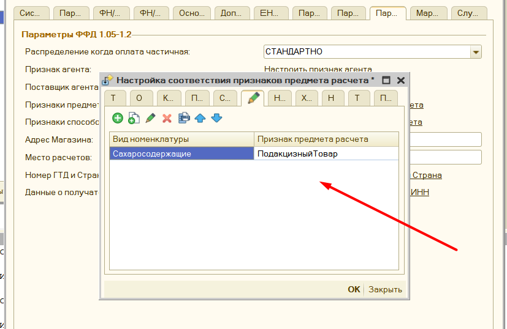

> Настройка подходит для любого подакцизного товара

### Настройка Моторные масла

####  Общие требования
- **Тип маркировки**: `моторные масла`
- **ФФД**: 1.2 (обязательно для работы с разрешительным режимом и количественным учётом)
- **Ревизия драйвера**: 4001+ (для поддержки ФФД 1.2 и маркировки)
- **Разрешительный режим**: Поддерживается с версии обработки **4.09+**

**Включите в настройках**:  
- Тип маркировки «моторные масла» в **Типы маркировок**  
- Разрешительный режим с ключом доступа ЧЗ и ИНН организации
- **Локальный модуль** (с 01.03.2025 обязательный для офлайн-проверки)

#### Номенклатура и учёт
Создайте **отдельные позиции** для разных источников:

| Тип продажи | Номенклатура | Единица (2108) | Количество (1023) | Примечание |
|-------------|--------------|----------------|-------------------|------------|
| Канистры | «Моторное масло [GTIN] 5л» | Штука (0) | 1 (целое) | Сканируется код с канистры |
| Розлив из кеги | «Моторное масло [GTIN] розлив» | Литр | 0.5; 1.25; 2.0 (дробное) | Код с бочки/кеги + литры [5] |

- **Количество**: дробное для розлива
- **Признак предмета расчёта**: 33 (маркированный товар)

#### Продажа и проверка
1. **Сканирование**:  
   - Канистра: код с канистры → тег 2000  
   - Кега: код бочки → тег 2000 + литры

2. **Разрешительный режим**:  
   - Проверка: онлайн (CDN ЧЗ) → офлайн (локальный модуль при недоступности)  
   - Результат: [M+] в чеке, отраслевой реквизит **1260** с 1262–1265 (UUID+Time)
   - **Без доп. тегов частичного выбытия** (1291–1294 не используются для литров)

3. **В форме проверки печати**:  
   - Автозаполнение типа «моторные масла»  
   - Статус разрешительного режима (ошибки отображаются)  
   - F7 для сканирования (клавиатурный сканер)[4]

#### Особенности розлива из кеги
- **Частичное выбытие**: литры суммируются по коду бочки в ЧЗ (остаток ~3–4% без доп. списания)
- **Пример чека**:  
  ```
  Наименование: Моторное масло 5W-40 розлив
  Количество: 1.75 л [1023=1.75][2108=литр]
  Код маркировки: [base64 код бочки] [2000]
  Отраслевой реквизит: [1260 с UUID/Time]
  ```
- **Списание**: через ОФД → ЧЗ (уведомление о реализации с объёмом)

#### Возможные ошибки
- **"Контрольная марка не проверена"**: Проверьте прошивку ФР (ФФД 1.2), драйвер 10.9+ (АТОЛ), компоненты
- **Дробное количество не принимается**: Убедитесь в ревизии 4001+ и ФФД 1.2

## Возможные ошибки сканирования ##

При полностью настроенном механизме работы с маркировкой могут встречаться ошибки считывания марки сканером-штрихкодов. Например, при RDP подключении сканер штрихкодов может считывать марку только в нижнем, или только верхнем регистре букв. Для устранения проблемы, нужно перенастроить параметры RDP подключения и в поле «Использовать сочетания клавиш Windows» установить «На этом компьютере»".

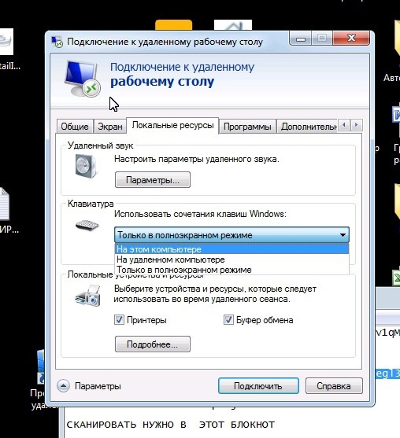

> Есть особенность при работе сканером, который подключен *как клавиатура*, в частности, если включена русская раскладка клавиатуры, то символы маркировки будут считаны как русские, и чтобы такого не было, обычно советуют переключит раскладку в английский вариант перед сканированием, однако в данной программе данная проблема дополнительно обрабатывается: если программа видит, что переданы русские символы, то автоматически их преобразует к английскому варианту раскладки клавиатуры, при этом на экран будет выведено соответствующая информация о преобразовании.
