# Маркировка #

Использование маркировки настраивается в параметрах программы раздел ["Маркировка"](parameters_description.md#маркировка)

Актуальная версия программа поддерживает работу со следующими категориями маркируемого товара:
- изделия из меха  
- лекарственные препараты  
- табачная продукция  
- альтернативный табак  
- никотиносодержащая продукция  
- обувные товары  
- средства защиты  
- антисептики  
- соковая продукция  
- духи  
- шины  
- велосипеды  
- лёгкая промышленность  
- кресла-коляски  
- молочная продукция  
- фотоаппараты  
- упакованная вода  
- пиво  
- пиво в потребительских упаковках  
- безалкогольное пиво  
- БАДы  
- морепродукты  
- алкогольная продукция до 9%  
- медицинские изделия  
- технические средства реабилитации  
- дезинфицирующие средства  
- корма для животных влажные  
- корма для животных  
- безалкогольные напитки  
- мясная продукция  
- ветеринарные препараты  
- игры и игрушки для детей  
- печатные платы  
- радиоэлектронная продукция  
- телефоны и ноутбуки  
- титановая металлопродукция  
- консервированная продукция  
- растительные масла  
- оптоволоконная продукция  
- парфюмерные и косметические средства  
- печатная продукция  
- бакалея  
- строительные материалы  
- пиротехнические изделия  
- отопительные приборы  
- кабельная продукция  
- моторные масла  
- полимерные трубы  
- сладости и кондитерские изделия  
- продукция, продаваемая по объёмно-сортовому учёту  

Из-за того, что список возможных видов маркируемой продукции значительно вырос, в настройки был добавлен параметр **«Настроить ограничение доступности отображения маркировки»**, который позволяет указать те типы маркировки, которые фактически используются в компании. Таким образом, уже в настройках использования маркировки и разрешительного режима, а также в форме проверки печати список будет ограничен только указанными ["видами"](parameters_description.md#маркировка)

## Требования к поддержке маркировки ##

- проверить поддерживает ли ваша модель оборудования в принципе работы с маркировкой
- должны быть установлены актуальные драйвера для оборудования
- обновлена прошивка фискального регистратора
- возможно потребуется дополнительно активировать специальные лицензии на оборудовании для поддержки маркировки (в частности такое есть у АТОЛ)
- обновлена текущая обработка для работы с фискальными регистраторами
- обновлены [компоненты](connecting.md#компоненты-оборудования) для работы с оборудованием
  
[Видео-описание](https://youtu.be/LAiJ1Bf3z3U?t=317)

<a id="разрешительный-режим-тс-пиот"></a>

## Разрешительный режим через ТС ПИоТ

### Что такое ТС ПИоТ и как он работает

ТС ПИоТ (ЕСМ) является отдельным программным обеспечением для проверки разрешения на продажу маркированного товара. Обработка передаёт ему код маркировки, получает результат и использует его при формировании чека.

Сам сервис взаимодействует с ККТ и системой «Честный знак», выполняет предусмотренные его версией онлайн- и офлайн-проверки. Установку, лицензирование и совместимость сервиса уточняйте у его поставщика. Настройка адреса в обработке не устанавливает ТС ПИоТ и не регистрирует в нём кассу.

### Что важно учесть перед переходом

Проверьте всю связку: модель ККТ, прошивку, драйвер, компоненту для 1С, ФФД и версию ТС ПИоТ. Поддержка новой ставки НДС не подтверждает совместимость драйвера с ТС ПИоТ, и наоборот.

Проверяйте совместимость по данным поставщика сервиса и производителя ККТ. После обновления драйвера повторно проверьте связь сервиса с кассой и результат проверки марки.

### Что потребуется для работы

Для корректной работы разрешительного режима через ТС ПИоТ необходимо выполнить несколько условий:

- фискальный регистратор должен поддерживать **ФФД 1.2** и иметь актуальную прошивку;
- драйвер ККТ должен быть совместим с ТС ПИоТ и корректно поддерживать действующие ставки НДС;
- должна использоваться версия обработки **4.08 или выше**;
- модуль **ЕСМ (ТС ПИоТ)** должен быть установлен и настроен;
- между фискальным регистратором и ТС ПИоТ должна быть настроена связь.

Если хотя бы одно из этих требований не выполнено, корректная работа разрешительного режима не гарантируется.

---

### Настройка ТС ПИоТ в обработке

1. Откройте «Параметры» → «Маркировка» → «Разрешительный режим».
2. Укажите адрес сервиса ТС ПИоТ и дату начала его использования. В форме по умолчанию подставляется 28 декабря 2025 года; при настройке проверьте фактическое значение поля.
3. Нажмите «Заполнить настройки». Если ККТ зарегистрирована в сервисе, обработка получит сведения о ФН и организации. Сверьте их с выбранной кассой.
4. Для нескольких организаций заполните настройки по организациям. Проверьте соответствие организации документа, ИНН, кассы, номера ФН и адреса сервиса.
5. Проверьте настройки типов маркировки и дату начала проверки для нужных товарных групп.


Параметр «При ошибке ТС Пиот проверять через разрешительный режим» включает предусмотренный обработкой переход к обычному разрешительному режиму. Для этого прежний режим должен быть настроен и доступен. Переход зависит от результата ТС ПИоТ: марка с уже установленным окончательным статусом не обязательно будет проверяться повторно. Флажок не отменяет отрицательный результат проверки товара.

Дату и возможность применения прежнего протокола проверяйте по [актуальному разъяснению](#техническая-возможность-использовать-обычный-разрешительный-режим-до-октября-2026).

### Что изменится для пользователя

Кассир по-прежнему сканирует код и проверяет результат перед печатью. Меняется сервис, который проверяет разрешение на продажу. При ошибке сохраните показанное сообщение: недоступность сервиса и отрицательный результат проверки марки требуют разных действий.

### Офлайн-режим

При работе через ТС ПИоТ офлайн-проверкой управляет сам сервис. Его установку и синхронизацию проверьте по инструкции поставщика.

Отдельные настройки локального модуля внутри обработки относятся к обычному разрешительному режиму, в том числе если он используется как предусмотренный настройками резервный маршрут. Не переносите параметры между этими механизмами без проверки выбранного маршрута.

### Возможные ошибки при проверке марки через ТС ПИоТ

Сначала определите, получен ли результат проверки товара или возникла ошибка обмена. Сообщение о связи само по себе не является разрешением на продажу.

| Сообщение | Что проверить |
| --- | --- |
| `X-Fn-Sid` | Связь ТС ПИоТ с нужной ККТ и ФН, установление сессии сервисом |
| `403 Forbidden` | Текст ответа сервиса, его авторизацию и состояние соединения с системой маркировки |
| «Код маркировки не найден» | Полный ответ проверки, онлайн- или офлайн-режим, сообщения об ошибке связи |

В обработке предусмотрен один автоматический повтор через 1 секунду при установленном признаке ошибки отправки. Это не универсальный повтор для каждого HTTP-кода или отрицательного результата. Если сообщение осталось, действуйте по описанию ниже и сохраните [лог](licensing.md#как-записать-лог-для-технической-поддержки).

#### Ошибка `X-Fn-Sid`

`X-Fn-Sid` относится к сессии обмена ТС ПИоТ с системой маркировки. Обработка не создаёт этот идентификатор самостоятельно.

Проверьте в сервисе, подключены ли нужные ККТ и ФН. Передайте администратору текст ошибки и время запроса. После восстановления соединения повторите проверку марки. Не подменяйте результат проверки вручную.

#### Ошибка `403 Forbidden`

Ответ `403 Forbidden` означает отказ в доступе к запросу. Он не подтверждает, что товар запрещён или разрешён к продаже.

Проверьте подробный ответ и состояние сервиса ТС ПИоТ. Если ошибка сохраняется, передайте поставщику сервиса время запроса, сведения о подключённой ККТ и журнал обмена. После устранения причины повторите проверку.

#### `Код маркировки не найден` при проблеме связи

Одного поля `found:false` недостаточно, чтобы объяснить причину результата без остального ответа сервиса. Проверьте, был ли полноценный онлайн-ответ, есть ли признак офлайн-проверки и сообщение об ошибке обмена.

В обработке при определённых сочетаниях ответа и настроек может отображаться «Код маркировки не найден в ГИС МТ». В частности, результат зависит от настройки перехода к обычному разрешительному режиму. Само сообщение не подтверждает, что такой переход уже выполнен.

Сохраните результат и время проверки. При восстановленной связи повторите проверку штатной командой. Не меняйте `found:false` на `true` и не считайте отсутствие связи успешной проверкой. Если сообщения противоречат состоянию товара, передайте лог в поддержку.

### Как проверить работу без реального оборудования

Для предварительного тестирования можно использовать официальный сервис, эмулирующий работу ТС ПИоТ:

`https://esm-emu.ao-esp.ru`

Демо-сервер позволяет проверить логику разрешительного режима и отладить интеграцию до подключения реального оборудования.

Наиболее удобный вариант для тестовой среды — использовать демо-сервер ТС ПИоТ вместе с **эмулятором фискального регистратора**. Это позволяет заранее проверить настройки и снизить риски при последующем внедрении.

### Техническая возможность использовать обычный разрешительный режим до октября 2026

По [разъяснению Честного знака от 10.09.2026](https://markirovka.ru/knowledge/tovarnye-gruppy/obschie-voprosy-gis/obyazatelno-li-ustanavlivat-ts-piot-esli-kassa-vzaimodeystvuet-s-sistemoy-markirovki-i-lokalnym-modu), прежний протокол с токеном X-API-KEY технически доступен до 1 октября 2026 года. Это не отменяет требования установки ТС ПИоТ. В публикации также указано, что с 1 июля 2026 года фиксируются отклонения, которые могут передаваться контролирующим органам.

Проверьте наличие решения для своей кассы в реестре и согласуйте установку с поставщиком. Доступность старого токена не следует трактовать как подтверждение отсутствия ответственности. Сведения проверены 19.09.2026; перед переходом сверяйтесь с обновлениями официальной публикации.

## Разрешительный режим продажи маркировки ##

Этот раздел описывает прямой обмен обработки с Честным знаком и локальным модулем. Для подключения через ТС ПИоТ используйте [соответствующий раздел](#разрешительный-режим-через-тс-пиот). Срок действия прежнего протокола и условия перехода приведены [выше](#техническая-возможность-использовать-обычный-разрешительный-режим-до-октября-2026).

### Требования для использования разрешительного режима

Для корректной работы **разрешительного режима продажи** необходимо, чтобы выполнялись **все** следующие условия:

* Касса должна работать с форматом фискальных данных **ФФД 1.2**.
* На фискальном регистраторе должна быть:

  * актуальная версия драйвера;
  * актуальная версия прошивки.
* Версия программы:

  * не ниже **3.79**;
  * для работы с **лекарственными препаратами** — не ниже **4.02**.
* На рабочем месте кассира или на сервере (при работе через RDP) должен быть **доступ в интернет**.
* Должен быть проверен доступ к серверам **Честного Знака**:

  * доступ не должен быть заблокирован на сервере;
  * Честный Знак может блокировать запросы, если клиентское подключение выполняется через **VPN**.

---

### Включение разрешительного режима в программе

Для включения разрешительного режима:

1. Откройте **параметры программы**.
2. Перейдите в раздел **«Маркировка»**.
3. Найдите параметр **«Разрешительный режим»**.

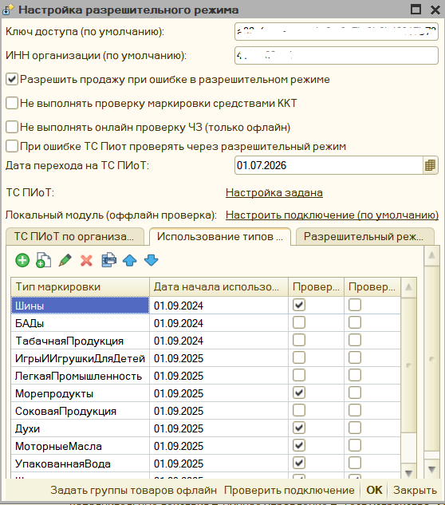

---

### Описание параметров разрешительного режима

#### Ключ доступа (по умолчанию)

**Ключ доступа** — это токен для обращения к серверам Честного Знака.

* Получается отдельно для организации.
* Используется для выполнения запросов проверки марки.

Инструкция по получению ключа доступа:
[https://www.markirovka.ru/knowledge/tovarnye-gruppy/legkaya-promishlennost/kak-poluchit-klyuch-dostupa-dlya-razreshitelnogo-rezhima-proverok-na-kkt](https://www.markirovka.ru/knowledge/tovarnye-gruppy/legkaya-promishlennost/kak-poluchit-klyuch-dostupa-dlya-razreshitelnogo-rezhima-proverok-na-kkt)

---

#### ИНН организации для проверки марки (по умолчанию)

Указывается **ИНН организации**, которой принадлежит ключ доступа.

* ИНН передаётся в запросах проверки марки.
* Обязателен для корректной работы разрешительного режима.

---

#### Разрешить продажу при ошибке в разрешительном режиме

Параметр может разрешать предложение пропустить проверку при ошибке обмена в обычном разрешительном режиме. Он не отключает проверку средствами ККТ и не превращает отрицательный результат марки в положительный.

При настроенном офлайн-механизме сначала проверьте его результат. Пропуск проверки не используйте как способ устранить ошибку настройки или отказ по товару. Условия применения разрешительного режима проверяйте по действующим правилам вашей товарной группы.

#### Не выполнять проверку маркировки средствами ККТ

При успешной проверке в разрешительном режиме параметр позволяет выполнять проверку через ККТ без ожидания ответа ОИСМ. В таком случае на чеке может отображаться `[M]` вместо `[M+]`.

Знак на бумажном чеке и результат разрешительного режима характеризуют разные этапы проверки. Убедитесь, что разрешительный режим действительно выполнен и его результат передан в чек. [Честный знак объясняет обозначения маркировки в фискальных документах](https://markirovka.ru/knowledge/tovarnye-gruppy/obschie-voprosy-gis/znachenie-m-v-fiskalnykh-dokumentakh-chekakh).

#### Ключ доступа в разрезе организаций

Используется, если:

* на одном рабочем месте формируются чеки **по нескольким организациям**;
* у каждой организации свой ключ доступа.

В этом разделе можно:

* указать ключ доступа для каждой организации;
* указать ИНН для запросов проверки;
* настроить подключение к локальному модулю для каждой организации.

Если ИНН не заполнен, программа попытается получить его **из карточки организации**.

---

#### Настройка типов маркировки для разрешительного режима

В этом разделе указывается:

* **какие типы маркировки** подлежат проверке;
* **с какой даты** начинается проверка.

> **ВАЖНО**
> Если этот раздел не заполнен, проверка маркировки выполняться **не будет**,
> даже если указан корректный ключ доступа.

Пример:

* с **01.04.2024** требуется проверять:

  * «Табачную продукцию»;
  * «Пиво».

В таблице необходимо:

* указать нужные типы маркировки;
* в поле **«Дата начала использования»** указать `01.04.2024`.

---

### Прочие настройки

Остальные параметры в этом разделе относятся к работе **локального модуля**
и описаны отдельно:

[Настройка локального модуля для офлайн-проверки](#настройка-локального-модуля-для-офлайн-проверки)

---

### Проверка доступа к серверам Честного Знака

Для снижения нагрузки Честный Знак использует несколько серверов проверки.

Алгоритм работы:

1. Первый запрос отправляется на основной сервер.
2. В ответе возвращается список доступных **CDN-площадок**.
3. Выбирается наиболее быстрая CDN.
4. Проверка марки выполняется через неё.

Пример адреса CDN-площадки:

```
https://cdn06.crpt.ru
```

Таких адресов может быть несколько.

---

#### Особенности работы через RDP

Если 1С установлена на сервере, а пользователи подключаются через **RDP**:

* запросы проверки выполняются **с сервера**, а не с клиентского компьютера;
* это связано с архитектурными особенностями 1С на обычных формах.

В брандмауэре сервера необходимо разрешить доступ к:

* `https://markirovka.crpt.ru`
* `https://cdn.crpt.ru`
* всем CDN-площадкам по шаблону:

```
https://cdn\d{2}\.crpt\.ru
```

Также необходимо уточнить и разрешить **IP-адреса** этих серверов.

---

### Проблемы доступа на платформе 8.1 (Windows 8)

На платформе **1С 8.1** под **Windows 8** может отсутствовать доступ к серверам Честного Знака,
даже при корректных настройках брандмауэра.

Причина:

* используется COM-компонента `WinHttp.WinHttpRequest.5.1`;
* сертификат `cacert.pem`, поставляемый с платформой 8.1, устарел (2009 год).

#### Решение

1. Скачайте актуальный сертификат:
   [cacert.pem](bin/cacert.pem)
2. Скопируйте файл в каталог:

```
1cv81\bin
```

3. Перезагрузите компьютер.


### Особенность Управление торговлей 10.3 ###

Для конфигурации Упавление торговлей 10.3 в частности с релиза **10.3.88.3** добавлена также поддержка разрешительного режима, однако она конфликтует с функционалом обработки, и если в УТ 10.3 используется функционал ведения учета маркированного товара, то желательно выполнить следующую настройку, чтобы можно было использовать проверку разрешительного режима через обработку:
- Необходимо перейти "Обмен с ГосИС" - "Обмен с ИСМП (одежда, обувь, табак...)" 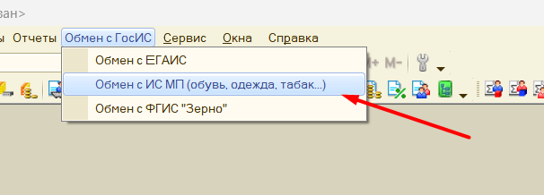
- Далее "Настройки и справочники" - "Интеграция с ИС МП" - в разделе "Вести учет маркируемой продукции" - нужно поставить значение "Разршетельный режим на ККТ" в 01.01.2035 год.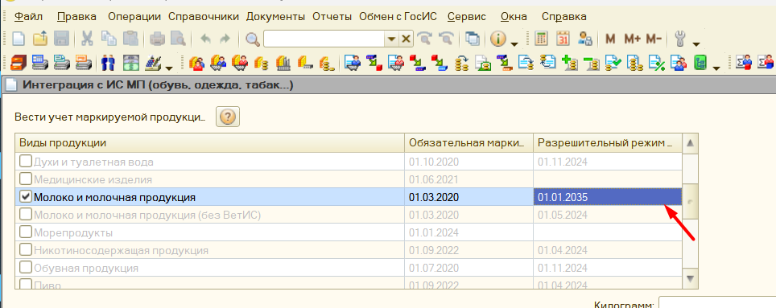


#### Как это работает ####

После выполнения настроек выше, при продаже товара в разрешительном режиме в форме проверки маркированного товара появится дополнительная колонка "Статус проверки в разрешительном режиме".
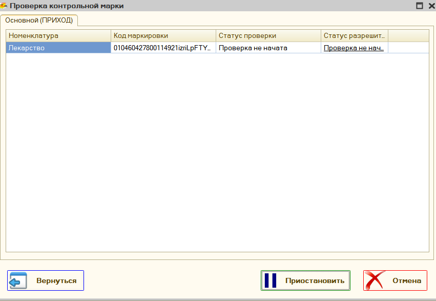
Перед непосредственной фискализацией обработка самостоятельно отправляет запрос в Честный знак и получает статус продажи марки, если товар недоступен к продаже, то в указанном поле дополнительно появится текст ошибки. 

При успешном выполнении информация о времени проверки статуса, и идентификатор этого запроса будет прописан в отраслевой реквизит будущего чека. По сути проверка в разрешительном режиме только дополняет стандартную проверку через ККТ.

> При успешном разрешительном режиме проверка через ККТ может выполняться без ожидания ответа ОИСМ. Поэтому обозначение `[M]` само по себе не описывает результат разрешительного режима. Проверяйте статус в форме и переданные реквизиты; [пояснение Честного знака](https://markirovka.ru/knowledge/tovarnye-gruppy/obschie-voprosy-gis/znachenie-m-v-fiskalnykh-dokumentakh-chekakh).

## Настройка локального модуля для офлайн проверки

Эти настройки относятся к прямому обмену обработки с локальным модулем Честного знака в обычном разрешительном режиме. Модуль используется, когда онлайн-проверка недоступна. При подключении через ТС ПИоТ настройте [офлайн-режим самого сервиса](#офлайн-режим).

Перед настройкой проверьте [условия перехода на ТС ПИоТ](#техническая-возможность-использовать-обычный-разрешительный-режим-до-октября-2026) и [формат обмена с локальным модулем](#проверка-настроек-локального-модуля).

### 🚀 Как подключить офлайн режим?

[Официальная инструкция](https://markirovka.ru/community/rezhim-proverok-nakassakh/oflayn-proverka-na-kassakh-lokalnyy-modul-chz) для Windows.

### 🔧 **Установка локального модуля**
1. Перейдите на страницу **Локального модуля**:  
   [Официальный сайт](https://xn--80ajghhoc2aj1c8b.xn--p1ai/local-module/)
2. В разделе **«Скачать ПО Локальный модуль»** выберите и скачайте нужный файл.
3. Запустите установочный файл и следуйте инструкциям.
4. Обновите обработку до версии **3.98** или новее.
5. Настройте локальный модуль в программе (см. ниже).

---

### Настройка локального модуля в программе

Настройки модуля находятся в разделе обработки, где указываются параметры разрешительного режима.

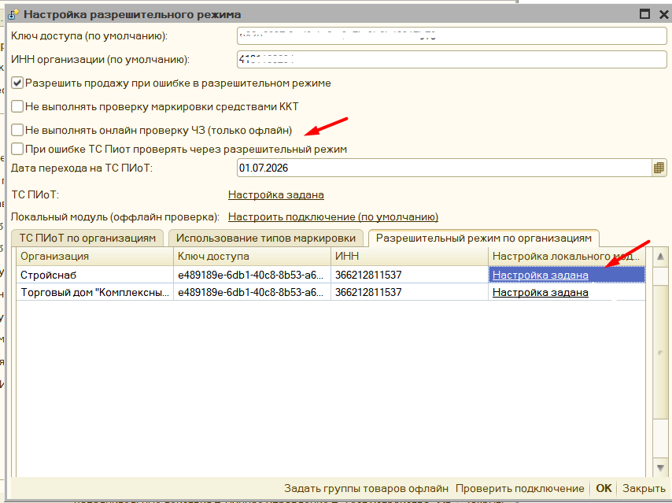

### 📌 **Основные параметры**

- **`не выполнять онлайн проверку ЧЗ (только офлайн)`** – позволяет пропустить онлайн-проверку и сразу проверять маркировку офлайн.  
  *Рекомендуется только в случаях долгого отсутствия интернета (>1 часа).*

- **Локальный модуль (офлайн проверка) По умолчанию** – указывает параметры подключения к локальному модулю, если не задано иное.

- **Настройка локального модуля для организаций** – если несколько организаций используют кассу, для каждой указывается отдельный модуль.  
  Для каждой организации проверьте отдельные настройки подключения и соответствие ИНН. Возможность обслуживания нескольких организаций одним сервисом уточните для установленной версии локального модуля.
  *Решение: разнести модули по разным портам или компьютерам.*

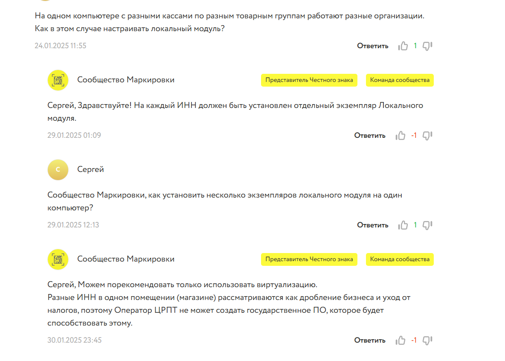

- **`Задать группы товаров офлайн`** – позволяет выбрать, для каких товаров загружать данные о заблокированных марках. (*не применяется для версии локального модуля V2*)

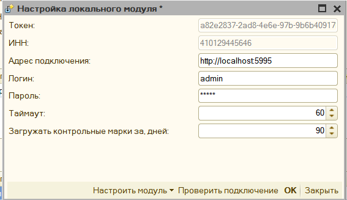

---

### 🔄 Настройка самого модуля

1. Войдите в **меню настройки модуля**.
2. Укажите:
   - **Адрес установленного модуля**
   - **Логин и пароль** (должны соответствовать тем, что были указаны при установке модуля)
3. Нажмите **«Настроить модуль» → «Инициализировать»**.
4. После успешной инициализации, в течение 2-3 минут, нужно дождаться статус `ready`,  и после переходить к его использовани. Чтобы узнать статус подключения или проверить проходит ли синхронизация или нет надо нажать **"проверить подключени"**  
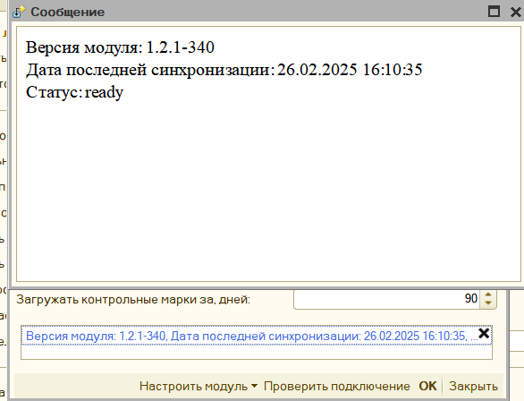

> **Обратите внимание!** Если необходимо перерегистрировать модуль для другой организации, его нужно удалить вместе с настройками и установить заново.

---

### 🔍 Как работает локальный режим (офлайн проверка)?

После настройки система проверяет маркировку в три этапа:

1. Проверка доступности CDN-площадок. Срок актуальности списка задаётся параметром «Интервал запроса площадок CDN, мин.»; первый запрос после истечения интервала может занять больше времени.
2. Онлайн-проверка:
   - Если серверы доступны, проверка проходит в интернете.
   - Если серверы недоступны или истек таймаут, активируется офлайн режим.
3. Офлайн-проверка:
   - Система запрашивает внутреннюю базу.
   - Проверяется **только факт блокировки марки**, дополнительные проверки недоступны.

*Если онлайн или офлайн проверка пройдена – маркировка передается на кассу, которая также выполняет контроль.*

---

### ❓ Часто задаваемые вопросы (FAQ)

### **Что делать, если офлайн проверка не работает?**
1. Убедитесь, что установленная версия локального модуля **актуальна**.
2. Проверьте, что в настройках указан **правильный адрес модуля**.
3. Обновить данную программу, возможно были выпущены исправления для использования локального модуля
4. Если проблема не решена – проверьте настройки сети и файрвола.

### **Можно ли использовать один модуль для нескольких организаций?**
Нет, официальная рекомендация – **разные локальные модули для каждой организации**. Альтернативный вариант – настройка модулей на **разных портах**.


## Настройка типов маркировки ##

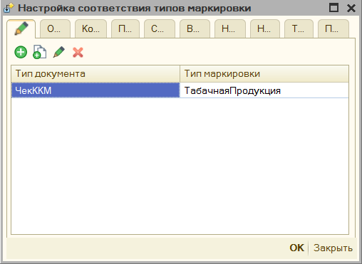

Чтобы указать программе, какой товар является маркированным, необходимо указать это условие в параметре **"Типы маркировок"**. Как задается такое условие описано в разделе инструкции [Механизм распределения](mechanism_distribution.md). Таким образом можно указать, что пробиваемый товар является обувью, табаком, лекарствами или другими группами маркированного товара.
> Выбирайте тип маркировки по товару. Для типа «Средства защиты» обработка не проверяет дубли марок, поэтому не используйте его для отключения проверки у других товарных групп.

## Продажа лекарств ##

Продажа лекарств отличается небольшими тонкостями при настройке. Вначале в программе необходим включить параметр **"Использовать маркировку лекарств"**, и заполнить **"Идентификатор места деятельности МДЛП"**. Идентификатор будет передавать в составе тегов 1085 и 1086. После этого указать [тип маркировки](#настройка-типов-маркировки) **"Лекарственные препараты"**.

Программа поддерживает работу с льготными рецептами, информацию об использовании льготы заполняется из документа основания, если есть соответствующие реквизиты, либо эту информацию можно указать в форме проверки печати в окне "Настройка основных реквизитов чека" - "Реквизиты МДЛП". При изменении информации о льготах в этом окне - будет автоматически пересчитаны дополнительные реквизита пользователя (теги 1085 и 1086)

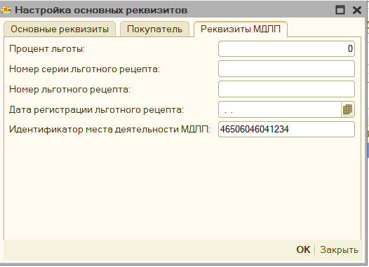

В крайнем случае теги 1085 и 1086 можно отредактировать вручную, тогда данные заполнения льгот будут проигнорированы.

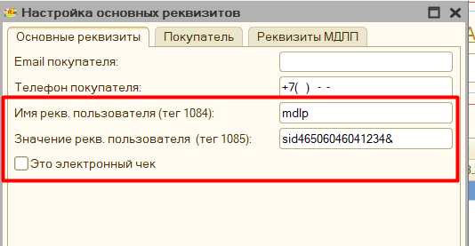

### Разрешительный режим лекарственные препараты с 01 июня 2025г ###

Для использования разрешительного режима для лекарственных препаратов необходимо включить использование маркировки [лекарственных препаратов](#продажа-лекарств) в целом. Далее указываем использование маркировки для разрешительного режима по этой [инструкции](#разрешительный-режим-продажи-маркировки), однако следует учитывать, что нужно использовать версию обработки **4.02** или выше.


### Частичная продажа упаковок маркированного товара ###

Программа поддерживает частичную продажу упаковок лекарств, или парфюмерии на розлив. При этом заполняется дополнительный реквизит предмета расчета (тег 1191) с информацией о содержимом неполной упаковки. Для этого в базе необходимо выполнить следующие действия:

1. Заведите номенклатуру-упаковку лекарства, или тару с большой емкостью для парфюмерии.
2. Помимо основной единицы измерения, заведите вторичную и назовите ее "**Первичная упаковка**", в поле коэффициент укажите сколько штук или миллилитров товара находится в упаковке.
   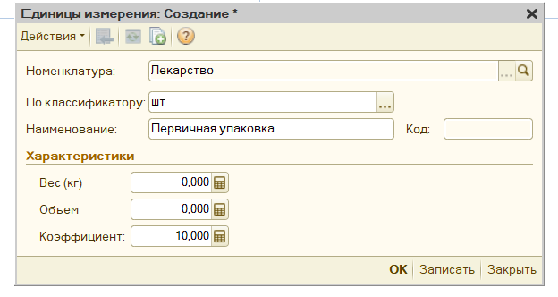
3. При продаже товара-упаковки для частичной продажи, указывайте дробное количество в чеке, тогда при заполнении формы продажи будет проверяться коэффициент единицы измерения "Первичная упаковка", и если он отличается от единицы, то программа будет считать, что продается упаковка.
   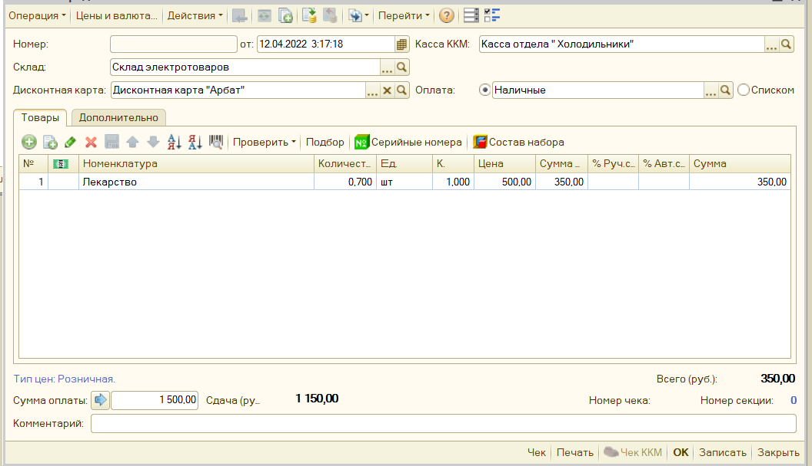

> **Пример**, мы продаем неполную коробку 7 из 10 лекарств, при этом "первичная упаковка" имеет коэффициент - 10, значит в изначальном чеке у нас будет количество 0.7 товара, а в форме проверки печати, это количество автоматически станет равно 1 (так как по закону маркированный товар может передаваться только с количеством 1, и данные о частичной продаже у нас будут отражены только в теге 1191), также в поле "количество единиц в упаковке" будет указано 10, а тег 1191 заполнится как "mdlp7/10&"

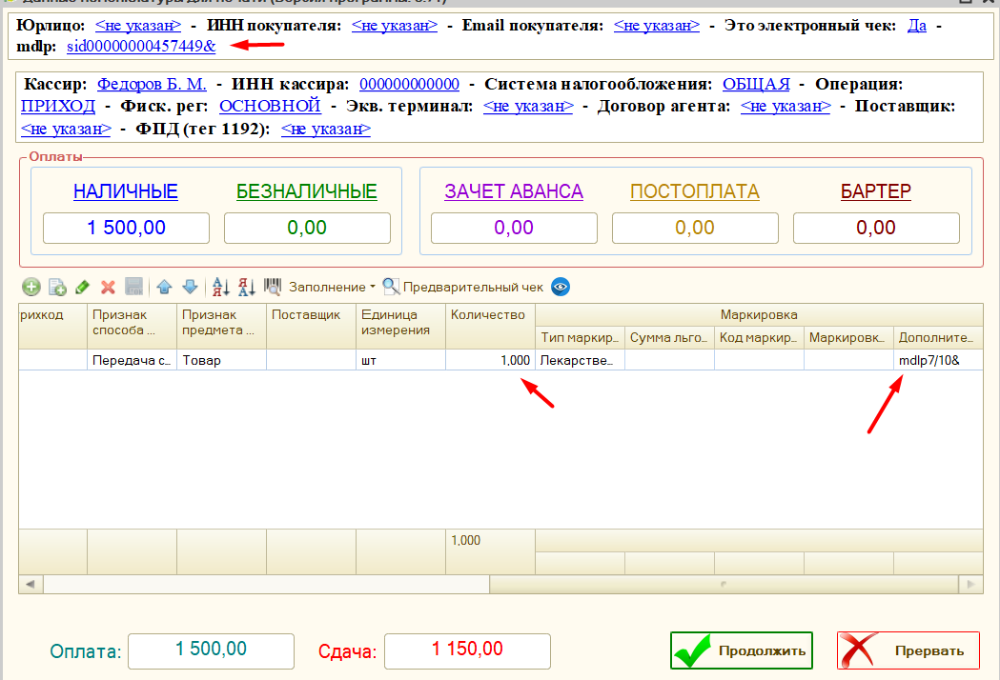

> **ФФД 1.2**: при переходе на форма работы с драйверами торгового оборудования ревизия **3004**, и если фискальный накопитель переключен на ФФД 1.2, то данные о дробном количества будут переданы в составе тега 1291

## Отражение продаж индивидуальных средства защиты ##

Согласно постановлению правительства от 16 апреля 2020 г. N 521, при продаже средств индивидуальной защиты, необходимо заполнять и передавать «код товара». Код товара из себя представляет предопределенный штрихкоды для определенной группы товара, общий перечень штрихкодов можно посмотреть по [ссылке](https://www.garant.ru/hotlaw/federal/1362146/). Таким образом для отражения данных товаров необходимо:

1. В параметрах обработки настроить тип маркировки «**Средства индивидуальной защиты**» для нужной номенклатуры или группы товара.

   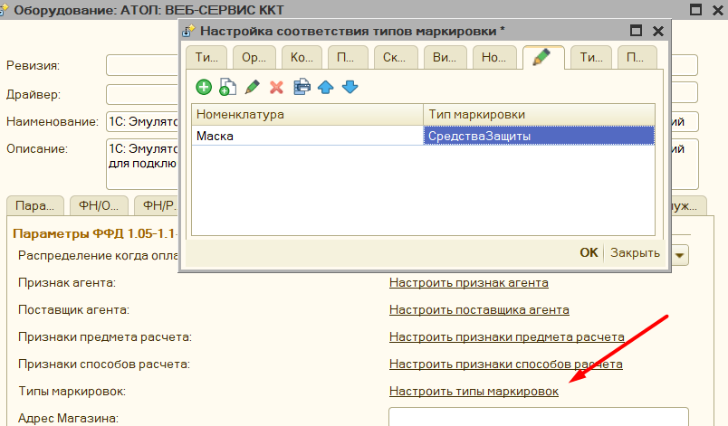

1. Убедиться, что у вас в поле Ревизия интерфейса стоит 3002, 3004 или выше.

    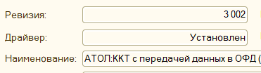

    Это связано с тем, что компоненты с данной ревизией поддерживают передачу маркировки в формате base64.

1. Передайте значение маркировки в чек. Возможно несколько вариантов.Маркировка находится сразу в документе, для этого должно быть заполнено поле «Штрихкод», или «КодМаркировки», если такие поля в вашем документе предусмотрены. Возможно заполнить маркировки через дополнительный обработчик, для этого необходимо заполнить поле «КодМаркировки», или «Штрихкод», в процедуре «ПослеФормированияТаблицыЧека», после этого данная маркировка будет автоматически распознана.

В типовых конфигурациях, например «Управление торговлей 10.3», также поддерживается заполнение данных штрихкодов по умолчанию.

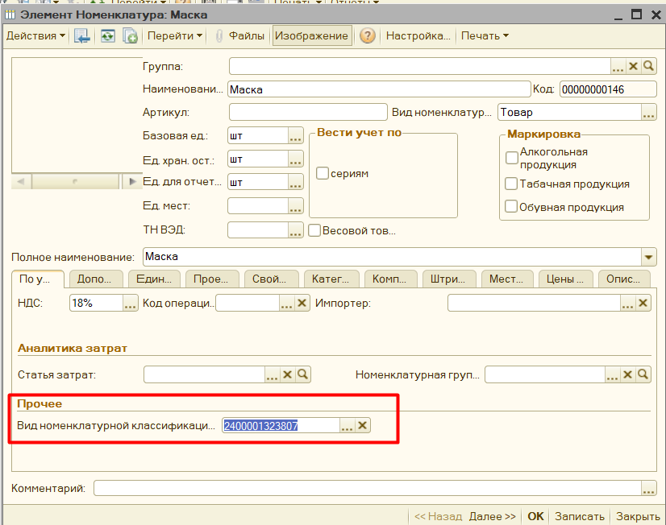

Штрихкоды средств защиты можно вносить интерактивно, для этого их необходимо сохранить, а затем при продаже отсканировать

## Как продавать маркированный товар через обработку ##

Если все настройки по использованию маркировки выполнены, и в чеке присутствует маркированный товар, то при открытии ["Формы проверки печати"](form_check_and_check_correction.md) будет автоматически заполнено поле *"тип маркировки"*, помимо этого программа попытается [найти](#откуда-программа-берет-данные-для-маркировки) заполненную марку в документе основания, если она была там указана. Если же её - нет, либо 1С не поддерживает работу с маркировкой. то марку можно заполнить и вручную в окне данной формы.

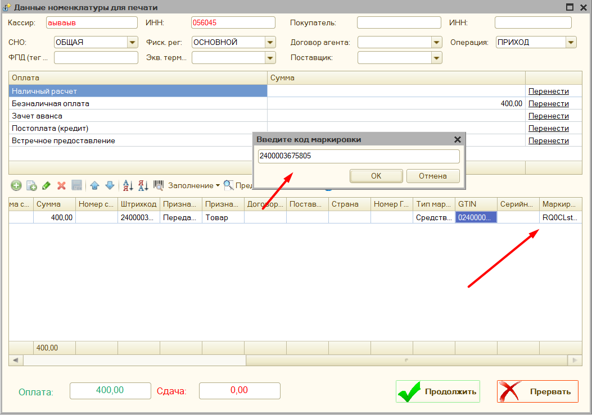

Форма проверки печати поддерживает работу со сканером штрихкодов, если сканер подключен через COM-подключение, то необходимо встать на строку с товаром и отсканировать марку, данные, если они корректны,автоматически попадут в поля *Base64 Маркировка* и *код марки*.
Если сканер штрихкодов подключен как клавиатура, то перед сканированием необходимо нажать кнопку **"F7"** или на значок штрихкода в окне программы, и уже в открывшееся поле отсканировать марку.
Если форма проверки печати отключена, то если в чеке присутствует маркированный товар - откроется специальная форма для указания только данных маркировки, в остальном же способ сканирования такой же.
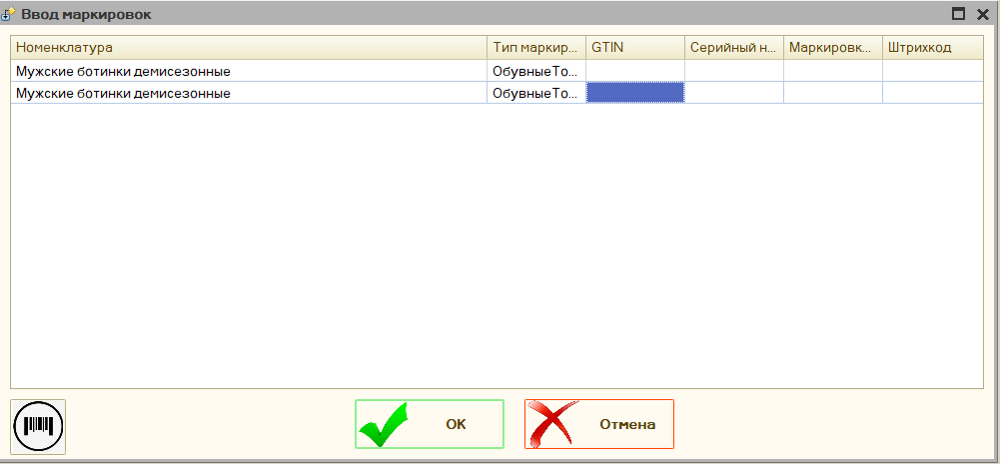

> **Важно**, маркировку можно указать только при фактической продаже товара, на это указывают признак способа расчета позиции - **"Передача"** (без оплаты, с частичной или полной оплатой), если в чеке стоит **"Аванс"**, **"Предоплата"**, либо **"Оплата кредита"**, то предполагается, что передается не товар, а деньги, тогда в позициях товара будет фигурировать "Платеж", а не маркированный товар. Для таких позиций марка не заполняется.

## Поддержка ФФД 1.2 ##

Для поддержки формата фискальных данных 1.2 добавлен интерфейс проверки маркировки. Перед пробитием чека, если включен параметр *Проверять корректность маркировки перед пробитием чека*, И в чеке на момент пробития есть маркированный товар с заполненным кодом марки, то откроется специальное окно, где можно запустить процедуру проверки маркировки средствами ККТ.

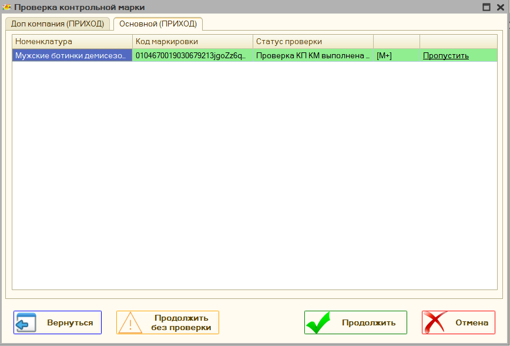

, Дополнительно программа проверяет соответствует ли компонента и версия ФФД оборудования нужному формату, и если нет, то выводит соответствующее сообщение.

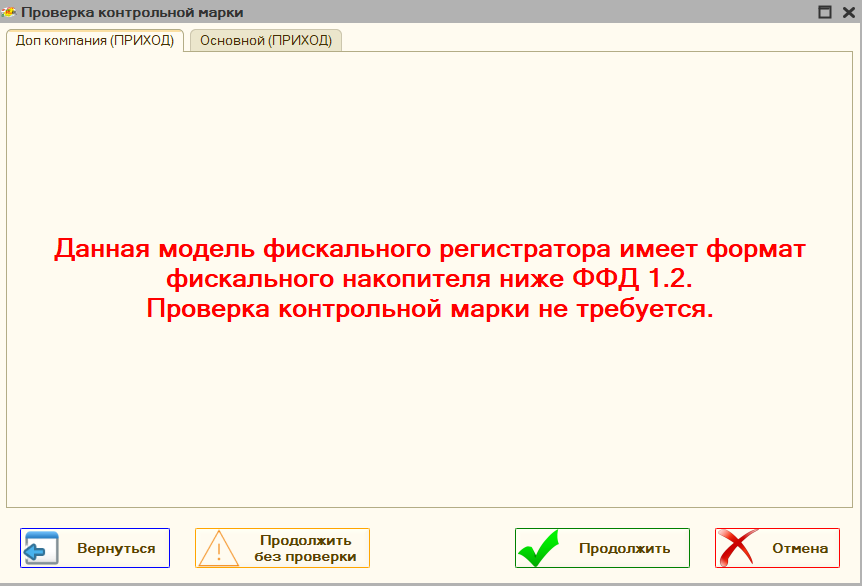

В данном можно пропустить проверку целиком, выбрать какие марки не нужно проверять, нажав на поле в таблице **Пропустить**. Также поддерживается возможность приостановить проверку, если возникла какая-то проблема.

### Контрольная марка не проверена - и что с этим делать? ###

Наиболее частая ошибка, что теперь видят при продаже маркированного товара после перехода на ФФД 1.2. Чтобы ее избежать необходимо:

1. Проверить вашу прошивку, и поддерживает ли она маркировку вообще и переключен ли фискальный регистратора на ФФД 1.2
2. Проверить актуальные ли у вас драйвера, для АТОЛ сверяйте версию с требованиями вашей ККТ и компоненты. Ранее в инструкции приводилась версия 10.9.0.9 по [ссылке](http://fs.atol.ru/_layouts/15/atol.templates/Handlers/FileHandler.ashx?guid=e8f4e641-84f3-4548-b522-3b8d0c88d84a&webUrl=) из центра загрузки АТОЛ , для ШтрихМ [тут](https://exam.shtrih-m-partners.ru/base/), для вики принт [тут](https://help.dreamkas.ru/hc/ru/articles/115001745425)
3. Затем полностью удалить старые компоненты обработки, и распаковать [новые](https://yadi.sk/d/jcdpGNZ43WQtro)
4. Включить в параметрах обработки параметр "Проверять марку перед пробитием чека"
5. Проверить, чтобы в параметрах программы стояло "Подключение кассы" - "Стандартно" 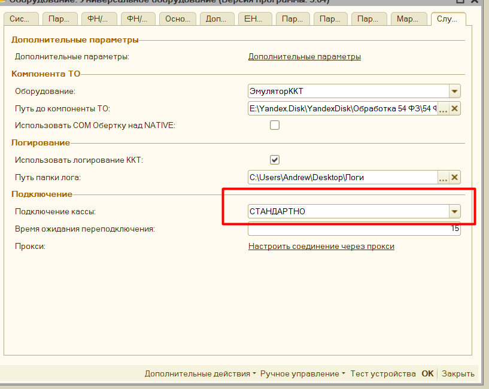
6. И осталось только перезапустить 1С для обновления параметров 1С

### Откуда программа берет данные для маркировки ###

Для автоматического заполнения таблицы с маркировкой программа проверяет есть ли у указанного документа табличная часть "КодыМаркировки", таблица должна содержать 2 поля "КлючСтроки" - "идентификатор" по которому программа сможет найти между маркировкой и строками товара, и поле "КодМаркировки" - содержащее непосредственно маркировку, так сделано например в конфигурации "Рарус: Альфа-Авто". Либо может быть таблица "ШтрихкодыУпаковок", которая имеет поле "ШтрихкодУпаковки", по которому обработка и будет искать соответствие, примером является конфигурация "Управление торговлей 10.3"
> **Важно**, маркировка будет заполняться и передаваться только, если заполнен в соответствии "**тип маркировки**", и указан "**Признак способа расчета**" - "Передача с частичной оплатой", либо "Передача с полной оплатой", либо "Передача без оплаты".

## Продажа сахаросодержащих напитков ##

Для сахаросодержащих напитков настройте признак предмета расчёта «Подакцизный товар», если он применяется к продаваемому товару. Этот признак и код маркировки являются разными реквизитами. Настройка акциза не заменяет [настройку типа маркировки](#настройка-типов-маркировки) и проверок для товара, который подлежит маркировке.

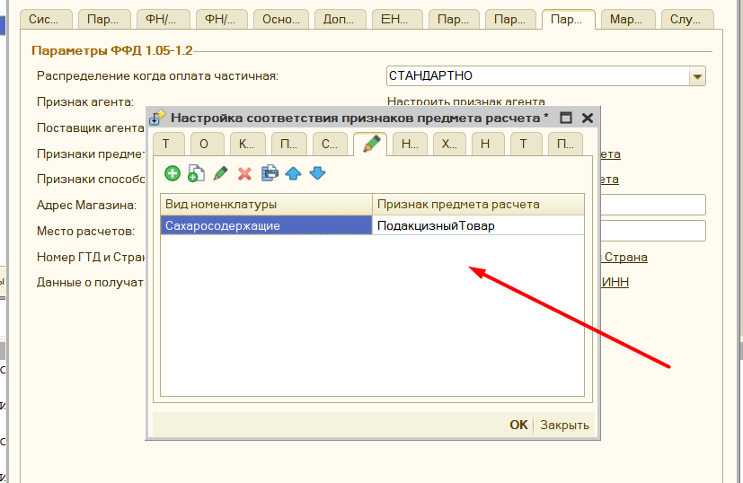

> Настройка подходит для любого подакцизного товара

### Настройка Моторные масла

####  Общие требования
- **Тип маркировки**: `моторные масла`
- **ФФД**: 1.2 (обязательно для работы с разрешительным режимом и количественным учётом)
- **Ревизия драйвера**: 4001+ (для поддержки ФФД 1.2 и маркировки)
- **Разрешительный режим**: поддерживается с версии обработки **4.09+**; используйте актуальную версию и выбранный для рабочего места маршрут проверки.

**Включите в настройках**:  
- Тип маркировки «моторные масла» в **Типы маркировок**  
- Разрешительный режим с ключом доступа ЧЗ и ИНН организации
- Офлайн-проверку выбранного маршрута: через сервис ТС ПИоТ либо локальный модуль обычного разрешительного режима.

#### Номенклатура и учёт
Создайте **отдельные позиции** для разных источников:

| Тип продажи | Номенклатура | Единица (2108) | Количество (1023) | Примечание |
|-------------|--------------|----------------|-------------------|------------|
| Канистры | «Моторное масло [GTIN] 5л» | Штука (0) | 1 (целое) | Сканируется код с канистры |
| Розлив из кеги | «Моторное масло [GTIN] розлив» | Литр | 0.5; 1.25; 2.0 (дробное) | Код с бочки/кеги и проданный объём в литрах |

- **Количество**: дробное для розлива
- **Признак предмета расчёта**: 33 (маркированный товар)

#### Продажа и проверка
1. **Сканирование**:  
   - Канистра: код с канистры → тег 2000  
   - Кега: код бочки → тег 2000 + литры

2. **Разрешительный режим**:  
   - Проверка: онлайн (CDN ЧЗ) → офлайн (локальный модуль при недоступности)  
   - Проверьте результат разрешительного режима и отраслевой реквизит **1260**. Обозначение `[M]` или `[M+]` зависит также от проверки средствами ККТ.
   - Для ФФД 1.2 проверьте код маркировки, количество и единицу измерения. [Честный знак описывает передачу объёма при розливе](https://markirovka.ru/knowledge/tovarnye-gruppy/motornye-masla/fasovka-motornykh-masel-nuzhno-li-markirovat-motornye-masla-prodavaemye-na-rozliv).

3. **В форме проверки печати**:  
   - Автозаполнение типа «моторные масла»  
   - Статус разрешительного режима (ошибки отображаются)  
   - F7 для сканирования (клавиатурный сканер)

#### Особенности розлива из кеги
- **Частичное выбытие**: при розничной продаже физическому лицу передавайте код упаковки и фактически проданный объём. Порядок обращения с остатком и иными видами реализации проверяйте по [официальному разъяснению](https://markirovka.ru/knowledge/tovarnye-gruppy/motornye-masla/fasovka-motornykh-masel-nuzhno-li-markirovat-motornye-masla-prodavaemye-na-rozliv).
- **Пример чека**:  
  ```
  Наименование: Моторное масло 5W-40 розлив
  Количество: 1.75 л [1023=1.75][2108=литр]
  Код маркировки: [base64 код бочки] [2000]
  Отраслевой реквизит: [1260 с UUID/Time]
  ```
- **Списание**: через ОФД → ЧЗ (уведомление о реализации с объёмом)

#### Возможные ошибки
- **"Контрольная марка не проверена"**: Проверьте прошивку ФР (ФФД 1.2), совместимость драйвера, компоненты и ККТ
- **Дробное количество не принимается**: Убедитесь в ревизии 4001+ и ФФД 1.2

## Возможные ошибки сканирования ##

При полностью настроенном механизме работы с маркировкой могут встречаться ошибки считывания марки сканером-штрихкодов. Например, при RDP подключении сканер штрихкодов может считывать марку только в нижнем, или только верхнем регистре букв. Для устранения проблемы, нужно перенастроить параметры RDP подключения и в поле «Использовать сочетания клавиш Windows» установить «На этом компьютере»".

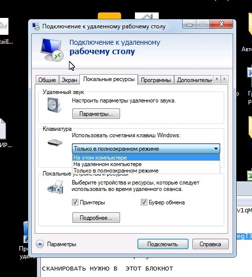

> При работе со сканером в режиме клавиатуры используйте английскую раскладку. Если код поступил с русскими символами, обработка преобразует их в символы английской раскладки и сообщает об этом на экране.

## Порядок проверки маркированного товара

Перед первой продажей определите тип маркировки для товара, настройте используемый разрешительный режим и проверьте оборудование. Ограничение списка видимых типов маркировки само по себе не задаёт правила проверки.

1. Откройте форму проверки печати. Проверьте товар, количество, единицу измерения, тип маркировки и признак способа расчёта.
2. Отсканируйте код. Для сканера в режиме клавиатуры используйте F7 и поле ввода. Проверьте, что код попал в нужную позицию.
3. Дождитесь результата предусмотренных проверок. Наличие кода в строке ещё не означает разрешение на продажу.
4. При отказе проверьте сообщение для конкретной марки. При ошибке связи проверьте результат офлайн-механизма; отсутствие ответа не равно разрешению.
5. Перед фискализацией проверьте все позиции. После операции сопоставьте результат ККТ с документом 1С.

| Этап | Что проверяется |
| --- | --- |
| Ввод и разбор кода | Наличие и формат кода, его привязка к позиции |
| ККТ/ОИСМ | Проверка марки средствами кассы с учётом ФФД и настроек ожидания |
| Разрешительный режим | Возможность продажи по результату ЧЗ, ТС ПИоТ или предусмотренной офлайн-проверки |

Статус «Не настроено» не является успешной проверкой. Статус «Не требуется» также отличается от положительного ответа сервиса. Для возврата обработка не выполняет разрешительную проверку продажи, но требования к наличию кода, его передаче в ККТ и настройка «Не пробивать чек без указания маркировки „ВОЗВРАТ“» рассматриваются отдельно.

Если разрешительный режим не запускается, проверьте таблицу типов маркировки и даты начала: при пустой настройке один только адрес сервиса или ключ не включает проверку нужной группы.

## Проверка настроек локального модуля

В настройках подключения выберите формат, соответствующий установленному локальному модулю. Обработка поддерживает V1 и V2: для новых настроек используется V2, а ранее сохранённая настройка без указания формата может обрабатываться как V1. Не меняйте формат только ради устранения сообщения об ошибке; сначала сверьте версию сервиса.

После инициализации дождитесь состояния `ready`, затем выполните проверку подключения. Для нескольких организаций проверьте отдельные настройки и соответствие ИНН. Настройка товарных групп в обработке, предусмотренная для V1, не применяется к V2.

При работе через ТС ПИоТ эти параметры не заменяют настройку офлайн-режима самого сервиса. Различия маршрутов описаны в [разделе ТС ПИоТ](#офлайн-режим).
