# Механизм распределения #

>**Внимание**: **Механизм распределения** будет работать, если обработка сможет определить документ для печати, для этого этот документ должен быть ей передан в явном виде. Если же нет, то при печати будет выведено окно с предложением указать этот документ вручную. Проверьте сделана ли у вас доработка из видео.

В обработке множество параметров, и для большинства можно задать условие их применения. Механизм использования этих настроек одинаков для каждого, поэтому общие моменты будут описаны здесь, далее будут приведены ссылки уже на этот
раздел.

Описание параметров размещено с учетом приоритета их применения: от наименее приоритетного к наиболее. Если в вашей конфигурации не будет отображаться один из описанных условий, то у вас просто нет таких метаданных. Далее под словом
«параметр» будет иметься ввиду именно их значение, например «Признак предмета расчета», или «Признак способа расчета» и т.д.

## Условия распределения ##

### Типы документов ###

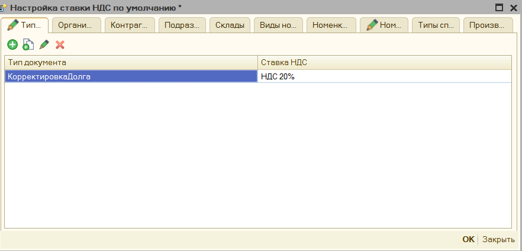

Здесь можно выбрать тип документа, где применять параметр. Например, мы хотим, чтобы для документа «Корректировка долга», всегда была ставка НДС 20%, здесь это можно указать. Данное условие применяется перед формированием таблицы чека, является наименее приоритетным.

>**Обратите внимание**, также в настройке можно указать «**Все документы**» - «*ALL*», в таком случае условие будет накладывать сразу на все чеки, которые сформирует обработка.

### Организации ###

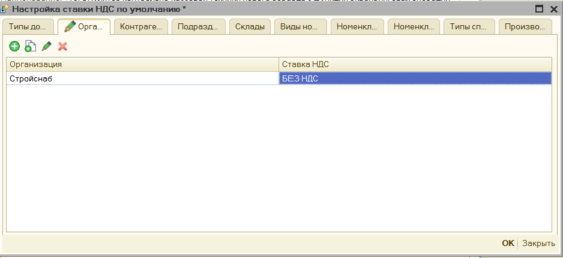

Можно выбрать для какой организации применять параметр. Например, мы хотим, чтобы для организации «Стройснаб» отсутствовал НДС в чеках. Применяется, если для документа удается определить организацию.

### Контрагенты ###

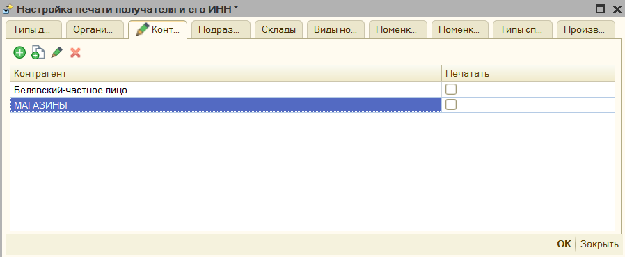

Можно выбрать для какого контрагента применять параметр. Например, мы хотим, чтобы для контрагента «Белявский» и всех контрагентов в папке «Магазины» в чеке не выходил их инн и наименования. Применяется, если для документа удается
определить контрагента. Возможно указать сразу каталог.

### Подразделения ###

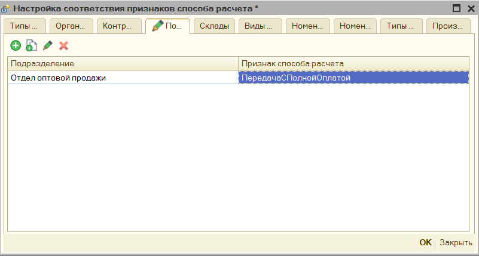

Можно выбрать для какого подразделения применять параметр. Например, мы хотим, чтобы для подразделения «Отдел оптовой техники» в чек сразу передавался признак способа расчета «Передача с полной оплатой». Применяется, если для документа удается определить подразделение.

### Склады ###

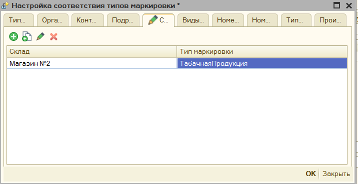

Можно выбрать для какого склада применять параметр. Например, мы хотим, чтобы для склада «Магазин №2» в продажу идет только «Табачная продукция». Применяется, если для документа удается определить склад.

### Виды маркировки ###

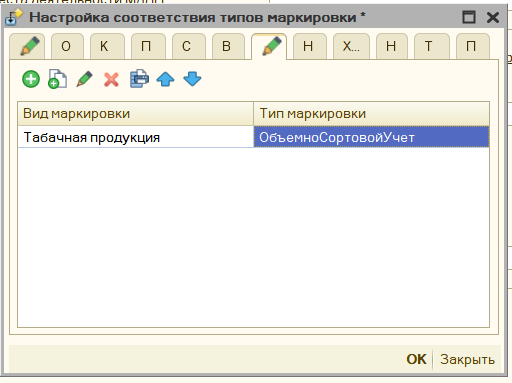

Можно выбрать для какого вида маркировки выбирать распределение. Например, мы хотим, чтобы табачная продукция фиксировалась как "Объемно-сортовой учет"

### Виды номенклатуры ###

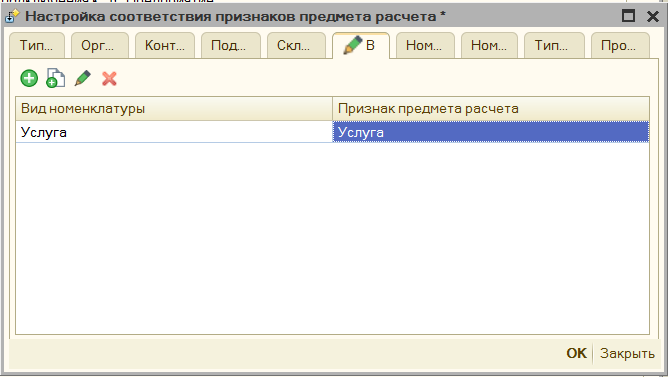

Можно выбрать для какого вида номенклатуры применять параметр. Например, мы хотим, чтобы для вида номенклатуры «Услуга» признак предмета расчета был «Услуга». Применяется, если для номенклатуры документа, где можно определить вид номенклатуры.

### Номенклатурные группы ###

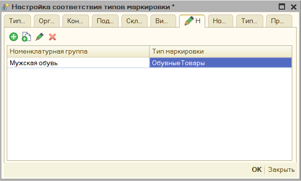

Можно выбрать для какой номенклатурной группы применять параметр. Например, мы хотим, чтобы вся номенклатура номенклатурной группы пробивалась как маркировочная продукция «Обувные товары». Применяется, если для номенклатуры
документа, где можно определить номенклатурную группу.

### Характеристика ###

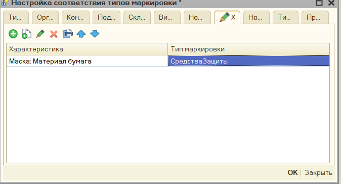

Можно выбрать для какой характеристики номенклатуры применять параметр. Например, мы хотим, чтобы определенные маски проходили как средства индивидуальной защиты, и по ним передавалась информация в ОФД.

### Номенклатура ###

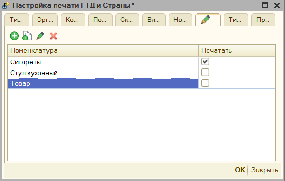

Можно выбрать для какой номенклатуры применять параметр. Например, мы хотим, чтобы вся номенклатура в папках «Сигареты» выходил в чеке номер гтд и код страны, а для других нет. Применяется для номенклатуры документа печати.
Поддерживает указания папок номенклатуры.

### Типы справочников ###

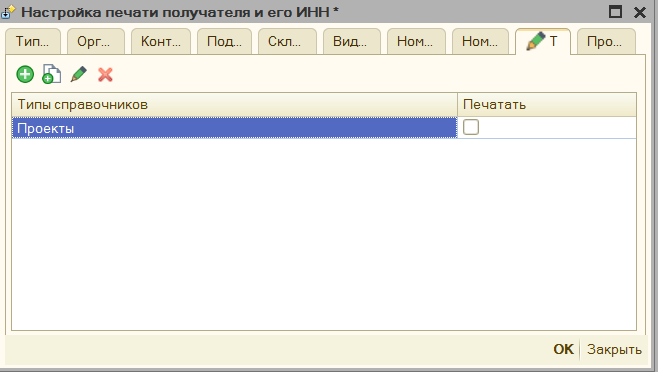

Можно выбрать для какой типа справочника, который имеет печатаемая фискальная строка применять параметр. В чек может выходить не только номенклатуры, но и другие поля документа. Поэтому, если в чек выходят справочник «Проекты», то
можно, например, указать, что для них не выходить ИНН покупателя и его наименование.

### Произвольный код для документа ###

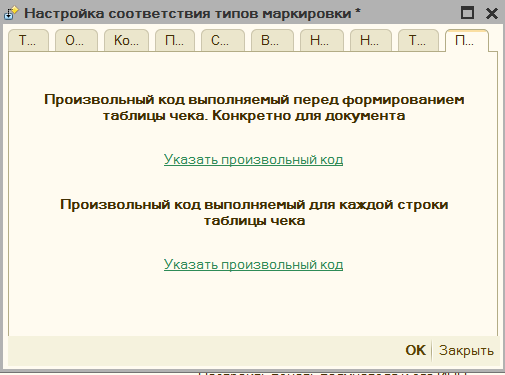

Помимо установки параметров по отбору, можно и прописать произвольный код распределения, который будет применяться, возможно указать как для всего документа, так и для конкретной позиции чека. Чтобы понять, какое именно значение ожидает параметр «ПризнакРаспределения» в форме есть команда «**Вставить возможный вариант результата**»

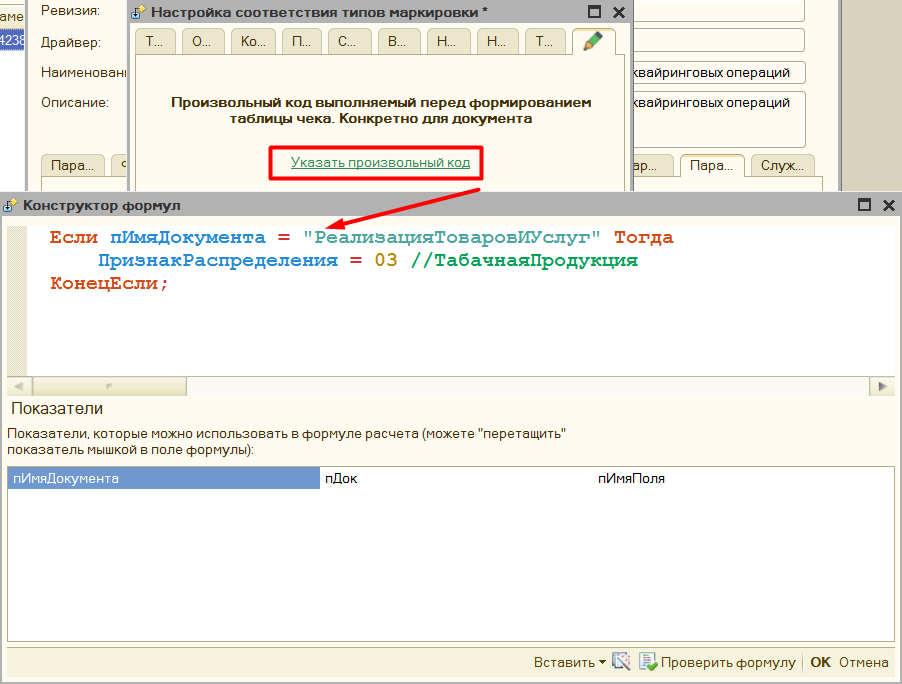

**Доступные параметры**:

**пИмяДокумента** – Имя метаданных документа, из которого происходит печать чеков.

**пДок** – Ссылка на документ, из которого происходит печать, доступны все его реквизиты.

**пИмяПоля** – это наименование поле параметра распределения, например, «ПризнакСпособаРасчета», или «НомерСекции», в основном нужно использовать при распределении СНО, когда может быть несколько полей распределения.

И др. команды конфигурации

Для того, чтобы понять, какое значнеие необходимо установить в поле **"ПризнакРаспределения"** - можно воспользоваться командой контекстного меню "Вставить" - **"Возможный вариант распределения"**

### Произвольный код для позиции чека ###

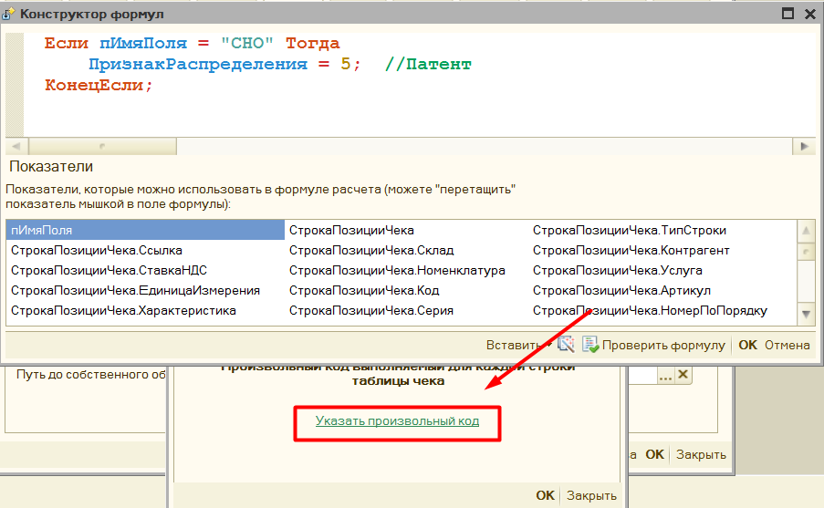

**Доступные параметры**:

**мОбщиеПараметры.ДокументОснование** – Ссылка на документ, из которого происходит печать, доступны все его реквизиты.

**пИмяПоля** – это наименование поле параметра распределения, например, **«ПризнакСпособаРасчета»**, или **«НомерСекции»**, в основном нужно использовать при распределении СНО, когда может быть несколько полей

**СтрокаПозицииЧека.\*** - это данные фискальной строки чека, для которой будет происходить заполнение шаблона.

## Распределение по системам налогообложения ##

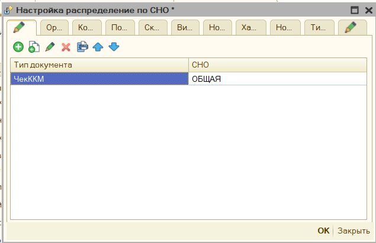

Данную настройку можно использовать для использования нескольких систем налогообложения в чеке. См. [**«Механизм распределения»**](#механизм-распределения)

При печати на разные системы налогообложения формируется несколько чеков, поэтому при ошибке печати в обработке предусмотрена возможность печать только выбранных чеков. См. [«**Не Печатать**»](form_check_and_check_correction.md#форма-проверки-печати-рабочее-место-кассира).

## Распределение по номерам секций ##

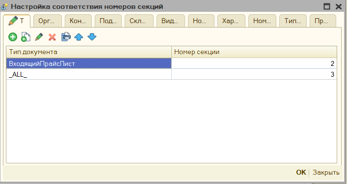

Данную настройку можно использовать для разделения позиций чека на секции налогообложения. См. [«Механизм распределения»](#механизм-распределения)

## Распределение по договорам Агента ##

В обработке есть возможно указать «Договор Агента», а также «Признак Агента» для передачи в ОФД.

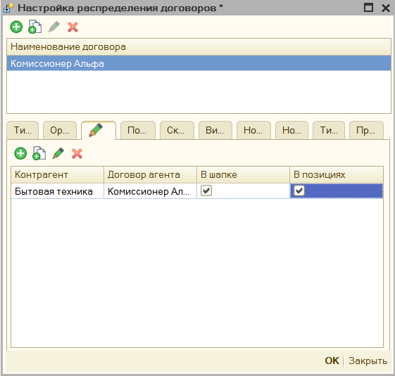

В форме договора агента можно указать «Признак агента», «Операция платежного агента», «Телефон платежного агента», «Телефон оператора по приему платежей», «Наименование оператора перевода», «Телефон оператора перевода», «Адрес
оператора перевода», «ИНН Оператора перевода».

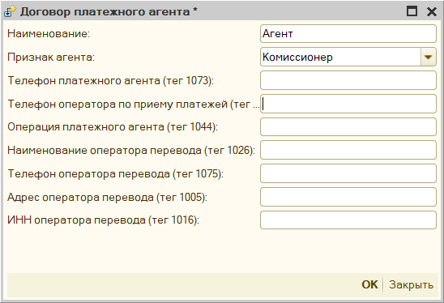

После этого необходимо задать условие при каких параметрах проставлять данный договор. Для настройки условий использования см. [Механизм распределения](#механизм-распределения)

## Настройка признаков предмета расчета ##

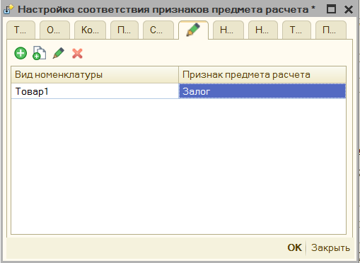

Чтобы задать в обработке условие заполнения «Признака предмета расчета», благодаря этому можно явно прописать, когда использовать Залог, выигрыш лотереи, акцизный товар. Для настройки распределения признаков предмета расчета по чекам
см. [Механизм распределения](#механизм-распределения)

## Настройка признаков способа расчета ##

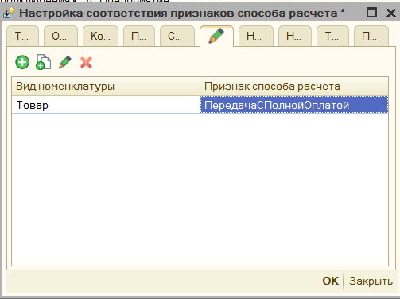

В обработке задать условия указания «Признака способа расчета», благодаря этому можно явно прописать, где использовать Аванс, или передачу с частичной оплатой. Для настройки распределения признаков способа расчета по чекам см. [Механизм распределения](#механизм-распределения)

## Настройка поставщика агента ##

В обработке есть возможно указать «Поставщика Агента»

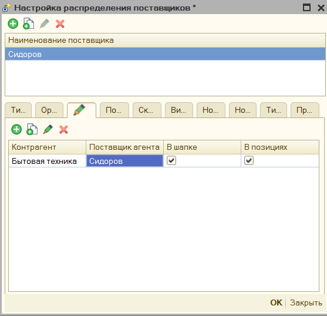

В форме поставщика можно указать «**Поставщика услуг**», «**Инн поставщика**», «**Телефон поставщика**».

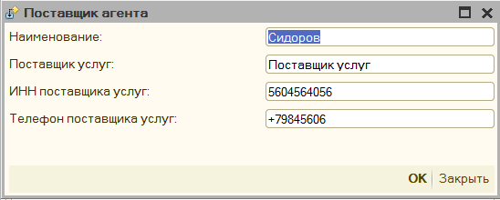

Флажок в форме распределения «В шапке» и «в позициях», указывает где именно в фискальном чеке прописывать поставщика, если флажок стоит «в позициях», то поставщик будет передан в ОФД внутри тега номенклатуры.

Чтобы задать в обработке условие заполнения «Поставщика агента». см. [Механизм распределения](#механизм-распределения)

## Настройка печати реквизитов ГТД и Страна ##

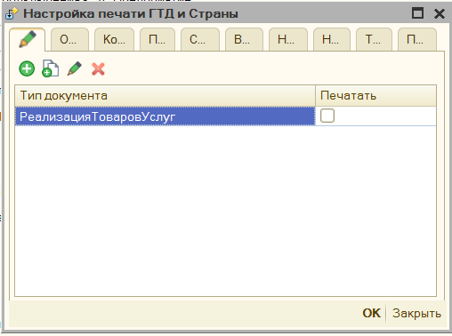

По умолчанию обработка пытается определить данные номенклатуре о номере таможенной декларации, и коде страны происхождения и передает их в ОФД, чтобы не передавать эти поля, можно задать определенные условия. См. [Механизм распределения](#механизм-распределения). Флажок «Печатать» должен быть снят, чтобы данные о гтд не передавались.

## Настройка печати получателя и его ИНН ##

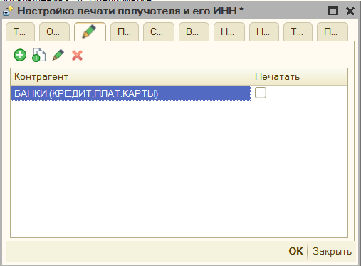

По умолчанию обработка пытается определить данные о контрагенте и его ИНН и передает их в ОФД, чтобы не передавать эти поля, можно задать определенные условия. См. [Механизм распределения](#механизм-распределения). Флажок **«Печатать»**
должен быть снят, чтобы данные о покупателе не передавались.

## Настройка ограничения времени продажи ##

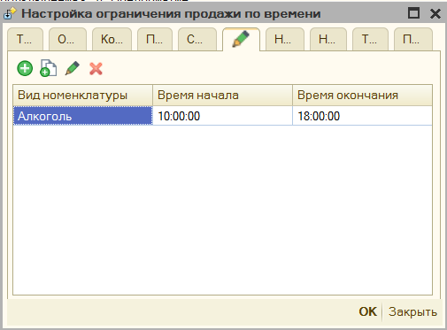

В параметрах обработки можно также указать время, когда можно продавать товар, например, это актуально для Алкоголя. Настройка условий распределения См. [Механизм распределения](#механизм-распределения).

## Настройка ставки НДС по умолчанию ##

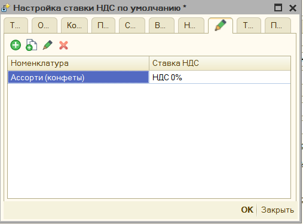

Если в организации применяется одна ставка НДС, то можно ее сразу прописать в параметрах, тогда именно она будет использована при заполнении. По заполнению параметров см. [«Механизм распределения»](#механизм-распределения)

## Подмена номенклатуры ##

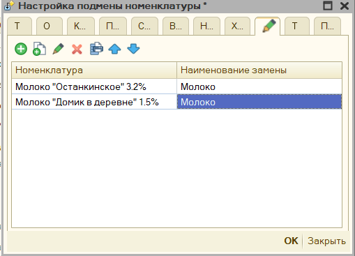

Можно указать настройки замены схожих позиций номенклатура на собственное наименование. По заполнению параметров см. [«Механизм распределения»](#механизм-распределения)
