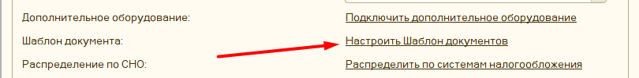
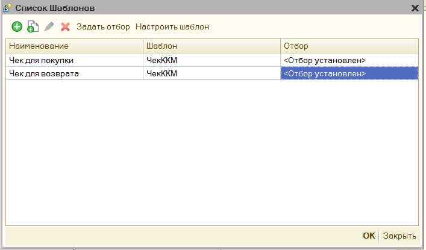
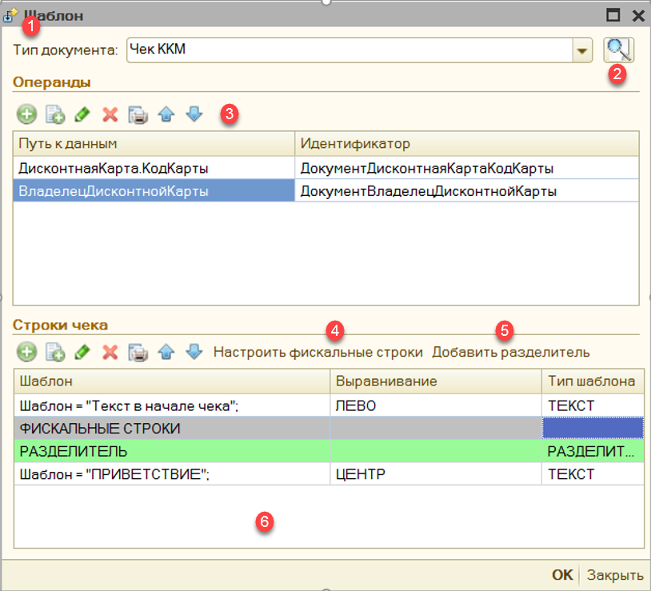
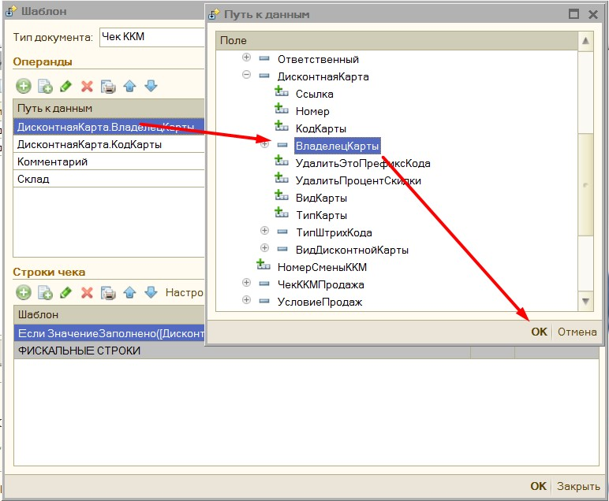
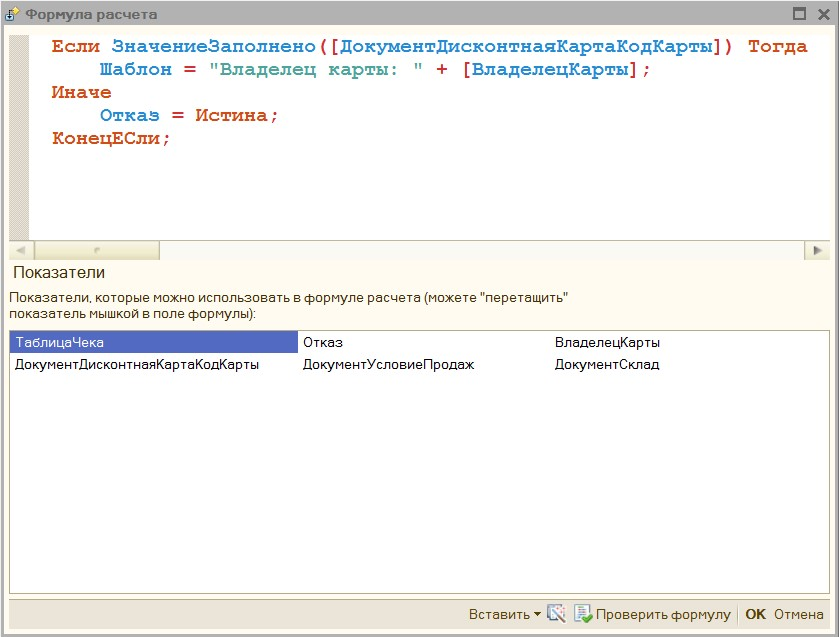
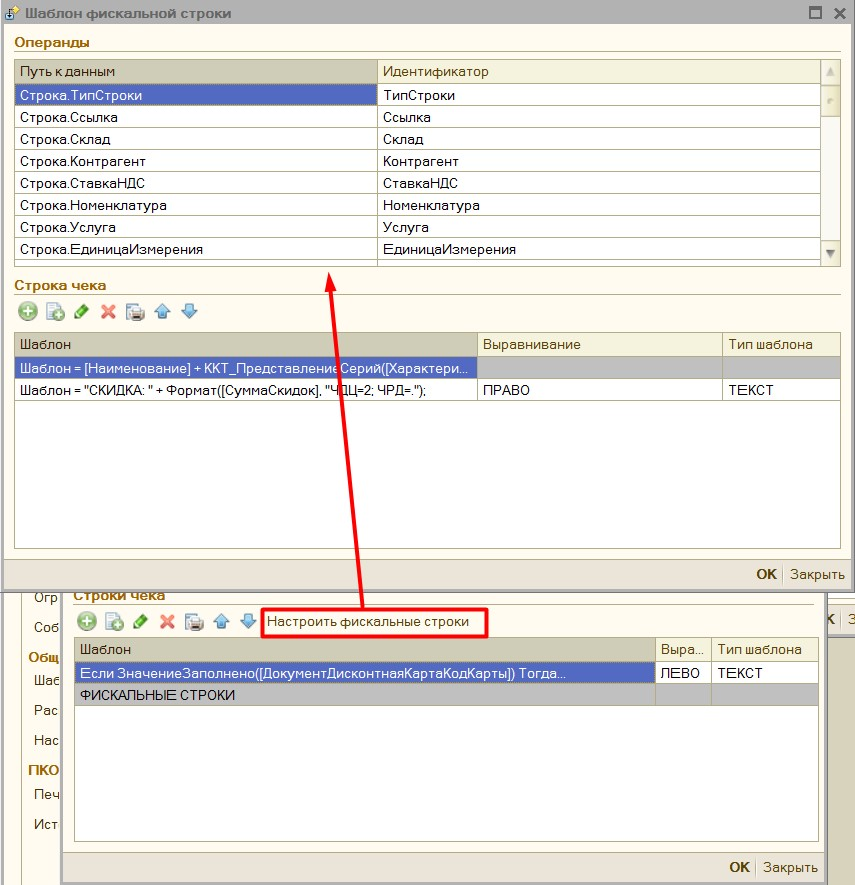
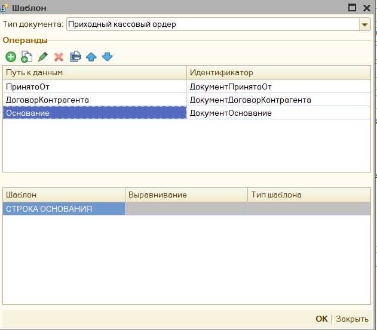

# Шаблон документа печати

Доступ к настройке шаблона документа, можно получить через форму с параметрами обработки

В обработке предусмотрен механизм шаблона документа, вы можете вывести в чек дополнительную информацию, рекламу, данные о покупателе, штрихкод, задать собственный способ отображения фискальных строк и многое другое.

Чтобы добавить шаблон необходимо в параметрах обработки выбрать пункт «[Шаблон документа](parameters_description.md#основные-параметры)»

В открывшемся списке шаблонов нажмите "Добавить"

Выберите «**Тип документа**», для которого вы будете настраивать шаблон, например, «Чек ККМ»

1. Тип документа – Имя документа, для которого будет настраиваться шаблон,можно изменить.

2. Проверка шаблона – позволяет в данном же окне проверить настройку шаблона чека.

3. Операнды – список реквизитов документа, которые можно использовать в произвольном коде, имя операнда можно задавать любое.

4. Настроить фискальные строки – открываем форму редактирования фискальных строк

5. Добавить разделитель – добавляет в шаблон чека строку-разделитель, которая позволяет печатать несколько чек, где только 1 будет фискальным, а другие текстовые с дополнительной информацией.

6. Строки чека – непосредственно строки с шаблоном, в данную таблицу можно добавить текстовые строки, строки со штрихкодами (QR код, Code39, EAN8, EAN13) и разделитель. Фискальные строки можно только редактировать.

При добавлении операнда, откроется форма со структурой документа, в ней нужно выбрать нужный реквизит и нажать кнопку «ОК». Поле Идентификатор заполнится автоматически по строке реквизита, при желании его можно изменить на любое
другое вручную.

Чтобы отредактировать содержимое шаблона щелкните два раза мышкой по тексту шаблона, либо нажмите кнопку «Изменить», либо кнопку F2 на клавиатуре, откроется окно редактирования.

В таблице «Показатели» есть предопределенные показатели: «ТаблицаЧека» - таблица с текущими фискальными строками; Отказ – булево значение, указывает выводить ли данную строку в шаблон, для фискальной строки этот параметр игнорируется, а также показатели, которые были добавлены в таблице операндов.

Для добавления показателя в формулу перетащите его мышкой из таблицы показателей в окно с формулой, при добавлении показателя в формулу он предстает в виде **\[Показатель\]**, предопределенный же показатель будет без квадратных скобок.
Подробнее о возможности редактирования формул см. [Редактор произвольного кода](instruction.md#редактор-произвольного-кода).

Шаблон можно задать также и для каждой фискальной строки, начиная от того, что будет содержать фискальная строка, заканчивая тем, что будет напечатано перед ней и после нее. Для этого в поле настройки шаблона необходимо нажать на кнопку «**Настроить фискальные строки**», либо 2 раза кликнуть на слово «ФИСКАЛЬНЫЕ СТРОКИ». Откроется окно с настройкой шаблона фискальной строки.

Данное окно напоминает окно редактирования шаблона, однако поле операндов нельзя редактировать, и оно заполняется автоматически: теми операндами, чтобы были в основном шаблоне, а также предопределенными реквизитами, которые содержатся в «ТаблицаЧека». В остальном же функционал идентичен.

Шаблон документа описан также в видео [Как настраивать шаблон документа](https://www.youtube.com/watch?v=gqETo0CXHRM)

## Шаблон строки основания

Настройка шаблона строки основания практически полностью идентична настройке [Шаблон документа печати](#шаблон-документа-печати), т.е. также добавляются шаблоны для каждого документа и настраиваются отборы для выбора документа. Отличие только в форме ввода операндов, в ней нельзя добавлять новые строчки, а сам шаблон можно задать только для "строки основания"

