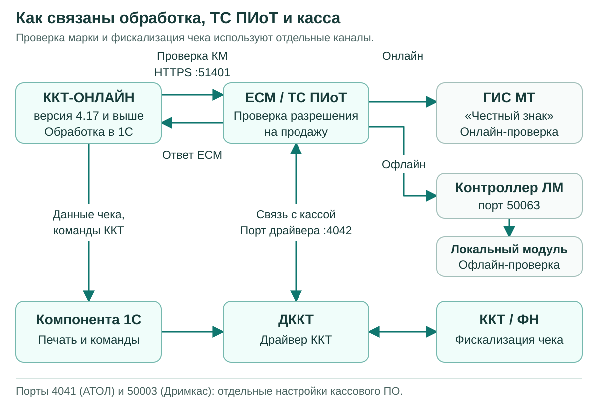
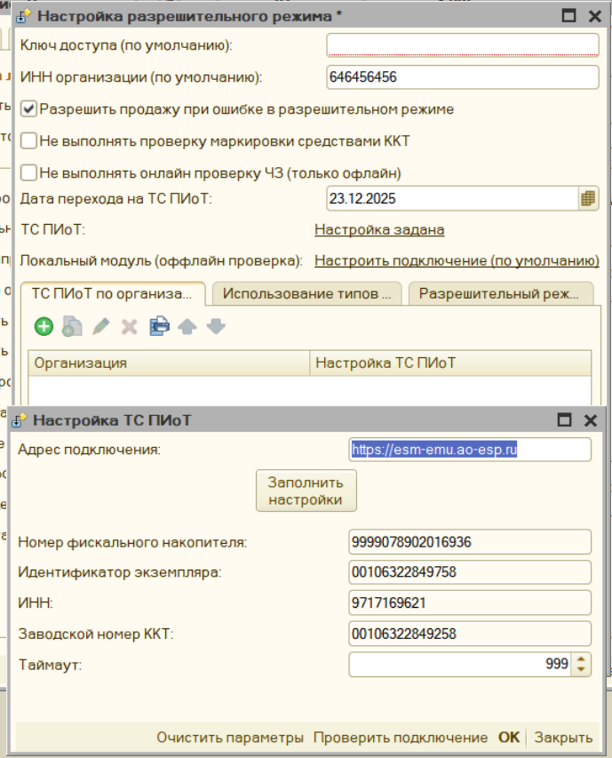

# Настройка ТС ПИоТ

## Требования перед началом настройки {#requirements}

Для этой инструкции нужна обработка **ККТ-ОНЛАЙН версии 4.17 или выше**. Установку выполняйте на кассовом компьютере с Windows. Основной сценарий: обработка 1С, драйвер ККТ и ЕСМ работают на одном компьютере, к которому подключена одна касса.

| Что проверить | Требование |
| --- | --- |
| Обработка | ККТ-ОНЛАЙН 4.17 или выше |
| Касса | Модель из поддерживаемого семейства: АТОЛ, POScenter, ШТРИХ с соответствующей веткой прошивки или Дримкас Вики Принт. Уточнения по моделям приведены ниже |
| Регистрация ККТ | ФФД 1.2; включён признак «Торговля маркированными товарами» |
| Прошивка и драйвер | Соответствуют выбранной ветке в таблице ниже; обычный драйвер без поддержки ЕСМ не подходит |
| Компонента для 1С | Поддерживает выбранный драйвер и нужные функции ККТ; разрядность соответствует процессу 1С |
| ЕСМ | Дистрибутив для своей ККТ из личного кабинета АО «ЕСП», действующая лицензия и зарегистрированный экземпляр |
| Локальный модуль Честного знака | Для офлайн-проверок нужны ЛМ ЧЗ и Контроллер ЛМ ЧЗ. Контроллер устанавливают на том же компьютере или сервере, где работает ЛМ |
| Работа с ЛМ ЧЗ 2.0 | ЕСМ и lm-controller версии 1.6 или выше. Для Дримкас производитель отдельно требует ЛМ ЧЗ 2.5.1 или выше |
| Доступ | Права на установку ПО, доступ к личному кабинету ЕСП, интернет и разрешённые сетевые соединения из [таблицы портов](#ports) |

### Минимальные версии по семействам ККТ

| Семейство | Модель и прошивка | Драйвер и дополнительные компоненты |
| --- | --- | --- |
| АТОЛ | Модель должна поддерживаться ЕСМ и работать на ФФД 1.2 с подходящей прошивкой АТОЛ. Общая инструкция ЕСП не задаёт одного номера прошивки для всех моделей | ДККТ **10.10.8.24 или выше**, обязательно с компонентом «Интеграционные компоненты для ЕСМ». [Источник: ЕСП][atol-guide] |
| POScenter, РИТЕЙЛ, ШТРИХ с прошивкой POScenter | Точная модель, версия модели и дата прошивки указаны в [следующей таблице](#модели-poscenter) | POScenter **5.21.1.1255 или выше**, сборка с поддержкой ПИоТ из комплекта ЕСП. [Источник: ЕСП][poscenter-guide] |
| ШТРИХ / Торговый Баланс М | Прошивка **T.3**, сборка **7161 или выше**; модель должна поддерживаться выбранным дистрибутивом ЕСМ | Драйвер **5.25.2096 или выше**, при подключении к ККТ выбрать протокол **3.0**. [Источник: ЕСП][tbm-guide] |
| Дримкас | **ВИКИ ПРИНТ 57 Ф, ВИКИ ПРИНТ 57 ПЛЮС Ф, ВИКИ ПРИНТ 80 ПЛЮС Ф**; прошивка **665.4.45 или выше** | **VikiDriver 2.0.2 или выше**, **VikiESM 1.0 или выше**. Windows со сборкой **21H2 или новее**. [ЕСП][dreamkas-guide], [Дримкас][dreamkas-install] |

В таблице указаны нижние границы из проверенных инструкций. Для новой установки берите свежий совместимый комплект из личного кабинета ЕСП. Компоненты комплекта рассчитаны на совместную работу; замена одного из них произвольной сборкой может нарушить связь с ЕСМ.

У разных документов встречаются разные требования. Для АТОЛ здесь принят минимум 10.10.8.24 из общей инструкции ЕСП от 27.07.2026, хотя инструкция для расширения 1С содержит более раннее значение 10.10.8.23. Для VikiDriver принят минимум 2.0.2 из инструкции производителя Дримкас; PDF ЕСП содержит 2.0.1. Это версии разных документов, а не повод понижать уже установленный рабочий драйвер.

### Модели POScenter и ШТРИХ с прошивкой POScenter {#модели-poscenter}

Перечень приведён по [инструкции ЕСП v2.3 от 27.07.2026][poscenter-guide]. Проверяйте не только надпись на корпусе, но и версию модели, которую возвращает драйвер.

| Модель | Версия модели | Прошивка не ниже |
| --- | --- | --- |
| Штрих-Нано-Ф | 003 | C3/D3 от 12.05.2026 |
| NCR-001 Ф | 003 | C3/D3 от 12.05.2026 |
| Штрих-Сити-Ф | 003 | C3/D3 от 12.05.2026 |
| Штрих-ЛАЙТ-02Ф | 003 | C3/D3 от 12.05.2026 |
| Штрих-МИНИ-01Ф | 003 | C3/D3 от 12.05.2026 |
| Штрих-М-02Ф | 003 | C3/D3 от 12.05.2026 |
| РИТЕЙЛ-КОМБО-01 Ф | 003 | C3/D3 от 10.12.2025 |
| РИТЕЙЛ-01ФМ | 003 | C3/D3 от 10.12.2025 |
| РИТЕЙЛ-02 Ф | 003 | C3/D3 от 10.12.2025 |
| POScenter-02 Ф | 003, 004 | C3/D3 от 10.12.2025 |
| POScenter-03ФМ | 003 | C3/D3 от 10.12.2025 |
| POScenter BANK-01Ф | 003 | C2 от 10.12.2025 |

Обозначение C3/D3 в этой таблице повторяет перечень ЕСП. Оно не означает, что на любую кассу можно установить любую из двух веток. Файл прошивки выбирайте для своей модели по документации POScenter. В частности, у POScenter BANK-01Ф в перечне указана C2.

Кассы ШТРИХ с прошивками POScenter и Торгового Баланса М настраиваются по разным веткам. До установки посмотрите версию ПО в тесте драйвера. Если на кассе T.3, используйте [ветку ТБМ](#установка-тбм). Для прошивки POScenter используйте [ветку POScenter](#установка-poscenter). Переход между прошивками не входит в обычную настройку ЕСМ и выполняется по процедуре производителя.

Для АТОЛ и ТБМ в использованных общих инструкциях нет полного списка моделей с минимальными прошивками. Перед обновлением проверьте свою модель в личном кабинете ЕСП и документации производителя. Наличие поддержки ФФД 1.2 само по себе не подтверждает совместимость с выбранным ТС ПИоТ.

## Как устроена работа {#flow}

ТС ПИоТ получает код маркировки от обработки и возвращает результат проверки. ЕСМ связывается с системой «Честный знак» и, когда это предусмотрено его настройками, с локальным модулем. Связь ЕСМ с драйвером ККТ нужна для получения сведений о кассе и работы с ФН.

Обработка использует два отдельных маршрута:

1. Проверяет марку через сервис ТС ПИоТ по указанному адресу, например `https://localhost:51401`.
2. Передаёт фискальный чек через компоненту оборудования и драйвер ККТ. Печать не перенаправляется на HTTPS-адрес ТС ПИоТ.



Исходник схемы для редактирования: `docs/media/ts_piot_flow.mmd` (Mermaid).

Успешная связь с ЕСМ ещё не подтверждает правильную печать чека. Проверку марки и формирование чека нужно проверить отдельно.

Эта глава адаптирует инструкции ЕСП для «1С Розница 3.0 (расширение)» к ККТ-ОНЛАЙН. В обработке используются её собственные настройки ТС ПИоТ. Установка расширения `.cfe` для типовой «Розницы», патчей типовой конфигурации и настройка её РМК не входят в описанный порядок.

## Адреса и порты {#ports}

### Порты драйверов по семействам

| Семейство ККТ | Порт драйвера для связи с ЕСМ | Что ещё учитывать |
| --- | --- | --- |
| АТОЛ | **4042/TCP** | В свойствах драйвера отдельное поле «Порт сервера GRPC» настраивается на **4041** |
| POScenter, включая ШТРИХ с прошивкой POScenter | **4042/TCP** | Включите передачу информации в ЕСМ в дополнительных параметрах драйвера |
| ШТРИХ / Торговый Баланс М | **4042/TCP** | Для связи драйвера с ККТ используется протокол ККТ 3.0 |
| Дримкас Вики Принт | **4042/TCP** | Связь кассового ПО с VikiDriver по умолчанию идёт на **127.0.0.1:50003** |

Порт 4042 указан в общих инструкциях ЕСП для всех четырёх семейств. У АТОЛ значение 4041 относится к отдельному полю свойств драйвера. Не заменяйте одно значение другим. [АТОЛ][atol-guide], [POScenter][poscenter-guide], [ТБМ][tbm-guide], [Дримкас][dreamkas-guide].

Для Вики Принт следующие кассы могут использовать порты 50004, 50005 и далее. Фактическое значение смотрите в VikiClient: выберите кассу и откройте «Порты подключения». [Инструкция Дримкас][dreamkas-ports].

### Общие порты ЕСМ и локального модуля

| Порт | Назначение | Где используется |
| --- | --- | --- |
| **51401/TCP, HTTPS** | Приём запросов от кассового ПО | В основной локальной схеме адрес обработки: `https://localhost:51401` |
| **50401/TCP** | Внутреннее соединение оркестратора с экземпляром ЕСМ | Не подставляйте вместо HTTPS-порта кассового ПО 51401 |
| **51077/TCP** | Настройка ТС ПИоТ | Служебный интерфейс ЕСМ |
| **50063/TCP** | Контроллер ЛМ ЧЗ | Этот порт указывают в настройках ЛМ в интерфейсе ЕСМ |
| **5063/TCP** | Дополнительный порт Контроллера ЛМ ЧЗ | Указан в перечне портов ЕСП |
| **5995/TCP** | Сам локальный модуль Честного знака | Не заменяет порт 50063 в настройках ЕСМ |
| **19100/TCP** | Регистрация экземпляра в ГИС МТ | `https://ts-reg.crpt.ru:19100` |
| **19101/TCP** | Площадки проверки Честного знака | Адреса CDN из актуального перечня ЕСП |
| **443/TCP** | Сервисы ЕСП | В том числе `api.ao-esp.ru` и `stats.ao-esp.ru`; для POScenter также требуется доступ к серверу лицензий `its.pos-center.ru` |

Источники: [перечень адресов и портов ЕСП][esp-ports] и общие инструкции установки по семействам. Назначение внутренних портов также описано в [инструкции ЕСП для нескольких ККТ][esp-multikkt]. Полный список CDN берите из актуального перечня: одного доступного адреса регистрации недостаточно для всех операций.

Порты 4042, 50401, 51401 и 51077 в локальной схеме обслуживают программы на кассовом компьютере. Проброс этих портов из интернета не требуется. Номер COM-порта и TCP-порт физической ККТ относятся к другому соединению; их определяют в настройках самой кассы или через поиск оборудования.

В этой инструкции сохранены стандартные порты производителей. Если порт занят, сначала определите владельца через [диагностику](#диагностика-портов). Менять номер только в одной программе нельзя: обе стороны соединения должны использовать согласованные настройки.

## Подготовка кассового компьютера {#подготовка}

1. Запишите модель и заводской номер ККТ, номер ФН, ИНН, версию прошивки и драйвера. Они понадобятся при сверке данных в ЕСМ и обработке.
2. Проверьте версию ККТ-ОНЛАЙН и разрядность платформы 1С. Драйвер и компонента должны подходить к процессу 1С: 32-разрядная 1С может работать на 64-разрядной Windows.
3. Проверьте лицензию обработки, лицензию ЕСМ и необходимые лицензии производителя ККТ. Это отдельные условия работы. Для POScenter дополнительно проверяется лицензия ККТ на функции ПИоТ и право на нужную прошивку.
4. Согласуйте время обновления, завершите текущую работу с кассой и закройте программы, которые используют её драйвер. Перед обновлением прошивки сохраните настройки ККТ по инструкции производителя.
5. Откройте [личный кабинет ЕСП][esp-cabinet], раздел «Скачать ПО». Выберите «Фискальный регистратор», своего производителя и Windows. Скачайте предназначенный для этой связки комплект и распакуйте архив.
6. Установите драйвер по одной из четырёх веток ниже. На этапе первоначальной настройки убедитесь, что тест драйвера видит нужную ККТ.
7. Установите ЕСМ и Контроллер ЛМ ЧЗ, затем выполните [регистрацию](#регистрация-есм).

Сам ЛМ ЧЗ и Контроллер ЛМ ЧЗ устанавливаются отдельно друг от друга. Если локальный модуль размещён на сервере, контроллер тоже должен работать на этом сервере. Сохраните логин и пароль ЛМ: они понадобятся в ЕСМ.

## АТОЛ: драйвер, ЕСМ и связь с кассой {#установка-атол}

Порядок основан на [общей инструкции ЕСП для АТОЛ][atol-guide].

1. Откройте папку `DKKT` в распакованном комплекте. Запустите установщик нужной разрядности вида `KKT10-10.10.*.*-windows*-setup-signed.exe`.
2. При выборе компонентов оставьте «Интеграционные компоненты для ЕСМ». Установите «Драйвер 1С», если он требуется выбранной компоненте оборудования. Завершите установку.
3. Установите ЕСМ и Контроллер ЛМ ЧЗ по [общему порядку](#установка-есм-и-лм).
4. Подключите кассу и откройте «Тест драйвера ККТ». В «Свойствах» укажите параметры своей ККТ: тип соединения, порт или сетевой адрес. Для неизвестных параметров используйте поиск оборудования.
5. В поле «Порт сервера GRPC» укажите **4041**. Выполните проверку связи, сохраните свойства и включите флаг «Включено» в тесте драйвера.
6. Проверьте, что драйвер показывает нужную модель и заводской номер. Откройте смену, если она закрыта; если смена истекла, сначала завершите её штатным способом.
7. Оставьте тест драйвера подключённым на время [регистрации ЕСМ](#регистрация-есм).
8. После регистрации закройте тест и перейдите к настройке компоненты ККТ в обработке. Рабочая компонента должна использовать тот же совместимый драйвер и нужное соединение с кассой.

Если ЕСМ видит кассу только при открытом тесте драйвера, а после перехода в 1С связь пропадает, проверьте интеграционные компоненты АТОЛ и способ подключения драйвера из обработки. Постоянно открытый тест параллельно рабочей программе не заменяет настройку рабочего подключения.

## POScenter: драйвер, лицензия ККТ и ЕСМ {#установка-poscenter}

Эта ветка подходит также для перечисленных [моделей ШТРИХ с прошивкой POScenter](#модели-poscenter). Порядок основан на [инструкции ЕСП][poscenter-guide].

1. Проверьте модель, версию модели и дату прошивки по таблице в начале главы. При необходимости обновите прошивку по инструкции POScenter до установки связи с ЕСМ.
2. Из комплекта ЕСП запустите установщик нужной разрядности вида `Poscenter_DrvKKT_5.21.*.*_*_piot.exe`. Завершите установку с предусмотренными компонентами.
3. Установите ЕСМ и Контроллер ЛМ ЧЗ по [общему порядку](#установка-есм-и-лм).
4. Подключите ККТ и запустите «POScenter: Тест ДККТ». Нажмите «Настройка свойств».
5. Выберите «Локально» для соответствующего COM-подключения либо «TCP-сокет» для сетевого подключения. Если параметры неизвестны, выполните «Поиск оборудования» и выберите найденную кассу.
6. Выполните «Проверку связи». Сверьте модель и заводской номер.
7. Откройте «Дополнит. параметры» → «20. ТС ПИоТ». Установите флаг «Включить передачу информации в драйвер ТС ПИоТ (ЕСМ)», сохраните параметры.
8. Выполните «Длинный запрос» и проверьте состояние ККТ. В разделе «12. ТС ПИоТ» нажмите «Проверка ККТ на готовность работы с ТС ПИоТ».
9. Дождитесь результата. Драйвер проверит соответствие требованиям и загрузит лицензию ККТ для ПИоТ. После загрузки касса может перезагрузиться; восстановите связь и повторно проверьте её состояние.
10. Убедитесь, что смена открыта и не истекла. Снова выполните «Длинный запрос». Оставьте тест открытым на время [регистрации ЕСМ](#регистрация-есм).
11. После регистрации закройте тест и настройте обработку с компонентой POScenter для этой ветки драйвера.

ЕСМ и функции ПИоТ в ККТ лицензируются отдельно. Если постоянная лицензия ККТ ещё не доступна, драйвер может загрузить временную лицензию на месяц. Проверьте обе даты действия, даже если проверка готовности прошла успешно. Подробности получения лицензии и подписки на прошивку приведены в [инструкции POScenter][poscenter-piot]. Условия подписки различаются для C.3 и D.3; уточняйте их для своей модели в [каталоге прошивок производителя][poscenter-firmware].

Для Windows используйте компоненту, совместимую со специальным драйвером ПИоТ из комплекта ЕСП. Производитель отдельно указывает ограничения драйвера NG для этой схемы в [ответах поддержки за июль 2026 года][poscenter-faq].

## ШТРИХ / Торговый Баланс М: драйвер и ЕСМ {#установка-тбм}

Порядок основан на [инструкции ЕСП для ТБМ][tbm-guide].

1. Через тест драйвера проверьте, что на ККТ установлена прошивка **T.3**, сборка **7161 или выше**. Для другой ветки прошивки сначала определите её производителя.
2. Из комплекта ЕСП установите драйвер нужной разрядности вида `DrvFR_5.25_*_x*_dkkt-signed.exe`, версия **5.25.2096 или выше**.
3. Установите ЕСМ и Контроллер ЛМ ЧЗ по [общему порядку](#установка-есм-и-лм).
4. Откройте «Тест драйвера ККТ» и нажмите «Настройка свойств».
5. Выберите **«Протокол ККТ 3.0»**. Этот протокол требуется для работы с ЕСМ.
6. Выберите подключение «Локально» либо «TCP-сокет». При необходимости запустите «Поиск оборудования», выберите найденную ККТ и выполните «Проверку связи».
7. Сверьте модель и заводской номер. Выполните «Длинный запрос».
8. Проверьте смену. Для регистрации ЕСМ она должна быть открыта и не превышать 24 часа. После открытия смены снова выполните «Длинный запрос».
9. Оставьте тест открытым на время [регистрации ЕСМ](#регистрация-есм). После регистрации закройте его и настройте в обработке компоненту ТБМ, соответствующую установленному драйверу.

На [странице загрузок ТБМ][tbm-downloads] опубликованы также более новые драйверы и прошивки. Например, на дату проверки там размещены общий драйвер 5.25.2235 и T.3 сборки 7338. Это доступные обновления, а не замена минимальных требований таблицы. Драйвер, выделенный производителем для отдельной кассовой программы, выбирают по назначению, а не только по большему номеру версии.

## Дримкас Вики Принт: VikiDriver, VikiESM и ЕСМ {#установка-дримкас}

Для этой ветки нужны три компонента: VikiDriver для связи с кассой, VikiESM для интеграции и сам ЕСМ. Порядок описан в [инструкции ЕСП][dreamkas-guide] и [инструкции Дримкас][dreamkas-install].

1. Проверьте модель Вики Принт, версию Windows и прошивку кассы. При прошивке ниже **665.4.45** подготовьте обновление по инструкции производителя; выполните его после установки VikiDriver.
2. Если на компьютере используется старый ComProxy, выполните переход на VikiDriver по инструкции Дримкас. Одновременное использование старого соединения и нового драйвера может мешать обнаружению кассы.
3. Установите **VikiDriver 2.0.2 или выше**. В комплекте ЕСП установщик имеет вид `VikiDriverOfflineInstaller-x86-64.exe`.
4. Подключите Вики Принт и проверьте его обнаружение в VikiClient. Сверьте модель и заводской номер, при необходимости обновите прошивку до требуемой версии.
5. Выберите кассу в VikiClient и откройте «Порты подключения». Запишите адрес и порт для кассовой программы. Для первой кассы по умолчанию используется **127.0.0.1:50003**. Для нескольких касс берите фактический порт каждой записи, а не общий порт первой кассы.
6. Из папки `DKKT` установите **VikiESM 1.0 или выше**, установщик вида `VikiEsm_OfflineSetup`.
7. Установите ЕСМ и Контроллер ЛМ ЧЗ по [общему порядку](#установка-есм-и-лм). Для локального модуля соблюдайте требования Дримкас, включая версию ЛМ ЧЗ **2.5.1 или выше**.
8. Убедитесь, что касса доступна VikiDriver, имеет нужные регистрационные признаки и открыта неистёкшая смена. Выполните [регистрацию ЕСМ](#регистрация-есм).
9. В обработке выберите компоненту Вики Принт и настройте её подключение к VikiDriver на записанный TCP-порт. Для основной схемы это `127.0.0.1:50003`.
10. Настройте адрес ТС ПИоТ в отдельной форме обработки: `https://localhost:51401`. Он не заменяет адрес VikiDriver для печати.

Версия VikiDriver, версия VikiESM и версия компоненты для 1С проверяются отдельно. Число в названии компоненты 1С нельзя сравнивать с требованием VikiDriver 2.0.2. Если кассовая программа не видит Вики Принт, сверяйте её порт с [«Портами подключения» VikiClient][dreamkas-ports].

## Установка ЕСМ и локального модуля {#установка-есм-и-лм}

1. Запустите установщик ЕСМ из распакованного комплекта, файл вида `esm_<версия>-windows-signed-setup.exe`.
2. Примите соглашение и выберите каталог установки. Если ЛМ ЧЗ будет на этом же компьютере, выберите компонент «Контроллер ЛМ ЧЗ».
3. Завершите установку и запустите ЕСМ. При отдельной установке контроллера используйте `esm-lm-controller_<версия>-windows-setup.exe`.
4. Установите сам ЛМ ЧЗ по инструкции Честного знака. Контроллер ЕСМ не содержит базу локального модуля и не заменяет его.
5. Если ЛМ уже находится на другом компьютере, установите или обновите контроллер там. Между кассовым компьютером и сервером ЛМ должны быть доступны предусмотренные порты 50063 и 5063.
6. Перед переходом на ЛМ ЧЗ 2.0 обновите ЕСМ и контроллер до 1.6 или выше. Для Дримкас учитывайте дополнительное требование версии ЛМ из его ветки.

После установки переходите к регистрации. Готовность офлайн-проверки подтверждается состоянием ЛМ и его синхронизацией; одного установленного контроллера недостаточно.

## Регистрация ЕСМ и проверка лицензии {#регистрация-есм}

1. Убедитесь, что драйвер выбранной ветки подключён к ККТ. Для регистрации смена должна быть открыта и не превышать 24 часа.
2. Откройте интерфейс ЕСМ и нажмите «Обновить список».
3. В блоке «Информация о кассе» сверьте модель, заводской номер, номер ФН, РНМ, ИНН и номер смены с нужной ККТ. При неверных данных сначала исправьте подключение драйвера.
4. Нажмите «Зарегистрировать». ЕСМ получает лицензию ЕСП и идентификатор регистрации экземпляра в ГИС МТ.
5. Дождитесь обновления информации. В блоке ЕСМ лицензия должна иметь статус «Активна до [дата]», а в блоке ГИС МТ должен появиться идентификатор и рабочее состояние, например «Стабильно».
6. В блоке ЛМ ЧЗ нажмите «Настроить адрес». Для локальной установки укажите `127.0.0.1`; для сервера укажите адрес этого сервера. Порт контроллера: **50063**. Введите логин и пароль, заданные при установке ЛМ.
7. Дождитесь состояния ЛМ «Готов к работе». Первоначальная загрузка и синхронизация базы могут занимать время.
8. В настройках ЕСМ проверьте адрес регистрации ГИС МТ: `https://ts-reg.crpt.ru:19100`. При необходимости нажмите «Обновить информацию».

Если касса не появилась, проверьте соответствующую ветку драйвера и [порт 4042](#диагностика-портов). Драйверы разных производителей на одном компьютере могут конфликтовать. Не повторяйте регистрацию с чужими реквизитами кассы.

### Сертификаты HTTPS

Если при обращении к ЕСМ возникает ошибка проверки сертификата, используйте сертификаты, созданные зарегистрированным экземпляром ЕСМ:

1. Откройте каталог `%ProgramData%\ESP\ESM\um`.
2. Для сертификатов `ca` и `gismt` откройте мастер установки сертификата.
3. Выберите «Локальный компьютер» и хранилище «Доверенные корневые центры сертификации».
4. Завершите импорт и повторите проверку подключения из обработки.

Порядок приведён в общих инструкциях ЕСП. Сертификаты появляются после регистрации экземпляра. Используйте файлы своей установленной системы; постоянное отключение проверки TLS не требуется.

## Настройка ККТ-ОНЛАЙН {#setup}

### Подключение оборудования для печати

1. Обновите обработку до **4.17 или выше** и актуальные компоненты оборудования.
2. В [мастере подключения компонент](connecting.md#мастер-подключения-компонент-начиная-с-версии-410) выберите своё семейство ККТ и компоненту, подходящую к установленному драйверу.
3. Проверьте разрядность компоненты и драйвера относительно платформы 1С. Для ШТРИХ отдельно учитывайте производителя прошивки: POScenter или ТБМ.
4. Укажите реальные параметры подключения к кассе. Для Вики Принт это соединение с VikiDriver. Для АТОЛ проверьте поле «Порт сервера GRPC» в параметрах выбранной компоненты и укажите **4041**, если это поле доступно. Если его нет, проверьте версию и возможности компоненты. Для остальных семейств используйте параметры своей выбранной компоненты и драйвера.
5. Проверьте связь с ККТ из обработки. Сверьте модель, заводской номер и ФН.

Для компоненты 1С АТОЛ [инструкция ЕСП для расширения][atol-extension] указывает минимум **10.10.8.20**. Драйвер ККТ проверяется отдельно: в этой главе его минимум **10.10.8.24**. Для новой установки используйте компоненты актуального совместимого комплекта.

ЕСМ требует активного экземпляра драйвера в течение рабочей смены. В обработке проверьте «Параметры» → «Служебное» → «Подключение кассы». Режим **«СТАНДАРТНО»** удерживает подключение между операциями. Он сам по себе не гарантирует, что экземпляр драйвера останется активным до конца смены: на это влияет сценарий работы 1С, выход из обработки и особенности интеграции с конфигурацией. Другие режимы, включая сценарии Рарус, могут отключать драйвер между операциями.

После выбора режима проверьте связь ЕСМ с кассой во время реальной работы, после нескольких операций и после повторного открытия формы. Если связь пропадает, устраните причину до начала продаж с ТС ПИоТ.

### Подключение ТС ПИоТ для проверки марки

1. Откройте «Параметры» → «Маркировка» → «Разрешительный режим».
2. Проверьте поле **«Дата перехода на ТС ПИоТ»**. Оно определяет, с какой даты обработка использует этот маршрут. Укажите дату запланированного перехода после подготовки ЕСМ.
3. В строке «ТС ПИоТ» нажмите **«Настроить подключение»**.
4. В поле **«Адрес подключения»** введите базовый адрес сервиса. Для ЕСМ на том же компьютере: `https://localhost:51401`. Путь API к адресу не дописывайте.
5. Нажмите **«Заполнить настройки»**. Обработка получает сведения зарегистрированного экземпляра: номер ФН, идентификатор экземпляра, ИНН, заводской номер ККТ и таймаут.
6. Сверьте номер ФН, ИНН и заводской номер с выбранной кассой. Полученные сведения используются для настройки подключения; исправляйте неверную регистрацию или адрес сервиса, а не подменяйте реквизиты другой кассы.
7. Нажмите **«Проверить подключение»**. Эта команда проверяет получение информации от сервиса. Она не проверяет код маркировки и не печатает чек.
8. Закройте форму кнопкой «ОК», сохраните настройки разрешительного режима и затем параметры обработки.
9. Проверьте выбранные типы маркировки и даты начала проверок для используемых товарных групп.



На скриншоте показаны адрес эмулятора и тестовые реквизиты. Для рабочей кассы укажите адрес своего ЕСМ и сверьте реквизиты, полученные от него.

Поле «Таймаут» заполняется из сведений сервиса. Не трактуйте его как время ожидания любого HTTP-запроса: транспортное ожидание и параметры проверки марки в обработке имеют разное назначение.

### Несколько организаций

Если в схеме распределения доступна организация, в форме есть вкладка **«ТС ПИоТ по организациям»**. Для каждой строки укажите «Организация» и «Настройка ТС ПИоТ».

Настройка выбранной организации заменяет общую настройку. Проверьте соответствие всей цепочки: организация документа, ИНН, ККТ, номер ФН и адрес её ЕСМ. Затем проверьте марку и чек отдельно для каждой организации. Общая настройка одной кассы не должна случайно использоваться для другой.

### Резервный переход к обычному разрешительному режиму

Параметр «При ошибке ТС Пиот проверять через разрешительный режим» включает предусмотренный обработкой резервный маршрут. Для него обычный разрешительный режим должен быть настроен и доступен.

Переход зависит от ответа ТС ПИоТ и состояния результата проверки. Этот флаг не отменяет запрет продажи и не гарантирует повторную проверку каждой марки с уже полученным окончательным статусом. Доступность прежнего протокола и сроки перехода приведены в [разделе о технической возможности обычного разрешительного режима](marking.md#техническая-возможность-использовать-обычный-разрешительный-режим-до-октября-2026).

### Офлайн-проверки {#offline}

Офлайн-проверками через ТС ПИоТ управляет ЕСМ. Настройки прямого локального модуля внутри обработки относятся к обычному разрешительному режиму, в том числе к его резервному использованию. Адреса этих механизмов заполняются отдельно.

## Проверка результата {#verification}

Проверяйте работу по этапам. Успех следующего этапа нельзя определить по результату предыдущего.

Для приёмки маршрута ТС ПИоТ указанная в обработке дата перехода должна уже наступить. Если переход запланирован на будущее, проведите эту проверку в назначенную дату или на подготовленном тестовом стенде. До даты перехода сканирование может запускать обычный разрешительный режим.

| Этап | Как проверить | Что подтверждает результат |
| --- | --- | --- |
| Драйвер и ККТ | Проверка связи, запрос состояния, сверка ЗН и ФН | Драйвер видит нужную физическую кассу |
| ЕСМ | Зарегистрированный экземпляр, действующая лицензия, рабочие состояния ГИС МТ и ЛМ | ЕСМ настроен и получает сведения о кассе |
| Обработка и ЕСМ | «Заполнить настройки», затем «Проверить подключение» | Обработка обращается к выбранному сервису и получает информацию |
| Проверка реального КМ | Отсканировать марку, просмотреть ответ и журнал обращения к выбранному сервису | Проверка товара прошла через нужный ТС ПИоТ |
| Формирование чека | Выполнить согласованную реальную продажу или отдельный тест на предназначенном для него стенде | Компонента, драйвер и ККТ корректно формируют фискальный документ |
| Стабильность соединения | Повторить проверки после нескольких операций и возврата в форму | ЕСМ продолжает видеть нужную ККТ при рабочем способе подключения |

Для проверки КМ сначала используйте предварительное сканирование без печати. Проверьте, что ответ содержит результат именно для отсканированной марки. При отрицательном результате продажа должна останавливаться по правилам обработки; ошибку обмена нельзя считать разрешением на продажу.

В [логе обработки](licensing.md#как-записать-лог-для-технической-поддержки) найдите операцию «ПРОВЕРКА МАРОК (ТС ПИОТ)» и обращение к нужному адресу сервиса. Если включён резервный переход к обычному разрешительному режиму, различайте исходный ответ ЕСМ и итог резервной проверки. Само успешное сканирование ещё не показывает, каким маршрутом получен результат.

Личный кабинет ЕСП может показывать «Нет проверки КМ» до первого запроса из кассовой программы. По [разъяснению POScenter][poscenter-piot], для появления такой проверки достаточно предварительного сканирования; реальная продажа не требуется.

Проверку печати планируйте отдельно. На рабочей зарегистрированной ККТ печать создаёт фискальный документ. Не используйте случайный товар и выдуманную оплату только ради проверки соединения. Для готового рабочего места проверьте корректную операцию в рамках его обычной работы либо используйте подходящий тестовый стенд.

### Проверка с эмулятором {#emulator}

Официальный [эмулятор ЕСМ](https://esm-emu.ao-esp.ru) помогает предварительно проверить интеграцию. Эмулятор предназначен для тестовой среды. Не используйте его адрес для проверки боевых продаж. Результат эмулятора не подтверждает связь с реальной ККТ, лицензии и работу её прошивки.

## Если подключение не работает {#diagnostics}

| Симптом | Что проверить |
| --- | --- |
| ЕСМ не показывает кассу | Модель и прошивку, специальный драйвер, подключение к ККТ, открытие смены, передачу данных в ЕСМ и занятость порта 4042 |
| Касса видна только при открытом тесте драйвера | Компоненту обработки, используемый ею драйвер и сохранение его экземпляра между операциями |
| Не заполняются настройки обработки | Базовый адрес ЕСМ, работа служб, сертификаты HTTPS, соответствие выбранного экземпляра и ККТ |
| Настройки заполнены, но проверка марки не проходит | Полный ответ проверки КМ, состояние ГИС МТ и ЛМ, лицензию и текущую связь ЕСМ с кассой |
| `403`, «Отсутствует активная лицензия» | Лицензию и сведения ЕСМ; затем проверьте, не разорван ли сеанс с драйвером ККТ. Один HTTP-код без текста ответа не объясняет причину |
| `X-Fn-Sid`, `empty X-FN-SID` | Получение ЕСМ сведений о нужной ККТ и ФН, регистрацию и сессию обмена |
| `407`, временная блокировка процедурой аутентификации | Актуальность ЕСМ и драйвера, одновременные операции с ФН. После завершения текущей операции повторите проверку марки |
| `514`, нет ответа от ГИС МТ или ЛМ ЧЗ | Доступ к площадкам Честного знака; для офлайна проверьте готовность ЛМ, контроллер на том же сервере, порт 50063 и учётные данные |
| `12029`, не удаётся установить соединение | Запуск ЕСМ, адрес и порт, локальный защитный экран; дождитесь запуска служб после входа в Windows |
| «Код маркировки не найден» | Полный ответ, онлайн- или офлайн-проверку, наличие ошибки обмена. Одного `found:false` недостаточно для диагностики причины |
| Проверка КМ проходит, чек не печатается | Отдельное подключение компоненты к драйверу и ККТ. Для Вики Принт сверьте порт VikiDriver |

Обработка не формирует `X-Fn-Sid` самостоятельно: сессию обеспечивает ЕСМ. Не подставляйте произвольный идентификатор и не меняйте отрицательный результат проверки на положительный.

В обработке предусмотрен один автоматический повтор через одну секунду при установленном признаке ошибки отправки. Это не универсальный повтор для каждого HTTP-кода или отрицательного результата проверки товара.

### Проверка портов в PowerShell {#диагностика-портов}

Команды ниже только читают состояние. Они не останавливают службы и не меняют правила защитного экрана.

Проверьте, какие из ожидаемых портов слушают программы на кассовом компьютере:

```powershell
$tsPiotPorts = @(4041, 4042, 50401, 51401, 51077, 50063, 5063, 5995, 50003)
Get-NetTCPConnection -State Listen -ErrorAction SilentlyContinue |
    Where-Object { $_.LocalPort -in $tsPiotPorts } |
    Select-Object LocalAddress, LocalPort, OwningProcess |
    Sort-Object LocalPort
```

Найдите процесс, занявший порт 4042:

```powershell
Get-NetTCPConnection -State Listen -LocalPort 4042 -ErrorAction SilentlyContinue |
    ForEach-Object { Get-Process -Id $_.OwningProcess -ErrorAction SilentlyContinue } |
    Select-Object Id, ProcessName, Path -Unique
```

Проверьте доступность локального HTTPS-порта ЕСМ:

```powershell
Test-NetConnection -ComputerName localhost -Port 51401
```

Если ЛМ и его контроллер находятся на сервере, замените пример на реальное имя или IP этого сервера:

```powershell
$tsPiotLmHost = 'ИМЯ-СЕРВЕРА-ЛМ'
Test-NetConnection -ComputerName $tsPiotLmHost -Port 50063
Test-NetConnection -ComputerName $tsPiotLmHost -Port 5063
```

При подозрении, что Windows зарезервировала нужный диапазон, выведите список исключённых TCP-портов:

```powershell
netsh int ipv4 show excludedportrange protocol=tcp
```

`TcpTestSucceeded: True` подтверждает только установление TCP-соединения. Команда не проверяет сертификат, лицензию, правильный ФН и результат проверки марки. Отсутствие слушателя тоже оценивайте по схеме: например, порты ЛМ на кассовом компьютере не ожидаются, если ЛМ размещён на другом сервере.

Если 4042 занят другим драйвером, сначала определите его назначение и используемую кассу. Не завершайте процесс наугад и не меняйте порты служб без согласованной схемы производителя. Для диагностики фиксируйте адрес, порт и владельца процесса вместе с версией установленного ПО.

### Что передать в поддержку

Сохраните точное сообщение и время ошибки, модель и ЗН ККТ, номер ФН, версии обработки, компоненты, драйвера, прошивки и ЕСМ. Укажите, на каком этапе ошибка возникает: получение информации, проверка марки или формирование чека.

Запишите [лог обработки](licensing.md#как-записать-лог-для-технической-поддержки). В интерфейсе ЕСМ используйте «Сохранить логи». Для ошибки связи приложите результаты проверки нужных портов. Пароли и полные реквизиты чужих организаций в открытой переписке не публикуйте.

## Несколько касс, организаций и работа через RDP {#multi-register}

Базовая инструкция выше рассчитана на одну кассу. Для нескольких ККТ сначала составьте таблицу: организация, ИНН, модель, ЗН, ФН, адрес экземпляра ЕСМ и параметры драйвера для печати. Лицензирование и регистрацию ЕСМ проверяйте отдельно для каждой кассы.

Настройки по организациям в обработке и режим нескольких ККТ на одном компьютере в ЕСМ решают разные задачи. В [инструкции ЕСП для нескольких ККТ][esp-multikkt] описана схема для одного ИНН и АТОЛ; поддержка POScenter и ТБМ в этой редакции обозначена как ожидаемая. Не распространяйте этот порядок автоматически на все четыре семейства.

В поддерживаемой схеме каждый экземпляр ЕСМ получает собственные внутренний порт и порт API. У АТОЛ несколько ККТ могут использовать одну службу gRPC с общим портом 4042. Это отличается от конфликта, при котором независимые драйверы разных производителей пытаются занять один адрес и порт.

Адреса подключения берите из фактически созданных экземпляров ЕСМ. Перед настройкой нескольких ККТ проверьте совместимость установленного ЕСМ с интерфейсом обработки: ККТ-ОНЛАЙН использует API v1, а примеры многокассовой схемы ЕСП содержат API v3. После настройки проверьте каждую организацию, каждую ККТ и переключение между ними. Порядок создания и регистрации экземпляров приведён в инструкции ЕСП.

При работе через RDP адрес `localhost` означает компьютер, на котором выполняется соответствующее обращение. Если 1С работает на сервере, он не обозначает автоматически компьютер кассира. Перед настройкой определите, где выполняются запросы обработки, где запущены драйвер и ЕСМ и к какому компьютеру подключена ККТ. Затем проверьте доступность сервиса именно из рабочего сеанса 1С.

Удалённое размещение ЕСМ, проброс оборудования и совместную работу нескольких пользователей согласуйте с поставщиком драйвера и ЕСМ. Для удалённого ЛМ используйте документированную схему: ЛМ и его контроллер на одном сервере, адрес этого сервера и порт 50063 в ЕСМ.

## Коротко о запросах обработки {#технические-сведения}

Этот блок нужен для чтения журналов. В форме подключения указывают только базовый адрес, например `https://localhost:51401`.

| Операция | Что делает обработка |
| --- | --- |
| Получение сведений и проверка подключения | `POST /api/v1/info` |
| Проверка кода маркировки | `POST /api/v1/codes/check` |
| Формирование фискального чека | Передаёт XML через метод компоненты оборудования `СформироватьЧек` |

Из ответа сервиса поле «Таймаут» заполняется значением `codesCheckTimeout`. Оно не является общим транспортным таймаутом HTTP. Успешный ответ `/info` не заменяет проверку `/codes/check` и контроль формирования чека.

## Источники и дата проверки {#sources}

Сведения сверены **25.09.2026**. Совместимость ККТ-ОНЛАЙН 4.17+ с четырьмя описанными семействами подтверждена автором разработки. Эта глава подготовлена по документации и настройкам обработки; аппаратные испытания четырёх семейств при её подготовке не выполнялись.

- [Раздел инструкций личного кабинета АО «ЕСП»][esp-instructions].
- [ЕСП: установка и настройка АТОЛ, Windows, v2.1 от 27.07.2026][atol-guide].
- [ЕСП: установка и настройка POScenter, Windows, v2.3 от 27.07.2026][poscenter-guide].
- [ЕСП: установка и настройка ШТРИХ ТБМ, Windows, v1.8 от 27.07.2026][tbm-guide].
- [ЕСП: установка и настройка Дримкас, Windows, v1.5 от 27.07.2026][dreamkas-guide].
- [ЕСП: перечень используемых адресов и портов][esp-ports].
- [ЕСП: подключение нескольких ККТ к ТС ПИоТ][esp-multikkt].
- [ЕСП: АТОЛ и «1С Розница 3.0 (расширение)», v1.3][atol-extension].
- [ЕСП: POScenter и «1С Розница 3.0 (расширение)», v1.3][poscenter-extension].
- [ЕСП: ШТРИХ и «1С Розница 3.0 (расширение)», v1.2][tbm-extension].
- [ЕСП: Дримкас и «1С Розница 3.0 (расширение)», v1.1][dreamkas-extension].
- [Дримкас: установка ТС ПИоТ для Вики Принт][dreamkas-install].
- [Дримкас: кассовая программа не видит Вики Принт, проверка портов][dreamkas-ports].
- [POScenter: настройка ПИоТ, лицензии и диагностика][poscenter-piot].
- [POScenter: драйверы и прошивки][poscenter-firmware].
- [Торговый Баланс М: официальные загрузки][tbm-downloads].

В PDF категории «ШТРИХ, 1С (Расширение)» смешаны сведения разных вариантов интеграции, включая версию драйвера POScenter. Поэтому требования ТБМ в этой главе взяты из отдельной общей инструкции ТБМ. Для настройки ККТ-ОНЛАЙН применяются поля самой обработки, а не названия разделов типовой 1С из иллюстраций ЕСП.

[esp-cabinet]: https://lk.ao-esp.ru/
[esp-instructions]: https://lk.ao-esp.ru/instructions?tab=esm
[atol-guide]: https://static.ao-esp.ru/downloads/pmsr/docs/ATOL/all/WINDOWS_2.1.pdf
[poscenter-guide]: https://static.ao-esp.ru/downloads/pmsr/docs/POSCENTER/all/WINDOWS_2.3.pdf
[tbm-guide]: https://static.ao-esp.ru/downloads/pmsr/docs/SHTRIHM/all/WINDOWS_1.8.pdf
[dreamkas-guide]: https://static.ao-esp.ru/downloads/pmsr/docs/DREAMKAS/all/WINDOWS_1.5.pdf
[esp-ports]: https://static.ao-esp.ru/downloads/integrator/documentation/pereen_ispolzuemyh_adresov_i_portov_1785911223160.pdf
[atol-extension]: https://static.ao-esp.ru/downloads/pmsr/docs/ATOL/1%D0%A1%20(%D0%A0%D0%B0%D1%81%D1%88%D0%B8%D1%80%D0%B5%D0%BD%D0%B8%D0%B5)/WINDOWS_1.3.pdf
[poscenter-extension]: https://static.ao-esp.ru/downloads/pmsr/docs/POSCENTER/1%D0%A1%20(%D0%A0%D0%B0%D1%81%D1%88%D0%B8%D1%80%D0%B5%D0%BD%D0%B8%D0%B5)/WINDOWS_1.3.pdf
[tbm-extension]: https://static.ao-esp.ru/downloads/pmsr/docs/SHTRIHM/1%D0%A1%20(%D0%A0%D0%B0%D1%81%D1%88%D0%B8%D1%80%D0%B5%D0%BD%D0%B8%D0%B5)/WINDOWS_1.2.pdf
[dreamkas-extension]: https://static.ao-esp.ru/downloads/pmsr/docs/DREAMKAS/1%D0%A1%20(%D0%A0%D0%B0%D1%81%D1%88%D0%B8%D1%80%D0%B5%D0%BD%D0%B8%D0%B5)/WINDOWS_1.1.pdf
[dreamkas-install]: https://help.dreamkas.ru/kb/viki-printy/ts-piot/install-ts-piot/
[dreamkas-ports]: https://help.dreamkas.ru/kb/f-a-q/kassovaya-programma-ne-vidit-viki-print/
[poscenter-piot]: https://teletype.in/@poscenter/piot
[poscenter-firmware]: https://teletype.in/@poscenter/doc.shtrih-m.ru
[poscenter-faq]: https://teletype.in/@poscenter/07-26
[tbm-downloads]: https://torgbalance.com/download_new/

[esp-multikkt]: https://static.ao-esp.ru/downloads/integrator/documentation/instrukci_po_podkleni_neskolkih_kkt_k_ts_piot_1782288846974.pdf
