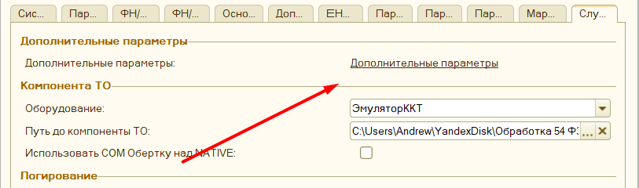

# Для программистов #

[в начало](README.md#навигация)

В данном разделе размещены примеры изменения программы или конфигурации.

## Доработка конфигурации ##

Если ваша конфигурация использует вид торгового оборудования **"ККТ с передачей данных"**, то доработка вам не требуется. Для остальных конфигураций, при печати программа пытается определить документ откуда печатается чек по данным журнала регистрации, это довольно затратно по производительности, плюс не всегда корректно получается, поэтому, чтобы явно задать документ откуда запущена печать, и тем самым ее ускорив, нужно подключить внешнюю печатную форму ["ВПФ_Чек"](connecting.md#структура-архива-с-обработкой), которая лежит в архиве с обработкой (если механизм внешних печатных форм поддерживается вашей конфигурацией).

Либо сделать небольшую доработку вашей конфигурации. Пример изменения конфигурации (видео): [Доработка конфигурации](https://www.youtube.com/watch?v=Ehp2DU-YnqM&index=1&list=PLv043XNq9i-6_DdLAy1kTuExX2E-ikn65)

**Описание действий:**

1. Откройте конфигурацию вашей базы 1С. В меню "Конфигурация" - "Поддержка" - "Настройка поддержки" проверьте включена ли возможность редактирования. Если нет - включите ее.
   
   

2. Найдите все упоминания строки ```ПолучитьСерверТО().ОплатитьПлатежнойКартой```. Перед найденной строкой добавьте такой код:

    ```bsl
    СохранитьЗначение("ДокументПечатиККТ", Ссылка);
    ```

3. Найдите все упоминания строки ```ПолучитьСерверТО().ПечатьЧека```. Перед найденной строкой добавьте такой код:

    ```bsl
    СохранитьЗначение("ДокументПечатиККТ", Ссылка);
    ```

4. Для конфигурации **Розница 1**, найдите упоминания ```ПолучитьСерверТО().ОткрытьЧек;``` в документе "Чек ККМ". Перед найденной строкой добавьте такой код:

    ```bsl
    СохранитьЗначение("ДокументПечатиККТ", Ссылка);
    ```

5. Нажмите кнопку **F7**, приняв тем самым изменения

## Дополнительные параметры ##

Если при разработке шаблона чека, или доработке функционала программы требуется ссылка на объект в базе, то ее можно явно прописать в параметрах обработки, а затем вызывать в коде таким образом.

```bsl
ЗначениеПараметра = ОсновнаяОбработка.ККТ_ЗначениеДополнительногоПараметра("ИмяПараметра");
```

Форму добавления дополнительных параметров, расположена в поле параметров программы



Здесь необходимо указать произвольное имя параметра и его возможное значение.


# Изменение функционала "под себя" #

Хотя основной модуль программы и закрыт для изменения, однако функционал программы все же можно изменить. Для этого необходимо использовать подключаемую обработку [KKT_DEVELOPE82](connecting.md#структура-архива-с-обработкой) для 1С версии 8.2 и 8.3 и [KKT_DEVELOPE81](connecting.md#структура-архива-с-обработкой) для версии 8.1 соответственно. Обработка находится в том же архиве, что и основная программа. В дальнейшем будем именовать его, как **доп обработчик**

Пример таких изменения описан в [видео](https://youtu.be/5t4pye9cRd8) (_устарело_)

## Доступные команды доп обработчика ##

В модуле **доп обработчика** расположены экспортные команды и переменные, которые при необходимости можно использовать для собственного кода. Так можно перехватить и подменить выполнение фискальных операций, в том числе печать чека.

### ОсновнаяОбработка ###

```ОсновнаяОбработка``` - переменная, в ней хранится объект основной программы. Через нее можно получить данные и вызывать методы доступные только в модуле объекта основной программы.
    _Пример_, ```ОсновнаяОбработка.мПараметрыУстройства``` - вернет текущие параметры обработки.

В любой процедуре доп обработчика можно получить доступ к параметрам чека, вызвав их через ```ОсновнаяОбработка```:

- ```мОбщиеПараметры``` - тип Структура, содержит данные основного чека, со всеми заполненными полями для печати. Данные заполняются после вызова  команды ```ОбработатьЧекПоСвоему``` и до выполнения процедуры фискализации чека. Пример заполнения ```ОсновнаяОбработка.мОбщиеПараметры``` можно посмотреть, в форме основной программы "МодульОбщий" функция ```ПараметрыОперацииФискализацииЧека()```
    
- ```мПараметрыУстройства``` - тип Структура, содержит общие параметры программы, как они были заданы пользователем.

- Также доступны специальные ***формы-модули***, через которые можно выполнять экспортный методы. Например, заполнение чека по умолчанию, можно вызвать через ```ОсновнаяОбработка.мМодульККТОбщий.ПараметрыОперацииФискализацииЧека()```. Содержимое модулей можно увидеть, открыв основную программу в конфигураторе, каждый модуль это отдельная форма обработки. В общей сложности доступны следующие модули:
  
  - ```мМодульККТОбщий``` - форма "МодульОбщий"
  - ```мМодульККТШаблон``` - форма "МодульШаблон"
  - ```мМодульККТМаркировка``` - форма "МодульМаркировка"
  - ```мМодульККТПочтаSMS``` - форма "МодульОтправкаПочтыSMS"
  - ```мМодульККТЗапросы``` - форма "МодульРаботаСЗапросами"
  - ```мМодульККТСобственная``` - форма "МодульСобственныйОбработчик"
  
#### ПредварительныйПросмотрЧека ####

- ```ПредварительныйПросмотрЧека(СсылкаНаДокумент)``` - процедура, формирует и выводит на экран предварительный чек по переданной ссылки документа. _Пример_,

       ```bsl
       ОсновнаяОбработка.ПредварительныйПросмотрЧека(СсылкаНаДокумент);
       ```

#### ПолучитьКассираСДолжностью ####

- ```ПолучитьКассираСДолжностью(СсылкаНаДокумент = Неопределено)``` - возвращает строку со сформированной должностью и именем кассира. Данные формируются на основании параметров обработки и переданной ссылке на документ (документ указывать необязательно). _Пример_,

       ```bsl
       КассирСДолжностью = ОсновнаяОбработка.ПолучитьКассираСДолжностью();
       ```

#### ККТ_XMLПредставлениеЧека ####

- ```ККТ_XMLПредставлениеЧека``` - возвращает XML представление напечатанного чека, соответствующее [требованиям к передаче данных](https://its.1c.ru/db/metod8dev/content/4829/hdoc)

        _Параметры_:

        ```ДанныеТекущегоЧека``` - тип Структура, содержит структура чека для печати, если чек для печати один, то по умолчанию он равен ```ОсновнаяОбработка.мОбщиеПараметры```

        ```ПараметрыПодключения``` - Тип Структура, содержит параметры подключения оборудования: заводской номер ФН, версию ФФД и т.д, если формирование происходит для основного фискального регистратора, то параметры подключения можно получить, вызвав ```ОсновнаяОбработка.мПараметрыПодключения```

        ```ШиринаСтроки``` - тип Число, необязательный, по умолчанию равен 32. Содержит ширину строки ленты фискального регистратора, используется, если дополнительно формируются текстовые строки, чтобы разбить одну длинную строку на несколько.

        _Пример_,

        ```bsl
        XMLЧек = ОсновнаяОбработка.ККТ_XMLПредставлениеЧека(ОсновнаяОбработка.мОбщиеПараметры, ОсновнаяОбработка.мПараметрыПодключения);
        ```

#### ОбработатьУниверсальныйДок ####

- ```ОбработатьУниверсальныйДок(СсылкаНаДокумент, СписокЧеков, ПараметрыОбработки, СуммаБезНал, СуммаНал, ДополнительнаяСтруктураДокумента = Неопределено)```:

       ```СсылкаНаДокумент``` - тип ДокументСсылка, ссылка на документ, откуда происходит печать.

       ```СписокЧеков``` - тип Массив, содержит массив структур, это чеки, которые будут напечатаны. Если список чеков получать в функции [```ОбработатьЧекПоСвоему```](#обработатьчекпосвоему), то там всегда будет находиться только один основной чек, разбиение происходит только в самом конце перед пробитием. Пример такой структуры чека можно получить, вызвав ```ОсновнаяОбработки.мМодульККТОбщий.ПараметрыОперацииФискализацииЧека()```

       ```ПараметрыОбработки``` - тип Структура, содержит параметры обработки, как они заданы пользователем через форму настройки.

       ```СуммаБезНал``` - тип Число, сумма безналичной оплаты в чеке, _устарело_

       ```СуммаНал``` - тип число, сумма наличной оплаты в чеке, _устарело, не используется_

       ```ДополнительнаяСтруктураДокумента``` - тип Структура, см. [```ДанныеДляПечатиЧекаДокумента```](#данныедляпечатичекадокумента), используется для того, чтобы переопределить определенное свойство документа именно в момент печати текущего чека, например, можно указать, что для этого чека, мы используем для получения товара только табличную часть Услуги, либо, что этот документа пробивается по безналу по умолчанию. В отличие от функции [МассивНетиповыхДокументов](#массивнетиповыхдокументов) данные дополнительной структуры документа не кэшируются, и используются только для обработки текущего чека, ее удобно применять, когда параметры заполнения чека меняются в зависимости от вида операции, или значения других полей.

       Выполняет типовой функционал заполнения и печати чека, с учетом переданной ссылки на документ, однако при этом, передав через ДополнительнаяСтруктураДокумента - дополнительные условия, мы можем управлять этим заполнением. Например, по умолчанию программа считает, что "**ПриходныйКассовыйОрдер**"  - это кассовый документ и содержит в себе табличную часть "**РасшифровкаПлатежа**", где указываются документы основания, однако если у вас он нетиповой, и не является кассовым и приходует товар, то мы можем передать вот так,

       ```bsl
       Функция ОбработатьЧекПоСвоему(СсылкаНаДокумент, СписокЧеков, ПараметрыОбработки, СуммаБезНал = 0, СуммаНал = 0, ПропуститьПроверку = Ложь) Экспорт

           ПропуститьПроверку = Истина;

           ИмяДокумента = пДок.Метаданные().Имя;
           СтруктураДокумента = Неопределено;

           Если ИмяДокумента = "ПриходныйКассовыйОрдер" Тогда
               СтруктураДокумента = Новый Структура();
               СтруктураДокумента.ЭтоКассовыйДокумент = Ложь;
               СтруктураДокумента.ТабличнаяЧасть = "Товары|Услуги";
           КонецЕсли;

           Возврат ОсновнаяОбработка.ОбработатьУниверсальныйДок(СсылкаНаДокумент, СписокЧеков, ПараметрыОбработки, СуммаБезНал, СуммаНал, СтруктураДокумента);

       КонецФункции

#### ПроверитьПечатьИВернутьРезультат ####

- ```ПроверитьПечатьИВернутьРезультат(СписокЧеков, ПараметрыОбработки)```:

       ```СписокЧеков``` - тип Массив, содержит массив структур, это чеки, которые будут напечатаны. Перед этой командой список чеков должен быть полностью заполнен итоговыми данными;

       ```ПараметрыОбработки``` - тип Структура, содержит параметры обработки, как они заданы пользователем через форму настройки.

       проверяет необходимость открытия [Формы проверки печати](form_check_and_check_correction.md), и открывает ее. Возвращает пустую строку, если все прошло успешно, или текст ошибки. Удобно, если список чеков формируете самостоятельно, но пользователю хотите вывести для корректировки.

       _Пример_,

       ```bsl
       Возврат ОсновнаяОбработка.ПроверитьПечатьИВернутьРезультат(СписокЧеков, ПараметрыОбработки);
       ```

#### Функции работы с оборудованием ####

Данные команды используется для самостоятельного вызова функций фискального регистратора или эквайринга, например можно предварительно открыть денежный ящик, или снять итоги по эквайрингу, либо вывести в интерфейс кассира кнопку для снятия отчета по секциям (Доступен например для оборудования Штрих-М)

#### ВыполнитьОсновнуюКомандуОборудования ####

- ```мМодульККТСобственная.ВыполнитьОсновнуюКомандуОборудования``` - позволяет через доп обработчик вызвать основную команду фискального регистратора (это общие команды, описание которых доступны в [требованиях к драйверам подключаемого оборудования](https://its.1c.ru/db/metod8dev#content:4829:hdoc:chapter270)).
Параметры:

    ```ИмяФискальногоРегистратора``` - тип Строка, имя подключенного фискального регистратора, как вы его назвали через меню подключения дополнительного оборудования, если это основной фискальный регистратор, то оставляем строку пустой.

    ```ИмяКоманды``` - тип Строка, русское наименование команды, как она указана в [требованиях к драйверам подключаемого оборудования](https://its.1c.ru/db/metod8dev#content:4829:hdoc:chapter270), например, ```ОткрытьДенежныйЯщик```

    ```ВходныеПараметры``` - необязательный, тип Массив, можно передать входные параметры для выполнения операции, например, Имя и ИНН кассира.

    Возвращает структуру, вида:

    ```bsl

        ДанныеОтвета = Новый Структура;
        ДанныеОтвета.Вставить("Успешно", Ложь);
        ДанныеОтвета.Вставить("ТекстОшибки", "");
        ДанныеОтвета.Вставить("ВыходныеПараметры");

    ```

    ```ВыходныеПараметры``` заполняются, при их наличии

    _Пример_,

    ```bsl
    ОсновнаяОбработка.мМодульККТСобственная.ВыполнитьОсновнуюКомандуОборудования("ДополнительныйФР", "ОткрытьДенежныйЯщик")
    ```

#### ВыполнитьДополнительнуюКомандуОборудования ####

- ```мМодульККТСобственная.ВыполнитьДополнительнуюКомандуОборудования``` - позволяет через доп обработчик вызвать дополнительную команду (это команды, которые предусмотрены только производителем определенного оборудования, например "Печать отчета по секциям") на подключенном фискальном регистраторе.
Параметры:

    ```ИмяФискальногоРегистратора``` - тип Строка, имя подключенного фискального регистратора, как вы его назвали через меню подключения дополнительного оборудования, если это основной фискальный регистратор, то оставляем строку пустой.

    ```ИмяДополнительнойКоманды``` - тип Строка, наименование дополнительной команды, как она прописана в описании драйвера, например, ```PrintChooseReceiptCopy```

    Возвращает структуру, вида:

    ```bsl

        ДанныеОтвета = Новый Структура;
        ДанныеОтвета.Вставить("Успешно", Ложь);
        ДанныеОтвета.Вставить("ТекстОшибки", "");
        ДанныеОтвета.Вставить("ВыходныеПараметры");

    ```

    ```ВыходныеПараметры``` заполняются, при их наличии

    _Пример_,

    ```bsl
    ОсновнаяОбработка.мМодульККТСобственная.ВыполнитьДополнительнуюКомандуОборудования("", "PrintChooseReceiptCopy");
    ```

#### ВыполнитьОсновнуюКомандуЭквайринга ####

- ```мМодульККТСобственная.ВыполнитьОсновнуюКомандуЭквайринга``` - позволяет через доп обработчик вызвать основную команду подключенного эквайрингового терминала (это общие команды, описание которых доступны в [требованиях к драйверам подключаемого оборудования](https://its.1c.ru/db/metod8dev#content:4829:hdoc:chapter238) для эквайринга)

    _Параметры_:

    ```ИмяЭквайринга``` - тип Строка, имя подключенного эквайрингового терминала, как вы его назвали через меню подключения эквайринговых терминалов.

    ```ИмяКоманды``` - тип Строка, русское наименование команды, как она указана в [требованиях к драйверам подключаемого оборудования](https://its.1c.ru/db/metod8dev#content:4829:hdoc:chapter238), например, ```ВернутьПлатежПоПлатежнойКарте```

    ```ВходныеПараметры``` - необязательный, тип Массив, можно передать входные параметры для выполнения операции.

    Возвращает структуру, вида:

    ```bsl
        ДанныеОтвета = Новый Структура;
        ДанныеОтвета.Вставить("Успешно", Ложь);
        ДанныеОтвета.Вставить("ТекстОшибки", "");
        ДанныеОтвета.Вставить("ВыходныеПараметры");
    ```

    ```ВыходныеПараметры``` заполняются, при их наличии

    _Пример_,

    ```bsl
    ОсновнаяОбработка.мМодульККТСобственная.ВыполнитьОсновнуюКомандуЭквайринга("Наш Эквайринг", "ИтогиДняПоКартам")

#### ВыполнитьДополнительнуюКомандуЭквайринга ####

- ```мМодульККТСобственная.ВыполнитьДополнительнуюКомандуЭквайринга``` - позволяет через доп обработчик вызвать дополнительную команду (это команды, которые предусмотрены только производителем определенного оборудования) на подключенном фискальном терминале.
Параметры:

    ```ИмяЭквайринга``` - тип Строка, имя подключенного эквайрингового терминала, как вы его назвали через меню подключения терминалов.

    ```ИмяДополнительнойКоманды``` - тип Строка, наименование дополнительной команды, как она прописана в описании драйвера, например, ```PrintChooseReceiptCopy```

    Возвращает структуру, вида:

    ```bsl
        ДанныеОтвета = Новый Структура;
        ДанныеОтвета.Вставить("Успешно", Ложь);
        ДанныеОтвета.Вставить("ТекстОшибки", "");
        ДанныеОтвета.Вставить("ВыходныеПараметры");
    ```

    ```ВыходныеПараметры``` заполняются, при их наличии

    _Пример_,

    ```bsl
    ОсновнаяОбработка.мМодульККТСобственная.ВыполнитьДополнительнуюКомандуЭквайринга("Наш эквайринг", "Test");
    ```

### Команды модуля обработчика ###

Здесь представлено описание команд доп обработчика, расположенных непосредственно в нем, и которые основная программа ожидает в нем увидеть.

#### ОбработатьЧекПоСвоему ####

- ```ОбработатьЧекПоСвоему``` - Выполняется перед запуском заполнения чека в основной обработке. Здесь можно добавить неподдерживаемые типы документов, или реализовать собственный функционал по заполнению чеков. При этом, если планируется реализовать собственный функционал, то необходимо установить значение переменной ```ПропуститьСтандартнуюОбработку``` в значение ```Истина```. Данная процедура обычно используется в паре с [```ОбработатьУниверсальныйДок```](#обработатьуниверсальныйдок)
  
    Параметры:

    ```СсылкаНаДокумент``` - Тип Ссылка на документ, документ из которого происходит печать

    ```СписокЧеков``` - тип Массив, содержит массив структур, это чеки, которые будут напечатаны. Первоначально содержит только один элемент, если предполагается напечатать несколько чеков, то необходимо добавлять дополнительные значения в эту структуру. Пример такой структуры чека можно получить, вызвав ```ОсновнаяОбработки.мМодульККТОбщий.ПараметрыОперацииФискализацииЧека()```

    ```ПараметрыОбработки``` - Тип Структура, Настройки обработки, см. мПараметрыУстройства

    ```СуммаБезНал``` - Необязательный, Тип Число. Сумма безналичной оплаты чека. _устарело_, не используется.

    ```СуммаНал``` - Необязательный, Тип Число. Сумма наличной оплаты чека. _устарело_, не используется.

    ```ПропуститьСтандартнуюОбработку``` - Необязательный, Тип Булево, указывает обрабатывать ли переданный документ по стандартному алгоритму основной программы. По умолчанию, ```ЛОЖЬ```

    Возвращаемое значение, тип Строка, возвращает текст ошибки, либо пустую строку при успешной срабатывании.

    _Пример_,

    ```bsl

    Функция ОбработатьЧекПоСвоему(СсылкаНаДокумент, СписокЧеков, ПараметрыОбработки, СуммаБезНал = 0, СуммаНал = 0, ПропуститьСтандартнуюОбработку = Ложь) Экспорт
        
        ПропуститьСтандартнуюОбработку = Истина;
        
        ИмяДокумента = СсылкаНаДокумент.Метаданные().Имя;
        СтруктураДокумента = Неопределено;
        Если ИмяДокумента = "ПлатежноеПоручениеВходящее" Тогда
            СтруктураДокумента = Новый Структура();
            СтруктураДокумента.ЭтоКассовыйДокумент = Истина;
            СтруктураДокумента.Электронно = Истина;
            СтруктураДокумента.ТабличнаяЧасть = "РасшифровкаПлатежа";
        ИначеЕсли ИмяДокумента = "РасходныйКассовыйОрдер" Тогда 
            СтруктураДокумента = Новый Структура();
            СтруктураДокумента.ЭтоКассовыйДокумент = Истина;
            СтруктураДокумента.ТипРасчетаПоУмолчанию = 3;
            СтруктураДокумента.ТабличнаяЧасть = "РасшифровкаПлатежа";
        КонецЕсли; 
        
        Возврат ОсновнаяОбработка.ОбработатьУниверсальныйДок(СсылкаНаДокумент, СписокЧеков, ПараметрыОбработки, СуммаБезНал, СуммаНал, СтруктураДокумента);

    КонецФункции

    ```

    _Пример_, как программно задать "передавать чек только в электроннном виде".

    ```bsl

    Функция ОбработатьЧекПоСвоему(СсылкаНаДокумент, СписокЧеков, ПараметрыОбработки, СуммаБезНал = 0, СуммаНал = 0, ПропуститьСтандартнуюОбработку = Ложь) Экспорт

 ПараметрыОбработки.T_БезПечати = Истина;
 ОсновнаяОбработка.мОбщиеПараметры.Электронно = Истина;

        Возврат "";

    КонецФункции

    ```

#### ДанныеДляПечатиЧекаДокумента ####

- ```ДанныеДляПечатиЧекаДокумента``` - функция, возвращает структуру следующего вида:
  
    ```bsl
        ПараметрыДокумента = Новый Структура();
        ПараметрыДокумента.Вставить("ТипРасчетаПоУмолчанию", 1);
        ПараметрыДокумента.Вставить("ЭтоКассовыйДокумент", Ложь);
        ПараметрыДокумента.Вставить("ВидОплатыПоУмолчанию", 0);
        ПараметрыДокумента.Вставить("ПризнакСпособаРасчетаПоУмолчанию", "");
        ПараметрыДокумента.Вставить("ТабличнаяЧасть", "");
        ПараметрыДокумента.Вставить("ЭтоТоварныйДокумент", Ложь);
        ПараметрыДокумента.Вставить("НеЗаполнятьПозиции", Ложь);
        ПараметрыДокумента.Вставить("НеЗаполнятьОплату", Ложь);
    ```

  Ее можно использовать как образец для заполнения полей, которые необходимо переопределить при использовании функции [```ОбработатьУниверсальныйДок```](#обработатьуниверсальныйдок).
  
  ```ТипРасчетаПоУмолчанию``` - Тип Число, отвечает за то, на какой тип расчета будет отнесен документ, если программе не удастся его определить по виду операции. Возможные значения: 1 - "Приход", 2 - "Возврат прихода", 3 - "Расход", 4 - "Возврат расхода"

    ```ЭтоКассовыйДокумент``` - Тип Булево, определяет является ли документ кассовым. Ярким примером является, например, документ "Приходный кассовый ордер". Для кассовых документов применяется особый механизм заполнения: программа пытается определить документ сделки, который содержит данные о товаре, это может быть документ расчетов с контрагентами, заказ, документ основания и т.д. У кассовых документов может быть несколько документов сделки с товарами. Также, если не устраивает типовой алгоритм определения сделки, например, нужно брать информацию по товарам из документа основания, а не из документа расчетов, то нужно переопределить еще эту функцию [```МассивПриоритетовОпределенияТоварногоДокумента```](#массивприоритетовопределениятоварногодокумента)

    ```ВидОплатыПоУмолчанию``` - тип Число, определяет, куда относить по умолчанию данные об оплате, если программе не удастся определить эту информация автоматически. Возможные значения: 0 - "Наличные", 1 - "Безналичные", 4 - "зачет аванса", 5 - "постоплата", 6 - "взаимозачет"

    ```ПризнакСпособаРасчетаПоУмолчанию``` - Тип Строка, Определяет на какой признак способа расчета установить документ, если ему явно этот признак не передан, например "ЗаказПокупателя", по умолчанию относится к "ПРЕДОПЛАТА".
    Возможные значения: "ПРЕДОПЛАТА", "ПЕРЕДАЧА", "ОПЛАТАКРЕДИТА","НЕЗАДАН", либо пустая строка, при пустой строке признака способа расчета будет проигнорирован, при признаке "НЕЗАДАН", настройки распределения обработки этого признака очистятся.

    ```ТабличнаяЧасть``` - тип Строка. Применяется для кассовых и товарных документов.
 Указывает, для кассового, где расположена табличная часть с документам сделки, а для товарного - наименования таблиц с товарами.
 Например, для "Приходного кассового ордера" табличная  - "РасшифровкаПлатежа". Если несколько табличных частей, то они записываются через символ |, Например "Товары|Услуги"

    ```ЭтоТоварныйДокумент``` - Тип Булево, используется в редких случаях для определения информации для оплаты, ярким примером является документ "Реализация товаров услуг" в последних типовых конфигурациях 1С, в нем появилась табличная часть с кассовыми документами, из нее можно получить информацию о том, какие оплаты по нему проходили. Если же мы хотим проигнорировать данную информацию, то нужно поставить этот признак в значение ```ЛОЖЬ```

    ```НеЗаполнятьПозиции``` - тип Булево, указывает заполнять ли информацию о товаре средствами основной программы. Использовать, если необходимо реализовать собственный алгоритм заполнения товара.

    ```НеЗаполнятьОплату``` - тип Булево, указывает заполнять ли информацию об оплате средствами основной программы. Использовать, если необходимо реализовать собственный алгоритм заполнения оплаты.

#### МассивПриоритетовОпределенияТоварногоДокумента ####

- ```МассивПриоритетовОпределенияТоварногоДокумента``` - выполняется в момент определения документа сделки для кассового документа. Возвращает массив, содержащий наименования возможных реквизитов документа, что содержат данные о документе сделки, в порядке от наиболее приоритетного к наименее. По умолчанию, принят такой порядок реквизитов:

   ```bsl
    МассивПриоритетов = Новый Массив;

 МассивПриоритетов.Добавить("СчетНаОплату");
 МассивПриоритетов.Добавить("ДокументРасчетовСКонтрагентом");
 МассивПриоритетов.Добавить("РеализацияТоваров");
 МассивПриоритетов.Добавить("ДокументОснованиеЧекаККМ");
 МассивПриоритетов.Добавить("Сделка");
 МассивПриоритетов.Добавить("ДокументОснование");
 МассивПриоритетов.Добавить("КредитныйДокумент");
 МассивПриоритетов.Добавить("ОтчетОРозничныхПродажах");
 МассивПриоритетов.Добавить("СубконтоДТ3");
    ```

    Если же необходимо, чтобы программа брала данные из "документа основания", а не "сделки", то этот порядок можно переопределить таким образом:

    ```bsl
    Функция МассивПриоритетовОпределенияТоварногоДокумента(СсылкаНаДокумент) Экспорт
        МассивПриоритетов = Новый Массив;
        МассивПриоритетов.Добавить("ДокументОснование");
        МассивПриоритетов.Добавить("Сделка");
        Возврат МассивПриоритетов; 
    КонецФункции
    ```

#### ПослеФормированииТаблицыЧека ####

- ```ПослеФормированииТаблицыЧека``` - процедура, Выполняется после заполнения таблицы чека по стандартному алгоритму обработки, но до фискализации и открытия формы проверки печати. На данном этапе уже заполнена информация по оплатам и позициям, но не произошло разбиение общего списка товара по отдельным чекам и не применены шаблоны. Предполагается, что разработчик здесь может полностью переопределить сформированную таблицу для печати, либо поменять отдельные реквизиты: признаки расчета, наименование товара, фискальный регистратор, ставку ндс, и многое другое.
    Параметры:

    ```пТаблицаЧека``` - тип ТаблицаЗначений, содержит строки будущего чека, с дополнительными служебными полями, что могут быть использованы в алгоритме заполнения чека. Какие колонки содержит данная таблица можно посмотреть вызвав ```ОсновнаяОбработка.мМодульККТОбщий.ККТ_ПолучитьПустуюТаблицуСДанными()``` или посмотрев ее код в форме ```МодульОбщий```

    ```пПараметры``` - тип Структура, Параметры обработки, см. ```мПараметрыУстройства```

    _Пример_,

    ```bsl
    Процедура ПослеФормированииТаблицыЧека(пТаблицаЧека, пПараметры) Экспорт
            
        //Заполнение email контрагента перед печатью чека
        Контрагент = ОсновнаяОбработка.мОбщиеПараметры.ДокументОснование.Контрагент;
        Если ЗаполненEmail(Контрагент) Тогда
            ОсновнаяОбработка.мОбщиеПараметры.Электронно = Истина;
            ОсновнаяОбработка.мОбщиеПараметры.ПокупательEmail = Контрагент.АдресЭП;
        КонецЕсли; 
        
        //Удаление НДС из чека
        Для Каждого СтрокаЧека Из пТаблицаЧека Цикл
         СтрокаЧека.СтавкаНДС = "";
         СтрокаЧека.СуммаНДС = 0;
        КонецЦикла;
        
        //Установка собственного номера таможенной декларации.
        Для Каждого СтрокаЧека Из пТаблицаЧека Цикл
         СтрокаЧека.НомерТаможеннойДекларации = НомерДекларацииИзНоменклатуры(СтрокаЧека.Номенклатура);
        КонецЦикла; 

    КонецПроцедуры

    ```

#### МассивНетиповыхДокументов ####

- ```МассивНетиповыхДокументов``` - Выполняется единожды при запуске обработки для определения списка поддерживаемых документов. Типовой список документов содержится в макете "Список поддерживаемых документов" основной обработки.  Данная функция позволяет добавить, либо переопределить уже существующие документы. В отличие от передачи схожего параметра в функцию ["ОбработатьУниверсальныйДок"](#обработатьуниверсальныйдок), здесь значение определяется единожды и в последствие не меняется, его удобно использовать, если нужно просто изменить поддерживаемый документ, без каких либо условий.

    Возвращает значение: тип Массив, содержит структуры ["ДанныеНетиповогоДокумента"](#данныенетиповогодокумента), в которых расположена информация по переопределению.

    Например, в текущей конфигурации документ "Приходный кассовый ордер" (ПКО) содержит табличную часть "Товары" и приходует товар - в типовом же варианте ПКО имеет табличную часть "РасшифровкаПлатежа" и приходует деньги, это можно поправить:

    ```bsl
    Функция МассивНетиповыхДокументов() Экспорт
        МассивНетиповыхДокументов = Новый Массив;
        
        //ПЕРЕОПРЕДЕЛЕНИЕ ПРИХОДНОГО КАССОВОГО ОРДЕРА
        ДанныеНовогоДокумента = ДанныеНетиповогоДокумента();
        ДанныеНовогоДокумента.ПолноеИмя = "Документ.ПриходныйКассовыйОрдер";
        ДанныеНовогоДокумента.ТабличнаяЧасть = "Товары";
        ДанныеНовогоДокумента.ЭтоКассовыйДокумент = Ложь;
        МассивНетиповыхДокументов.Добавить(ДанныеНовогоДокумента);
        
        Возврат МассивНетиповыхДокументов;
    КонецФункции
    ```

    Другое пример, необходимо добавить документ "Акт списания ЕГАИС" с табличной часть "Товары", чтобы он делал расход по кассе:

    ```bsl
    Функция МассивНетиповыхДокументов() Экспорт
        МассивНетиповыхДокументов = Новый Массив;
        
        //ДОБАВЛЕНИЕ ДОКУМЕНТА "АКТ СПИСАНИЯ ЕГАИС"
        ДанныеНовогоДокумента = ДанныеНетиповогоДокумента();
        ДанныеНовогоДокумента.ТипРасчетаПоУмолчанию = 3; //Расход
        ДанныеНовогоДокумента.ПолноеИмя = "Документ.АктСписанияЕГАИС";
        ДанныеНовогоДокумента.ТабличнаяЧасть = "Товары";
        МассивНетиповыхДокументов.Добавить(ДанныеНовогоДокумента);
        
        Возврат МассивНетиповыхДокументов;
    КонецФункции
    ```

#### ДанныеНетиповогоДокумента ####

- ```ДанныеНетиповогоДокумента``` - функция, возвращает структуру следующего вида:

    ```bsl
    Функция ДанныеНетиповогоДокумента()
        СтруктураДокумента = ДанныеДляПечатиЧекаДокумента(); 
        СтруктураДокумента.Вставить("ПолноеИмя");
        Возврат СтруктураДокумента;
    КонецФункции  
    ```

    Используется в функции [МассивНетиповыхДокументов](#массивнетиповыхдокументов) для переопределения параметров поддерживаемых документов. По факту это расширение структуры [ДанныеДляПечатиЧекаДокумента](#данныедляпечатичекадокумента) с добавлением поля "ПолноеИмя", в котором содержится полное наименование метаданных поддерживаемого объекта, например "Документ.ПриходныйКассовыйОрдер".

#### ПолучитьПредставлениеПоляЗапроса_Универсальное ####

- ```ПолучитьПредставлениеПоляЗапроса_Универсальное``` - используется для переопределения механизма динамического формирования запросов к базе данных. Функционал программы универсальный, и потому получение данных о контрагенте, кассире, пробитом товаре основано на динамическом сформированном запросе, через эту функцию разработчик может повлиять на этот запрос. Обратите внимание, что результат такого динамического формирования кэшируется по виду документа как только инициализируется данные запроса, поэтому подменять запрос в зависимости от вида операции документа не получится

    _Параметры_:

    ```пИмяПоля``` - тип Строка, имя предопределенного поля, для которого программа пытается построить запрос. Например, это может быть поле "ПОЛУЧАТЕЛЬ", "ИННПОЛУЧАТЕЛЯ", "ЦЕНА", "НОМЕНКЛАТУРА" и т.д. Обратите внимание, что имя поля передается в верхнему регистре. Общий список полей доступных для определения можно посмотреть, открыв в конфигураторе основную обработку, форму "МодульРаботаСЗапросами" функцию "СписокИзмененныхПолей".
    

    ```ИмяОбъекта1С``` - тип Строка, имя объекта 1С, для которого определяется поле запроса, например, мы может для объекта "Номенклатура", искать поле "ВИДНОМЕНКЛАТУРЫ", или, например, для "РеализацияТоваровУслуг", искать поле "ОРГАНИЗАЦИЯ". Имя объекта передается в *CamelCase*

    ```пТабличнаяЧасть``` - тип Строка, имя табличной части объекта 1С, в которой находится предполагаемое поле, если табличная часть не используется, то она будет пустой строкой.

    ```пТаблицаЗапроса``` - тип Строки, служебное поле, содержит информацию представления объекта для построения запроса, к примеру, имеет запрос вида

    ```bsl
    "ВЫБРАТЬ 
    | Объект.Организация КАК Организация
    | ИЗ Документ.РеализацияТоваровИУслуг КАК Объект"
    ```

    здесь конструкция "Объект." будет как раз в ```пТаблицаЗапроса```, таким образом, чтобы в функции "ПолучитьПредставлениеПоляЗапроса_Универсальное" вернуть необходимое значение реквизита, то нужно возвращать так

    ```bsl
    Возврат пТаблицаЗапроса + "ИмяВашегоРеквизита";
    ```

    ```пТиповоеПоле``` - тип Строка, значение поля запроса, которое будет использовано, если его разработчик его не подменит.

    _Пример_

    ```bsl
    Функция ПолучитьПредставлениеПоляЗапроса_Универсальное(пИмяПоля, ИмяОбъекта1С, пТабличнаяЧасть, пТаблицаЗапроса, пТиповоеПоле) Экспорт
        Если пИмяПоля = "ЦЕНА" Тогда
            Возврат пТаблицаЗапроса + "ЦенаДоставки";
        КонецЕсли;
        
        Возврат пТиповоеПоле;
    КонецФункции
    ```
