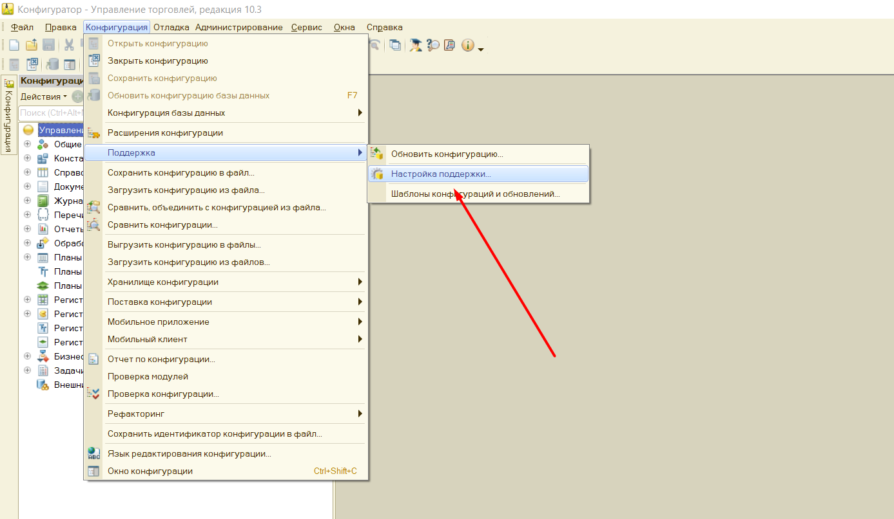
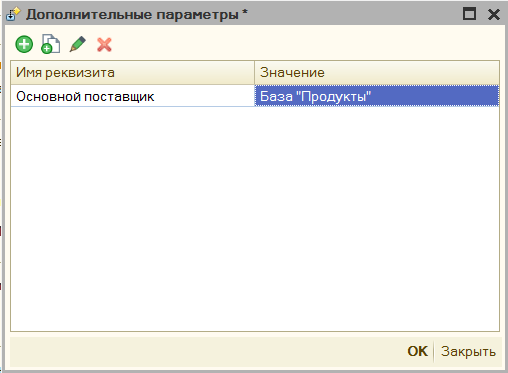
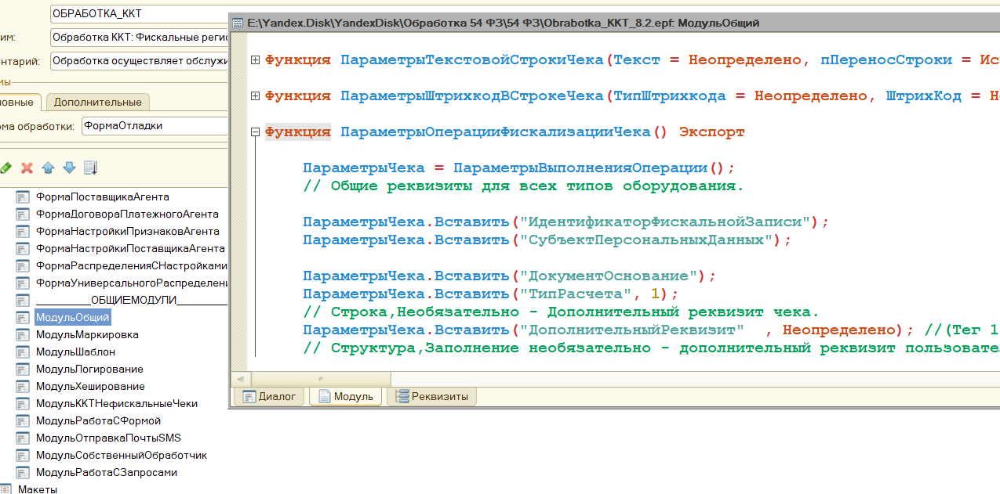

# Для программистов #

[в начало](README.md#навигация)

В данном разделе размещены примеры изменения программы или конфигурации.

## Доработка конфигурации ##

Если ваша конфигурация использует вид торгового оборудования **"ККТ с передачей данных"**, то доработка вам не требуется. Для остальных конфигураций, при печати программа пытается определить документ откуда печатается чек по данным журнала регистрации, это довольно затратно по производительности, плюс не всегда корректно получается, поэтому, чтобы явно задать документ откуда запущена печать, и тем самым ее ускорив, нужно подключить внешнюю печатную форму ["ВПФ_Чек"](connecting.md#структура-архива-с-обработкой), которая лежит в архиве с обработкой (если механизм внешних печатных форм поддерживается вашей конфигурацией). 

Либо сделать небольшую доработку вашей конфигурации. Пример изменения конфигурации (видео): [Доработка конфигурации](https://www.youtube.com/watch?v=Ehp2DU-YnqM&index=1&list=PLv043XNq9i-6_DdLAy1kTuExX2E-ikn65)

**Описание действий:**

1. Откройте конфигурацию вашей базы 1С. В меню "Конфигурация" - "Поддержка" - "Настройка поддержки" проверьте включена ли возможность редактирования. Если нет - включите ее.
   
   

2. Найдите все упоминания строки ```ПолучитьСерверТО().ОплатитьПлатежнойКартой```. Перед найденной строкой добавьте такой код:

    ```bsl
    СохранитьЗначение("ДокументПечатиККТ", Ссылка);
    ```

3. Найдите все упоминания строки ```ПолучитьСерверТО().ПечатьЧека```. Перед найденной строкой добавьте такой код:

    ```bsl
    СохранитьЗначение("ДокументПечатиККТ", Ссылка);
    ```

4. Для конфигурации **Розница 1**, найдите упоминания ```ПолучитьСерверТО().ОткрытьЧек;``` в документе "Чек ККМ". Перед найденной строкой добавьте такой код:

    ```bsl
    СохранитьЗначение("ДокументПечатиККТ", Ссылка);
    ```

5. Нажмите кнопку **F7**, приняв тем самым изменения

## Дополнительные параметры ##

Если при разработке шаблона чека, или доработке функционала программы требуется ссылка на объект в базе, то ее можно явно прописать в параметрах обработки, а затем вызывать в коде таким образом.

```bsl
ЗначениеПараметра = ОсновнаяОбработка.ККТ_ЗначениеДополнительногоПараметра("ИмяПараметра");
```
Форму добавления дополнительных параметров, расположена в поле параметров программы


Здесь необходимо указать произвольное имя параметра и его возможное значение.



# Изменение функционала "под себя" #

Хотя основной модуль программы и закрыт для изменения, однако функционал программы все же можно изменить. Для этого необходимо использовать подключаемую обработку [KKT_DEVELOPE82](connecting.md#структура-архива-с-обработкой) для 1С версии 8.2 и 8.3 и [KKT_DEVELOPE81](connecting.md#структура-архива-с-обработкой) для версии 8.1 соответственно. Обработка находится в том же архиве, что и программа. В дальнейшем описании будем именовать его, как **доп обработчик**

Пример таких изменения описан в [видео](https://youtu.be/5t4pye9cRd8) (_устарело_)

## Доступные команды KKT_DEVELOPE ##

Внутри **доп обработчика** расположены экспортные команды и переменных, которые при необходимости использовать для собственного кода. Таким образом можно перехватить и подменить заполнение фискального чека, или фискальной операции.

```ОсновнаяОбработка``` - переменная, в ней хранится объект основной программы, через нее можно получать данные и вызывать процедуру доступные только в модуле объекта основной обработки. 
    _Пример_, ```ОсновнаяОбработка.мПараметрыУстройства``` - вернет текущую структуру параметров обработки.

### ОсновнаяОбработка ###

В любой процедуру Доп обработчика можно переопределить параметры чека, вызвав их через ```ОсновнаяОбработка```:
   - ```мОбщиеПараметры``` - тип Структура, содержит данные основного чека, со всеми заполненными полями для печати, данные заполняются после вызова  команды ```ОбработатьЧекПоСвоему``` и до выполнения процедуры ```ПослеФормированииТаблицыЧека``` доп обработчика. Образец заполнения ```ОсновнаяОбработка.мОбщиеПараметры``` можно посмотреть, в форме основной программы "МодульОбщий" функция ```ПараметрыОперацииФискализацииЧека()```
    
   - ```мПараметрыУстройства``` - тип Структура, содержит общие параметры программы, как они были заданы пользователем.

    
   - Также доступны специальные ***формы-модули***, через которое можно выполнять экспортный функции и процедуры, например заполнение данных чека по умолчанию, можно вызвать через ```ОсновнаяОбработка.мМодульККТОбщий.ПараметрыОперацииФискализацииЧека()```. Содержимое модулей можно посмотреть, открыв основную программу в конфигураторе, каждый модуль это имя формы. В общей сложности доступны следующие модули:
  
     - ```мМодульККТОбщий``` - форма "МодульОбщий"
     - ```мМодульККТШаблон``` - форма "МодульШаблон"
     - ```мМодульККТМаркировка``` - форма "МодульМаркировка"
     - ```мМодульККТПочтаSMS``` - форма "МодульОтправкаПочтыSMS"
     - ```мМодульККТЗапросы``` - форма "МодульРаботаСЗапросами"
     - ```мМодульККТСобственная``` - форма "МодульСобственныйОбработчик"
  
#### ПредварительныйПросмотрЧека ####

   - ```ПредварительныйПросмотрЧека(СсылкаНаДокумент)``` - процедура, формирует и выводит на экран предварительный чек по переданной ссылки документа. _Пример_,

       ```bsl
       ОсновнаяОбработка.ПредварительныйПросмотрЧека(СсылкаНаДокумент);
       ```

#### ПолучитьКассираСДолжностью ####

   - ```ПолучитьКассираСДолжностью(СсылкаНаДокумент = Неопределено)``` - возвращает строку со сформированной должностью и именем кассира. Данные формируются на основании параметров обработки и переданной ссылке на документ (документ указывать необязательно). _Пример_,

       ```bsl
       КассирСДолжностью = ОсновнаяОбработка.ПолучитьКассираСДолжностью();
       ```

#### ККТ_XMLПредставлениеЧека ####

   - ```ККТ_XMLПредставлениеЧека(ДанныеТекущегоЧека, ПараметрыПодключения, ШиринаСтроки = 32)``` - возвращает XML строку, с данными фискального чека, что будут переданы на оборудование при фискализации, xml будет соответствовать [требованиям к передаче данных](https://its.1c.ru/db/metod8dev/content/4829/hdoc). Чек строится по Структуре переданного чека и его параметрам подключения, ширину строку можно не передавать, таким образом ```ДанныеТекущегоЧека```, по умолчанию равны ```ОсновнаяОбработка.мОбщиеПараметры```, а ```ПараметрыПодключения = ОсновнаяОбработка.мПараметрыПодключения```
   Пример,

       ```bsl
       XMLЧек = ОсновнаяОбработка.ККТ_XMLПредставлениеЧека(ОсновнаяОбработка.мОбщиеПараметры, ОсновнаяОбработка.мПараметрыПодключения);
       ```

#### ОбработатьУниверсальныйДок ####

   - ```ОбработатьУниверсальныйДок(СсылкаНаДокумент, СписокЧеков, ПараметрыОбработки, СуммаБезНал, СуммаНал, ДополнительнаяСтруктураДокумента = Неопределено)```:

       ```СсылкаНаДокумент``` - тип ДокументСсылка, ссылка на документ, откуда происходит печать.

       ```СписокЧеков``` - тип Массив, содержит массив структур, это чеки, которые будут напечатаны. Если список чеков получать в функции ```ОбработатьЧекПоСвоему```, то там всегда будет находиться только один основной чек, разбиение происходит только в самом конце перед пробитием. Пример такой структуры чека можно получить, вызвав ```ОсновнаяОбработки.мМодульККТОбщий.ПараметрыОперацииФискализацииЧека()```

       ```ПараметрыОбработки``` - тип Структура, содержит параметры обработки, как они заданы пользователем через форму настройки.

       ```СуммаБезНал``` - тип Число, сумма безналичной оплаты в чеке, _устарело_

       ```СуммаНал``` - тип число, сумма наличной оплаты в чеке, _устарело, не используется_

       ```ДополнительнаяСтруктураДокумента``` - тип Структура, см. ```ДанныеДляПечатиЧекаДокумента```, используется для того, чтобы переопределить определенное свойство документа именно в момент печати текущего чека, например, можно указать, что для этого чека, мы используем для получения товара только табличную часть Услуги, либо, что этот документа пробивается по безналу по умолчанию.

       Выполняет типовой функционал заполнения и печати чека, с учетом переданной ссылки на документ, однако при этом, передав через ДополнительнаяСтруктураДокумента - дополнительные условия, мы можем управлять этим заполнением. Например, по умолчанию программа считает, что "**ПриходныйКассовыйОрдер**"  - это кассовый документ и содержит в себе табличную часть "**РасшифровкаПлатежа**", где указываются документы основания, однако если у вас он нетиповой, и не является кассовым и приходует товар, то мы можем передать вот так,

       ```bsl
       Функция ОбработатьЧекПоСвоему(СсылкаНаДокумент, СписокЧеков, ПараметрыОбработки, СуммаБезНал = 0, СуммаНал = 0, ПропуститьПроверку = Ложь) Экспорт

           ПропуститьПроверку = Истина;

           ИмяДокумента = пДок.Метаданные().Имя;
           СтруктураДокумента = Неопределено;

           Если ИмяДокумента = "ПриходныйКассовыйОрдер" Тогда
               СтруктураДокумента = Новый Структура();
               СтруктураДокумента.ЭтоКассовыйДокумент = Ложь;
               СтруктураДокумента.ТабличнаяЧасть = "Товары|Услуги";
           КонецЕсли;

           Возврат ОсновнаяОбработка.ОбработатьУниверсальныйДок(СсылкаНаДокумент, СписокЧеков, ПараметрыОбработки, СуммаБезНал, СуммаНал, СтруктураДокумента);

       КонецФункции

#### ПроверитьПечатьИВернутьРезультат ####

   - ```ПроверитьПечатьИВернутьРезультат(СписокЧеков, ПараметрыОбработки)```:
     
       ```СписокЧеков``` - тип Массив, содержит массив структур, это чеки, которые будут напечатаны. Перед этой командой список чеков должен быть уже полностью заполнен итоговыми данными
       
       ```ПараметрыОбработки``` - тип Структура, содержит параметры обработки, как они заданы пользователем через форму настройки.

       проверяет необходимость открытия [Формы проверки печати](form_check_and_check_correction.md), и открывает ее. Возвращает пустую строку, если все прошло успешно, или текст ошибки. Удобно, если список чеков формируете самостоятельно, но пользователю хотите вывести для корректировки.

       _Пример_,
       ```bsl
       Возврат ОсновнаяОбработка.ПроверитьПечатьИВернутьРезультат(СписокЧеков, ПараметрыОбработки);
       ```

#### Функции работы с оборудованием ####

#### ВыполнитьДополнительнуюКомандуОборудования ####

- ```мМодульККТСобственная.ВыполнитьДополнительнуюКомандуОборудования``` - позволяет через доп обработчик вызвать дополнительную команду (это команды, которые предусмотрены только производителем определенного оборудования, например "Печать отчета по секциям") на подключенном фискальном регистраторе.
Параметры:

    ```ИмяФискальногоРегистратора``` - тип Строка, имя подключенного фискального регистратора, как вы его назвали через меню подключения дополнительного оборудования, если это основной фискальный регистратор, то оставляем строку пустой.

    ```ИмяДополнительнойКоманды``` - тип Строка, наименование дополнительной команды, как она прописана в описании драйвера, например, ```PrintChooseReceiptCopy```

    _Пример_,

    ```bsl
    ОсновнаяОбработка.мМодульККТСобственная.ВыполнитьДополнительнуюКомандуОборудования("", "PrintChooseReceiptCopy");

    ```
