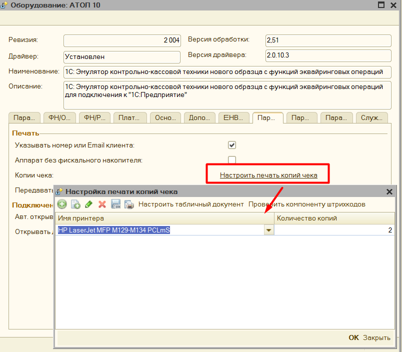
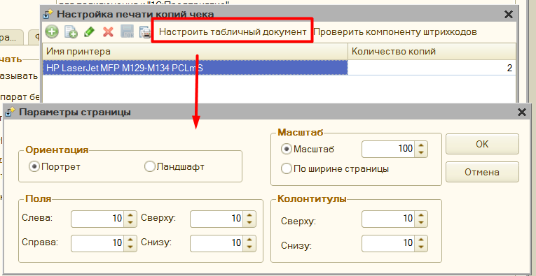
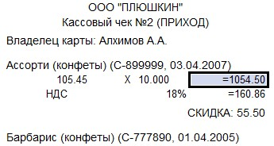
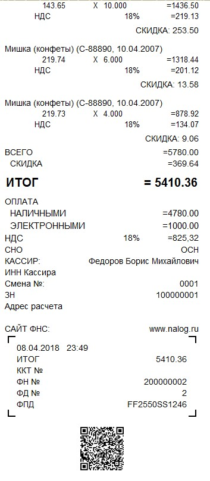
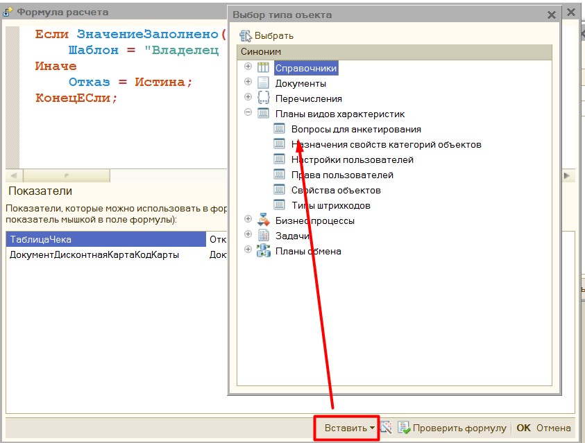
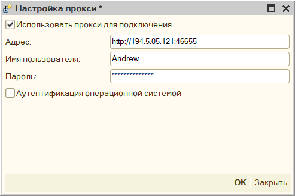
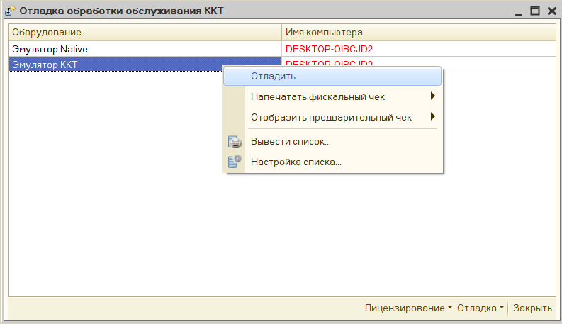
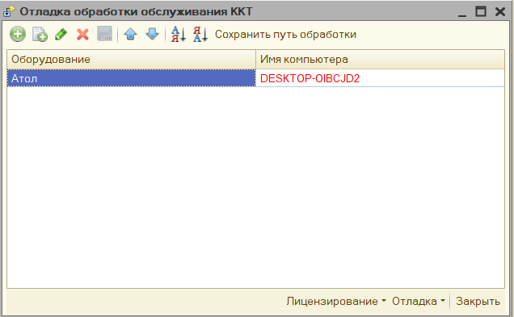

# Дополнительная функциональность #

[в начало](README.md#навигация)

>**Обратите внимание**, что основной функционал обработки представлен также в видео:

[Первое видео](https://www.youtube.com/watch?v=uVJSKu6wHXE) (_устарело_))

[Второе видео](https://www.youtube.com/watch?v=T3Qr9CJBb48) (_устарело_)

[Третье видео](https://www.youtube.com/watch?v=ZOXDoqp12sk) (_устарело_))

## Печать копии чека ##

В параметрах обработки можно настроить возможность печати копии чека на обычный принтер. Для этого в параметрах обработки нажмите на **«Настроить печать копий чека»** - откроется форма настройки.

В поле **«Имя принтера»** необходимо выбрать принтер из списка, и указать количество копий, которые нужно напечатать.

По кнопке **«Проверить компоненту штрихкодов»** - обработка проверяет находится ли в папке с макетами компонента для печати штрихкодов.
> **Важно**: без данной компоненты в копию чека не будет выведен QR код фискального чека.

Для настройка выводимого табличного документа, есть кнопка «Настроить табличный документ», где можно указать как должен выводиться чек.

Копия чека заполняется также, как и фискальный чек, и информацию заполнения можно менять, меняя шаблон документа. Однако часть информации невозможно получить из фискального регистратора, поэтому ее нужно указать вручную. Данные настройки находятся в группе «**Нефискальные чеки**» в параметрах обработки

Если вы хотите, чтобы копия чека выводилась корректно, то данные параметры нужно заполнить.

Копия чека будет напечатана в следующем виде.

## Редактор произвольного кода ##

Когда в обработке нужно написать код на встроенном языке 1С, открывается редактор произвольного кода. Данный редактор имеет подсветку синтаксиса 1С, можно открыть конструктор запросов, вставить ссылку на объект в базе данных, используются шаблоны кода, используется конструктор форматной строки.

## Подключение через прокси ##

Для подключения к прокси необходимо заполнить:

«**Адрес**» - он заполняется в формате «http://адрес:порт», либо «https://адрес:порт», адрес прокси-сервера можно не заполнять, тогда будут использованы настройки по умолчанию.

«**Имя пользователя**» и «**Пароль**» - пользователя, под которым будет происходить подключение к прокси-серверу.

«**Аутентификация операционной системой**» - если установлен данный флажок, то подключение к прокси будет происходить без указания имени пользователя и пароля.

## Форма отладки ##

Для более удобной проверки работы обработки можно использовать «форму отладки», для этого откройте обработку через меню **«Файл»** - **«Открыть»**.

Если конфигурация, в которой была открыта форма отладки не поддерживает работу с торговым оборудованием, то в этом окне можно самостоятельно добавить подключение к новому оборудованию.

Кнопка «Сохранить путь обработки» используется при печати через внешнюю печатную форму, которая идет в комплекте с обработкой. Она сохраняет путь до файла основной обработки в настройки пользователя, затем при печати через внешнюю
печатную форму проверяется указан ли путь до обработки, и если указан, то используется именно обработка по этому пути.

Если же работа с фискальными регистраторами поддерживается, то в данном списке отобразиться уже подключенное оборудование, которой можно перенастроить здесь же.

Из данной формы можно на основании абсолютно любого документа:

1. **Напечатать предварительный чек**, который представляет из себя обычную печатную форму
1. **Напечатать фискальный чек.**

Доступно 2 варианта использование:

- **Предопределенный документ** – это тот документ, для которого алгоритм печати заложен в самой обработке

- **Собственный документ** – для такого документа обработка попробует напечатать чек на основании универсального алгоритма, однако желательно для такого реализовать собственный функционал печати через дополнительный обработчик.

Например, в конфигурации **УТ 10.2**, можно печатать полноценные фискальные чеки без доработки конфигурации.
