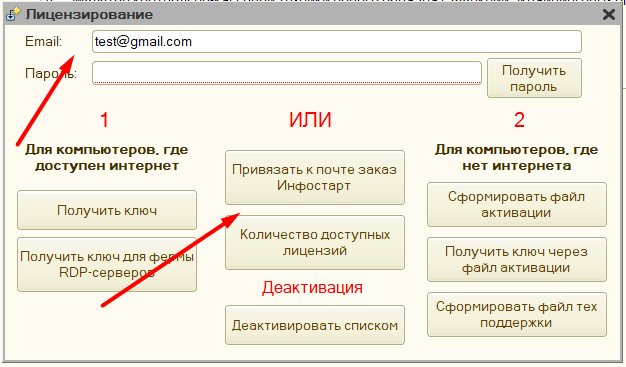

# Лицензирование #

[в начало](README.md#навигация)

Обработка использует 3 режима: «**Демо**», «**Лицензия**» и «**Лицензия на ферму RDP-серверов**»

«**Демо**» - позволяет использовать полный функционал обработки, отличается от «Лицензия» и «Лицензия на ферму RDP-серверов» тем, что при печати присутствует задержка с информационным окном о том, что используется демоверсия, а также есть ограничение на количество операций для одного пользователя.

«**Лицензия**» - полноценная работа с обработкой без искусственных задержек и ограничений. Лицензия бессрочная, продлевать ее не нужно.

«**Лицензия на ферму RDP-серверов**» - полноценная лицензия, для частных случаев, когда работа происходит по RDP, однако при этом используется несколько компьютеров-серверов, и при переподключении пользователь может подключиться уже к другому компьютеру, например, такой функционал обычно используется для сервисов, что предоставляют 1с в аренду (1C fresh).

Для режимов «**Лицензия**» и «**Лицензия на ферму RDP-серверов**», необходимо приобрести лицензию на программу, и активировать ее по инструкции. Обратите внимание, 1 ключ может работать только на 1-м рабочем месте, если лицензию нужно переактивировать, то нужно вначале «Деактивировать» первую лицензию через меню обработки, а затем заново получить лицензию на другом рабочем месте.

**Возможные спорные ситуации:**

1. 1С находится на сервере, и пользователи подключаются к ней через установленную на своем компьютере 1С, необходимо приобрести столько лицензий сколько компьютеров использует обработку.

2. 1С находится на сервере, и пользователи подключаются к ней через RemoteAPP, тогда необходимо приобрести только 1 лицензию на сервер

3. 1С находится на сервере, и пользователи подключаются к ней через RDP, тогда необходимо приобрести только 1 лицензию на сервер

Видеоинструкция по активации лицензии: [Активация лицензии](https://www.youtube.com/watch?v=7v10ljuM3ag)

## Особенность получения обновлений и технической поддержки ##

Все обновления привязаны к технической поддержки пользователя. Обработка сверяет дату ее окончания, и, если версия не соответствует - переключает работу в демо-режим. Не стоит беспокоиться, что вы не сможете получить версию, которая вам доступна. Через форму обработки теперь можно получить все необходимые файлы для работы, при этом можно получить и доступные предыдущие версии.

Важно, все купленные лицензии закрепляются за тем email, что был указан при покупке, и потому техническая поддержка оказывается не на купленную лицензию, а на указанный email, поэтому при первоначальной покупки лицензии, техническая поддержка автоматически устанавливается на 2 месяца, однако если в последствии на этот email будут приобретать дополнительные лицензии, то техническая поддержка уже не будет продлена, и нужно приобретать позицию именно с технической поддержкой.

Дату окончания технической поддержки можно проверить через параметры обработки. Без технической поддержки консультации по программе не оказываются.

## Форма лицензирования ##

Доступ к форме лицензирования осуществляется через параметры обработки, раздел ["Ручное управление"](parameters_description.md#ручное-управление) - **"Лицензирование"**, либо через форму первоначальной настройки, если ранее обработка не приобреталась.

> Если лицензия была оплачена через сайт **"Инфостарт"**, то первоначально заказ нужно прикрепить к своей учетной записи, укажите в поле **Email** свою почту и нажмите **"Привязать к почте заказ Инфостарт"**, в открывшемся окне заполните **номер заказа**. Пароль для учетной записи запрашивается уже после привязки лицензии.

Для использования формы лицензирования необходимо вначале получить пароль для указанного email, для этого нажмите "Получить пароль", в течение 5-ти минут должен прийти пароль на указанную почту, если письма нет, то проверьте папку "СПАМ", скорее всего письмо попало туда. Пароль для указанной почты один и не меняется, даже если приобретено несколько лицензий.

Форма лицензирования позволяет:

- по кнопке **"Количество доступных лицензий"** - узнать, когда истекает техническая поддержка, сколько приобретено лицензий, и на каких компьютерах они активированы
  
  

- по кнопке **"Деактивировать списком"**, можно выбрать нужные лицензии для деактивации, обратите внимание, что есть ограничение на количество деактиваций в день - оно равно количеству приобретенных лицензий.

   

   Деактивация лицензии происходит, если нажать на имя соответствующего компьютера.

- по кнопке **"Сформировать файл технической поддержки"**, можно получить файл тех поддержки, который необходимо указать в [параметрах обработки](parameters_description.md#основные-параметры) поле **"путь к файлу технической поддержки"**. Он необходим на случае, если не доступен интернет или есть периодические обрывы связи, для проверки, что данная версия обработки доступна для использования. Для формирования файла нужен доступ к интернету, он одинаков для всех лицензий активированных на одну учетную запись. После получения файла, его необходимо перенести на тот компьютер, где активирована лицензия.
- кнопки **"Сформировать файл активации"** и **"Получить ключ через файл активации"** используются, если на компьютере, где будет использована лицензия нет интернета. На том компьютере необходимо запустить обработки и в данном меню выбрать "Сформировать файл активации", обработка пропишет в файл информацию необходимую для активации через интернет, после необходимо взять этот файл и на компьютере, где есть интернет запустить также обработку и нажать "Получить ключ через файл активации" и указать сформированный файл - будет получен ключ для рабочего места без интернета. После останется только перенести этот ключ на указанное рабочее место.
- кнопка "**Получить ключ**" - активирует лицензию для текущего рабочего места, и сохраняет ее в указанный каталог.
    >**Важно**: для использования, файл лицензии должен быть доступен, иначе программа будет считать, что ключ не активирован. На доступность может влиять права пользователя Windows на этот каталог, а также если файл лицензии заблокирован другим приложением
- кнопка "**Получить ключ для фермы RDP-серверов**" - формирует общий ключ для фермы RDP-серверов.
    >**Важно**: если используется ферма RDP-серверов, то доступ к интернету должен быть обязательно, если на сервере используется [прокси](instruction.md#подключение-через-прокси), то его нужно будет настроить в параметрах обработки, чтобы связь не обрывалась.

### Общий порядок действий после покупки ###

- откройте [форму лицензирования](#форма-лицензирования)
- укажите email
- нажмите **получить пароль**
- откройте свою почту - скопируйте пароль, и вставьте его в поле *пароль* формы лицензирования
- если программа приобреталась через сайт Инфостарт, то порядок активации описан [здесь](#особенность-активации-инфостарт)
- если есть Интернет:
  - на рабочем месте нажмите **Получить ключ** и укажите место для сохранения ключа.
- если Интернета нет:
  - на текущем рабочем месте нажмите **сформировать файл активации**
  - полученный файл скопируйте на компьютер с Интернетом
  - откройте форму лицензирования
  - нажмите "**Получить ключ через файл активации**" и укажите путь к файлу активации с первого компьютера
  - нажмите "**Сформировать файл технической поддержки**"
  - файл технической поддержки и ключ скопируйте на компьютер без интернета
  - в [параметрах обработки](parameters_description.md#основные-параметры) укажите путь к ключу, и путь к файлу технической поддержки.
- используйте лицензионную программу

### Как обновить ранее приобретенную программу? ###

Обновления на программу привязаны к сроку технической поддержки. Если техническая поддержка активна, либо требуется перейти на последнюю доступную версию, то это можно сделать так:

1. Скачайте обновленную обработку, это можно сделать:
   - на сайте, где приобреталась программа
   - через параметры программы по кнопке "Ручное управление" - "Скачать обработку" и выбрав актуальную версию.
   - либо, если параметры недоступны, то открыв обработку, через меню "Файл"- "открыть". В появившемся окне нажать "Лицензирование" - "Скачать обработку"
2. Помимо обработки также необходимо скачать и [актуальные компоненты](connecting.md#компоненты-оборудования). Необходимость обновления компонент связана с тем, что обычно последняя версия программы требуется при изменении законодательства, либо прошивки фискального регистратора, и такая поддержка есть только в новых компонентах.
3. После этого необходимо заменить вашу старую обработку на новую, предварительно нужно распаковать архив, в котором расположена новая версия программы:
   - если конфигурация Управление торговлей 10.3 или похожие:
     - откройте справочник "Обработки обслуживания торгового оборудования";
     - найдите в списке старую обработку;
     - в форме объекта нажмите "открыть файл" и выберите новую версию в каталоге, при этом обновится номер версии в поле "Версия" справочника;
     - перезапустите 1С, чтобы обновился кэш настроек;
     - откройте параметры программы и заново их сохраните, при этом новые поля настроек сохранятся по умолчанию;
     - перезапустите 1С еще раз.

   - если конфигурация Рарус (Альфа-Авто и т.д)
     - Откройте справочник оборудование, найдите там оборудование с моделью "универсальное оборудование";
     - В форме объекта на закладке "Внешняя обработка" нажмите на значок "Папка" и выберите новую версию программы в каталоге;
     - Нажмите "настроить параметры" и заново их сохраните, при этом новые поля настроек сохранятся по умолчанию;
     - Сохраните изменения в справочнике и перезапустите 1С ([подробнее](rarus_connecting.md#подключение-оборудования))

## Написать разработчику ##

Данные команды доступна через параметры программа "Ручное управление" - "Написать разработчику". Она позволяет связаться с автором программы: задать вопрос или отправить пожелание по разработке. Заполните email, и ранее полученный пароль - укажите текст вопроса и после нажмите "Отправить". Ответ разработка придет на указанную почту.

## Особенность активации Инфостарт ##

Одним из магазинов, где представлена программа является "**Инфостарт**". С ним есть ряд сложностей по активации лицензии:
После покупки разработчику не предоставляется данные об адресе почты покупателя, и потому автоматическое прикрепление заказов не работает. В связи с этим, для активации программного продукта клиенту необходимо самостоятельно прикрепить заказ с сайта к своей почте.

Для этого в [форме первоначальной настройки](connecting.md#Подключение):

- нажмите **Получить ключ** - откроется форма лицензирования
- укажите адрес электронной почты
  
    
- нажмите  **Привязать к почте заказ Инфостарт**, и укажите номер заказа с сайта
- нажмите **ок**
После этого воспользуйтесь [обычной инструкцией](#форма-лицензирования) по активации лицензии.
  >**Обратите внимание**, что если вы прикрепляете к почте лицензию, на которую уже был ранее сделан заказ, то техническая поддержка не будет продлена, она останется на дату первой покупки, чтобы получить актуальные обновления необходимо дополнительно приобрести продление тех поддержку, либо вы можете указать другой адрес электронной почты, на который еще не было заказов, тогда тех поддержка активируется на 2 месяца, это описано также в [Особенности получения обновлений](#особенность-получения-обновлений-и-технической-поддержки)
