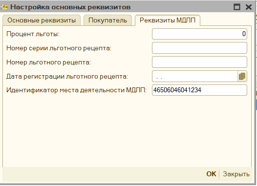
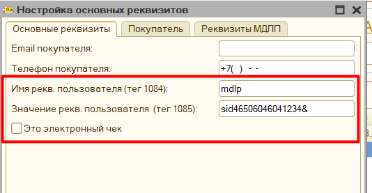
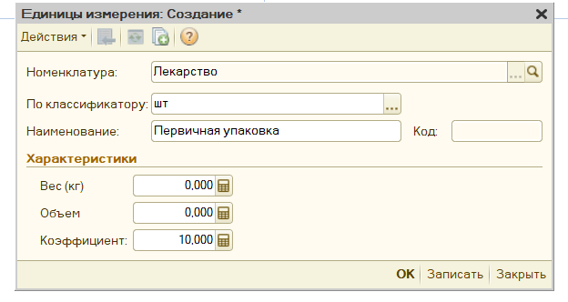
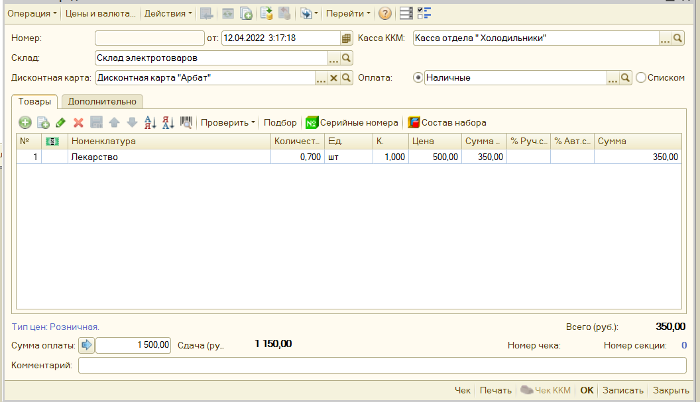
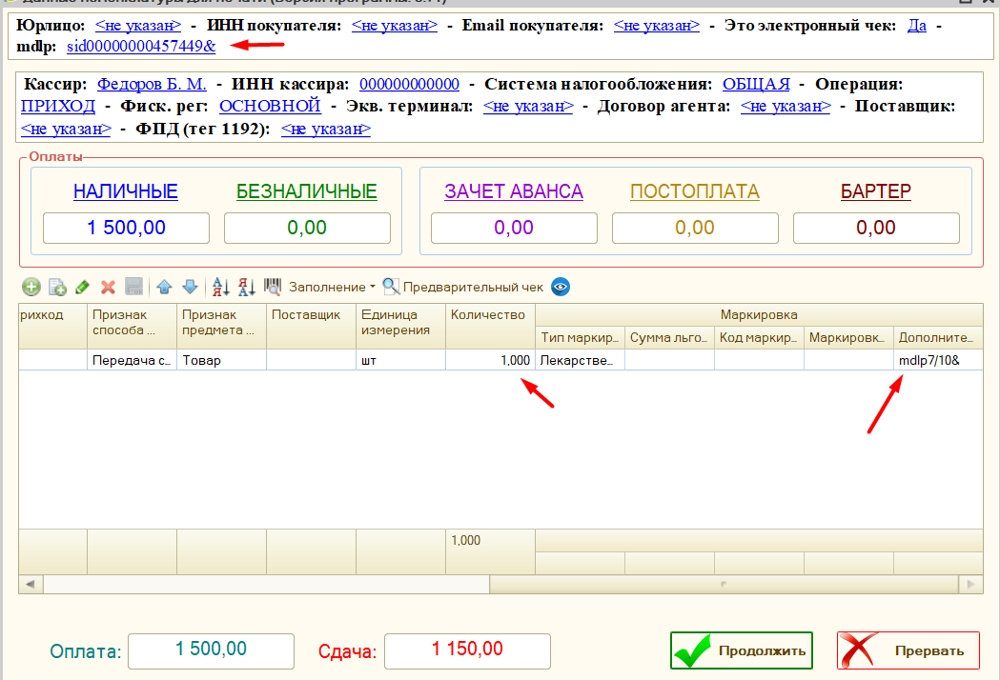
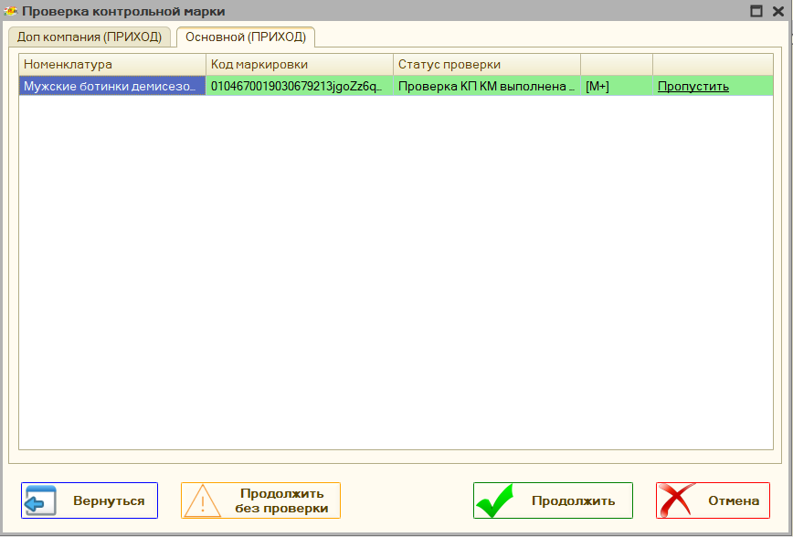
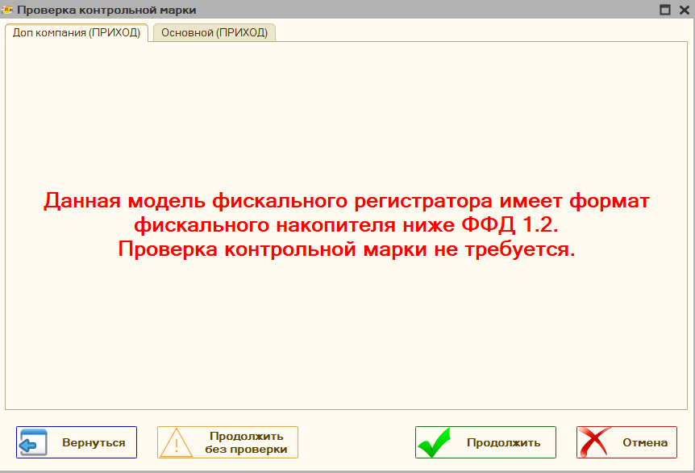
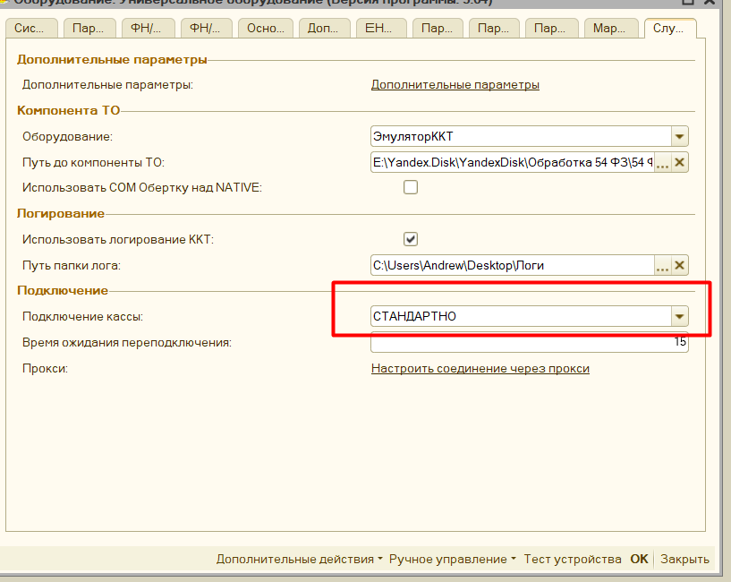
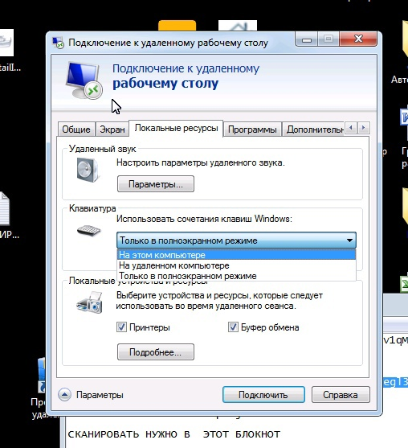

# Маркировка #

[в начало](README.md#навигация)

Использование маркировки настраивается в параметрах программы раздел ["Маркировка"](parameters_description.md#маркировка)

## Требования к поддержке маркировки ##

- проверить поддерживает ли ваша модель оборудования в принципе работы с маркировкой
- должны быть установлены актуальные драйвера для оборудования
- обновлена прошивка фискального регистратора
- возможно потребуется дополнительно активировать специальные лицензии на оборудовании для поддержки маркировки (в частности такое есть у АТОЛ)
- обновлена текущая обработка для работы с фискальными регистраторами
- обновлены [компоненты](connecting.md#компоненты-оборудования) для работы с оборудованием
  
[Видео-описание](https://youtu.be/LAiJ1Bf3z3U?t=317)

## Настройка типов маркировки ##

Чтобы указать программе, какой товар является маркированным, необходимо указать это условие в параметре **"Типы маркировок"**. Как задается такое условие описано в разделе инструкции [Механизм распределения](mechanism_distribution.md). Таким образом можно указать, что пробиваемый товар является обувью, табаком, лекарствами или другими группами маркированного товара.
> **Обратите внимание**, если хотите, чтобы для определенной группы товаров программа не проверяла дубли марок по умолчанию, то для нее необходимо установить тип маркировки **"Средства защиты"**. Для данной маркировки проверка на дублирования не осуществляется.

## Продажа лекарств ##

Продажа лекарств отличается небольшими тонкостями при настройке. Вначале в программе необходим включить параметр **"Использовать маркировку лекарств"**, и заполнить **"Идентификатор места деятельности МДЛП"**. Идентификатор будет передавать в составе тегов 1085 и 1086. После этого указать [тип маркировки](#настройка-типов-маркировки) **"Лекарственные препараты"**.

Программа поддерживает работу с льготными рецептами, информацию об использовании льготы заполняется из документа основания, если есть соответствующие реквизиты, либо эту информацию можно указать в форме проверки печати в окне "Настройка основных реквизитов чека" - "Реквизиты МДЛП". При изменении информации о льготах в этом окне - будет автоматически пересчитаны дополнительные реквизита пользователя (теги 1085 и 1086)

В крайнем случае теги 1085 и 1086 можно отредактировать вручную, тогда данные заполнения льгот будут проигнорированы.

### Частичная продажа упаковок маркированного товара ###

Программа поддерживает частичную продажу упаковок лекарств, или парфюмерии на розлив. При этом заполняется дополнительный реквизит предмета расчета (тег 1191) с информацией о содержимом неполной упаковки. Для этого в базе необходимо выполнить следующие действия:

1. Заведите номенклатуру-упаковку лекарства, или тару с большой емкостью для парфюмерии.
2. Помимо основной единицы измерения, заведите вторичную и назовите ее "**Первичная упаковка**", в поле коэффициент укажите сколько штук или миллилитров товара находится в упаковке.
   
3. При продаже товара-упаковки для частичной продажи, указывайте дробное количество в чеке, тогда при заполнении формы продажи будет проверяться коэффициент единицы измерения "Первичная упаковка", и если он отличается от единицы, то программа будет считать, что продается упаковка.
   

> **Пример**, мы продаем неполную коробку 7 из 10 лекарств, при этом "первичная упаковка" имеет коэффициент - 10, значит в изначальном чеке у нас будет количество 0.7 товара, а в форме проверки печати, это количество автоматически станет равно 1 (так как по закону маркированный товар может передаваться только с количеством 1, и данные о частичной продаже у нас будут отражены только в теге 1191), также в поле "количество единиц в упаковке" будет указано 10, а тег 1191 заполнится как "mdlp7/10&"

> **ФФД 1.2**: при переходе на форма работы с драйверами торгового оборудования ревизия **3004**, и если фискальный накопитель переключен на ФФД 1.2, то данные о дробном количества будут переданы в составе тега 1291

## Отражение продаж индивидуальных средства защиты ##

Согласно постановлению правительства от 16 апреля 2020 г. N 521, при продаже средств индивидуальной защиты, необходимо заполнять и передавать «код товара». Код товара из себя представляет предопределенный штрихкоды для определенной группы товара, общий перечень штрихкодов можно посмотреть по [ссылке](https://www.garant.ru/hotlaw/federal/1362146/). Таким образом для отражения данных товаров необходимо:

1. В параметрах обработки настроить тип маркировки «**Средства индивидуальной защиты**» для нужной номенклатуры или группы товара.

   

1. Убедиться, что у вас в поле Ревизия интерфейса стоит 3002, 3004 или выше.

    

    Это связано с тем, что компоненты с данной ревизией поддерживают передачу маркировки в формате base64.

1. Передайте значение маркировки в чек. Возможно несколько вариантов.Маркировка находится сразу в документе, для этого должно быть заполнено поле «Штрихкод», или «КодМаркировки», если такие поля в вашем документе предусмотрены. Возможно заполнить маркировки через дополнительный обработчик, для этого необходимо заполнить поле «КодМаркировки», или «Штрихкод», в процедуре «ПослеФормированияТаблицыЧека», после этого данная маркировка будет автоматически распознана.

Помимо этого, в типовых конфигурациях 1С добавлена заполнение данных штрихкодов по умолчанию, например в конфигурации Управление Торговлей 10.3

Штрихкоды средств защиты можно вносить интерактивно, для этого их необходимо сохранить, а затем при продаже отсканировать

## Как продавать маркированный товар через обработку ##

Если все настройки по использованию маркировки выполнены, и в чеке присутствует маркированный товар, то при открытии ["Формы проверки печати"](form_check_and_check_correction.md) будет автоматически заполнено поле *"тип маркировки"*, помимо этого программа попытается [найти](#откуда-программа-берет-данные-для-маркировки) заполненную марку в документе основания, если она была там указана. Если же её - нет, либо 1С не поддерживает работу с маркировкой. то марку можно заполнить и вручную в окне данной формы.

Форма проверки печати поддерживает работу со сканером штрихкодов, если сканер подключен через COM-подключение, то необходимо встать на строку с товаром и отсканировать марку, данные, если они корректны,автоматически попадут в поля *Base64 Маркировка* и *код марки*.
Если сканер штрихкодов подключен как клавиатура, то перед сканированием необходимо нажать кнопку **"F7"** или на значок штрихкода в окне программы, и уже в открывшееся поле отсканировать марку.
Если форма проверки печати отключена, то если в чеке присутствует маркированный товар - откроется специальная форма для указания только данных маркировки, в остальном же способ сканирования такой же.

> **Важно**, маркировку можно указать только при фактической продаже товара, на это указывают признак способа расчета позиции - **"Передача"** (без оплаты, с частичной или полной оплатой), если в чеке стоит **"Аванс"**, **"Предоплата"**, либо **"Оплата кредита"**, то предполагается, что передается не товар, а деньги, тогда в позициях товара будет фигурировать "Платеж", а не маркированный товар. Для таких позиций марка не заполняется.

## Как настроить частичную продажу упаковок ##

Из-за урезанности функционала типовых конфигураций, в основном, нет поддержки частичной продажи марвкированного твоара

## Поддержка ФФД 1.2 ##

Для поддержки формата фискальных данных 1.2 добавлен интерфейс проверки маркировки. Перед пробитием чека, если включен параметр *Проверять корректность маркировки перед пробитием чека*, И в чеке на момент пробития есть маркированный товар с заполненным кодом марки, то откроется специальное окно, где можно запустить процедуру проверки маркировки средствами ККТ.

, Дополнительно программа проверяет соответствует ли компонента и версия ФФД оборудования нужному формату, и если нет, то выводит соответствующее сообщение.

В данном можно пропустить проверку целиком, выбрать какие марки не нужно проверять, нажав на поле в таблице **Пропустить**. Также поддерживается возможность приостановить проверку, если возникла какая-то проблема.

### Контрольная марка не проверена - и что с этим делать? ###

Наиболее частая ошибка, что теперь видят при продаже маркированного товара после перехода на ФФД 1.2. Чтобы ее избежать необходимо:

1. Проверить вашу прошивку, и поддерживает ли она маркировку вообще и переключен ли фискальный регистратора на ФФД 1.2
2. Проверить актуальные ли у вас драйвера, для АТОЛ последние рабочие 10.9.0.9,  можно скачать по [ссылке](http://fs.atol.ru/_layouts/15/atol.templates/Handlers/FileHandler.ashx?guid=e8f4e641-84f3-4548-b522-3b8d0c88d84a&webUrl=) из центра загрузки АТОЛ , для ШтрихМ [тут](https://exam.shtrih-m-partners.ru/base/), для вики принт [тут](https://help.dreamkas.ru/hc/ru/articles/115001745425)
3. Затем полностью удалить старые компоненты обработки, и распаковать [новые](https://yadi.sk/d/jcdpGNZ43WQtro)
4. Включить в параметрах обработки параметр "Проверять марку перед пробитием чека"
5. Проверить, чтобы в параметрах программы стояло "Подключение кассы" - "Стандартно" 
6. И осталось только перезапустить 1С для обновления параметров 1С

### Откуда программа берет данные для маркировки ###

Для автоматического заполнения таблицы с маркировкой программа проверяет есть ли у указанного документа табличная часть "КодыМаркировки", таблица должна содержать 2 поля "КлючСтроки" - "идентификатор" по которому программа сможет найти между маркировкой и строками товара, и поле "КодМаркировки" - содержащее непосредственно маркировку, так сделано например в конфигурации "Рарус: Альфа-Авто". Либо может быть таблица "ШтрихкодыУпаковок", которая имеет поле "ШтрихкодУпаковки", по которому обработка и будет искать соответствие, примером является конфигурация "Управление торговлей 10.3"
> **Важно**, маркировка будет заполняться и передаваться только, если заполнен в соответствии "**тип маркировки**", и указан "**Признак способа расчета**" - "Передача с частичной оплатой", либо "Передача с полной оплатой", либо "Передача без оплаты".

## Возможные ошибки сканирования ##

При полностью настроенном механизме работы с маркировкой могут встречаться ошибки считывания марки сканером-штрихкодов. Например, при RDP подключении сканер штрихкодов может считывать марку только в нижнем, или только верхнем регистре букв. Для устранения проблемы, нужно перенастроить параметры RDP подключения и в поле «Использовать сочетания клавиш Windows» установить «На этом компьютере»".

> Есть особенность при работе сканером, который подключен *как клавиатура*, в частности, если включена русская раскладка клавиатуры, то символы маркировки будут считаны как русские, и чтобы такого не было, обычно советуют переключит раскладку в английский вариант перед сканированием, однако в данной программе данная проблема дополнительно обрабатывается: если программа видит, что переданы русские символы, то автоматически их преобразует к английскому варианту раскладки клавиатуры, при этом на экран будет выведено соответствующая информация о преобразовании.
