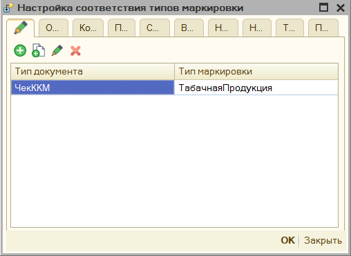
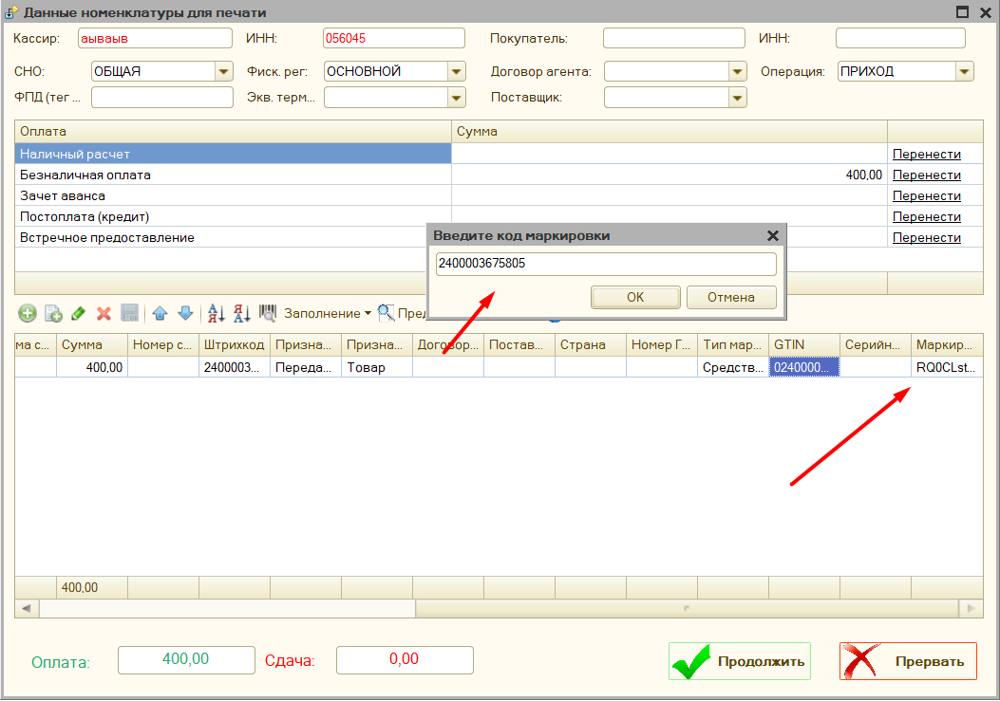

# Маркировка #

[в начало](README.md#навигация)

Использование маркировки настраивается в параметрах программы раздел ["Маркировка"](parameters_description.md#маркировка)

## Настройка типов маркировки ##

Чтобы задать в обработке условие заполнения **«Типа маркировки»** см. [Механизм распределения](mechanism_distribution.md). Это позволит прописать, те позиции чека, которые должны передаваться как акцизный товар. Если вы хотите, чтобы для определенной группы товаров программа не проверяла дубли марок, то поставьте в типах маркировки "Средства защиты", их обработка не проверяет.

## Требования к поддержке маркировки ##

- проверить поддерживает ли ваша модель оборудования в принципе работы с маркировкой
    >в основном маркировку поддерживают модели АТОЛ, ШТРИХ или Вики ПРИНТ
- должны быть установлены актуальные драйвера для оборудования
- обновлена прошивка фискального регистратора
- обновлена текущая обработка для работы с фискальными регистраторами
- обновлены [компоненты](connecting.md#компоненты-оборудования) для работы с оборудованием
  
[Видео-описание](https://youtu.be/LAiJ1Bf3z3U?t=317)

### Откуда программа берет данные для маркировки ###

Для автоматического заполнения таблицы с маркировкой программа проверяет есть ли у указанного документа табличная часть "КодыМаркировки", таблица должна содержать 2 поля "КлючСтроки" - "идентификатор" по которому программа сможет найти между маркировкой и строками товара, и поле "КодМаркировки" - содержащее непосредственно маркировку, так сделано например в конфигурации "Рарус: Альфа-Авто". Либо может быть таблица "ШтрихкодыУпаковок", которая имеет поле "ШтрихкодУпаковки", по которому обработка и будет искать соответствие, примером является конфигурация "Управление торговлей 10.3"
> **Важно**, маркировка будет заполняться и передаваться только, если заполнен в соответствии "**тип маркировки**", и указан "**Признак способа расчета**" - "Передача с частичной оплатой", либо "Передача с полной оплатой", либо "Передача без оплаты".

## Продажа маркировочного товара ##

Если маркировка не заполняется на основании базы 1С, то ее можно вносить интерактивно, для этого предусмотрен ввод через ["Форму проверки печати"](form_check_and_check_correction.md),

либо через специальную форму ввода маркировки

## Отражение продаж индивидуальных средства защиты ##

Согласно постановлению правительства от 16 апреля 2020 г. N 521, при продаже средств индивидуальной защиты, необходимо заполнять и передавать «код товара». Код товара из себя представляет предопределенный штрихкоды для определенной группы товара, общий перечень штрихкодов можно посмотреть по [ссылке](https://www.garant.ru/hotlaw/federal/1362146/). Таким образом для отражения данных товаров необходимо:

1. В параметрах обработки настроить тип маркировки «**Средства индивидуальной защиты**» для нужной номенклатуры или группы товара.

   

1. Убедиться, что у вас в поле Ревизия интерфейса стоит 3002 или выше.

    

    Это связано с тем, что компоненты с данной ревизией поддерживают передачу маркировки в формате base64.

1. Передайте значение маркировки в чек. Возможно несколько вариантов.Маркировка находится сразу в документе, для этого должно быть заполнено поле «Штрихкод», или «КодМаркировки», если такие поля в вашем документе предусмотрены. Возможно заполнить маркировки через дополнительный обработчик, для этого необходимо заполнить поле «КодМаркировки», или «Штрихкод», в процедуре «ПослеФормированияТаблицыЧека», после этого данная маркировка будет автоматически распознана.

Помимо этого, в типовых конфигурациях 1С добавлена заполнение данных штрихкодов по умолчанию, например в конфигурации Управление Торговлей 10.3

Штрихкоды средств защиты можно вносить интерактивно, для этого их необходимо сохранить, а затем при продаже отсканировать

## Поддержка ФФД 1.2 ##

Для поддержки формата фискальных данных 1.2 добавлен интерфейс проверки маркировки. Перед пробитием чека, если включен параметр *Проверять корректность маркировки перед пробитием чека*, И в чеке на момент пробития есть маркированный товар с заполненным кодом марки, то откроется специальное окно, где можно запустить процедуру проверки маркировки средствами ККТ.

, Дополнительно программа проверяет соответствует ли компонента и версия ФФД оборудования нужному формату, и если нет, то выводит соответствующее сообщение.

В данном можно пропустить проверку целиком, выбрать какие марки не нужно проверять, нажав на поле в таблице **Пропустить**. Также поддерживается возможность приостановить проверку, если возникла какая-то проблема.

## Возможные ошибки сканирования ##

При полностью настроенном механизме работы с маркировкой могут встречаться ошибки считывания марки сканером-штрихкодов. Например, при RDP подключении сканер штрихкодов может считывать марку только в нижнем, или только верхнем регистре букв. Для устранения проблемы, нужно перенастроить параметры RDP подключения и в поле «Использовать сочетания клавиш Windows» установить «На этом компьютере»".

