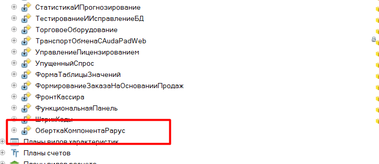

# Подключение Рарус #

[в начало](README.md#навигация)

Для конфигураций Рарус: Альва-Авто 4 и 5-й версии, типовой механизм работы с торговым оборудованием использует компоненту лицензирования, и имеет ряд ограничений и неудобств, например ошибки при работы оборудования через RDP-подключение, или несовместимость компонент для работы с торговым оборудованием с другими конфигурациями, а из-за этого они остаются довольно устаревшими, плюс не поддерживаются многие современные модели оборудования, в частности Вики-принт.

В данной инструкции будет описано как использовать программу ККТ-ОНЛАЙН 54ФЗ: "Обработка для работы фискальных регистраторов", вместе с типовым функционалом.

Вся суть доработки сводится к тому, что мы подменим момент инициализации торгового оборудования на свой механизм, а если будет вызываться не наше оборудование, то будет использован типовой функционал.

Пример подключения представлен в текстовом виде, и видео-инструкцией, однако текстовый вариант будет более актуальным, так как чаще обновляется.

[Видео-инструкция](https://www.youtube.com/watch?v=KY9TM6lczlA) по подключению

Ссылка на [актуальный комплект интеграции](https://yadi.sk/d/AmJnxbkksSN2ag)

> **Важно**: следует понимать, что хоть механизм печати будет такой же как в типовой программе, но чек заполняется по алгоритму именно обработки, которая берет данные из фронт-кассира, либо из указанного документа основания.

## Изменение конфигурации ##

Доработка Альфа-Авто 4-й и 5-й версии немного отличается в инструкции на это будут соответствующая пометка.

- Скачайте [комплект интеграции Рарус](https://yadi.sk/d/AmJnxbkksSN2ag) и откройте файл _Комплект\_доработки_РАРУС\_8\_2\.cf_ в конфигураторе.

- переносим переменную из модуля обычного приложения комплекта интеграции в модуль конфигурации.

  ```bsl
  Перем глРарус_КомпонентаТО Экспорт;
  ```

  в итоге получится так
  

    Данная переменная будет использоваться наравне с типовой ```глРарус_Компонента```, в которой расположена компонента лицензирования

- теперь скопируем 2 общих модуля **ККТ_ФормаДокументаГенерация** и **ККТ_РаботаСТорговымОборудованием**, чтобы получилось так
  
  

- полностью копируем справочник **ПараметрыРарус**, он используется, чтобы эмулировать COM-объект типовых параметров Рарус, в случае, если произойдет ошибка в инициализации компоненты лицензирования и COM-объект не будет доступен.

    

- скорректируем справочник **Оборудование**, чтобы можно было добавлять внешние обработки для работы с ТО:
  - вначале скопируем новые реквизиты справочника.
  
    

  - в форме элемента необходимо заменить переменную ```глРарус_Компонента``` на нашу ```глРарус_КомпонентаТО```, она встречается только одни раз в процедуре ```ОсновныеДействияФормыОборудование``` и будет выглядеть так
      
    - в самом конце процедуры ```ПередОткрытием()``` формы элемента добавить следующий код

        ```bsl
        ККТ_ФормаДокументаГенерация.Справочник_Оборудование_ФормаЭлемента_ПередОткрытием(ЭтаФорма, Отказ);
        ККТ_РаботаСТорговымОборудованием.УстановитьДоступностьЭлементовФормыОборудования(ЭтаФорма, ИспользоватьВнешнююОбработку);
        ```

        чтобы получилось так

        

    - и в самом конце модуля формы элемента, до области инициализации модуля, добавить следующий код:

        ```bsl
        Процедура КнопкаНастроитьПараметрыНажатие(Элемент)
            ККТ_РаботаСТорговымОборудованием.НастроитьПараметрыОборудования(ЭтотОбъект);
        КонецПроцедуры

        Процедура КнопкаОчиститьПараметрыНажатие(Элемент)
            ККТ_РаботаСТорговымОборудованием.ОчиститьПараметрыОборудования(ЭтотОбъект, ЭтаФорма);
        КонецПроцедуры

        Процедура ЗагрузкаОбновлениеОбработкиИзКаталогаНажатие(Элемент)
            ККТ_РаботаСТорговымОборудованием.ЗагрузитьОбработкуОбслуживанияКнопка(ЭтотОбъект);
        КонецПроцедуры

        Процедура ИспользоватьВнешнююОбработкуПриИзменении(Элемент)
            ККТ_РаботаСТорговымОборудованием.УстановитьДоступностьЭлементовФормыОборудования(ЭтаФорма, ИспользоватьВнешнююОбработку);
        КонецПроцедуры
        ```

        будет так

        

  - теперь нужно изменить "форму списка" оборудования, здесь достаточно заменить только глобальную переменную ```глРарус_Компонента``` на ```глРарус_КомпонентаТО``` в процедуре ```ОсновныеДействияФормыДействия```, но если вы там ничего не найдете, то и заменять не нужно.

    

  - также изменим форму "ВводНового", заменим глобальную переменную ```глРарус_Компонента``` на ```глРарус_КомпонентаТО```, тут уже в 3х местах ```кнИзменитьОборудованиеНажатие``` и ```КнопкаДалееНажатие```, но если вы там ничего не найдете, то и заменять не нужно.

    

    
- теперь перейдем к обработке "**ТорговоеОборудование**".
  - откроем модуль объекта и заменим глобальную переменную ```глРарус_Компонента``` на ```глРарус_КомпонентаТО```, для **Альфа-Авто 5-й** версии найдется в 4-х местах ```ПолучитьОписаниеОшибкиКомпоненты``` , ```СоздатьОборудование```, ```УдалитьОборудование``` и в области инициализации модуля, а для **Альфа-Авто 4-й** версии только в области инициализации модуля

    

  - в модуле объекта изменим функцию ```ВыполнитьДействие```. Так как наш функционал не будет использовать COM объект, для передачи параметров, нам необходимо отключить здесь проверку на его передачу, необходимо закомментировать строку ```ИЛИ (ТипЗнч(ОбъектЗадача) <> ТипСОМОбъект)```

    _до_

    ```bsl
    Если (ТипЗнч(GUID_Оборудования) <> Тип("Строка")) ИЛИ (СтрДлина(GUID_Оборудования) <> 38)
        ИЛИ (Лев(GUID_Оборудования,1) <> "{") ИЛИ (Прав(GUID_Оборудования,1) <> "}")
        ИЛИ (ТипЗнч(Действие) <> Тип("Строка")) ИЛИ ПустаяСтрока(Действие)
        ИЛИ НЕ((ТипЗнч(Параметры) = ТипСОМОбъект) ИЛИ (Параметры = НЕОПРЕДЕЛЕНО) ИЛИ ПустаяСтрока(Параметры))
        ИЛИ (ТипЗнч(ТаймАут) <> Тип("Число"))
        ИЛИ (ТипЗнч(ОбъектЗадача) <> ТипСОМОбъект)
    ```

    _после_

    ```bsl
    Если (ТипЗнч(GUID_Оборудования) <> Тип("Строка")) ИЛИ (СтрДлина(GUID_Оборудования) <> 38)
        ИЛИ (Лев(GUID_Оборудования,1) <> "{") ИЛИ (Прав(GUID_Оборудования,1) <> "}")
        ИЛИ (ТипЗнч(Действие) <> Тип("Строка")) ИЛИ ПустаяСтрока(Действие)
        ИЛИ НЕ((ТипЗнч(Параметры) = ТипСОМОбъект) ИЛИ (Параметры = НЕОПРЕДЕЛЕНО) ИЛИ ПустаяСтрока(Параметры))
        ИЛИ (ТипЗнч(ТаймАут) <> Тип("Число"))
        //ИЛИ (ТипЗнч(ОбъектЗадача) <> ТипСОМОбъект)

    ```

  - из комплекта интеграции копируем форму **"ФР_ККТ_54ФЗ_ДрайверФР"**, и добавляем ее к остальным формам обработки **ТорговоеОборудование**

    

- доработаем модуль объекта обработки "ФронтКассира":

  - заменим глобальную переменную ```глРарус_Компонента``` на ```глРарус_КомпонентаТО```, изменения будут только в области инициализации модуля
  
    

  - в функции ```ПробитьЧек``` перед строкой ```Если ВыполнитьКомандуОборудования("ФР",GUID_ФР,"ПробитьЧек"``` добавляем следующий код

    ```bsl
    ККТ_РаботаСТорговымОборудованием.ККТ_ПодготовитьДанныеДляПечати54ФЗ(ЭтотОбъект);
    ```

    данный код, закэширует параметры печати чека, и передаст их в обработку.

    
  - если в вашей конфигурации уже поддерживается работа с чеком коррекции, то во ФронтКассира можно попробовать найти еще функцию ```ПробитьЧекКоррекции``` и доработать ее также, но код нужно вставить перед процедурой ```ВыполнитьКомандуОборудования("ФР",GUID_ФР,"ПробитьЧекКоррекции"```

    

- в модуле объекта обработки "ЗакрытиеСмены" заменим глобальную переменную ```глРарус_Компонента``` на ```глРарус_КомпонентаТО```, изменения будут только в области инициализации модуля

    

- доработаем обработку "СтартСистемы":
  - для **Альфа-Авто 5** изменения нужно вносить в модуль объекта, в процедурах ```ПроверитьОбновитьКомпонентуОборудования``` и ```ИнициализацияФункцийВнешнихКомпонент``` после строки:

    ```bsl
    РезультатИнициализацииОборудования = ОбработкаЗащиты.ЗагрузитьКомпонентуОборудования(КаталогНазначения);
    ```

    добавить следующий код

    ```bsl
    Если РезультатИнициализацииОборудования = "OK" Тогда
        ККТ_РаботаСТорговымОборудованием.ККТ_ИнициализироватьКомпонентуОбертку();
    КонецЕсли;
    ```

    

  - для **Альфа-Авто 4** изменения нужно вносить в модуль основной формы, в процедуре ```ЗагрузитьКомпонентуЗащиты``` после строки:

    ```bsl
    ТекстОшибки = Защита.ЗагрузитьКомпоненту(ПутьДоКомпоненты);
    ```

    добавляется следующий код

    ```bsl
    Если ТекстОшибки="OK" Тогда
        ККТ_РаботаСТорговымОборудованием.ККТ_ИнициализироватьКомпонентуОбертку();
    КонецЕсли;
    ```

- копируем из комплекта интеграции обработку "ОберткаКомпонентаРарус", именно ее объект находится в переменной ```глРарус_КомпонентаТО```

    

на этом доработка будет завершена, и можно переходить на этап добавления и настройки внешнего оборудования

## Подключение оборудования ##

- запустите вашу программу в режиме 1С:Предприятия
- откройте справочник "Оборудование" и нажмите "**добавить**"

    

- В форме добавления нового оборудования, выбираем «**Фискальные регистраторы**» - «**Универсальное оборудование ККТ 54ФЗ**» - **"Создать новое устройство"**,
устанавливаем наименование вашего оборудования (может быть любое), и нажмите **"Готово"**
- откроется форма настройки фискального регистратора, в ней переходим на закладку **"Внешняя обработка"** и устанавливаем флажок **"Использовать внешнюю обработку"**

    

- нажмите **"Настроить параметры"**, и воспользуйтесь [этой инструкцией по настройке](connecting.md) обработки
- сохраните настройки и перезапустите 1С
