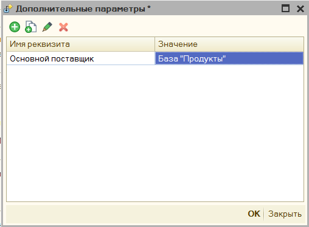
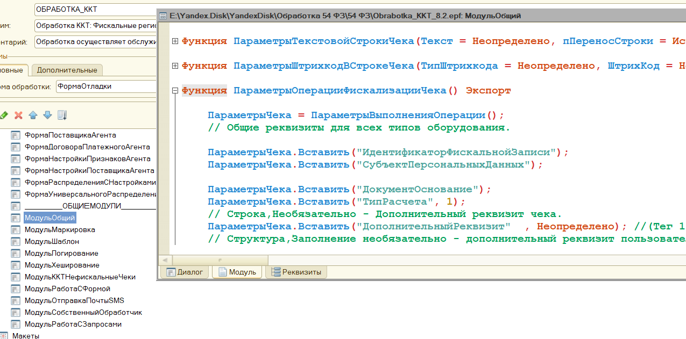

# Для программистов #

## Доработка конфигурации ##

Если ваша конфигурация поддерживает способ подключение "ККТ", то доработка вам не нужна. Для других конфигураций, чтобы явно задать из какого документа происходит печать, и ускорить тем самым данную процедуру, нужно подключить внешнюю печатную форму ["ВПФ_Чек"](Инструкция.md#структура-архива-с-обработкой), которая лежит в архиве с обработкой, либо сделать небольшую доработку.

Пример изменения конфигурации: [Доработка конфигурации](https://www.youtube.com/watch?v=Ehp2DU-YnqM&index=1&list=PLv043XNq9i-6_DdLAy1kTuExX2E-ikn65)

**Описание действий:**

1. Открываете вашу конфигурацию, в меню "Конфигурация "- "Поддержка" - "Настройка поддержки" проверяете включена ли возможность редактирования конфигурации, если нет, то включаете ее.

2. Ищете все упоминания строки ```ПолучитьСерверТО().ОплатитьПлатежнойКартой```. В тех документах, в которых будет найдена данная строка, перед ней добавить такой код:

    ```1C
    СохранитьЗначение("ДокументПечатиККТ", Ссылка);
    ```

3. Ищете все упоминания строки ```ПолучитьСерверТО().ПечатьЧека```. В тех документах, в которых будет найдена данная строка, перед ней добавить такой код:

    ```1C
    СохранитьЗначение("ДокументПечатиККТ", Ссылка);
    ```

4. Для конфигурации Розница 1, возможно нужно еще поискать ```ПолучитьСерверТО().ОткрытьЧек;```. В тех документах, в которых будет найдена данная строка, перед ней добавить такой код:

    ```1C
    СохранитьЗначение("ДокументПечатиККТ", Ссылка);
    ```

5. Объединяете с основной конфигурацией, нажав кнопку F7.

## Дополнительные параметры ##



Данный механизм можно использовать для разработки собственного обработчика, в данном поле указывается произвольный параметр, а в собственном коде его можно вызвать вот так.

```1C
ЗначениеПараметра = ОсновнаяОбработка.ККТ_ЗначениеДополнительногоПараметра("ИмяПараметра");
```

## Изменение функционала "под себя" ##

Функционал программы также можно изменить через подключаемую обработку, находящуюся архиве с основной. Обработка называется [KKT_DEVELOPE82](Инструкция.md#структура-архива-с-обработкой) для 1С версии 8.2 и 8.3 и [KKT_DEVELOPE81](Инструкция.md#структура-архива-с-обработкой) для версии 8.1 соответственно.

Пример таких изменения описан в [видео](https://youtu.be/5t4pye9cRd8) (_немного устарело_)

### Доступные команды KKT_DEVELOPE ###

Внутри доп обрабочтика используется определенный набор экспортных команд и переменных, которые при печати будет вызывать основная обработка, и таким образом можно перехватывать и менять заполнение фискального чека.

В области переменных находится одна экспортная переменная:

```Перем ОсновнаяОбработка``` - в ней хранится объект основной обработки, и таким образом можно вызывать команды и переменные доступные только в основной обработке. Пример, ```ОсновнаяОбработка.мПараметрыУстройства``` - вернет структуру параметров обработки.

Помимо этого в любом месте доп обработчика можно вызвать переменные отвечающие за параметры чека и поменять их.
```ОсновнаяОбработка.мОбщиеПараметры``` - содержит данные основного чека, со всеми заполненными полями для печати, сама структура заполняется после вызова ```ОбработатьЧекПоСвоему``` и перед ```ПослеФормированииТаблицыЧека```. Из чего состоит ```мОбщиеПараметры``` можно посмотреть, если открыть основную обработку в конфигураторе, нам понадобится форма "МодульОбщий" там расположен код инициализации ```ПараметрыОперацииФискализацииЧека()```
    

Помимо параметров из основной обработки можно вызывать и специальные ***формы-модули***, через которое можно выполнять экспортный функции и процедуры, например ранее рассмотренная форма в основной обработке будет вызвана командой ```ОсновнаяОбработка.мМодульККТОбщий.ПараметрыОперацииФискализацииЧека()```, в общей сложности доступны следующие модули:

- ```мМодульККТОбщий``` - форма "МодульОбщий"
- ```мМодульККТШаблон``` - форма "МодульШаблон"
- ```мМодульККТМаркировка``` - форма "МодульМаркировка"
- ```мМодульККТПочтаSMS``` - форма "МодульОтправкаПочтыSMS"
- ```мМодульККТЗапросы``` - форма "МодульРаботаСЗапросами"
- ```мМодульККТСобственнная``` - форма "МодульСобственныйОбработчик"
  
#### Экспортные процедуры ОсновнаяОбработка ####

Доступны следующие экспортные процедуры:

```Процедура ПредварительныйПросмотрЧека(СсылкаНаДокумент)``` - формирует и выводит на экран предварительный чек по переданной ссылки документа. Пример,

```1C
ОсновнаяОбработка.ПредварительныйПросмотрЧека(СсылкаНаДокумент);
```

```Функция ПолучитьКассираСДолжностью(СсылкаНаДокумент = Неопределено)``` - возвращает строку со сформированной должностью и именем кассира. Данные формируются на основании параметров обработки и переданной ссылке на документ (документ указывать необязательно). Пример,

```1C
КассирСДолжностью = ОсновнаяОбработка.ПолучитьКассираСДолжностью();
```

```Функция ККТ_XMLПредставлениеЧека(ДанныеТекущегоЧека, ПараметрыПодключения, ШиринаСтроки = 32)``` - возвращает XML строку, с данными фискального чека, что будут переданы на оборудование при фискализации, xml будет соответствовать [требованиям к передаче данных](https://its.1c.ru/db/metod8dev/content/4829/hdoc). Чек строится по Структуре переданного чека и его параметрам подключения, ширину строку можно не передавать, таким образом ```ДанныеТекущегоЧека```, по умолчанию равны ```ОсновнаяОбработка.мОбщиеПараметры```, а ```ПараметрыПодключения = ОсновнаяОбработка.мПараметрыПодключения```
Пример,

```1C
XMLЧек = ОсновнаяОбработка.ККТ_XMLПредставлениеЧека(ОсновнаяОбработка.мОбщиеПараметры, ОсновнаяОбработка.мПараметрыПодключения);
```
