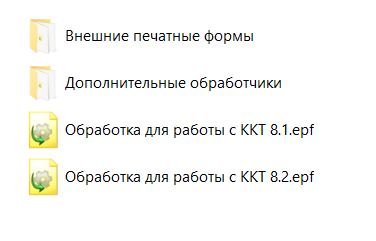
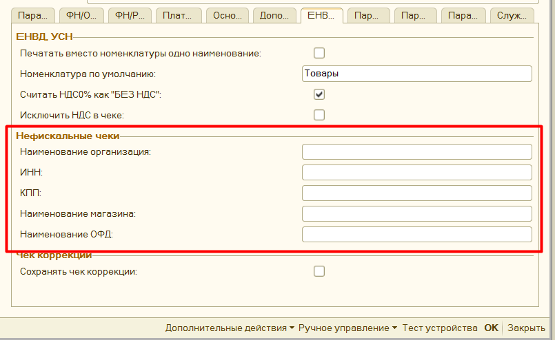
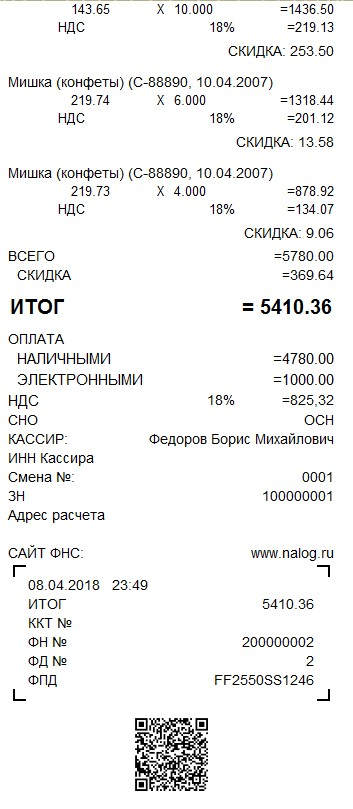
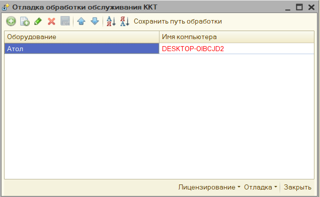

# Дополнительная функциональность #

>**Обратите внимание**, что основной функционал обработки представлен также в видео:

[Первое видео](https://www.youtube.com/watch?v=uVJSKu6wHXE)

[Второе видео](https://www.youtube.com/watch?v=T3Qr9CJBb48)

[Третье видео](https://www.youtube.com/watch?v=ZOXDoqp12sk)

>**Внимание**: **Механизм распределения** будет работать, если обработка сможет определить документ для печати, для этого этот документ должен быть ей передан в явном виде. Если же нет, то при печати будет выведено окно с предложением указать этот документ вручную. Проверьте сделана ли у вас доработка из видео.

## Структура архива с обработкой ##

Архив с обработкой состоит из следующих файлов:

- «**Обработка для работы с ККТ 8.2.epf**» - Основная обработка для платформы 1С 8.2 (также подходит для платформы 8.3, но только для обычных форм)

- «**Обработка для работы с ККТ 8.1.epf**» - Основная обработка для платформы 1С 8.1

- «**Инструкции\\История версий обработки ККТ 54.pdf**» - содержит историю вышедших релизов обработки, в нем можно увидеть, что изменилось в последних версиях.

- «**Инструкции\\Обработка для работы фискальных регистраторов с поддержкой ККТ.pdf**» - содержит полную инструкцию по работе с обработкой.

- «**Дополнительные обработчики\\KKT_DEVELOPE_8_2.epf**» - обработка для платформы 8.2 или 8.3, в которую можно внести свой код и подключить к основной обработке, для изменения функционала печати.

- «**Дополнительные обработчики\\KKT_DEVELOPE_8_1.epf**» - обработка для платформы 8.1, в которую можно внести свой код и подключить к основной обработке, для изменения функционала печати.

- «**Внешние печатные формы\\ВПФ_Чек_8_1.epf**» - обработка для платформы 8.1, является внешней печатной формой, подключается к выбранном документу, через типовой механизм подключения внешних печатных форм. Таким образом можно  добавить функционал печати чеков для тех документов, что его не поддерживают.

- «**Внешние печатные формы\\ВПФ_Чек_8_2.epf**» - для платформы 8.2 или 8.3, является внешней печатной формой, подключается к выбранном документу, через типовой механизм подключения внешних печатных форм. Таким образом можно добавить функционал печати чеков для тех документов, что его не поддерживают.

- «**Внешние печатные формы\\ВПФ_ЧекКоррекции_8_2.epf**» - для платформы 8.2 или 8.3, является внешней печатной формой, подключается к выбранном документу, через типовой механизм подключения внешних печатных форм. Таким образом можно обавить функционал печати чека коррекции для тех документов, что его не поддерживают.

- «**Внешние печатные формы\\ВПФ_ЧекКоррекции_8_1.epf**» - обработка для платформы 8.1, является внешней печатной формой, подключается к выбранном документу, через типовой механизм подключения внешних печатных форм. Таким образом можно обавить функционал печати чека коррекции для тех документов, что его не поддерживают.

## Печать копии чека ##

В параметрах обработки можно настроить возможность печати копии чека на обычный
принтер. Для этого в параметрах обработки нажмите на «Настроить печать копий
чека» - откроется форма настройки.

В поле «Имя принтера» необходимо выбрать принтер из списка, и указать количество
копий, которые нужно напечатать.

По кнопке «Проверить компоненту штрихкодов» - обработка проверяет находится ли в
папке с макетами компонента для печати штрихкодов. **Важно,** без нее в копию
чека не будет выведен QR код фискального чека.

Для настройка выводимого табличного документа, есть кнопка «Настроить табличный
документ», где можно указать как должен выводиться чек.

Копия чека заполняется также, как и фискальный чек, и информацию заполнения
можно менять, меняя шаблон документа. Однако часть информации невозможно
получить из фискального регистратора, поэтому ее нужно указать вручную. Данные
настройки находятся в группе «**Нефискальные чеки**» в параметрах обработки

Если вы хотите, чтобы копия чека выводилась корректно, то данные параметры нужно
заполнить.

Копия чека будет напечатана в следующем виде.

## Редактор произвольного кода ##

Когда в обработке нужно написать код на встроенном языке 1С, открывается
редактор произвольного кода. Данный редактор имеет подсветку синтаксиса 1С,
можно открыть конструктор запросов, вставить ссылку на объект в базе данных,
используются шаблоны кода, используется конструктор форматной строки.

## Подключение через прокси ##

Для подключения к прокси необходимо заполнить:

«Адрес» - он заполняется в формате «http://адрес:порт», либо
«https://адрес:порт», адрес прокси-сервера можно не заполнять, тогда будут
использованы настройки по умолчанию.

«Имя пользователя» и «Пароль» - пользователя, под которым будет происходить
подключение к прокси-серверу.

«Аутентификация операционной системой» - если установлен данный флажок, то
подключение к прокси будет происходить без указания имени пользователя и пароля.

## Форма отладки ##

Для более удобной проверки работы обработки можно использовать «форму отладки»,
для этого откройте обработку через меню «Файл» - «Открыть».

Если конфигурация, в которой была открыта форма отладки не поддерживает работу с
торговым оборудованием, то в этом окне можно самостоятельно добавить подключение
к новому оборудованию.

Кнопка «Сохранить путь обработки» используется при печати через внешнюю печатную
форму, которая идет в комплекте с обработкой. Она сохраняет путь до файла
основной обработки в настройки пользователя, затем при печати через внешнюю
печатную форму проверяется указан ли путь до обработки, и если указан, то
используется именно обработка по этому пути.

Если же работа с фискальными регистраторами поддерживается, то в данном списке
отобразиться уже подключенное оборудование, которой можно перенастроить здесь
же.

Из данной формы можно на основании абсолютно любого документа:

1. Напечатать предварительный чек, который представляет из себя обычную печатную форму
1. Напечатать фискальный чек.

Доступно 2 варианта использование: **Предопределенный документ** – это тот
документ, для которого алгоритм печати заложен в самой обработке, и
**Собственный документ** – для такого документа обработка попробует напечатать
чек на основании универсального алгоритма, однако желательно для такого
реализовать собственный функционал печати через дополнительный обработчик.

Например, в конфигурации **УТ 10.2**, можно печатать полноценные фискальные чеки
без доработки конфигурации.

## Отражение продаж индивидуальных средства защиты ##

Согласно постановлению правительства от 16 апреля 2020 г. N 521, при продаже
средств индивидуальной защиты, необходимо заполнять и передавать «код товара».
Код товара из себя представляет предопределенный штрихкоды для определенной
группы товара, общий перечень штрихкодов можно посмотреть по
[ссылке](https://www.garant.ru/hotlaw/federal/1362146/). Таким образом для
отражения данных товаров необходимо:

1. В параметрах обработки настроить тип маркировки «**Средства индивидуальной защиты**» для нужной номенклатуры или группы товара.

   

2. Убедиться, что у вас в поле Ревизия интерфейса стоит 3002 или выше.

    

    Это связано с тем, что компоненты с данной ревизией поддерживают передачу
    маркировки в формате base64.

3. Передайте значение маркировки в чек. Возможно несколько вариантов.
    Маркировка находится сразу в документе, для этого должно быть заполнено поле
    «Штрихкод», или «КодМаркировки», если такие поля в вашем документе
    предусмотрены. Возможно заполнить маркировки через дополнительный
    обработчик, для этого необходимо заполнить поле «КодМаркировки», или
    «Штрихкод», в процедуре «ПослеФормированияТаблицыЧека», после этого данная
    маркировка будет автоматически распознана.

    Помимо этого, в типовых конфигурациях 1С добавлена заполнение данных
    штрихкодов по умолчанию, например в конфигурации Управление Торговлей 10.3

    

    Также маркировку можно вносить интерактивно, для этого необходимо
    подготовить штрихкоды, значения штрихкодов можно посмотреть из постановления
    правительства и сканировать эти штрихкоды при пробитии чека, обработка
    распознает их и заполняет необходимые поля кодом товара.

    
