**ККТ-ОНЛАЙН 54ФЗ: «Обработка**

**для работы фискальных регистраторов»**

**Версия 3.38**

**Оглавление**

>   [Особенности функционала обработки	3](#_Toc50067153)

>   [Структура архива с обработкой	4](#_Toc50067154)

>   [Подключение	5](#_Toc50067155)

>   [Особенность подключения 8.1	6](#_Toc50067156)

>   [Особенность подключения Linux	6](#_Toc50067157)

>   [Особенность подключения Рарус	6](#_Toc50067158)

>   [Особенность подключения Далион	6](#_Toc50067159)

>   [Особенность подключения УТ 10.2	6](#_Toc50067160)

>   [Лицензирование	7](#_Toc50067161)

>   [Описание параметров обработки	8](#_Toc50067162)

>   [Основные параметры	8](#_Toc50067163)

>   [Дополнительные параметры	10](#_Toc50067164)

>   [ЕНВД, УСН, Нефискальные чеки	11](#_Toc50067165)

>   [Параметры драйвера	12](#_Toc50067166)

>   [Параметры документов	13](#_Toc50067167)

>   [Параметры для ФФД	15](#_Toc50067168)

>   [Маркировка	17](#_Toc50067169)

>   [Служебное	18](#_Toc50067170)

>   [Ручное управление	19](#_Toc50067171)

>   [Форма проверки печати (Рабочее место кассира)	20](#_Toc50067172)

>   [Чек коррекции	25](#_Toc50067173)

>   [Дополнительная функциональность	26](#_Toc50067174)

>   [Механизм распределения	26](#_Toc50067175)

>   [Распределение по системам налогообложения	32](#_Toc50067176)

>   [Распределение по номерам секций	33](#_Toc50067177)

>   [Распределение по договорам Агента	33](#_Toc50067178)

>   [Подключение эквайринговых терминалов	34](#_Toc50067179)

>   [Подключение дополнительного оборудования	35](#_Toc50067180)

>   [Настройка признаков предмета расчета	36](#_Toc50067181)

>   [Настройка признаков способа расчета	37](#_Toc50067182)

>   [Настройка типов маркировки	37](#_Toc50067183)

>   [Настройка поставщика агента	37](#_Toc50067184)

>   [Настройка печати реквизитов ГТД и Страна	38](#_Toc50067185)

>   [Настройка печати получателя и его ИНН	39](#_Toc50067186)

>   [Настройка ограничения времени продажи	39](#_Toc50067187)

>   [Настройка ставки НДС по умолчанию	40](#_Toc50067188)

>   [Задать условие подмены номенклатуры	40](#_Toc50067189)

>   [Дополнительные параметры.	40](#_Toc50067190)

>   [Печать копии чека	41](#_Toc50067191)

>   [Рассылка чеков средствами 1С по Email	43](#_Toc50067192)

>   [Рассылка чеков по SMS	44](#_Toc50067193)

>   [Шаблон документа печати	45](#_Toc50067194)

>   [Редактор произвольного кода	48](#_Toc50067195)

>   [Форма ввода Email и Номера телефона	49](#_Toc50067196)

>   [Подключение через прокси	50](#_Toc50067197)

>   [Форма отладки	50](#_Toc50067198)

>   [Отражение продаж индивидуальных средства защиты	51](#_Toc50067199)

>   [Доработка конфигурации	53](#_Toc50067200)

>   [Полезные ссылки	55](#_Toc50067201)

>   [Возможные ошибки	57](#_Toc50067202)

**Обратите внимание, что основной функционал обработки представлен также в
видео:**

[Первое видео](https://www.youtube.com/watch?v=uVJSKu6wHXE)

[Второе видео](https://www.youtube.com/watch?v=T3Qr9CJBb48)

[Третье видео](https://www.youtube.com/watch?v=ZOXDoqp12sk)

**Внимание**: **Механизм распределения будет работать, если обработка сможет
определить документ для печати, для этого этот документ должен быть ей передан в
явном виде. Если же нет, то при печати будет выведено окно с предложением
указать этот документ вручную. Проверьте сделана ли у вас доработка из видео.**

# Особенности функционала обработки

-   Поддержка нескольких Систем Налогообложения в одном документе 1С, например,
    ОСН, и ЕНВД

-   Поддержка работы использования оборудования с разных рабочих мест.

-   Поддержка 54 ФЗ, форматов обмена: ФФД 1.05 и ФФД 1.1.

-   Поддержка работы с операционными системами Windows и Linux

-   Поддержка работы с отраслевыми конфигурациями 1С: **Рарус: Альфа-Авто,
    Далион;**

-   Поддерживает собственный шаблон чека для вывода рекламной или иной
    информации

-   Позволяет разделить чек на разные фискальный регистраторы, например,
    пробивать алкоголь по другой кассе.

-   Функционал обработки можно изменить под нужды заказчика через дополнительно
    подключаемую библиотеку.

-   Поддержка печати «копии» чека на обычном принтере.

-   Поддержка печати чеков по авансам, и частичной оплате.

-   Позволяет сформировать предварительный нефискальный чек перед печатью

-   Поддержка печати чека коррекции

-   Использует собственную форму «Рабочего места кассира» (Форма проверки
    печати), в которой можно поменять способ оплаты, или данные фискального чека
    вручную.

-   Поддержка печати чеков с детализацией номенклатуры по кассовым документам
    (Приходный кассовый ордер, Расходный кассовый ордер, платежной поручение
    входящее и т.д)

-   Можно подключить Эмулятор для проверки работы ККТ.

-   Поддержка отправки электронного чека средствами 1С на электронную почту или
    по SMS

-   Поддерживает платформы 1С 8.1, 8.2 и 8.3 (Для платформы 8.1 поддерживаются
    NATIVE компоненты оборудования)

-   Можно проверить и скачать обновление прямо из обработки.

# Структура архива с обработкой

Архив с обработкой состоит из следующих файлов:

-   «**Обработка для работы с ККТ 8.2.epf**» - Основная обработка для платформы
    1С 8.2 (также подходит для платформы 8.3, но только для обычных форм)

-   «**Обработка для работы с ККТ 8.1.epf**» - Основная обработка для платформы
    1С 8.1

-   «**Инструкции\\История версий обработки ККТ 54.pdf**» - содержит историю
    вышедших релизов обработки, в нем можно увидеть, что изменилось в последних
    версиях.

-   «**Инструкции\\Обработка для работы фискальных регистраторов с поддержкой
    ККТ.pdf**» - содержит полную инструкцию по работе с обработкой.

-   «**Дополнительные обработчики\\KKT_DEVELOPE_8_2.epf**» - обработка для
    платформы 8.2 или 8.3, в которую можно внести свой код и подключить к
    основной обработке, для изменения функционала печати.

-   «**Дополнительные обработчики\\KKT_DEVELOPE_8_1.epf**» - обработка для
    платформы 8.1, в которую можно внести свой код и подключить к основной
    обработке, для изменения функционала печати.

-   «**Внешние печатные формы\\ВПФ_Чек_8_1.epf**» - обработка для платформы 8.1,
    является внешней печатной формой, подключается к выбранном документу, через
    типовой механизм подключения внешних печатных форм. Таким образом можно
    добавить функционал печати чеков для тех документов, что его не
    поддерживают.

-   «**Внешние печатные формы\\ВПФ_Чек_8_2.epf**» - для платформы 8.2 или 8.3,
    является внешней печатной формой, подключается к выбранном документу, через
    типовой механизм подключения внешних печатных форм. Таким образом можно
    добавить функционал печати чеков для тех документов, что его не
    поддерживают.

-   «**Внешние печатные формы\\ВПФ_ЧекКоррекции_8_2.epf**» - для платформы 8.2
    или 8.3, является внешней печатной формой, подключается к выбранном
    документу, через типовой механизм подключения внешних печатных форм. Таким
    образом можно добавить функционал печати чека коррекции для тех документов,
    что его не поддерживают.

-   «**Внешние печатные формы\\ВПФ_ЧекКоррекции_8_1.epf**» - обработка для
    платформы 8.1, является внешней печатной формой, подключается к выбранном
    документу, через типовой механизм подключения внешних печатных форм. Таким
    образом можно добавить функционал печати чека коррекции для тех документов,
    что его не поддерживают.

# Подключение

1.  Установите драйвера для вашего оборудования, их можно скачать с официального
    сайта производителя.

2.  Добавить обработку в торговое оборудование, обработка подключается как
    «**фискальный регистратор**» или как «**ККТ**», если ваша программа
    поддерживает такой способ подключения

3.  Скачайте из публикации архив «**Макеты компонент**» и распакуйте его в любое
    место.

4.  В 1С откройте параметры обработке, согласитесь с лицензионным соглашением,
    заполните параметры: Оборудование, Версия формата обмена, Система
    налогообложения, Лицензирование.

5.  В поле «**Путь к компонентам ТО**» укажите путь к папке, куда вы распаковали
    архив «**Макеты компонент**». Нажмите «**Активировать**», если в папке есть
    компонента, которая поддерживает работу с вашей программой 1С, то откроются
    окно настройки обработки, иначе программа выдаст ошибку.

Возможно, потребуется отдельная регистрация компоненты драйвера вашего
фискального регистратора как внешнюю библиотеку. Компоненты для работы с
торговым оборудованием находятся в архиве «Макеты компонент», каждый файл в
архиве соответствует оборудованию и формату обмена.

Наименование файлов задано по определенному шаблону:

[**Наименование оборудования**]_[**Тип компоненты**]_[**Тип драйверов**]_[Тип
платформы 1С]_[**Наименование драйвера в реестре**]

Например, в наименовании компоненты ATOLKKT_COM_2001_32_ATOL_KKM_1C82_54FZ .
Наименование оборудования: ATOLKKT, Тип компоненты: COM, Тип драйверов: 2001,
Тип платформы 1С: 32 битная, наименование драйвера в реестре: ATOL_KKM_1C82_54FZ

Вы можете добавить свои компоненты, если сформируете их наименование по данному
шаблону.

**Ссылка на видео**:[Как
подключить
обработку](https://www.youtube.com/watch?v=ITcpWAHEhsE&t=3s&list=PLv043XNq9i-6_DdLAy1kTuExX2E-ikn65&index=2)

## Особенность подключения 8.1

Для корректной работы с компонентами Native на платформе 8.1 необходимо
дополнительно зарегистрировать 2 компоненты. Они находятся в каталоге с другими
компонентами, и называются **WrapperNative.dll** и
**UniversalNativeWrapper.dll**. Зарегистрировать их нужно через командную строку
командой **regsvr32.** Данные компоненты работают как обертка для **Native**
компонент, без их регистрации не будет работать печать QR кодов, и драйвера
оборудования, работающие через **Native**, например, АТОЛ.

**Примечание**: **Native** компоненты – это такие dll, использующие внутренний
формат 1С, что позволяет их не регистрировать как компоненты com

Ссылка на инструкцию, [Как зарегистрировать
компоненту](http://fb.ru/article/290527/kak-zaregistrirovat-dll-tri-sposoba)

## Особенность подключения Linux

Для корректной работы обработки на Linux необходимо скачать вместо «Макеты
компонент для Windows» «макеты компонент для Linux», в остальном же способ
подключения и активации точно такой же.

## Особенность подключения Рарус

Для конфигураций Рарус Альфа-Авто 4 и 5-й версии, для того, чтобы можно было
использовать функционал печати чеков через формы «Фронт кассира» и «Фронт
менеджера» нужно сделать доработку как на видео [Ссылка на
видео](https://www.youtube.com/watch?v=KY9TM6lczlA), и при этом приобрести
**«комплект интеграции Рарус»**

## Особенность подключения Далион

Если вы хотите встроить обработку для работы онлайн кассами так, чтобы можно
было печатать чеки прямо из документов, то нужно приобрести отдельно «**комплект
интеграции Далион**» и подключить его по этой инструкции [Ссылка на
инструкцию](https://www.youtube.com/watch?v=1iRL_sfTyyE)

## Особенность подключения УТ 10.2

Для конфигурации **Управление торговлей 10.2** нет типового способа подключить
обработку для печати прямо из документов, поэтому необходимо приобрести также
«**Комплект интеграции УТ 10.2**» и доработать конфигурацию по этой видео
инструкции [Ссылка на видео](https://www.youtube.com/watch?v=P2aMi6Kd7Tc).

**Обратите внимание,** хоть перечисленные конфигурации и требуют комплект
интеграции, использовать обработку можно и без них. Для этого откройте обработку
через «Файл» - «Открыть». Откроется окно «**формы отладки**», в ней можно
добавить новое подключение к оборудованию, и печатать чеки по кнопке «Напечатать
фискальный чек» - «Предопределенный»  

# Лицензирование

Обработка использует 3 режима: «**Демо**», «**Лицензия**» и «**Лицензия на ферму
RDP-серверов**»

«**Демо**» - позволяет использовать полный функционал обработки, отличается от
«Лицензия» и «Лицензия на ферму RDP-серверов» тем, что при печати присутствует
задержка с информационным окном о том, что используется демоверсия, а также есть
ограничение на количество операций для одного пользователя.

«**Лицензия**» - полноценная работа с обработкой без искусственных задержек и
ограничений. Лицензия бессрочная, продлевать ее не нужно.

«**Лицензия на ферму RDP-серверов**» - полноценная лицензия, для частных
случаев, когда работа происходит по RDP, однако при этом используется несколько
компьютеров-серверов, и при переподключении пользователь может подключиться уже
к другому компьютеру, например, такой функционал обычно используется для
сервисов, что предоставляют 1с в аренду.

Для режимов «**Лицензия**» и «**Лицензия на ферму RDP-серверов**», необходимо
приобрести лицензию на программу, и активировать ее по инструкции. Обратите
внимание, 1 ключ может работать только на 1-м рабочем месте, если лицензию нужно
переактивировать, то нужно вначале «Деактивировать» первую лицензию через меню
обработки, а затем заново получить лицензию на другом рабочем месте.

>   Возможные спорные ситуации:

1.  1С находится на сервере, и пользователи подключаются к ней через
    установленную на своем компьютере 1С, необходимо приобрести столько лицензий
    сколько компьютеров использует обработку.

2.  1С находится на сервере, и пользователи подключаются к ней через RemoteAPP,
    тогда необходимо приобрести только 1 лицензию на сервер

3.  1С находится на сервере, и пользователи подключаются к ней через RDP, тогда
    необходимо приобрести только 1 лицензию на сервер

Видеоинструкция по активации лицензии: [Активация
лицензии](https://www.youtube.com/watch?v=_jtZMwiT-jc&list=PLv043XNq9i-6_DdLAy1kTuExX2E-ikn65&index=3)

# Описание параметров обработки

**Важно**: при изменении параметров обработки, необходимо перезапускать 1С, так
как эти параметры сохраняются до перезапуска 1С.

## Основные параметры 

**«Путь к ключу лицензирования»** - путь к лицензии на обработку. Заполняется, в
случае использования способа «**Лицензия**» (см.
«[Лицензирование](#_Лицензирование)**»**). Для использования обработки способом
«**Демо**» заполнение не требуется.

**«Лицензирование»** - определяет способ использования обработки, Возможны
следующие варианты «**Демо**», «**Лицензия**» или «**Ферма RDP-серверов**». См.
[Лицензирование](#_Лицензирование)

**«Путь к файлу технической поддержки»** - путь к файлу технической поддержки.
Файл указывает, какая именно версия обработки доступна. Заполняется, если
компьютер отключен от интернета или имеет нестабильный интернет. См.
[Лицензирование](#_Лицензирование)

**«Система налогообложения»** - данное поле обязательно для заполнения,
отвечает, какая система налогообложения будет передана на печать. Является
**системой налогообложения по умолчанию** при использовании функционала
[«Распределение СНО»](#_Распределение_по_разным).

**«Распределение по секциям»** - позволяет настроить использование разных секций
налогового учета в чеке, в том числе в разрезе складов. **«**[Распределение по
секциям](#_Распределение_по_номерам)**»**

**«Дополнительное оборудование»** - позволяет указать параметры подключения
дополнительных фискальных регистраторов к данной обработке (см. [«Подключение
дополнительного оборудования»).](#РаспределениеПоФР)

**«Шаблон документа»** - позволяет напечатать внутри фискального чека
собственный текст. Для каждого типа документа задается собственный шаблон. Можно
задать шаблон для строки номенклатуры (см. [«Шаблон документа
печати»](#_Шаблон_документа_печати)).

**«Распределение по СНО»** - позволяет задать условия использования разных
систем налогообложения в одном чеке (см. [«Распределение
СНО»](#_Распределение_по_разным)).

**«Настройка открытия формы проверки печати» -** позволяет задать, открывать для
выбранного документа [«Форму проверки печати»](#_Форма_проверки_печати), либо не
открывать. По умолчанию, форма открывается всегда (см. [«Настройка открытия
формы»](#_Настройка_открытия_формы)).

**«Ставка НДС \<По умолчанию\>» -** позволяет задать, какую ставку НДС
использовать при заполнении чека, нужно использовать, если не устраивает
стандартный способ заполнения. Для настройки см. [Механизм
распределения](#МеханизмРаспределения)

**«Путь до собственного обработчика»** - путь до внешней обработки, в которой
реализован дополнительный функционал для печати. Например, можно задать
собственный способ для печати. Сама обработка лежит в архиве с основной, также
записано несколько видео по ее разработке: [ссылки на
видео](https://www.youtube.com/watch?list=PLv043XNq9i-4GdAZ521a7GR_ft1Me9OWP&v=5t4pye9cRd8)

## Дополнительные параметры 

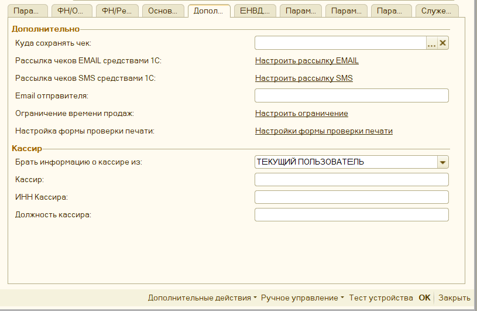

**«Куда сохранять чек»** - путь к папке на компьютере, куда обработка может
сохранять сформированные чеки, либо то, что необходимо отправить на email
клиенту или по смс.

**«Рассылка чеков EMAIL средствами 1С»** - определяет параметры отправки чеков
на EMAIL из 1С через встроенные механизмы (см. «[Рассылка чеков средствами 1С по
Email](#_Рассылка_чеков_средствами)»).

**«Рассылка чеков SMS средствами 1С»** - определяет параметры отправки чеков по
SMS из 1С через встроенные механизмы (см. «[Рассылка чеков средствами 1С по
SMS](#_Рассылка_чеков_по)»).

**«Email отправителя»** - содержит Email вашей организации. Передается в ОФД
вместе с печатью чека. Указывать необязательно.

**«Ограничение времени продажи» -** позволяет настроить временной интервал
продажи товара. Например, ограничение на продажу алкоголя.

**«Настройка формы проверки печати» -** позволяет выборочно настраивать
доступность элементов формы проверки печати (см. «[Настройка формы проверки
печати](#_Настройка_формы_проверки_1)»).

**«Брать информацию о кассире из»** - позволяет определить откуда необходимо
брать информацию о кассире в чеке. Возможные варианты:

>   Реквизит «Ответственный» - если в документе есть поле «Ответственный», либо
>   аналогичные ему, то информация будет взята из документа. Однако при открытии
>   и закрытии смены будет использован текущий пользователь;

>   Текущий пользователь – система попытается определить текущего пользователя
>   информационной базы

>   Указать вручную – данные о кассире будут взяты из параметров обработки.

**«Кассир»** - имя кассира, которое будет отображаться в чеке. Если оно не
заполнено, то будет передано имя текущего пользователя 1С.

**«ИНН Кассира»** - ИНН кассира, которое будет передаваться в ОФД. Если не
заполнен, то обработка попытается определить ИНН кассира самостоятельно:
проверит, есть ли у пользователя или прописанного этому пользователю физлица
реквизит ИНН, либо указана информация в поле комментарий, либо дополнительное
свойство «ИНН».

**«Должность кассира»** - должность кассира, которая будет отображаться в чеке,
является дополнением к параметру **«Кассир по умолчанию»**

## ЕНВД, УСН, Нефискальные чеки 

**«Печатать вместо номенклатуры одно наименование»** - применяется для
организаций, где не нужно учитывать проданный товар. При включении на печать
выводится только одна строка, где количество равно одному, а цена равна сумме
платежа. Текст для печати выбирается в параметрах **«Номенклатура по
умолчанию»**.

>   **«Номенклатура по умолчанию»** - содержит текст, который будет напечатан в
>   чеке, если включен параметр **«Печатать вместо номенклатуры одно
>   наименование»**.

**«Условие подмены номенклатуры»** - позволят настроить условие, когда можно
подменить одну номенклатуру на другую. См. [Задать условие подмены
номенклатуры](#_Задать_условие_подмены)

**«Считать «НДС0%» как «БЕЗ НДС»** - указывает на то, как рассматривать нулевую
ставку НДС при печати чека, по умолчанию данный параметр включен.

**«Наименование организации»** - пока не задействован, используется для печати
нефискальных чеков. Данные не передается в ОФД.

**«ИНН»** - пока не задействован, используется для печати нефискальных чеков.
Данные не передается в ОФД.

**«КПП»** - пока не задействован, используется для печати нефискальных чеков.
Данные не передается в ОФД.

**«Наименование магазина»** - пока не задействован, используется для печати
нефискальных чеков. Данные не передается в ОФД.

**«Наименование ОФД»** - наименование ОФД, которое будет отображаться в копии
чека.

## Параметры драйвера 

**«Указывать номер или Email клиента»** - влияет на то, будет ли открываться
окно для ввода Email и номера телефона клиента при формировании чека.

**«Автоматически заполнять email по данным контрагента»** - при включенном
параметре, программа будет пытаться определить email контрагента автоматически.

**«Аппарат без фискального накопителя»** - позволяет печатать чеки для тех
фискальных регистраторов, что не имеют фискального накопителя и переключены в
режим печати «ЕНВД».

**«Копии чека»** - позволяет настроить печать копии чека на обычный принтер. См.
[«Печать копии чека»](#_Печать_копии_чека)

**«Передавать чеки в ОФД без печати»** - если передается email или номер
телефона клиента, то чек не будет напечатан, а только будет передан в ОФД.

**«Авт. открывать\\закрывать смену»** - если параметр включен, то при печати
чека обработка проверяет статус смены, если смена превысила 24-часа, то она
автоматически закроет и откроет ее заново. Работает только если обработка
подключена как **«Фискальный регистратор»**

**«Открывать ден. ящик из 1С»** - если у фискального регистратора есть денежный
ящик, то он будет открываться из 1С при печати фискального чека.

**«Пробивать чек при «Открытии чека»** - используется, если обработка подключена
как «**Фискальный регистратор**», позволяет пробивать чека, не при операции
«Закрытии чека», а при «Открытии чека», проблема связана с тем, что на более
современных конфигурациях, убрали отмену чека при ошибке во время закрытия чека,
поэтому если у вас проводятся чеки, даже если закончилась бумага на Фискальном
регистраторе, то вам нужно включить данный параметр.

**«Эквайринговые терминалы»** - позволяет указать параметры подключения
эквайринговых терминалов к данной обработке (см. [Подключение эквайринговых
терминалов](#_Подключение_эквайринговых_терминало))

**«Не открывать окно эквайрингового терминала при печати» -** данный параметр
отключает открытие окна с суммой, что будет пробита на эквайринговом терминале,
также в этом окне можно указать ссылочный номер пробитого чека на эквайринге,
необходим при возвратах.

**«Задержка перед печатью слип-чека, сек» -** позволяет увеличивать задержку
перед печатью слип-чека на эквайринге, что полезно, если на фискальном
регистраторе нет автоматической отрезки. Работает, если печать происходит через
фискальный регистратор. Максимальное время задержки 40 секунд.

## Параметры документов 

**«Ограничить количество фискальных строк»** - исправление ошибки оборудования
«Переполнение буфера», связанной с нехваткой оперативной памяти аппарата. При
заданном ограничении чек будет разбит на несколько маленьких. **Важно**: при
таком варианте будет несколько фискальных чеков. Не используется, если значение
0.

**«Ограничить длину номенклатуры»** - исправление ошибки оборудования, связанной
со слишком большой длиной фискальной строки. При заданном ограничении текст
фискальной строки будет обрезан до заданной длины. Не используется, если
значение 0.

**«Заменить ставку НДС 18% на 20%»** - заменяет переданную ставку НДС 18% на
20%, подходит для старых конфигураций, не поддерживающих новую ставку.

**«Аппарат не воспринимает ставку НДС 20%»** - необходимо включить, если при
печати чека с НДС 20% фискальный регистратор выдает ошибку. Тогда обработка
передаст на оборудование ставку 18%, но с суммой НДС равной НДС 20%.

**«Смещать дату чека коррекции»** - необходимо включить, если при печати чека
коррекции дата основания смещается на день.

**«Подсчитывать номер чека средствами обработки»** - необходимо включить, если
нумерация чеков не начинается с 1 в начале смены, а передается сквозная.

**«Отключить окно выбора документа»** - если обработка не сможет определить
документ перед печатью чека, то появится окно с выбором документа вручную,
данная настройка позволяет его отключить, однако все равно нужно переопределить
функционал печати через доп обработчик.

**«Предварительно проверять пробитие чека»** - перед пробитием чека обработка
дополнительно проверяет пробит ли чек ранее по этому документу, такой параметр
стал актуален на новых конфигурациях на обычных формах, в них убрали данную
проверку.

**«Печатать «ОСНОВАНИЕ» в ПКО и РКО»** - позволяет вначале документа напечатать
текстовую строку «Основания». Например, **«Контрагент такой-то Основание
документа такое-то».** Строка основания будет напечатана, если в тексте нет
фискальных строк с тем же самым текстом.

**«Источником ставки НДС в чеке будет»** - данный параметр определяет какая
ставка НДС будет проставляться в кассовые документы: по документу основания,
либо по текущему документу. Возможны варианты: «Кассовый документ» или «Документ
основания»

**«Игнорировать данные Фронт-кассира»** - используется для конфигураций Рарус,
если включен, то при печати через форму «фронт кассира» или «фронт менеджера»,
несмотря на указанные в ней товары, данные для печати будут взяты прямо из
документа основания, однако суммы оплаты будут все равно взяты и фронт кассира.

## Параметры для ФФД 

**«Распределение, когда оплата частичная»** - данная настройка определяет, как
обойтись с разницей между суммой платежа и суммой документа. Можно задать
несколько условий:

-   «РАСПРЕДЕЛЯТЬ СТРОКИ» - при печати автоматически «строка распределения»
    уменьшит количество в чеке, так чтобы оно подходило под данную сумму,
    возможны дробные значения для штучного товара;

-   «ЗАМЕНИТЬ НА АВАНС» - заменяет все фискальные строки на текст «Оплата по
    документу основание» и признак способа расчета «Аванс» и признак предмета
    расчета «Платеж»

-   «ЗАМЕНИТЬ НА ЧАСТИЧНУЮ ОПЛАТУ» - заменяет все фискальные строки на текст
    «Оплата по документу «Основание», признак способа расчета «Предоплата
    частичная» и признак предмета расчета «Платеж»

-   «ЗАМЕНИТЬ НА "НОМЕНКЛАТУРА ПО УМОЛЧАНИЮ"» - заменяет все фискальные строки
    на текст из реквизита «Номенклатура по умолчанию», Признак предмета расчета
    «Передача с полной оплатой» и признак предмета расчета «Товар»

-   «СТАНДАРТНО» - оставляет стандартный вариант распределения, когда при
    частичной оплате передается весь чек, однако в поле оплаты появляется
    дополнительный вид оплаты «Постоплата» или «Зачет аванса» с разницей между
    фактической оплатой и общей суммой документа.

**«Признак Агента»** - позволяет настроить условие, когда и какой признак
агента, и данные по агентскому договору необходимо заполнять в чеке. См.
[«Распределение по договорам Агента»](#_Распределение_по_договорам)

**«Поставщик агента»** - позволяет указать данные поставщика агента, которые
будут выводиться в чеке. См. «[Настройка поставщика
агента](#_Настройка_поставщика_агента)»

**«Признаки предмета расчета»** - позволяет настроить условие, когда и какой
признак предмета расчета необходимо заполнять в чеке. См. [«Настройка признаков
предмета расчета»](#_Настройка_признаков_предмета)

**«Признаки способов расчета»** - позволяет настроить условие, когда и какой
признак способов расчета необходимо заполнять в чеке. См. [«Настройка признаков
способа расчета»](#_Настройка_признаков_способа)

**«Адрес Магазина»** - для формата обмена ФФД 1.05 и ФФД 1.1, содержит Адрес
магазина, который будет передан в ОФД, также может быть использован для печати
нефискальных чеков.

**«Место расчетов»** - для формата обмена ФФД 1.05 и ФФД 1.1, содержит место
расчетов, которое будет передано в ОФД.

**«Номер ГТД и Страна»** - позволяет задать условие передавать информацию о
Номере таможенной декларации и коде страны происхождения товара. См. [«Настройка
печати реквизитов ГТД и Страны»](#_Настройка_печати_реквизитов)

**«Данные о получателе»** - позволяет задать условие передавать информацию о
покупателе или нет в чек. См. [«Настройка печати получателя и его
ИНН»](#_Настройка_печати_получателя)

## Маркировка 

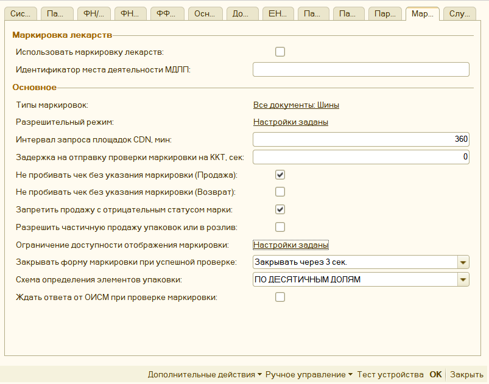

**«Использовать маркировку лекарств»** - специальная настройка для использования
продажи лекарств. При ее включении становится доступно использование льгот и
рецептов при продаже лекарств, дробная продажа упаковки лекарств, а также при
этом будут автоматически заполняться теги 1084, 1085, 1191.

**«Идентификатор места деятельности МДЛП»** - идентификатор места продажи,
передается в составе тега 1085, является обязательном при продажи лекарств.

**«Типы маркировок»** - позволяет настроить условие, когда и какой тип
маркировки необходимо заполнять в чеке. Используется для маркировочной
продукции: Табак, алкоголь, лекарства и т.д. См. [Настройка типа
маркировки](#_Настройка_типов_маркировки)

**«Не пробивать чек без указания маркировки «ПРОДАЖА»»** - если в чеке
используется продукция с маркировкой, то чек на Приход не будет пробит, если
какая-то позиция не будет заполнена.

**«Не пробивать чек без указания маркировки «ВОЗВРАТ»»** - если в чеке
используется продукция с маркировкой, то чек на Возврат не будет пробит.

  

##  Служебное 

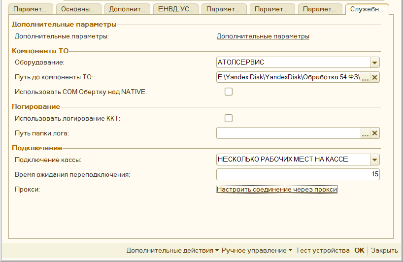

**«Дополнительные параметры»** - позволяет указать собственные параметры,
которые можно использовать в коде доп обработчика. См. [«Дополнительные
параметры»](#_Дополнительные_параметры.)

**«Оборудование»** - указывает на то, какую компоненту для работы с
оборудованием будет использовать обработка.

**«Путь до компоненты ТО»** - путь к папке на компьютере, где находятся
компоненты для работы с торговым оборудованием. Должен быть всегда заполнен.

**«Использовать COM Обертку над NATIVE»** - данный параметр влияет на то, нужно
ли использовать специальную компоненту для работы с компонентами Native, это
нужно, если у вас платформы 8.1, либо у вас возникли сложности при стандартном
подключении. Компонента называется Universal Native Wrapper и лежит с остальными
компонентами.

**«Использовать логирование ККТ»** - указывает нужно ли вести подробную запись
действий с фискальным регистратором. Нужен для отладки и проверки механизма
печати. Работает, если заполнен параметр «**Путь папки лога**».

**«Путь папки лога»** - путь до папки на компьютере, где будет храниться лог
действий пользователя. Лог сохраняется в файл Log54FZ.txt, с указанием текущего
дня. Работает, если включен параметр «**Использовать логирование ККТ**».

**«Подключение кассы» -** параметр может принимать два состояния:

-   "СТАНДАРТНО" – при такой настройке оборудование всегда будет находиться в
    состоянии подключено, при разрывах соединения с кассой могут быть ошибки,
    этот параметр значительно увеличивает скорость печати.

-   "НЕСКОЛЬКО РАБОЧИХ МЕСТ НА КАССЕ" - используется, если на фискальный
    регистратор одновременно могут печатать несколько компьютеров, что-то вроде
    очереди печати;

«**Время ожидания переподключения**» - используется, когда параметр
**«Подключение кассы»** установлен как **"НЕСКОЛЬКО РАБОЧИХ МЕСТ НА КАССЕ",**
обозначает время, при котором обработка будет ждать подключения, если при печати
касса оказалась занята на другом рабочем месте.

**«Прокси» -** позволяет настроить отправку http запросов обработки через
прокси-сервер, например это необходимо для передачи данных на сервер sms
рассылки, или для работы сервера лицензирования. См. [настройка подключения
прокси](#_Подключение_через_прокси)

## Ручное управление 

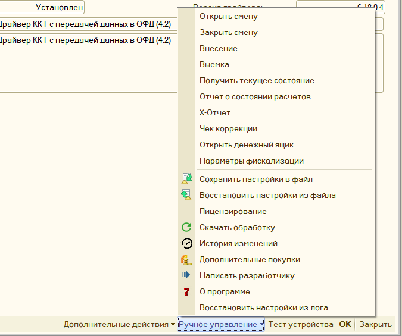

**«Открыть смену»** - открывает смену на данном фискальном регистраторе.

**«Закрыть смену»** - закрывает смену на данном фискальном регистраторе.
Отличается от типовой процедуры тем, что не формирует документ отчет о продажах.

**«Внесение»** - позволяет внести денежные средства в кассу.

**«Выемка» -** позволяет сделать выемку денежных средств из кассы.

**«Получить текущее состояние»** - отображает информацию о фискальном
регистраторе: Номер смены, Номер текущего документа, Статус смены, Количество
непереданных фискальных документов, Номер первого непереданного фискальных
документов, Дата первого непереданного фискального документа.

**«Отчет о состоянии расчетов»** - формирует фискальный документ «Отчет о
состоянии расчетов».

«**X-Отчет»** - формирует отчет без гашения (x-отчет) на фискальном
регистраторе.

**«Чек коррекции»** - открывает форму для формирования чека коррекции, данную
кнопку нужно использовать, если ваша конфигурация не содержит документ «Чек
коррекции»

**«Открыть денежный ящик»** - открывает денежный ящик на данном фискальном
регистраторе.

**«Параметры фискализации»** - открывает форму с регистрационными данными вашего
фискального регистратора. Например, можно узнать какой формат обмена с налоговой
данный поддерживает аппарат.

**«Сохранить настройки в файл»** - позволяет сохранить параметры обработки в
файл для последующего восстановления. Можно переносить настройки с одного
рабочего места на другое.

**«Восстановить настройки из файла»** - позволяет восстановить ранее сохраненные
параметры обработки.

**«Лицензирование»** - открывает форму лицензирования, где можно активировать
или деактивировать лицензию на обработку.

**«Скачать обработку»** - открывает окно, где можно скачать последнюю доступную
версию программы.

**«Дополнительные покупки»** - открывает окно, где можно приобрести
дополнительные лицензии, или продлить тех поддержку.

**«Написать разработчику»** - открывает форму, где можно отправить письмо
разработчику (не используя почтовую рассылку), сообщить об ошибке, либо
высказать пожелания о доработке.

# Форма проверки печати (Рабочее место кассира)

Форма проверки печати открывается автоматически, при печати любого документа.
Она используется для проверки содержимого фискального чека, а также при
необходимости его редактирования. Открытие данной формы можно отключить, для
этого в параметрах обработки есть соответствующий параметр. См. **«**[Настройка
открытия формы](#_Настройка_открытия_формы)**»**

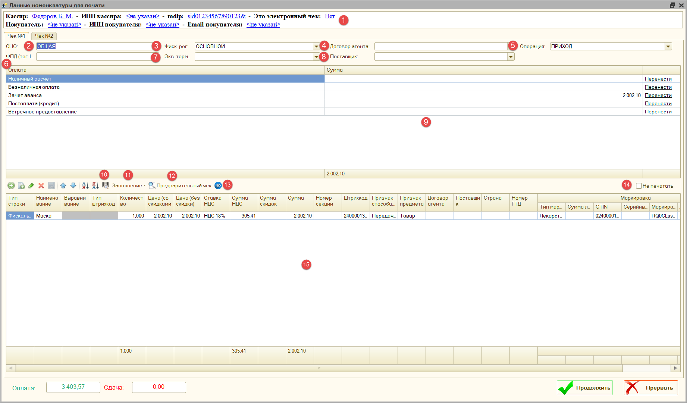

1.  **Основные реквизиты чека** – позволяет настроить основные реквизиты чека:

    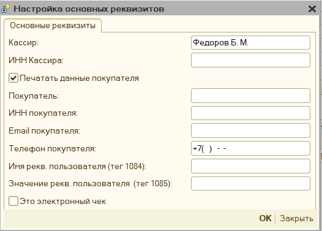

    К основным реквизитам чека относятся: Кассир, Инн кассира, Покупатель, ИНН
    Покупателя, Email покупателя, телефон покупателя, Имя реквизита пользователя
    (тег 1084), Значение реквизита пользователя (тег 1085), электронный чек.

>   «**Реквизиты МДЛП**» - заполнить эти реквизиты можно при включении параметра
>   «**Использовать маркировку лекарств**», в этом окне можно указать Процент
>   льготы, Номер серии льготного рецепта, Номер льготного рецепта, Дата
>   регистрации льготного рецепта, Идентификатор места деятельности МДЛП.

1.  **СНО** – система налогообложения, под которой будет пробит чек.

2.  **Фиск. рег.** – фискальный регистратор, на котором будет пробит чек.

3.  **Договор агента** – имя заранее добавленного в параметры обработки договора
    агента.

4.  **Операция** – операция фискального чека: приход, возврат прихода, расход
    или возврат расхода.

5.  **ФПД (тег 1192)** – фискальный признак документа, используется для
    возвратов, когда нужно указать фискальный признак предыдущего документа, это
    тег 1192

6.  **Экв. терминал** – эквайринговый терминал, на котором будет пробита
    безналичная информация.

7.  **Поставщик** – имя заранее добавленного в параметры обработки поставщика,
    работает в паре с договором агента.

8.  **Оплаты** – раздел оплаты, где можно вручную скорректировать суммы оплаты.
    Кнопка «Перенести» может переносить оплаты между фактическими суммами
    («наличные» и «безналичная оплата») и виртуальными («постоплата (кредит)»,
    «зачет аванса», «встречное предоставление»)

9.  «**Ввести код маркировки вручную**» - открывает форму, где можно указать
    штрихкод для маркировочного товара. Доступен вызов по кнопке F7

10. **Заполнение** – меню, где можно запустить команды для редактирования
    позиций чека:

Заполнить «Признак способа расчета» - позволяет указать для всех позиций чека
«Признак способа расчета»

Заполнить «Признак предмета расчета» - позволяет указать для всех позиций чека
«Признак предмета расчета»

Заполнить «Номер секции» - позволяет указать для всех позиций чека Номер секции

Распределить «строку распределения» - если в чеке присутствует строка с
отрицательной суммой с наименованием «Строка распределения», то будет
автоматически разнесена на остальные строки, путем уменьшения количества и суммы
по остальным позициям чека.

Заменить строки на «Аванс» - заменяет все строки чека на одну строку с
наименование «Оплата по Покупатель основание такое-то», признаком способа
расчета «Аванс», признаком предмета расчета «Платеж», и удаляются виртуальные
оплаты: «Зачет аванса» и «Постоплата»

Заменить строки на «Частичная оплата» - заменяет все строки чека на одну строку
с наименование «Оплата по Покупатель основание такое-то», признаком способа
расчета «Предоплата частичная», признаком предмета расчета «Платеж», и удаляются
виртуальные оплаты: «Зачет аванса» и «Постоплата»

Заменить строки на «Номенклатура по умолчанию» - заменяет все строки чека на
одну строку с наименование указанным в параметре обработки «Номенклатура по
умолчанию», признаком способа расчета «Передача с полной оплатой», признаком
предмета расчета «Товар», и удаляются виртуальные оплаты: «Зачет аванса» и
«Постоплата»

Вернуть первоначальную таблицу – отменяет все внесенные изменения и
восстанавливает таблицу с позициями чека.

1.  «**Предварительный чек**» - формирует на основании текущих данных
    предварительный чек и выводит его на экран.

    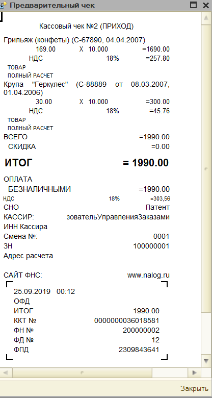

2.  «**Настройка видимости колонок**» – позволяет настроить видимость колонок, в
    таблице позиции чека, например, можно отключить видимость данных о договоре
    агента, если он не используется.

    

3.  «**Не печатать**» - позволяет отключить печать выбранного чека, данный
    флажок доступен, когда при печати получается 2 и более чеков.

4.  «**Позиции чека**» - таблица, которая содержит фискальные строки чека, их
    можно отредактировать вручную

### **Настройка открытия формы проверки печати** 

Для того, чтобы для определенных документов не открывалась «форма проверки
печати», необходимо это указать в параметре «**Настройка открытия формы проверки
печати**» [обработки](#НастройкаОткрытияФорм).

Сюда необходимо добавить имя документа, для которого не нужно открывать формы
проверки печати.

### **Настройка формы проверки печати**

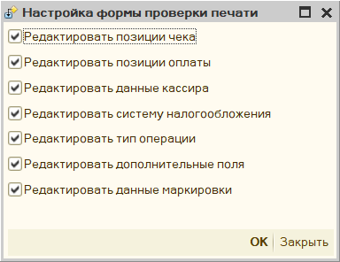

Данная форма позволяет настроить доступность полей «**формы проверки печати**»,
можно открыть через параметры обработки.

-   **Редактировать позиции чека** – включает возможность редактировать позиции
    чека в форме проверки печати. По умолчанию, включено.

-   **Редактировать позиции оплаты** – включает возможность редактировать данные
    об оплате в форме проверки печати. По умолчанию, включено.

-   **Редактировать данные кассира** – включает возможность редактировать имя и
    инн кассира в форме проверки печати. По умолчанию, включено.

-   **Редактировать систему налогообложения** – включает возможность
    редактировать систему налогообложения в форме проверки печати. По умолчанию,
    включено.

-   **Редактировать тип операции** – включает возможность редактировать тип
    операции в форме проверки печати. По умолчанию, включено.

-   **Редактировать дополнительные поля** - включает возможность редактирования
    полей «Фиск. рег», «Экв. терминал», «ФПД», «Поставщик», «Договор агента» в
    форме проверки печати. По умолчанию, включено.

-   **Редактировать данные маркировки** - включает возможность редактирования
    полей «Тип маркировки», «GTIN», «Серийный номер», «Маркировка BASE64». По
    умолчанию, включено.

# Чек коррекции

**Не путайте чек коррекции и чек на возврат. Чек коррекции отбивается, если
нужно исправить ошибку (факт неприменения ККТ), а если нужно оформить возврат
товара, то нужно отбить обычный кассовый чек с указанием признака расчета
«возврат прихода».**

Обработка поддерживает использование чека коррекции. Если ваша конфигурация
содержит в себе такой документ, то печать можно произвести из него. Если же нет,
то печать данного чека можно сделать из параметров обработки – Ручное
управление. См. [Чек коррекции](#ЧекКоррекции)

Также вы можете добавить чек коррекции в ваш документ, подключив к нему внешнюю
печатную форму «ВПФ_ЧекКоррекции», которая находится вместе с основной
обработкой.

Обязательными для заполнения являются поля «Основание коррекции» (можно указать
числовой номер документа), «номер» и «дата коррекции».

**Обратите внимание**, что полноценная работа с чеком коррекции доступна для
более новых компонент оборудования (ревизии 3000 и выше), поэтому для старых
компонент, если Тип коррекции «Неприменение ККТ», будет сформирован чек
коррекции без указания номенклатуры, для типа коррекции «Исправление ошибок» -
будет сформировано 2 чека: обычный чек возврата и уже корректный чек прихода.

**Форма чека коррекции**

Чек коррекции сохраняется в каталог «[Куда сохранять чек](#КудаСохранятьЧек)»

# Дополнительная функциональность

## Механизм распределения

В обработке множество параметров, и для большинства можно задать условие их
применения. Механизм использования этих настроек одинаков для каждого, поэтому
общие моменты будут описаны здесь, далее будут приведены ссылки уже на этот
раздел.

Описание параметров размещено с учетом приоритета их применения: от наименее
приоритетного к наиболее. Если в вашей конфигурации не будет отображаться один
из описанных условий, то у вас просто нет таких метаданных. Далее под словом
«параметр» будет иметься ввиду именно их значение, например «Признак предмета
расчета», или «Признак способа расчета» и т.д.

Применяются следующие условия:

### **Типы документов**

Здесь можно выбрать тип документа, где применять параметр. Например, мы хотим,
чтобы для документа «Корректировка долга», всегда была ставка НДС 20%, здесь это
можно указать. Данное условие применяется перед формированием таблицы чека,
является наименее приоритетным.

**Обратите внимание**, что теперь в настройке можно указать «**Все документы**»
- «_ALL_», в таком случае условие будет накладывать сразу на все чеки, которые
сформирует обработка.

### **Организации**

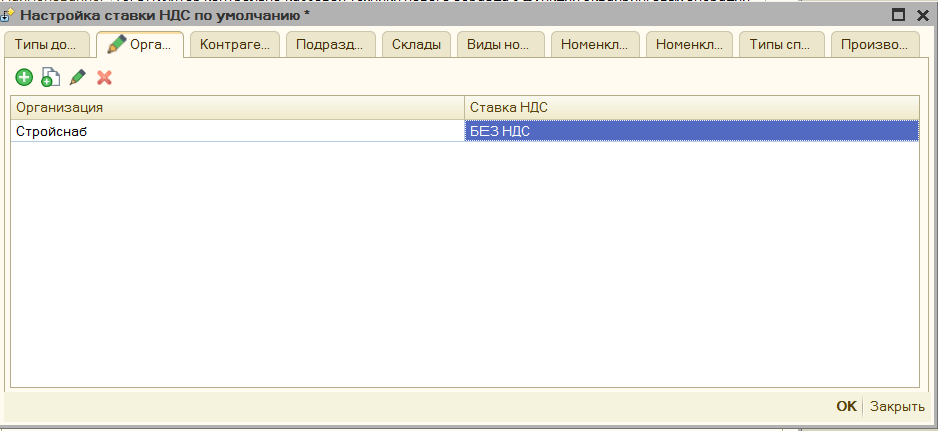

Можно выбрать для какой организации применять параметр. Например, мы хотим,
чтобы для организации «Стройснаб» отсутствовал НДС в чеках. Применяется, если
для документа удается определить организацию.

### **Контрагенты**

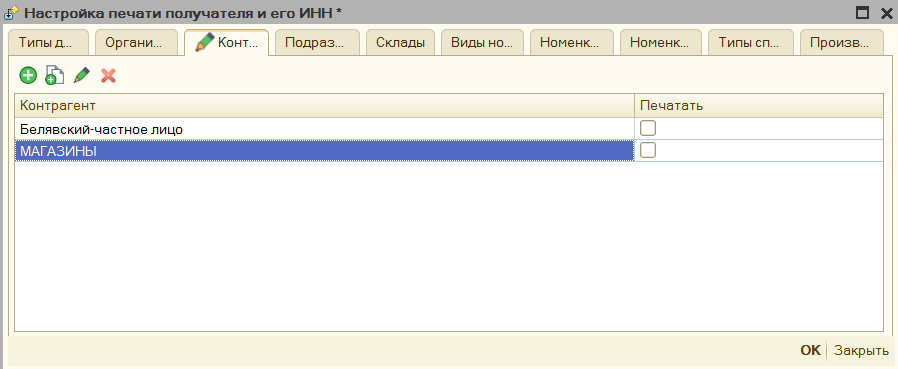

Можно выбрать для какого контрагента применять параметр. Например, мы хотим,
чтобы для контрагента «Белявский» и всех контрагентов в папке «Магазины» в чеке
не выходил их инн и наименования. Применяется, если для документа удается
определить контрагента. Возможно указать сразу каталог.

### **Подразделения**

Можно выбрать для какого подразделения применять параметр. Например, мы хотим,
чтобы для подразделения «Отдел оптовой техники» в чек сразу передавался признак
способа расчета «Передача с полной оплатой». Применяется, если для документа
удается определить подразделение.

### **Склады**

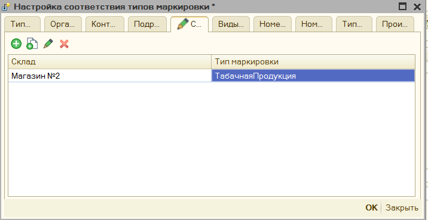

Можно выбрать для какого склада применять параметр. Например, мы хотим, чтобы
для склада «Магазин №2» в продажу идет только «Табачная продукция». Применяется,
если для документа удается определить склад.

### **Виды номенклатуры**

Можно выбрать для какого вида номенклатуры применять параметр. Например, мы
хотим, чтобы для вида номенклатуры «Услуга» признак предмета расчета был
«Услуга». Применяется, если для номенклатуры документа, где можно определить вид
номенклатуры.

### **Номенклатурные группы**

Можно выбрать для какой номенклатурной группы применять параметр. Например, мы
хотим, чтобы вся номенклатура номенклатурной группы пробивалась как
маркировочная продукция «Обувные товары». Применяется, если для номенклатуры
документа, где можно определить номенклатурную группу.

### **Характеристика**

Можно выбрать для какой характеристики номенклатуры применять параметр.
Например, мы хотим, чтобы определенные маски проходили как средства
индивидуальной защиты, и по ним передавалась информация в ОФД.

### **Номенклатура**

Можно выбрать для какой номенклатуры применять параметр. Например, мы хотим,
чтобы вся номенклатура в папках «Сигареты» выходил в чеке номер гтд и код
страны, а для других нет. Применяется для номенклатуры документа печати.
Поддерживает указания папок номенклатуры.

### **Типы справочников**

Можно выбрать для какой типа справочника, который имеет печатаемая фискальная
строка применять параметр. В чек может выходить не только номенклатуры, но и
другие поля документа. Поэтому, если в чек выходят справочник «Проекты», то
можно, например, указать, что для них не выходить ИНН покупателя и его
наименование.

### **Произвольный код для документа**

Помимо установки параметров по отбору, можно и прописать произвольный код
распределения, который будет применяться, возможно указать как для всего
документа, так и для конкретной позиции чека. Чтобы понять, какое именно
значение ожидает параметр «ПризнакРаспределения» в форме есть команда
«**Вставить возможный вариант результата**»

**Доступные параметры**:

**пИмяДокумента** – Имя метаданных документа, из которого происходит печать
чеков.

**пДок** – Ссылка на документ, из которого происходит печать, доступны все его
реквизиты.

**пИмяПоля** – это наименование поле параметра распределения, например,
«ПризнакСпособаРасчета», или «НомерСекции», в основном нужно использовать при
распределении СНО, когда может быть несколько полей распределения.

И др. команды конфигурации

### **Произвольный код для позиции чека**

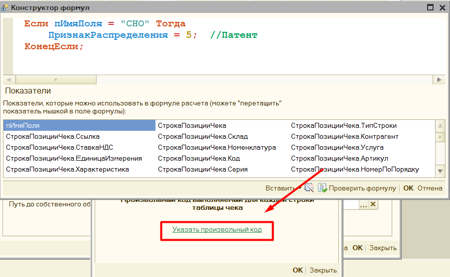

**Доступные параметры**:

**мОбщиеПараметры.ДокументОснование** – Ссылка на документ, из которого
происходит печать, доступны все его реквизиты.

**пИмяПоля** – это наименование поле параметра распределения, например,
«ПризнакСпособаРасчета», или «НомерСекции», в основном нужно использовать при
распределении СНО, когда может быть несколько полей

**СтрокаПозицииЧека.\*** - это данные фискальной строки чека, для которой будет
происходить заполнение шаблона.

## Распределение по системам налогообложения 

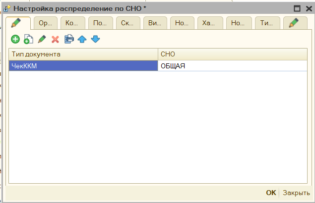

Данную настройку можно использовать для использования нескольких систем
налогообложения в чеке. **См.** [«Механизм
распределения»](#_Механизм_распределения)

**При печати на разные системы налогообложения формируется несколько чеков,
поэтому при ошибке печати в обработке предусмотрена возможность печать только
выбранных чеков. См. «**[Не Печатать](#НеПечатать)**».**

## Распределение по номерам секций 

Данную настройку можно использовать для разделения позиций чека на секции
налогообложения. **См.** [«Механизм распределения»](#_Механизм_распределения)

## Распределение по договорам Агента 

В обработке есть возможно указать «Договор Агента», а также «Признак Агента» для
передачи в ОФД.

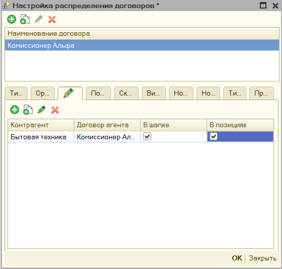

В форме договора агента можно указать «Признак агента», «Операция платежного
агента», «Телефон платежного агента», «Телефон оператора по приему платежей»,
«Наименование оператора перевода», «Телефон оператора перевода», «Адрес
оператора перевода», «ИНН Оператора перевода».

После этого необходимо задать условие при каких параметрах проставлять данный
договор. Для настройки условий использования см. [Механизм
распределения](#МеханизмРаспределения)

## Подключение эквайринговых терминалов

В обработку можно подключить эквайринговый терминал, минуя стандартный способ
подключения. Для этого в форме настройки нужно заполнить «Путь к компонентам»,
где указывается путь к компонентам эквайринга, данные компоненты можно скачать
там же, где была загружена основная обработка.

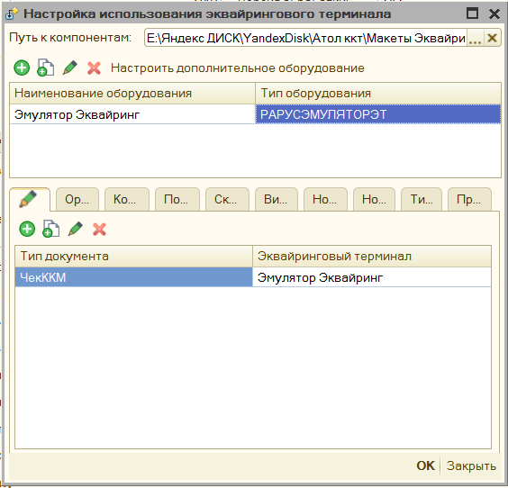

Для подключения эквайринга, нужно выбрать тип оборудования из списка, и указать
произвольное наименование. Затем нажать «**Настроить дополнительное
оборудование**», в открывшейся форме указать параметры подключения эквайринга.
После этого можно проверить подключение по кнопке «**Тест устройства**». Также в
данной форме по кнопке «Ручное управление» можно снять «**Итоги дня по
картам**».

Когда подключение успешно, то необходимо будет указать условие, когда применять
эквайринговый терминал для этого см. [Механизм
распределения](#МеханизмРаспределения)

## Подключение дополнительного оборудования

>   К обработке помимо основного фискального регистратора можно подключить и
>   дополнительные, данный функционал можно использовать, когда необходимо,
>   например, разделить акцизный товар с обычным и пробивать его по другой
>   кассе, либо есть другой фискальный регистратор, зарегистрированный на другую
>   организацию.

>   Добавьте новую строку, укажите тип оборудования и произвольное наименование.

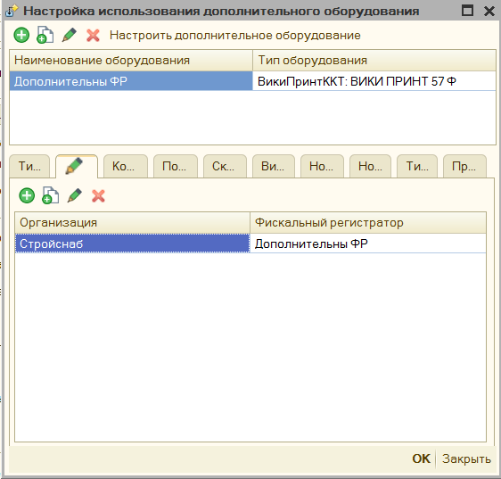

Нажмите на кнопку «Настроить дополнительное оборудование», откроется окно
аналогичное форме с параметрами основного фискального регистратора, однако в нем
будут только параметры для физического подключения оборудования, значения
остальных полей будут браться из настроек основного оборудования.

Для настройки распределения фискальных регистраторов по чекам см. [Механизм
распределения](#МеханизмРаспределения)

## Настройка признаков предмета расчета 

Чтобы задать в обработке условие заполнения «Признака предмета расчета»,
благодаря этому можно явно прописать, когда использовать Залог, выигрыш лотереи,
акцизный товар. Для настройки распределения признаков предмета расчета по чекам
см. [Механизм распределения](#МеханизмРаспределения)

## Настройка признаков способа расчета 

В обработке задать условия указания «Признака способа расчета», благодаря этому
можно явно прописать, где использовать Аванс, или передачу с частичной оплатой.
Для настройки распределения признаков способа расчета по чекам см. [Механизм
распределения](#МеханизмРаспределения)

## Настройка типов маркировки 

Чтобы задать в обработке условие заполнения «Типа маркировки» см. [Механизм
распределения](#МеханизмРаспределения)**.** Это позволит прописать, те позиции
чека, которые должны передаваться как акцизный товар.

## Настройка поставщика агента 

В обработке есть возможно указать «Поставщика Агента»

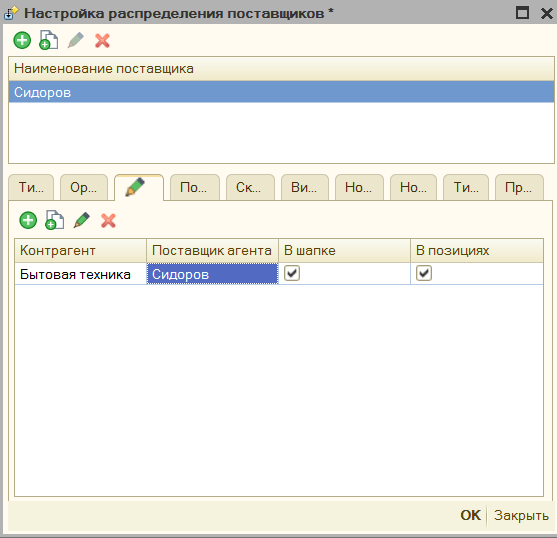

В форме поставщика можно указать «Поставщика услуг», «Инн поставщика», «Телефон
поставщика».

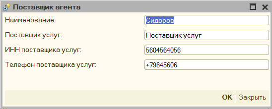

Флажок в форме распределения «В шапке» и «в позициях», указывает где именно в
фискальном чеке прописывать поставщика, если флажок стоит «в позициях», то
поставщик будет передан в ОФД внутри тега номенклатуры.

Чтобы задать в обработке условие заполнения «Поставщика агента». см. [Механизм
распределения](#МеханизмРаспределения)

## Настройка печати реквизитов ГТД и Страна 

По умолчанию обработка пытается определить данные номенклатуре о номере
таможенной декларации, и коде страны происхождения и передает их в ОФД, чтобы не
передавать эти поля, можно задать определенные условия. См. [Механизм
распределения](#МеханизмРаспределения). Флажок «Печатать» должен быть снят,
чтобы данные о гтд не передавались.

## Настройка печати получателя и его ИНН 

По умолчанию обработка пытается определить данные о контрагенте и его ИНН и
передает их в ОФД, чтобы не передавать эти поля, можно задать определенные
условия. См. [Механизм распределения](#МеханизмРаспределения). Флажок «Печатать»
должен быть снят, чтобы данные о покупателе не передавались.

## Настройка ограничения времени продажи 

В параметрах обработки можно также указать время, когда можно продавать товар,
например, это актуально для Алкоголя. Настройка условий распределения См.
[Механизм распределения](#МеханизмРаспределения).

## Настройка ставки НДС по умолчанию

Если в организации применяется одна ставка НДС, то можно ее сразу прописать в
параметрах, тогда именно она будет использована при заполнении. По заполнению
параметров см. [«Механизм распределения»](#МеханизмРаспределения)

## Задать условие подмены номенклатуры

Можно указать настройки замены схожих позиций номенклатура на собственное
наименование. По заполнению параметров см. [«Механизм
распределения»](#МеханизмРаспределения)

## Дополнительные параметры.

Данный механизм можно использовать для разработки собственного обработчика, в
данном поле указывается произвольный параметр, а в собственном коде его можно
вызвать вот так.
ОсновнаяОбработка.ККТ_ЗначениеДополнительногоПараметра(“ИмяПараметра”);

## Печать копии чека 

В параметрах обработки можно настроить возможность печати копии чека на обычный
принтер. Для этого в параметрах обработки нажмите на «Настроить печать копий
чека» - откроется форма настройки.

В поле «Имя принтера» необходимо выбрать принтер из списка, и указать количество
копий, которые нужно напечатать.

По кнопке «Проверить компоненту штрихкодов» - обработка проверяет находится ли в
папке с макетами компонента для печати штрихкодов. **Важно,** без нее в копию
чека не будет выведен QR код фискального чека.

Для настройка выводимого табличного документа, есть кнопка «Настроить табличный
документ», где можно указать как должен выводиться чек.

Копия чека заполняется также, как и фискальный чек, и информацию заполнения
можно менять, меняя шаблон документа. Однако часть информации невозможно
получить из фискального регистратора, поэтому ее нужно указать вручную. Данные
настройки находятся в группе «**Нефискальные чеки**» в параметрах обработки

Если вы хотите, чтобы копия чека выводилась корректно, то данные параметры нужно
заполнить.

Копия чека будет напечатана в следующем виде.

## Рассылка чеков средствами 1С по Email

В обработке предусмотрен механизм отправки чеков по Email, минуя ОФД, для этого
необходимо в параметрах обработки заполнить данные для подключения. Чек
отправляется в виде письма на почту, где содержимое чека может быть либо в теле
письма, либо прикреплено как вложение.

**«Тема письма»** - тема письма, которое будет отправлено клиенту.

**«Логин»** - email учетной записи, обязательно должен содержать символ \@.

**«Пароль»** - пароль учетной записи вашей почты

**«Адрес сервера SMTP» -** адрес сервера SMTP, например, для Gmail он будет
smtp.gmail.com, этот параметр и порт можно посмотреть в интернете, на сайте,
соответствующем вашей почте.

**«Порт SMPT»** - порт сервера SMTP.

**«Использовать SSL»** - указывает использовать ли защищенное соединение при
отправке почты, в современных почтах SSL обычно всегда включен.

**«Не отправлять QR код чека»** - указывает, что при отправке чека по почте qr
код чека при этом не будет передаваться.

**«Отправлять чеки в виде PDF файла»** - доступно только для платформы 8.2 и
8.3, сохраняет чек в виде pdf файла и прикрепляет его к письму и отправляет его
в качестве вложения.

«**Проверить**» - кнопка для проверки подключения к учетной записи вашей почты,
при нажатии отправляет тестовое письмо на ваш email.

**Примечание**: если возникает вопрос откуда получить параметры подключения к
почте, то можно посмотреть, как это реализовано у google:

<https://support.google.com/mail/answer/7126229?visit_id=637102020096722822-631526299&p=syncdmail&rd=1>

## Рассылка чеков по SMS

В обработке предусмотрен механизм отправки чеков по SMS, минуя ОФД, для этого
необходимо в параметрах обработки заполнить данные для подключения. Чек
отправляется в виде простой строки, которая содержит данные по Регистрационному
номеру ККТ, фискальному признаку чека, сумме оплаты, и дате покупки, а также
включает в себя ссылку на сайт nalog.ru, где можно проверить чек по фискальному
признаку, вы также можете настроить собственный шаблон такого sms сообщения
через специальную форму. Обратите внимание, что для отправки чеков у вас должен
быть заключен и оплачен договор с одним из sms-провайдеров.

**«Провайдер»** - фирма, предоставляющая услугу по SMS рассылки.

**«Логин»** - login для подключения сервису, для разных sms провайдеров данный
параметр может меняться.

**«Пароль»** - пароль для подключения к сервису.

**«Имя отправителя» -** Имя организации, как она будет отображаться во входящей
SMS.

**«Номер телефона для проверки»** - номер телефона, на который должно уйти
тестовое SMS

**«Шаблон SMS»** - шаблон строки, которая будет передана для отправки по SMS.

«**Проверить**» - кнопка для проверки подключения к учетной записи SMS
провайдера, при нажатии отправляет тестовое SMS на «номер для проверки».

Примечание: если возникает вопрос откуда получить параметры подключения к sms
рассылке, то можно посмотреть, как это реализовано у сервиса SMS-Центр
<https://smsc.ru/api/?SE=9f54412c>

## Шаблон документа печати 

В обработке предусмотрен механизм шаблона документа, вы можете вывести в чек
дополнительную информацию, рекламу, данные о покупателе, штрихкод, задать
собственный способ отображения фискальных строк и многое другое.

Чтобы добавить шаблон необходимо в параметрах обработки выбрать пункт «[Шаблон
документа](#НастрокаШаблонаДокумента)»

Выберите «**Тип документа**», для которого вы будете настраивать шаблон,
например, «Чек ККМ»

1.  Тип документа – Имя документа, для которого будет настраиваться шаблон,
    можно изменить.

2.  Проверка шаблона – позволяет в данном же окне проверить настройку шаблона
    чека.

3.  Операнды – список реквизитов документа, которые можно использовать в
    произвольном коде, имя операнда можно задавать любое.

4.  Настроить фискальные строки – открываем форму редактирования фискальных
    строк

5.  Добавить разделитель – добавляет в шаблон чека строку-разделитель, которая
    позволяет печатать несколько чек, где только 1 будет фискальным, а другие
    текстовые с дополнительной информацией.

6.  Строки чека – непосредственно строки с шаблоном, в данную таблицу можно
    добавить текстовые строки, строки со штрихкодами (QR код, Code39, EAN8,
    EAN13) и разделитель. Фискальные строки можно только редактировать.

При добавлении операнда, откроется форма со структурой документа, в ней нужно
выбрать нужный реквизит и нажать кнопку «ОК». Поле Идентификатор заполнится
автоматически по строке реквизита, при желании его можно изменить на любое
другое вручную.

Чтобы отредактировать содержимое шаблона щелкните два раза мышкой по тексту
шаблона, либо нажмите кнопку «Изменить», либо кнопку F2 на клавиатуре, откроется
окно редактирования.

В таблице «Показатели» есть предопределенные показатели: «ТаблицаЧека» - таблица
с текущими фискальными строками; Отказ – булево значение, указывает выводить ли
данную строку в шаблон, для фискальной строки этот параметр игнорируется, а
также показатели, которые были добавлены в таблице операндов.

Для добавления показателя в формулу перетащите его мышкой из таблицы показателей
в окно с формулой, при добавлении показателя в формулу он предстает в виде
[Показатель], предопределенный же показатель будет без квадратных скобок.
Подробнее о возможности редактирования формул см. [Редактор произвольного
кода](#_Редактор_произвольного_кода).

Шаблон можно задать также и для каждой фискальной строки, начиная от того, что
будет содержать фискальная строка, заканчивая тем, что будет напечатано перед
ней и после нее. Для этого в поле настройки шаблона необходимо нажать на кнопку
«Настроить фискальные строки», либо 2 раза кликнуть на слово «ФИСКАЛЬНЫЕ
СТРОКИ». Откроется окно с настройкой шаблона фискальной строки.

Данное окно напоминает окно редактирования шаблона, однако поле операндов нельзя
редактировать, и оно заполняется автоматически: теми операндами, чтобы были в
основном шаблоне, а также предопределенными реквизитами, которые содержатся в
таблице «ТаблицаЧека». В остальном же функционал идентичен.

Шаблон документа описан также в видео [Как настраивать шаблон
документа](https://www.youtube.com/watch?v=gqETo0CXHRM&t=2s)[.](https://www.youtube.com/watch?v=gqETo0CXHRM&t=2s)

## Редактор произвольного кода

Когда в обработке нужно написать код на встроенном языке 1С, открывается
редактор произвольного кода. Данный редактор имеет подсветку синтаксиса 1С,
можно открыть конструктор запросов, вставить ссылку на объект в базе данных,
используются шаблоны кода, используется конструктор форматной строки.

## Форма ввода Email и Номера телефона 

Чтобы при печати появилась возможность вводить номер телефона или email клиента
необходимо в параметрах обработки включить параметр «**Указывать номер или Email
клиента»**. Одновременно в данную форму может быть введен только один вид
контактной информации.

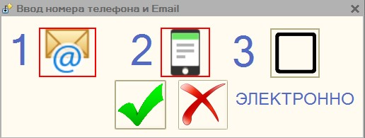

Данные окно поддерживает «горячие клавиши», по кнопке **«1»** – откроется форма
ввода email

По кнопке **«2»** – откроется окно ввода номера телефона

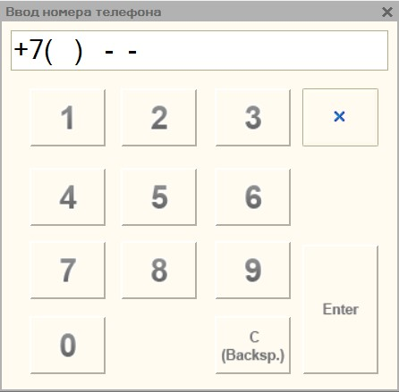

По кнопке «**3»** – можно изменить способ фискализации, если параметр
«Электронно» включен и заполнен либо адрес электронной почты, либо телефон, то
чек не будет выведен на печать, а отправится сразу в ОФД.

По нажатию на «**Enter**» - печать продолжиться с введенным данными.

По нажатию на «**ESC**» - печать отменится.

Поддерживает работу со сканером штрих-кода или магнитным считыватель, если
контактная информации закодирована в определенный штрихкод или магнитную карту,
то ее можно прочитать, и она автоматически добавится в данную форму

## Подключение через прокси

Для подключения к прокси необходимо заполнить:

«Адрес» - он заполняется в формате «http://адрес:порт», либо
«https://адрес:порт», адрес прокси-сервера можно не заполнять, тогда будут
использованы настройки по умолчанию.

«Имя пользователя» и «Пароль» - пользователя, под которым будет происходить
подключение к прокси-серверу.

«Аутентификация операционной системой» - если установлен данный флажок, то
подключение к прокси будет происходить без указания имени пользователя и пароля.

##  Форма отладки 

Для более удобной проверки работы обработки можно использовать «форму отладки»,
для этого откройте обработку через меню «Файл» - «Открыть».

Если конфигурация, в которой была открыта форма отладки не поддерживает работу с
торговым оборудованием, то в этом окне можно самостоятельно добавить подключение
к новому оборудованию.

Кнопка «Сохранить путь обработки» используется при печати через внешнюю печатную
форму, которая идет в комплекте с обработкой. Она сохраняет путь до файла
основной обработки в настройки пользователя, затем при печати через внешнюю
печатную форму проверяется указан ли путь до обработки, и если указан, то
используется именно обработка по этому пути.

Если же работа с фискальными регистраторами поддерживается, то в данном списке
отобразиться уже подключенное оборудование, которой можно перенастроить здесь
же.

Из данной формы можно на основании абсолютно любого документа:

1.  Напечатать предварительный чек, который представляет из себя обычную
    печатную форму

2.  Напечатать фискальный чек.

Доступно 2 варианта использование: **Предопределенный документ** – это тот
документ, для которого алгоритм печати заложен в самой обработке, и
**Собственный документ** – для такого документа обработка попробует напечатать
чек на основании универсального алгоритма, однако желательно для такого
реализовать собственный функционал печати через дополнительный обработчик.

Например, в конфигурации **УТ 10.2**, можно печатать полноценные фискальные чеки
без доработки конфигурации.

## Отражение продаж индивидуальных средства защиты 

Согласно постановлению правительства от 16 апреля 2020 г. N 521, при продаже
средств индивидуальной защиты, необходимо заполнять и передавать «код товара».
Код товара из себя представляет предопределенный штрихкоды для определенной
группы товара, общий перечень штрихкодов можно посмотреть по
[ссылке](https://www.garant.ru/hotlaw/federal/1362146/). Таким образом для
отражения данных товаров необходимо:

1.  В параметрах обработки настроить тип маркировки «**Средства индивидуальной
    защиты**» для нужной номенклатуры или группы товара.

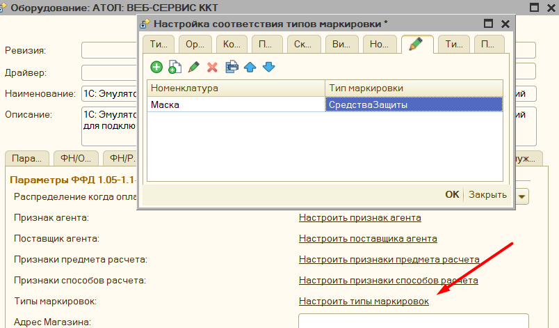

1.  Убедиться, что у вас в поле Ревизия интерфейса стоит 3002 или выше.

    

    Это связано с тем, что компоненты с данной ревизией поддерживают передачу
    маркировки в формате base64.

2.  Передайте значение маркировки в чек. Возможно несколько вариантов.
    Маркировка находится сразу в документе, для этого должно быть заполнено поле
    «Штрихкод», или «КодМаркировки», если такие поля в вашем документе
    предусмотрены. Возможно заполнить маркировки через дополнительный
    обработчик, для этого необходимо заполнить поле «КодМаркировки», или
    «Штрихкод», в процедуре «ПослеФормированияТаблицыЧека», после этого данная
    маркировка будет автоматически распознана.

    Помимо этого, в типовых конфигурациях 1С добавлена заполнение данных
    штрихкодов по умолчанию, например в конфигурации Управление Торговлей 10.3

    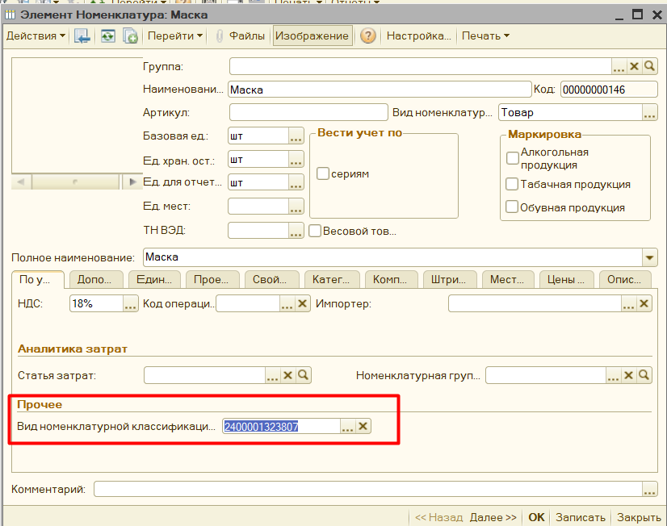

    Также маркировку можно вносить интерактивно, для этого необходимо
    подготовить штрихкоды, значения штрихкодов можно посмотреть из постановления
    правительства и сканировать эти штрихкоды при пробитии чека, обработка
    распознает их и заполняет необходимые поля кодом товара.

# Доработка конфигурации

Чтобы явно задать из какого документа происходит печать, и ускорить тем самым
данную процедуру, в вашей программе нужно сделать небольшую доработку. Как это
сделать представлено в видео инструкции.

Видео доработка конфигурации:[Доработка
конфигурации](https://www.youtube.com/watch?v=Ehp2DU-YnqM&index=1&list=PLv043XNq9i-6_DdLAy1kTuExX2E-ikn65)

>   **Описание действий:**

1.  Открываете вашу конфигурацию, в меню "Конфигурация "- "Поддержка" -
    "Настройка поддержки" проверяете включена ли возможность редактирования
    конфигурации, если нет, то включаете ее.

2.  Ищете все упоминания строки
    "**ПолучитьСерверТО().ОплатитьПлатежнойКартой**". В тех документах, в
    которых будет найдена данная строка, перед ней добавить такой код:

    "**СохранитьЗначение("ДокументПечатиККТ", Ссылка);"**

3.  Ищете все упоминания строки "**ПолучитьСерверТО().ПечатьЧека**". В тех
    документах, в которых будет найдена данная строка, перед ней добавить такой
    код:

    "**СохранитьЗначение("ДокументПечатиККТ", Ссылка);**"

4.  Для конфигурации Розница 1, возможно нужно еще поискать

    "**ПолучитьСерверТО().ОткрытьЧек**". В тех документах, в которых будет
    найдена данная строка, перед ней добавить такой код:
    "**СохранитьЗначение("ДокументПечатиККТ", Ссылка);**"

5.  Объединяете с основной конфигурацией, нажав кнопку F7.

# Полезные ссылки

| **Описание**                                                                                 | **Ссылка**                                                                                                                                                                                                                                                                                             |
|----------------------------------------------------------------------------------------------|--------------------------------------------------------------------------------------------------------------------------------------------------------------------------------------------------------------------------------------------------------------------------------------------------------|
| Текст закона 54 ФЗ                                                                           | <http://www.consultant.ru/cons/cgi/online.cgi?req=doc&base=LAW&n=330192&fld=134&dst=447,0&rnd=0.30253534143765193#021374827923156636>                                                                                                                                                                  |
| Постановление правительства рф от 16 апреля 2020 г. N 521, для средств индивидуальной защиты | <https://www.garant.ru/hotlaw/federal/1362146/>                                                                                                                                                                                                                                                        |
| Порядок оформления чеков по новым стандартам                                                 | <https://1cborc.ru/news/obraztsy-chekov-kkt-kak-teper-oformlyat-raschety-bez-oshibok/>                                                                                                                                                                                                                 |
| Как настроить и подключить оборудование к 1С, на примере оборудования АТОЛ                   | <https://pogrommist.ru/2017/06/podklyuchenie-kkm-atol-55f-k-1s-na-udalennom-rabochem-stole/>                                                                                                                                                                                                           |
| Порядок оформления чеков в конфигурациях от Рарус                                            | <https://rarus.ru/press/publications/20190730-metodika-raboty-KKT-v-alfa-avto-avtosalon-avtoservis-avtozapchasti-prof-393386/>                                                                                                                                                                         |
| Почему фискальный регистратор разделяет одну строку в 1С на несколько с разной ценой         | <https://fiscal.atol.ru/news/skidki-i-razdelenie-pozitsiy-v-cheke-v-sootvetstvii-s-54-fz/>                                                                                                                                                                                                             |
| Примеры оформления чеков, от налоговой                                                       | <http://forum.atol.ru/index.php?s=&showtopic=32556>                                                                                                                                                                                                                                                    |
| Как подключить оборудование Эвотор к компьютеру                                              | https://infostart.ru/public/889385/                                                                                                                                                                                                                                                                    |
| Компоненты 1С для оборудования АМС и К1Ф                                                     | <http://vtsoft.ru/catalog/soft/list.php?SECTION_ID=145>                                                                                                                                                                                                                                                |
| Официальный сайт с компонентами 1С для оборудования «Прим»                                   | <http://iskra-kkt.ru/>                                                                                                                                                                                                                                                                                 |
| Описание параметров таблицы 17 оборудования ШтрихМ, отвечающей за работу с ККТ               | <https://newskktblog.wordpress.com/2017/03/03/tablica-17-kkt/>                                                                                                                                                                                                                                         |
| Компоненты 1С для оборудование Вики Принт                                                    | <https://help.dreamkas.ru/hc/ru/articles/360000259169-%D0%92%D0%B8%D0%BA%D0%B8-%D0%9F%D1%80%D0%B8%D0%BD%D1%82-%D0%A4-1%D0%A1>                                                                                                                                                                          |
| Официальный сайт с компонентами для оборудования СчетМаш                                     | <https://schetmash.com/>                                                                                                                                                                                                                                                                               |
| Описание методов веб-сервера АТОЛ                                                            | <http://integration.atol.ru/#103cbcf96a>                                                                                                                                                                                                                                                               |
| База знаний АТОЛ для работы по 54 ФЗ                                                         | <https://onedrive.live.com/redir?resid=189C614ED00D4C23%21128&authkey=%21ABE4IM6eOvPtlrQ&page=View&wd=target%2854-%D0%A4%D0%97.one%7C27377c95-2928-4aa8-8fd7-4b03b801c6ef%2F%D0%94%D0%BE%D0%BF.%20%D0%BC%D0%B0%D1%82%D0%B5%D1%80%D0%B8%D0%B0%D0%BB%D1%8B%7Ca071440e-6651-458f-a477-7fba4fd851d0%2F%29> |

# Возможные ошибки

| **Оборудование** | **Описание ошибки**                                                                                   | **Методы устранения**                                                                                                                                                                                                                                                                                                                                                                                                                                                                                                                                                             |
|------------------|-------------------------------------------------------------------------------------------------------|-----------------------------------------------------------------------------------------------------------------------------------------------------------------------------------------------------------------------------------------------------------------------------------------------------------------------------------------------------------------------------------------------------------------------------------------------------------------------------------------------------------------------------------------------------------------------------------|
| Общие            | Медленная скорость печати по локальной сети                                                           | Отключить антивирус, или настроить исключения на нем. Если используется Windows 10, то защитник Windows необходимо отключить также через реестр. Отключение защитника Windows. жмем Win+R, вводим regedit и жмем Enter. В появившемся редакторе переходим по пути HKEY_LOCAL_MACHINE\\SOFTWARE\\Policies\\Microsoft\\Windows Defender. На пустом месте справа кликаем правой кнопкой мыши и выбираем "Создать" параметр DWORD (32 бита) с именем DisableAntiSpyware. Двойным кликом на созданный параметр вызываем его редактирование и присваиваем ему значение 1. Нажимаем «ОК» |
| Общие            | Ошибка при попытки открыть форму настройки параметров модели. Ошибка загрузки обработки обслуживания. | Возникает после обновления обработки. Ошибка связана с проблемами в кэше платформы 1С. Для решения: необходимо просто перезапустить 1С.                                                                                                                                                                                                                                                                                                                                                                                                                                           |
| Общие            | Медленная скорость печати по RDP                                                                      | Компьютеры могут находиться в разных доменах. Проблема возникает на уровне доменных прав учетных записей. Решается внесение компьютеров в одно доменной пространство. Также можно воспользоваться такой инструкцией <https://forum.infostart.ru/forum9/topic121333/> Также можно попробовать перенастроить подключения не через com, а через TCP соединение согласно этой инструкции <https://pogrommist.ru/2019/11/uskorjaem-skorost-pechati-chekov-po-rdp-na-kkt-atol/>                                                                                                         |
| Общие            | Ошибка, «ККТ не зарегистрирована с указанной СНО»                                                     | Если фискальный регистратор не фискализирован, то можно воспользоваться следующей инструкцией <https://infostart.ru/public/1154934/>                                                                                                                                                                                                                                                                                                                                                                                                                                              |
| Общие            | Не удается подключить компоненту для работы с оборудованием                                           | Компонента оборудования имеет способ подключения COM, необходимо ее зарегистрировать. Полезная ссылка <https://remontka.pro/dll-register-windows/> Слишком длинный путь к расположенной компоненте на диске, поместите ее в корень диска. Запустить 1С от имени администратора, чтобы компонента прописалась во временном каталоге.                                                                                                                                                                                                                                               |
| Общие            | Ошибка при активации лицензии на Windows                                                              | Не доступна служба WMI или некорректно установлена. Решение <https://sysadmins.ru/topic433466.html> и еще можно воспользоваться командой: rundll32 wbemupgd, RepairWMISetup, пример по ссылке <http://manaeff.ru/forum/viewtopic.php?p=1092> Если предыдущие способы не помогли, то переустановите эту службу или пересоздайте репозиторий согласно данной инструкции <https://winitpro.ru/index.php/2014/08/12/ustranenie-nepoladok-v-wmi/>                                                                                                                                      |
| Общие            | Ошибка программирования реквизита 1228                                                                | Ошибка в передаче ИНН покупателя, проверьте его заполнение, передачу данных о покупателе можно также отключить в параметрах обработки.                                                                                                                                                                                                                                                                                                                                                                                                                                            |
| Общие            | Не списывается маркировка в Честном знаке.                                                            | При сканировании марки при подключении по RDP все символы получаются в нижнем регистре. Проблема в клиенте RDP, один из вариантов решений - в свойствах подключения RDP поменять настройку: «Локальные ресурсы» -\> «Клавиатура» -\> «Использовать сочетания клавиш Windows» поставить «На этом компьютере»                                                                                                                                                                                                                                                                       |
| ШтрихПринт       | ошибка DeviceID                                                                                       | Скорее всего не обновлены драйвера, либо зарегистрирована старая компонента для торгового оборудования. Нужно обновить драйвера или перерегистрировать компоненту.                                                                                                                                                                                                                                                                                                                                                                                                                |
| ШтрихПринт       | ошибка «09h, Некорректное значение параметров команды»                                                | Передается неправильная система налогообложения. Если отображается, что указана правильная система налогообложения, то возможно произошла ошибка при прошивке и регистрации, поэтому нужно обновить прошивку.                                                                                                                                                                                                                                                                                                                                                                     |
| ШтрихПринт       | ошибка «4Fh неверный пароль администратора»                                                           | Необходимо обновить драйвера, также возможно через утилиту оборудования установить в таблице «пароль администратора» в значение 0. Полезная ссылка <https://pikabu.ru/story/problema_s_kassovyim_apparatom_shtrikhm_5584492>                                                                                                                                                                                                                                                                                                                                                      |
| Атол             | ошибка «некорректное значение параметра ФН. (ОШИБКА ФН 231)»                                          | Указана неверная система налогообложения в параметрах обработки, либо не обновлена прошивка.  Также может быть, что фискальный накопитель использует ОСНО, но имеет ограничение на продажу УСЛУГ, тогда нужно настроить распределение по признаку предмета расчета «Услуга»                                                                                                                                                                                                                                                                                                       |
| Атол             | не печатает чек по системе налогообложения Патент                                                     | В утилите оборудования необходимо выставить «систему налогообложения по умолчанию», скорее всего она не заполнена.                                                                                                                                                                                                                                                                                                                                                                                                                                                                |
| Атол             | Ошика «Неверная длина чека»                                                                           | Необходимо обновить прошивку, либо в параметрах обработки проверить указан ли параметр «Модель» и корректен ли он.                                                                                                                                                                                                                                                                                                                                                                                                                                                                |
| Спарк            | Не печатался чек, из-за номера секции равного 0                                                       | В параметрах обработки необходимо установить номер секции как на аппарате, например «1»                                                                                                                                                                                                                                                                                                                                                                                                                                                                                           |
| ВикиПринт        | Не печатался чек, с переданным признаком предмета расчета «Подакцизный товар»                         | При регистрации оборудования необходимо установить «Продажа подакцизного товара»                                                                                                                                                                                                                                                                                                                                                                                                                                                                                                  |
|                  |                                                                                                       |                                                                                                                                                                                                                                                                                                                                                                                                                                                                                                                                                                                   |
