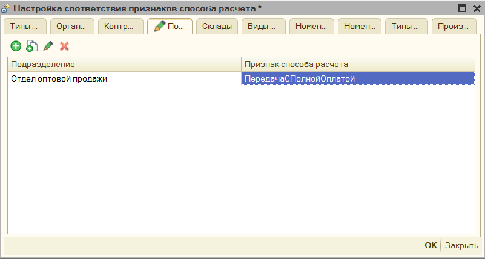
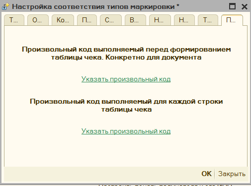
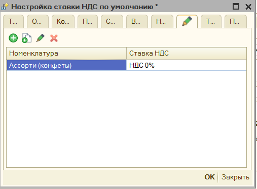
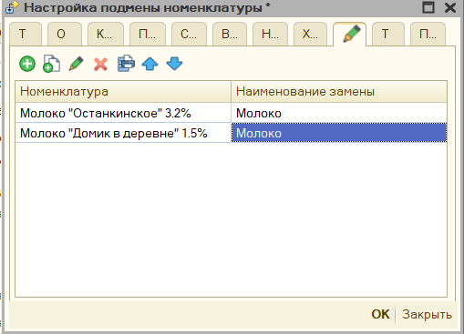
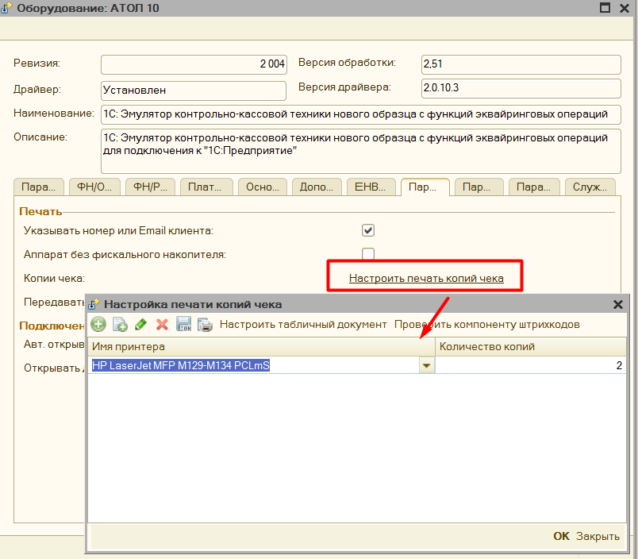
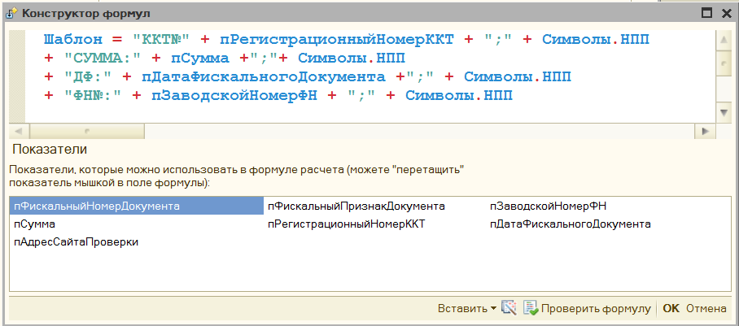
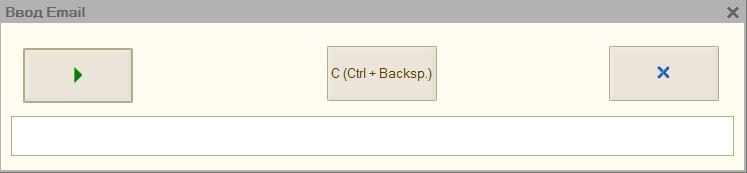
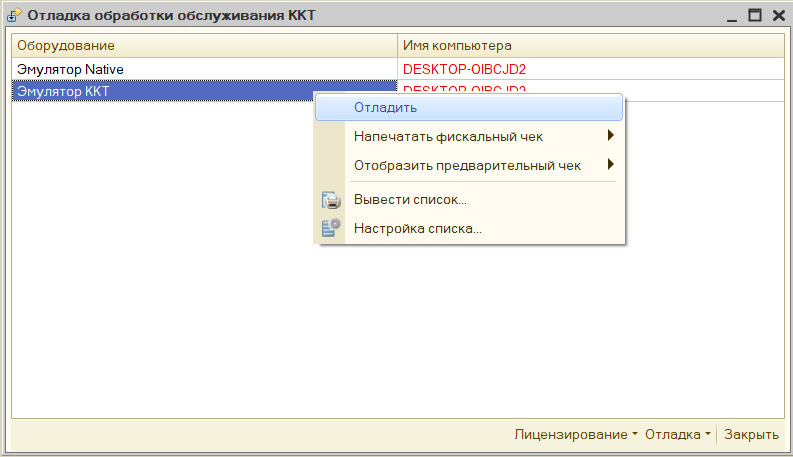

# Дополнительная функциональность #

>**Обратите внимание**, что основной функционал обработки представлен также в видео:

[Первое видео](https://www.youtube.com/watch?v=uVJSKu6wHXE)

[Второе видео](https://www.youtube.com/watch?v=T3Qr9CJBb48)

[Третье видео](https://www.youtube.com/watch?v=ZOXDoqp12sk)

>**Внимание**: **Механизм распределения** будет работать, если обработка сможет определить документ для печати, для этого этот документ должен быть ей передан в явном виде. Если же нет, то при печати будет выведено окно с предложением указать этот документ вручную. Проверьте сделана ли у вас доработка из видео.

## Структура архива с обработкой ##

Архив с обработкой состоит из следующих файлов:

- «**Обработка для работы с ККТ 8.2.epf**» - Основная обработка для платформы 1С 8.2 (также подходит для платформы 8.3, но только для обычных форм)

- «**Обработка для работы с ККТ 8.1.epf**» - Основная обработка для платформы 1С 8.1

- «**Инструкции\\История версий обработки ККТ 54.pdf**» - содержит историю вышедших релизов обработки, в нем можно увидеть, что изменилось в последних версиях.

- «**Инструкции\\Обработка для работы фискальных регистраторов с поддержкой ККТ.pdf**» - содержит полную инструкцию по работе с обработкой.

- «**Дополнительные обработчики\\KKT_DEVELOPE_8_2.epf**» - обработка для платформы 8.2 или 8.3, в которую можно внести свой код и подключить к основной обработке, для изменения функционала печати.

- «**Дополнительные обработчики\\KKT_DEVELOPE_8_1.epf**» - обработка для платформы 8.1, в которую можно внести свой код и подключить к основной обработке, для изменения функционала печати.

- «**Внешние печатные формы\\ВПФ_Чек_8_1.epf**» - обработка для платформы 8.1, является внешней печатной формой, подключается к выбранном документу, через типовой механизм подключения внешних печатных форм. Таким образом можно  добавить функционал печати чеков для тех документов, что его не поддерживают.

- «**Внешние печатные формы\\ВПФ_Чек_8_2.epf**» - для платформы 8.2 или 8.3, является внешней печатной формой, подключается к выбранном документу, через типовой механизм подключения внешних печатных форм. Таким образом можно добавить функционал печати чеков для тех документов, что его не поддерживают.

- «**Внешние печатные формы\\ВПФ_ЧекКоррекции_8_2.epf**» - для платформы 8.2 или 8.3, является внешней печатной формой, подключается к выбранном документу, через типовой механизм подключения внешних печатных форм. Таким образом можно обавить функционал печати чека коррекции для тех документов, что его не поддерживают.

- «**Внешние печатные формы\\ВПФ_ЧекКоррекции_8_1.epf**» - обработка для платформы 8.1, является внешней печатной формой, подключается к выбранном документу, через типовой механизм подключения внешних печатных форм. Таким образом можно обавить функционал печати чека коррекции для тех документов, что его не поддерживают.

## Дополнительная функциональность ##

### Механизм распределения ###

В обработке множество параметров, и для большинства можно задать условие их применения. Механизм использования этих настроек одинаков для каждого, поэтому общие моменты будут описаны здесь, далее будут приведены ссылки уже на этот
раздел.

Описание параметров размещено с учетом приоритета их применения: от наименее приоритетного к наиболее. Если в вашей конфигурации не будет отображаться один из описанных условий, то у вас просто нет таких метаданных. Далее под словом
«параметр» будет иметься ввиду именно их значение, например «Признак предмета расчета», или «Признак способа расчета» и т.д.

Применяются следующие условия:

### Типы документов ###

Здесь можно выбрать тип документа, где применять параметр. Например, мы хотим, чтобы для документа «Корректировка долга», всегда была ставка НДС 20%, здесь это можно указать. Данное условие применяется перед формированием таблицы чека, является наименее приоритетным.

>**Обратите внимание**, также в настройке можно указать «**Все документы**» - «*ALL*», в таком случае условие будет накладывать сразу на все чеки, которые сформирует обработка.

### Организации ###

Можно выбрать для какой организации применять параметр. Например, мы хотим,
чтобы для организации «Стройснаб» отсутствовал НДС в чеках. Применяется, если
для документа удается определить организацию.

### Контрагенты ###

Можно выбрать для какого контрагента применять параметр. Например, мы хотим,
чтобы для контрагента «Белявский» и всех контрагентов в папке «Магазины» в чеке
не выходил их инн и наименования. Применяется, если для документа удается
определить контрагента. Возможно указать сразу каталог.

### Подразделения ###

Можно выбрать для какого подразделения применять параметр. Например, мы хотим,
чтобы для подразделения «Отдел оптовой техники» в чек сразу передавался признак
способа расчета «Передача с полной оплатой». Применяется, если для документа
удается определить подразделение.

### Склады ###

Можно выбрать для какого склада применять параметр. Например, мы хотим, чтобы
для склада «Магазин №2» в продажу идет только «Табачная продукция». Применяется,
если для документа удается определить склад.

### Виды номенклатуры ###

Можно выбрать для какого вида номенклатуры применять параметр. Например, мы
хотим, чтобы для вида номенклатуры «Услуга» признак предмета расчета был
«Услуга». Применяется, если для номенклатуры документа, где можно определить вид
номенклатуры.

### Номенклатурные группы ###

Можно выбрать для какой номенклатурной группы применять параметр. Например, мы
хотим, чтобы вся номенклатура номенклатурной группы пробивалась как
маркировочная продукция «Обувные товары». Применяется, если для номенклатуры
документа, где можно определить номенклатурную группу.

### Характеристика ###

Можно выбрать для какой характеристики номенклатуры применять параметр.
Например, мы хотим, чтобы определенные маски проходили как средства
индивидуальной защиты, и по ним передавалась информация в ОФД.

### Номенклатура ###

Можно выбрать для какой номенклатуры применять параметр. Например, мы хотим,
чтобы вся номенклатура в папках «Сигареты» выходил в чеке номер гтд и код
страны, а для других нет. Применяется для номенклатуры документа печати.
Поддерживает указания папок номенклатуры.

### Типы справочников ###

Можно выбрать для какой типа справочника, который имеет печатаемая фискальная
строка применять параметр. В чек может выходить не только номенклатуры, но и
другие поля документа. Поэтому, если в чек выходят справочник «Проекты», то
можно, например, указать, что для них не выходить ИНН покупателя и его
наименование.

### Произвольный код для документа ###

Помимо установки параметров по отбору, можно и прописать произвольный код
распределения, который будет применяться, возможно указать как для всего
документа, так и для конкретной позиции чека. Чтобы понять, какое именно
значение ожидает параметр «ПризнакРаспределения» в форме есть команда
«**Вставить возможный вариант результата**»

**Доступные параметры**:

**пИмяДокумента** – Имя метаданных документа, из которого происходит печать
чеков.

**пДок** – Ссылка на документ, из которого происходит печать, доступны все его
реквизиты.

**пИмяПоля** – это наименование поле параметра распределения, например,
«ПризнакСпособаРасчета», или «НомерСекции», в основном нужно использовать при
распределении СНО, когда может быть несколько полей распределения.

И др. команды конфигурации

### Произвольный код для позиции чека ###

**Доступные параметры**:

**мОбщиеПараметры.ДокументОснование** – Ссылка на документ, из которого
происходит печать, доступны все его реквизиты.

**пИмяПоля** – это наименование поле параметра распределения, например,
«ПризнакСпособаРасчета», или «НомерСекции», в основном нужно использовать при
распределении СНО, когда может быть несколько полей

**СтрокаПозицииЧека.\*** - это данные фискальной строки чека, для которой будет
происходить заполнение шаблона.

## Распределение по системам налогообложения ##

Данную настройку можно использовать для использования нескольких систем налогообложения в чеке. **См.** [«Механизм
распределения»](#_Механизм_распределения)

При печати на разные системы налогообложения формируется несколько чеков, поэтому при ошибке печати в обработке предусмотрена возможность печать только
выбранных чеков. См. «**[Не Печатать](#НеПечатать)**».

## Распределение по номерам секций ##

Данную настройку можно использовать для разделения позиций чека на секции
налогообложения. **См.** [«Механизм распределения»](#_Механизм_распределения)

## Распределение по договорам Агента ##

В обработке есть возможно указать «Договор Агента», а также «Признак Агента» для
передачи в ОФД.

В форме договора агента можно указать «Признак агента», «Операция платежного
агента», «Телефон платежного агента», «Телефон оператора по приему платежей»,
«Наименование оператора перевода», «Телефон оператора перевода», «Адрес
оператора перевода», «ИНН Оператора перевода».

После этого необходимо задать условие при каких параметрах проставлять данный
договор. Для настройки условий использования см. [Механизм
распределения](#МеханизмРаспределения)

## Настройка признаков предмета расчета ##

Чтобы задать в обработке условие заполнения «Признака предмета расчета»,
благодаря этому можно явно прописать, когда использовать Залог, выигрыш лотереи,
акцизный товар. Для настройки распределения признаков предмета расчета по чекам
см. [Механизм распределения](#МеханизмРаспределения)

## Настройка признаков способа расчета ##

В обработке задать условия указания «Признака способа расчета», благодаря этому можно явно прописать, где использовать Аванс, или передачу с частичной оплатой. Для настройки распределения признаков способа расчета по чекам см. [Механизм распределения](#МеханизмРаспределения)

## Настройка типов маркировки ##

Чтобы задать в обработке условие заполнения «Типа маркировки» см. [Механизм
распределения](#МеханизмРаспределения)**.** Это позволит прописать, те позиции
чека, которые должны передаваться как акцизный товар.

## Настройка поставщика агента ##

В обработке есть возможно указать «Поставщика Агента»

В форме поставщика можно указать «Поставщика услуг», «Инн поставщика», «Телефон поставщика».

Флажок в форме распределения «В шапке» и «в позициях», указывает где именно в
фискальном чеке прописывать поставщика, если флажок стоит «в позициях», то
поставщик будет передан в ОФД внутри тега номенклатуры.

Чтобы задать в обработке условие заполнения «Поставщика агента». см. [Механизм распределения](#МеханизмРаспределения)

## Настройка печати реквизитов ГТД и Страна ##

По умолчанию обработка пытается определить данные номенклатуре о номере
таможенной декларации, и коде страны происхождения и передает их в ОФД, чтобы не
передавать эти поля, можно задать определенные условия. См. [Механизм
распределения](#МеханизмРаспределения). Флажок «Печатать» должен быть снят,
чтобы данные о гтд не передавались.

## Настройка печати получателя и его ИНН ##

По умолчанию обработка пытается определить данные о контрагенте и его ИНН и
передает их в ОФД, чтобы не передавать эти поля, можно задать определенные
условия. См. [Механизм распределения](#МеханизмРаспределения). Флажок «Печатать»
должен быть снят, чтобы данные о покупателе не передавались.

## Настройка ограничения времени продажи ##

В параметрах обработки можно также указать время, когда можно продавать товар,
например, это актуально для Алкоголя. Настройка условий распределения См.
[Механизм распределения](#МеханизмРаспределения).

## Настройка ставки НДС по умолчанию ##

Если в организации применяется одна ставка НДС, то можно ее сразу прописать в
параметрах, тогда именно она будет использована при заполнении. По заполнению
параметров см. [«Механизм распределения»](#МеханизмРаспределения)

## Задать условие подмены номенклатуры ##

Можно указать настройки замены схожих позиций номенклатура на собственное
наименование. По заполнению параметров см. [«Механизм
распределения»](#МеханизмРаспределения)

## Дополнительные параметры ##

Данный механизм можно использовать для разработки собственного обработчика, в
данном поле указывается произвольный параметр, а в собственном коде его можно
вызвать вот так.
ОсновнаяОбработка.ККТ_ЗначениеДополнительногоПараметра(“ИмяПараметра”);

## Печать копии чека ##

В параметрах обработки можно настроить возможность печати копии чека на обычный
принтер. Для этого в параметрах обработки нажмите на «Настроить печать копий
чека» - откроется форма настройки.

В поле «Имя принтера» необходимо выбрать принтер из списка, и указать количество
копий, которые нужно напечатать.

По кнопке «Проверить компоненту штрихкодов» - обработка проверяет находится ли в
папке с макетами компонента для печати штрихкодов. **Важно,** без нее в копию
чека не будет выведен QR код фискального чека.

Для настройка выводимого табличного документа, есть кнопка «Настроить табличный
документ», где можно указать как должен выводиться чек.

Копия чека заполняется также, как и фискальный чек, и информацию заполнения
можно менять, меняя шаблон документа. Однако часть информации невозможно
получить из фискального регистратора, поэтому ее нужно указать вручную. Данные
настройки находятся в группе «**Нефискальные чеки**» в параметрах обработки

Если вы хотите, чтобы копия чека выводилась корректно, то данные параметры нужно
заполнить.

Копия чека будет напечатана в следующем виде.

## Рассылка чеков средствами 1С по Email

В обработке предусмотрен механизм отправки чеков по Email, минуя ОФД, для этого
необходимо в параметрах обработки заполнить данные для подключения. Чек
отправляется в виде письма на почту, где содержимое чека может быть либо в теле
письма, либо прикреплено как вложение.

**«Тема письма»** - тема письма, которое будет отправлено клиенту.

**«Логин»** - email учетной записи, обязательно должен содержать символ \@.

**«Пароль»** - пароль учетной записи вашей почты

**«Адрес сервера SMTP» -** адрес сервера SMTP, например, для Gmail он будет
smtp.gmail.com, этот параметр и порт можно посмотреть в интернете, на сайте,
соответствующем вашей почте.

**«Порт SMPT»** - порт сервера SMTP.

**«Использовать SSL»** - указывает использовать ли защищенное соединение при
отправке почты, в современных почтах SSL обычно всегда включен.

**«Не отправлять QR код чека»** - указывает, что при отправке чека по почте qr
код чека при этом не будет передаваться.

**«Отправлять чеки в виде PDF файла»** - доступно только для платформы 8.2 и
8.3, сохраняет чек в виде pdf файла и прикрепляет его к письму и отправляет его
в качестве вложения.

«**Проверить**» - кнопка для проверки подключения к учетной записи вашей почты,
при нажатии отправляет тестовое письмо на ваш email.

**Примечание**: если возникает вопрос откуда получить параметры подключения к
почте, то можно посмотреть, как это реализовано у google:

<https://support.google.com/mail/answer/7126229?visit_id=637102020096722822-631526299&p=syncdmail&rd=1>

## Рассылка чеков по SMS

В обработке предусмотрен механизм отправки чеков по SMS, минуя ОФД, для этого
необходимо в параметрах обработки заполнить данные для подключения. Чек
отправляется в виде простой строки, которая содержит данные по Регистрационному
номеру ККТ, фискальному признаку чека, сумме оплаты, и дате покупки, а также
включает в себя ссылку на сайт nalog.ru, где можно проверить чек по фискальному
признаку, вы также можете настроить собственный шаблон такого sms сообщения
через специальную форму. Обратите внимание, что для отправки чеков у вас должен
быть заключен и оплачен договор с одним из sms-провайдеров.

**«Провайдер»** - фирма, предоставляющая услугу по SMS рассылки.

**«Логин»** - login для подключения сервису, для разных sms провайдеров данный
параметр может меняться.

**«Пароль»** - пароль для подключения к сервису.

**«Имя отправителя» -** Имя организации, как она будет отображаться во входящей
SMS.

**«Номер телефона для проверки»** - номер телефона, на который должно уйти
тестовое SMS

**«Шаблон SMS»** - шаблон строки, которая будет передана для отправки по SMS.

«**Проверить**» - кнопка для проверки подключения к учетной записи SMS
провайдера, при нажатии отправляет тестовое SMS на «номер для проверки».

Примечание: если возникает вопрос откуда получить параметры подключения к sms
рассылке, то можно посмотреть, как это реализовано у сервиса SMS-Центр
<https://smsc.ru/api/?SE=9f54412c>

## Шаблон документа печати

В обработке предусмотрен механизм шаблона документа, вы можете вывести в чек
дополнительную информацию, рекламу, данные о покупателе, штрихкод, задать
собственный способ отображения фискальных строк и многое другое.

Чтобы добавить шаблон необходимо в параметрах обработки выбрать пункт «[Шаблон
документа](#НастрокаШаблонаДокумента)»

Выберите «**Тип документа**», для которого вы будете настраивать шаблон,
например, «Чек ККМ»

1.  Тип документа – Имя документа, для которого будет настраиваться шаблон,
    можно изменить.

2.  Проверка шаблона – позволяет в данном же окне проверить настройку шаблона
    чека.

3.  Операнды – список реквизитов документа, которые можно использовать в
    произвольном коде, имя операнда можно задавать любое.

4.  Настроить фискальные строки – открываем форму редактирования фискальных
    строк

5.  Добавить разделитель – добавляет в шаблон чека строку-разделитель, которая
    позволяет печатать несколько чек, где только 1 будет фискальным, а другие
    текстовые с дополнительной информацией.

6.  Строки чека – непосредственно строки с шаблоном, в данную таблицу можно
    добавить текстовые строки, строки со штрихкодами (QR код, Code39, EAN8,
    EAN13) и разделитель. Фискальные строки можно только редактировать.

При добавлении операнда, откроется форма со структурой документа, в ней нужно
выбрать нужный реквизит и нажать кнопку «ОК». Поле Идентификатор заполнится
автоматически по строке реквизита, при желании его можно изменить на любое
другое вручную.

Чтобы отредактировать содержимое шаблона щелкните два раза мышкой по тексту
шаблона, либо нажмите кнопку «Изменить», либо кнопку F2 на клавиатуре, откроется
окно редактирования.

В таблице «Показатели» есть предопределенные показатели: «ТаблицаЧека» - таблица
с текущими фискальными строками; Отказ – булево значение, указывает выводить ли
данную строку в шаблон, для фискальной строки этот параметр игнорируется, а
также показатели, которые были добавлены в таблице операндов.

Для добавления показателя в формулу перетащите его мышкой из таблицы показателей
в окно с формулой, при добавлении показателя в формулу он предстает в виде
[Показатель], предопределенный же показатель будет без квадратных скобок.
Подробнее о возможности редактирования формул см. [Редактор произвольного
кода](#_Редактор_произвольного_кода).

Шаблон можно задать также и для каждой фискальной строки, начиная от того, что
будет содержать фискальная строка, заканчивая тем, что будет напечатано перед
ней и после нее. Для этого в поле настройки шаблона необходимо нажать на кнопку
«Настроить фискальные строки», либо 2 раза кликнуть на слово «ФИСКАЛЬНЫЕ
СТРОКИ». Откроется окно с настройкой шаблона фискальной строки.

Данное окно напоминает окно редактирования шаблона, однако поле операндов нельзя
редактировать, и оно заполняется автоматически: теми операндами, чтобы были в
основном шаблоне, а также предопределенными реквизитами, которые содержатся в
таблице «ТаблицаЧека». В остальном же функционал идентичен.

Шаблон документа описан также в видео [Как настраивать шаблон
документа](https://www.youtube.com/watch?v=gqETo0CXHRM&t=2s)[.](https://www.youtube.com/watch?v=gqETo0CXHRM&t=2s)

## Редактор произвольного кода

Когда в обработке нужно написать код на встроенном языке 1С, открывается
редактор произвольного кода. Данный редактор имеет подсветку синтаксиса 1С,
можно открыть конструктор запросов, вставить ссылку на объект в базе данных,
используются шаблоны кода, используется конструктор форматной строки.

## Форма ввода Email и Номера телефона

Чтобы при печати появилась возможность вводить номер телефона или email клиента
необходимо в параметрах обработки включить параметр «**Указывать номер или Email
клиента»**. Одновременно в данную форму может быть введен только один вид
контактной информации.

Данные окно поддерживает «горячие клавиши», по кнопке **«1»** – откроется форма
ввода email

По кнопке **«2»** – откроется окно ввода номера телефона

По кнопке «**3»** – можно изменить способ фискализации, если параметр
«Электронно» включен и заполнен либо адрес электронной почты, либо телефон, то
чек не будет выведен на печать, а отправится сразу в ОФД.

По нажатию на «**Enter**» - печать продолжиться с введенным данными.

По нажатию на «**ESC**» - печать отменится.

Поддерживает работу со сканером штрих-кода или магнитным считыватель, если
контактная информации закодирована в определенный штрихкод или магнитную карту,
то ее можно прочитать, и она автоматически добавится в данную форму

## Подключение через прокси

Для подключения к прокси необходимо заполнить:

«Адрес» - он заполняется в формате «http://адрес:порт», либо
«https://адрес:порт», адрес прокси-сервера можно не заполнять, тогда будут
использованы настройки по умолчанию.

«Имя пользователя» и «Пароль» - пользователя, под которым будет происходить
подключение к прокси-серверу.

«Аутентификация операционной системой» - если установлен данный флажок, то
подключение к прокси будет происходить без указания имени пользователя и пароля.

## Форма отладки

Для более удобной проверки работы обработки можно использовать «форму отладки»,
для этого откройте обработку через меню «Файл» - «Открыть».

Если конфигурация, в которой была открыта форма отладки не поддерживает работу с
торговым оборудованием, то в этом окне можно самостоятельно добавить подключение
к новому оборудованию.

Кнопка «Сохранить путь обработки» используется при печати через внешнюю печатную
форму, которая идет в комплекте с обработкой. Она сохраняет путь до файла
основной обработки в настройки пользователя, затем при печати через внешнюю
печатную форму проверяется указан ли путь до обработки, и если указан, то
используется именно обработка по этому пути.

Если же работа с фискальными регистраторами поддерживается, то в данном списке
отобразиться уже подключенное оборудование, которой можно перенастроить здесь
же.

Из данной формы можно на основании абсолютно любого документа:

1. Напечатать предварительный чек, который представляет из себя обычную печатную форму
1. Напечатать фискальный чек.

Доступно 2 варианта использование: **Предопределенный документ** – это тот
документ, для которого алгоритм печати заложен в самой обработке, и
**Собственный документ** – для такого документа обработка попробует напечатать
чек на основании универсального алгоритма, однако желательно для такого
реализовать собственный функционал печати через дополнительный обработчик.

Например, в конфигурации **УТ 10.2**, можно печатать полноценные фискальные чеки
без доработки конфигурации.

## Отражение продаж индивидуальных средства защиты ##

Согласно постановлению правительства от 16 апреля 2020 г. N 521, при продаже
средств индивидуальной защиты, необходимо заполнять и передавать «код товара».
Код товара из себя представляет предопределенный штрихкоды для определенной
группы товара, общий перечень штрихкодов можно посмотреть по
[ссылке](https://www.garant.ru/hotlaw/federal/1362146/). Таким образом для
отражения данных товаров необходимо:

1.  В параметрах обработки настроить тип маркировки «**Средства индивидуальной
    защиты**» для нужной номенклатуры или группы товара.

1.  Убедиться, что у вас в поле Ревизия интерфейса стоит 3002 или выше.

    

    Это связано с тем, что компоненты с данной ревизией поддерживают передачу
    маркировки в формате base64.

2.  Передайте значение маркировки в чек. Возможно несколько вариантов.
    Маркировка находится сразу в документе, для этого должно быть заполнено поле
    «Штрихкод», или «КодМаркировки», если такие поля в вашем документе
    предусмотрены. Возможно заполнить маркировки через дополнительный
    обработчик, для этого необходимо заполнить поле «КодМаркировки», или
    «Штрихкод», в процедуре «ПослеФормированияТаблицыЧека», после этого данная
    маркировка будет автоматически распознана.

    Помимо этого, в типовых конфигурациях 1С добавлена заполнение данных
    штрихкодов по умолчанию, например в конфигурации Управление Торговлей 10.3

    

    Также маркировку можно вносить интерактивно, для этого необходимо
    подготовить штрихкоды, значения штрихкодов можно посмотреть из постановления
    правительства и сканировать эти штрихкоды при пробитии чека, обработка
    распознает их и заполняет необходимые поля кодом товара.

# Доработка конфигурации

Чтобы явно задать из какого документа происходит печать, и ускорить тем самым
данную процедуру, в вашей программе нужно сделать небольшую доработку. Как это
сделать представлено в видео инструкции.

Видео доработка конфигурации:[Доработка
конфигурации](https://www.youtube.com/watch?v=Ehp2DU-YnqM&index=1&list=PLv043XNq9i-6_DdLAy1kTuExX2E-ikn65)

>**Описание действий:**

1.  Открываете вашу конфигурацию, в меню "Конфигурация "- "Поддержка" -
    "Настройка поддержки" проверяете включена ли возможность редактирования
    конфигурации, если нет, то включаете ее.

2.  Ищете все упоминания строки
    "**ПолучитьСерверТО().ОплатитьПлатежнойКартой**". В тех документах, в
    которых будет найдена данная строка, перед ней добавить такой код:

    "**СохранитьЗначение("ДокументПечатиККТ", Ссылка);"**

3.  Ищете все упоминания строки "**ПолучитьСерверТО().ПечатьЧека**". В тех
    документах, в которых будет найдена данная строка, перед ней добавить такой
    код:

    "**СохранитьЗначение("ДокументПечатиККТ", Ссылка);**"

4.  Для конфигурации Розница 1, возможно нужно еще поискать

    "**ПолучитьСерверТО().ОткрытьЧек**". В тех документах, в которых будет
    найдена данная строка, перед ней добавить такой код:
    "**СохранитьЗначение("ДокументПечатиККТ", Ссылка);**"

5.  Объединяете с основной конфигурацией, нажав кнопку F7.
