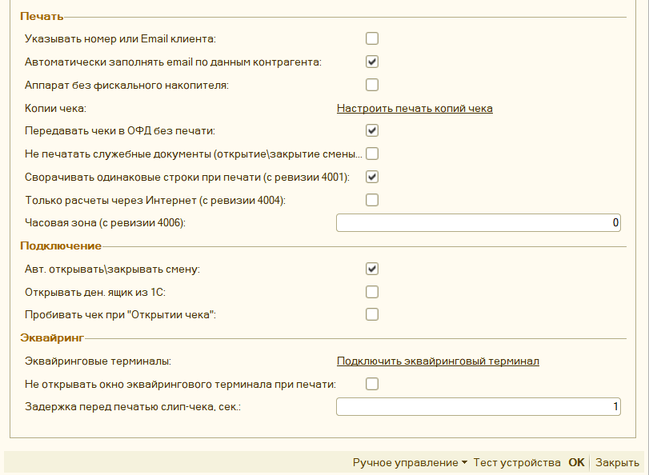

# Параметры обработки #

>**Важно**: при изменении параметров обработки, необходимо перезапускать 1С, чтобы эти параметры обновились в настройках.

## Основные параметры ##

**«Путь к ключу лицензирования»** - путь к лицензии на обработку. Заполняется, в
случае использования способа «**Лицензия**» (см.
«[Лицензирование](#_Лицензирование)**»**). Для использования обработки способом
«**Демо**» заполнение не требуется.

**«Лицензирование»** - определяет способ использования обработки, Возможны
следующие варианты «**Демо**», «**Лицензия**» или «**Ферма RDP-серверов**». См.
[Лицензирование](#_Лицензирование)

**«Путь к файлу технической поддержки»** - путь к файлу технической поддержки.
Файл указывает, какая именно версия обработки доступна. Заполняется, если
компьютер отключен от интернета или имеет нестабильный интернет. См.
[Лицензирование](#_Лицензирование)

**«Система налогообложения»** - данное поле обязательно для заполнения,
отвечает, какая система налогообложения будет передана на печать. Является
**системой налогообложения по умолчанию** при использовании функционала
[«Распределение СНО»](#_Распределение_по_разным).

**«Распределение по секциям»** - позволяет настроить использование разных секций
налогового учета в чеке, в том числе в разрезе складов. **«**[Распределение по
секциям](#_Распределение_по_номерам)**»**

**«Дополнительное оборудование»** - позволяет указать параметры подключения
дополнительных фискальных регистраторов к данной обработке (см. [«Подключение
дополнительного оборудования»).](#РаспределениеПоФР)

**«Шаблон документа»** - позволяет напечатать внутри фискального чека
собственный текст. Для каждого типа документа задается собственный шаблон. Можно
задать шаблон для строки номенклатуры (см. [«Шаблон документа
печати»](#_Шаблон_документа_печати)).

**«Распределение по СНО»** - позволяет задать условия использования разных
систем налогообложения в одном чеке (см. [«Распределение
СНО»](#_Распределение_по_разным)).

**«Настройка открытия формы проверки печати» -** позволяет задать, открывать для
выбранного документа [«Форму проверки печати»](#_Форма_проверки_печати), либо не
открывать. По умолчанию, форма открывается всегда (см. [«Настройка открытия
формы»](#_Настройка_открытия_формы)).

**«Ставка НДС \<По умолчанию\>» -** позволяет задать, какую ставку НДС
использовать при заполнении чека, нужно использовать, если не устраивает
стандартный способ заполнения. Для настройки см. [Механизм
распределения](#МеханизмРаспределения)

**«Путь до собственного обработчика»** - путь до внешней обработки, в которой
реализован дополнительный функционал для печати. Например, можно задать
собственный способ для печати. Сама обработка лежит в архиве с основной, также
записано несколько видео по ее разработке: [ссылки на
видео](https://www.youtube.com/watch?list=PLv043XNq9i-4GdAZ521a7GR_ft1Me9OWP&v=5t4pye9cRd8)

## Дополнительные параметры ##

**«Куда сохранять чек»** - путь к папке на компьютере, куда обработка может
сохранять сформированные чеки, либо то, что необходимо отправить на email
клиенту или по смс.

**«Рассылка чеков EMAIL средствами 1С»** - определяет параметры отправки чеков
на EMAIL из 1С через встроенные механизмы (см. «[Рассылка чеков средствами 1С по
Email](#_Рассылка_чеков_средствами)»).

**«Рассылка чеков SMS средствами 1С»** - определяет параметры отправки чеков по
SMS из 1С через встроенные механизмы (см. «[Рассылка чеков средствами 1С по
SMS](#_Рассылка_чеков_по)»).

**«Email отправителя»** - содержит Email вашей организации. Передается в ОФД
вместе с печатью чека. Указывать необязательно.

**«Ограничение времени продажи» -** позволяет настроить временной интервал
продажи товара. Например, ограничение на продажу алкоголя.

**«Настройка формы проверки печати» -** позволяет выборочно настраивать
доступность элементов формы проверки печати (см. «[Настройка формы проверки
печати](#_Настройка_формы_проверки_1)»).

**«Брать информацию о кассире из»** - позволяет определить откуда необходимо
брать информацию о кассире в чеке. Возможные варианты:

- Реквизит «Ответственный» - если в документе есть поле «Ответственный», либо аналогичные ему, то информация будет взята из документа. Однако при открытии и закрытии смены будет использован текущий пользователь;
- Текущий пользователь – система попытается определить текущего пользователя информационной базы
- Указать вручную – данные о кассире будут взяты из параметров обработки.
**«Кассир»** - имя кассира, которое будет отображаться в чеке. Если оно не
заполнено, то будет передано имя текущего пользователя 1С.

**«ИНН Кассира»** - ИНН кассира, которое будет передаваться в ОФД. Если не
заполнен, то обработка попытается определить ИНН кассира самостоятельно:
проверит, есть ли у пользователя или прописанного этому пользователю физлица
реквизит ИНН, либо указана информация в поле комментарий, либо дополнительное
свойство «ИНН».

**«Должность кассира»** - должность кассира, которая будет отображаться в чеке, является дополнением к параметру **«Кассир по умолчанию»**

## ЕНВД, УСН, Нефискальные чеки ##

**«Печатать вместо номенклатуры одно наименование»** - применяется для организаций, где не нужно учитывать проданный товар. При включении на печать выводится только одна строка, где количество равно одному, а цена равна сумме платежа. Текст для печати выбирается в параметрах **«Номенклатура по умолчанию»**.

**«Номенклатура по умолчанию»** - содержит текст, который будет напечатан в чеке, если включен параметр **«Печатать вместо номенклатуры одно наименование»**.

**«Условие подмены номенклатуры»** - позволят настроить условие, когда можно подменить одну номенклатуру на другую. См. [Задать условие подмены номенклатуры](#_Задать_условие_подмены)

**«Считать «НДС0%» как «БЕЗ НДС»** - указывает на то, как рассматривать нулевую
ставку НДС при печати чека, по умолчанию данный параметр включен.

**«Наименование организации»** - пока не задействован, используется для печати
нефискальных чеков. Данные не передается в ОФД.

**«ИНН»** - пока не задействован, используется для печати нефискальных чеков. Данные не передается в ОФД.

**«КПП»** - пока не задействован, используется для печати нефискальных чеков. Данные не передается в ОФД.

**«Наименование магазина»** - пока не задействован, используется для печати нефискальных чеков. Данные не передается в ОФД.

**«Наименование ОФД»** - наименование ОФД, которое будет отображаться в копии чека.

## Параметры драйвера ##

**«Указывать номер или Email клиента»** - влияет на то, будет ли открываться
окно для ввода Email и номера телефона клиента при формировании чека.

**«Автоматически заполнять email по данным контрагента»** - при включенном
параметре, программа будет пытаться определить email контрагента автоматически.

**«Аппарат без фискального накопителя»** - позволяет печатать чеки для тех
фискальных регистраторов, что не имеют фискального накопителя и переключены в
режим печати «ЕНВД».

**«Копии чека»** - позволяет настроить печать копии чека на обычный принтер. См.
[«Печать копии чека»](#_Печать_копии_чека)

**«Передавать чеки в ОФД без печати»** - если передается email или номер
телефона клиента, то чек не будет напечатан, а только будет передан в ОФД.

**«Авт. открывать\\закрывать смену»** - если параметр включен, то при печати
чека обработка проверяет статус смены, если смена превысила 24-часа, то она
автоматически закроет и откроет ее заново. Работает только если обработка
подключена как **«Фискальный регистратор»**

**«Открывать ден. ящик из 1С»** - если у фискального регистратора есть денежный
ящик, то он будет открываться из 1С при печати фискального чека.

**«Пробивать чек при «Открытии чека»** - используется, если обработка подключена
как «**Фискальный регистратор**», позволяет пробивать чека, не при операции
«Закрытии чека», а при «Открытии чека», проблема связана с тем, что на более
современных конфигурациях, убрали отмену чека при ошибке во время закрытия чека,
поэтому если у вас проводятся чеки, даже если закончилась бумага на Фискальном
регистраторе, то вам нужно включить данный параметр.

**«Эквайринговые терминалы»** - позволяет указать параметры подключения
эквайринговых терминалов к данной обработке (см. [Подключение эквайринговых
терминалов](#_Подключение_эквайринговых_терминало))

**«Не открывать окно эквайрингового терминала при печати» -** данный параметр
отключает открытие окна с суммой, что будет пробита на эквайринговом терминале,
также в этом окне можно указать ссылочный номер пробитого чека на эквайринге,
необходим при возвратах.

**«Задержка перед печатью слип-чека, сек» -** позволяет увеличивать задержку
перед печатью слип-чека на эквайринге, что полезно, если на фискальном
регистраторе нет автоматической отрезки. Работает, если печать происходит через
фискальный регистратор. Максимальное время задержки 40 секунд.

## Параметры документов ##

**«Ограничить количество фискальных строк»** - исправление ошибки оборудования
«Переполнение буфера», связанной с нехваткой оперативной памяти аппарата. При
заданном ограничении чек будет разбит на несколько маленьких. **Важно**: при
таком варианте будет несколько фискальных чеков. Не используется, если значение
0.

**«Ограничить длину номенклатуры»** - исправление ошибки оборудования, связанной
со слишком большой длиной фискальной строки. При заданном ограничении текст
фискальной строки будет обрезан до заданной длины. Не используется, если
значение 0.

**«Заменить ставку НДС 18% на 20%»** - заменяет переданную ставку НДС 18% на
20%, подходит для старых конфигураций, не поддерживающих новую ставку.

**«Аппарат не воспринимает ставку НДС 20%»** - необходимо включить, если при
печати чека с НДС 20% фискальный регистратор выдает ошибку. Тогда обработка
передаст на оборудование ставку 18%, но с суммой НДС равной НДС 20%.

**«Смещать дату чека коррекции»** - необходимо включить, если при печати чека
коррекции дата основания смещается на день.

**«Подсчитывать номер чека средствами обработки»** - необходимо включить, если
нумерация чеков не начинается с 1 в начале смены, а передается сквозная.

**«Отключить окно выбора документа»** - если обработка не сможет определить
документ перед печатью чека, то появится окно с выбором документа вручную,
данная настройка позволяет его отключить, однако все равно нужно переопределить
функционал печати через доп обработчик.

**«Предварительно проверять пробитие чека»** - перед пробитием чека обработка
дополнительно проверяет пробит ли чек ранее по этому документу, такой параметр
стал актуален на новых конфигурациях на обычных формах, в них убрали данную
проверку.

**«Печатать «ОСНОВАНИЕ» в ПКО и РКО»** - позволяет вначале документа напечатать
текстовую строку «Основания». Например, **«Контрагент такой-то Основание
документа такое-то».** Строка основания будет напечатана, если в тексте нет
фискальных строк с тем же самым текстом.

**«Источником ставки НДС в чеке будет»** - данный параметр определяет какая
ставка НДС будет проставляться в кассовые документы: по документу основания,
либо по текущему документу. Возможны варианты: «Кассовый документ» или «Документ
основания»

**«Игнорировать данные Фронт-кассира»** - используется для конфигураций Рарус,
если включен, то при печати через форму «фронт кассира» или «фронт менеджера»,
несмотря на указанные в ней товары, данные для печати будут взяты прямо из
документа основания, однако суммы оплаты будут все равно взяты и фронт кассира.

## Параметры для ФФД ##

**«Распределение, когда оплата частичная»** - данная настройка определяет, как
обойтись с разницей между суммой платежа и суммой документа. Можно задать
несколько условий:

- «РАСПРЕДЕЛЯТЬ СТРОКИ» - при печати автоматически «строка распределения» уменьшит количество в чеке, так чтобы оно подходило под данную сумму, возможны дробные значения для штучного товара;

- «ЗАМЕНИТЬ НА АВАНС» - заменяет все фискальные строки на текст «Оплата по документу основание» и признак способа расчета «Аванс» и признак предмета расчета «Платеж»

- «ЗАМЕНИТЬ НА ЧАСТИЧНУЮ ОПЛАТУ» - заменяет все фискальные строки на текст «Оплата по документу «Основание», признак способа расчета «Предоплата частичная» и признак предмета расчета «Платеж»

- «ЗАМЕНИТЬ НА "НОМЕНКЛАТУРА ПО УМОЛЧАНИЮ"» - заменяет все фискальные строки на текст из реквизита «Номенклатура по умолчанию», Признак предмета расчета «Передача с полной оплатой» и признак предмета расчета «Товар»

- «СТАНДАРТНО» - оставляет стандартный вариант распределения, когда при частичной оплате передается весь чек, однако в поле оплаты появляется дополнительный вид оплаты «Постоплата» или «Зачет аванса» с разницей между фактической оплатой и общей суммой документа.

**«Признак Агента»** - позволяет настроить условие, когда и какой признак агента, и данные по агентскому договору необходимо заполнять в чеке. См. [«Распределение по договорам Агента»](#_Распределение_по_договорам)

**«Поставщик агента»** - позволяет указать данные поставщика агента, которые будут выводиться в чеке. См. «[Настройка поставщика агента](#_Настройка_поставщика_агента)»

**«Признаки предмета расчета»** - позволяет настроить условие, когда и какой
признак предмета расчета необходимо заполнять в чеке. См. [«Настройка признаков
предмета расчета»](#_Настройка_признаков_предмета)

**«Признаки способов расчета»** - позволяет настроить условие, когда и какой
признак способов расчета необходимо заполнять в чеке. См. [«Настройка признаков
способа расчета»](#_Настройка_признаков_способа)

**«Адрес Магазина»** - для формата обмена ФФД 1.05 и ФФД 1.1, содержит Адрес
магазина, который будет передан в ОФД, также может быть использован для печати
нефискальных чеков.

**«Место расчетов»** - для формата обмена ФФД 1.05 и ФФД 1.1, содержит место
расчетов, которое будет передано в ОФД.

**«Номер ГТД и Страна»** - позволяет задать условие передавать информацию о
Номере таможенной декларации и коде страны происхождения товара. См. [«Настройка
печати реквизитов ГТД и Страны»](#_Настройка_печати_реквизитов)

**«Данные о получателе»** - позволяет задать условие передавать информацию о
покупателе или нет в чек. См. [«Настройка печати получателя и его
ИНН»](#_Настройка_печати_получателя)

## Маркировка ##

**«Использовать маркировку лекарств»** - специальная настройка для использования
продажи лекарств. При ее включении становится доступно использование льгот и
рецептов при продаже лекарств, дробная продажа упаковки лекарств, а также при
этом будут автоматически заполняться теги 1084, 1085, 1191.

**«Идентификатор места деятельности МДЛП»** - идентификатор места продажи,
передается в составе тега 1085, является обязательном при продажи лекарств.

**«Типы маркировок»** - позволяет настроить условие, когда и какой тип
маркировки необходимо заполнять в чеке. Используется для маркировочной
продукции: Табак, алкоголь, лекарства и т.д. См. [Настройка типа
маркировки](#_Настройка_типов_маркировки)

**«Не пробивать чек без указания маркировки «ПРОДАЖА»»** - если в чеке
используется продукция с маркировкой, то чек на Приход не будет пробит, если
какая-то позиция не будет заполнена.

**«Не пробивать чек без указания маркировки «ВОЗВРАТ»»** - если в чеке
используется продукция с маркировкой, то чек на Возврат не будет пробит.

## Служебное ##

**«Дополнительные параметры»** - позволяет указать собственные параметры,
которые можно использовать в коде доп обработчика. См. [«Дополнительные
параметры»](#_Дополнительные_параметры.)

**«Оборудование»** - указывает на то, какую компоненту для работы с
оборудованием будет использовать обработка.

**«Путь до компоненты ТО»** - путь к папке на компьютере, где находятся
компоненты для работы с торговым оборудованием. Должен быть всегда заполнен.

**«Использовать COM Обертку над NATIVE»** - данный параметр влияет на то, нужно
ли использовать специальную компоненту для работы с компонентами Native, это
нужно, если у вас платформы 8.1, либо у вас возникли сложности при стандартном
подключении. Компонента называется Universal Native Wrapper и лежит с остальными
компонентами.

**«Использовать логирование ККТ»** - указывает нужно ли вести подробную запись
действий с фискальным регистратором. Нужен для отладки и проверки механизма
печати. Работает, если заполнен параметр «**Путь папки лога**».

**«Путь папки лога»** - путь до папки на компьютере, где будет храниться лог
действий пользователя. Лог сохраняется в файл Log54FZ.txt, с указанием текущего
дня. Работает, если включен параметр «**Использовать логирование ККТ**».

**«Подключение кассы» -** параметр может принимать два состояния:

- "СТАНДАРТНО" – при такой настройке оборудование всегда будет находиться в
    состоянии подключено, при разрывах соединения с кассой могут быть ошибки,
    этот параметр значительно увеличивает скорость печати.

- "НЕСКОЛЬКО РАБОЧИХ МЕСТ НА КАССЕ" - используется, если на фискальный
    регистратор одновременно могут печатать несколько компьютеров, что-то вроде
    очереди печати;

«**Время ожидания переподключения**» - используется, когда параметр
**«Подключение кассы»** установлен как **"НЕСКОЛЬКО РАБОЧИХ МЕСТ НА КАССЕ",**
обозначает время, при котором обработка будет ждать подключения, если при печати
касса оказалась занята на другом рабочем месте.

**«Прокси» -** позволяет настроить отправку http запросов обработки через
прокси-сервер, например это необходимо для передачи данных на сервер sms
рассылки, или для работы сервера лицензирования. См. [настройка подключения
прокси](#_Подключение_через_прокси)

## Ручное управление ##

![Ручное управление(media/48a23ad1014bbcba6443c159a494b686.png)

**«Открыть смену»** - открывает смену на данном фискальном регистраторе.

**«Закрыть смену»** - закрывает смену на данном фискальном регистраторе.
Отличается от типовой процедуры тем, что не формирует документ отчет о продажах.

**«Внесение»** - позволяет внести денежные средства в кассу.

**«Выемка» -** позволяет сделать выемку денежных средств из кассы.

**«Получить текущее состояние»** - отображает информацию о фискальном
регистраторе: Номер смены, Номер текущего документа, Статус смены, Количество
непереданных фискальных документов, Номер первого непереданного фискальных
документов, Дата первого непереданного фискального документа.

**«Отчет о состоянии расчетов»** - формирует фискальный документ «Отчет о
состоянии расчетов».

«**X-Отчет»** - формирует отчет без гашения (x-отчет) на фискальном
регистраторе.

**«Чек коррекции»** - открывает форму для формирования чека коррекции, данную
кнопку нужно использовать, если ваша конфигурация не содержит документ «Чек
коррекции»

**«Открыть денежный ящик»** - открывает денежный ящик на данном фискальном
регистраторе.

**«Параметры фискализации»** - открывает форму с регистрационными данными вашего
фискального регистратора. Например, можно узнать какой формат обмена с налоговой
данный поддерживает аппарат.

**«Сохранить настройки в файл»** - позволяет сохранить параметры обработки в
файл для последующего восстановления. Можно переносить настройки с одного
рабочего места на другое.

**«Восстановить настройки из файла»** - позволяет восстановить ранее сохраненные
параметры обработки.

**«Лицензирование»** - открывает форму лицензирования, где можно активировать
или деактивировать лицензию на обработку.

**«Скачать обработку»** - открывает окно, где можно скачать последнюю доступную
версию программы.

**«Дополнительные покупки»** - открывает окно, где можно приобрести
дополнительные лицензии, или продлить тех поддержку.

**«Написать разработчику»** - открывает форму, где можно отправить письмо
разработчику (не используя почтовую рассылку), сообщить об ошибке, либо
высказать пожелания о доработке.
