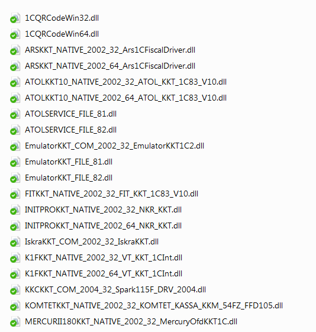
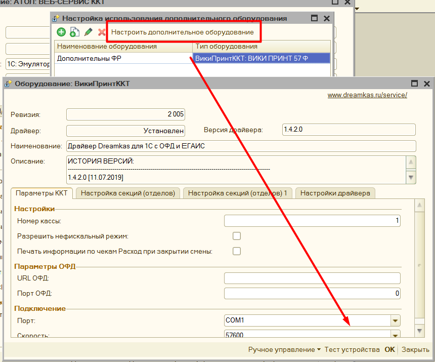

# Подключение #

1. Установите драйвера для вашего оборудования, их можно скачать с официального
    сайта производителя.

2. Добавить обработку в торговое оборудование, обработка подключается как
    «**фискальный регистратор**» или как «**ККТ**», если ваша программа
    поддерживает такой способ подключения

3. Скачайте из публикации архив «**Макеты компонент**» и распакуйте его в любое
    место.

4. В 1С откройте параметры обработке, согласитесь с лицензионным соглашением,
    заполните параметры: Оборудование, Версия формата обмена, Система
    налогообложения, Лицензирование.

5. В поле «**Путь к компонентам ТО**» укажите путь к папке, куда вы распаковали
    архив «**Макеты компонент**». Нажмите «**Активировать**», если в папке есть
    компонента, которая поддерживает работу с вашей программой 1С, то откроются
    окно настройки обработки, иначе программа выдаст ошибку.

Возможно, потребуется отдельная регистрация компоненты драйвера вашего
фискального регистратора как внешнюю библиотеку. Компоненты для работы с
торговым оборудованием находятся в архиве «Макеты компонент», каждый файл в
архиве соответствует оборудованию и формату обмена.

Наименование файлов задано по определенному шаблону:

[**Наименование оборудования**]*[***Тип компоненты***]*[**Тип драйверов**]*[Тип
платформы 1С]*[**Наименование драйвера в реестре**]

Например, в наименовании компоненты ATOLKKT_COM_2001_32_ATOL_KKM_1C82_54FZ .
Наименование оборудования: ATOLKKT, Тип компоненты: COM, Тип драйверов: 2001,
Тип платформы 1С: 32 битная, наименование драйвера в реестре: ATOL_KKM_1C82_54FZ

Вы можете добавить свои компоненты, если сформируете их наименование по данному
шаблону.

**Ссылка на видео**: [Как подключить обработку](https://www.youtube.com/watch?v=i_1eexDzheM)

## Особенность подключения 8.1 ##

Для корректной работы с компонентами Native на платформе 8.1 необходимо дополнительно зарегистрировать 2 компоненты. Они находятся в каталоге с другими
компонентами, и называются **WrapperNative.dll** и
**UniversalNativeWrapper.dll**. Зарегистрировать их нужно через командную строку командой **regsvr32.** Данные компоненты работают как обертка для **Native** компонент, без их регистрации не будет работать печать QR кодов, и драйвера оборудования, работающие через **Native**, например, АТОЛ.

> **Примечание:**
> **NATIVE** компоненты – это такие dll, использующие внутренний формат 1С, что позволяет их не регистрировать как компоненты com

Пример: [Как зарегистрировать компоненту](http://fb.ru/article/290527/kak-zaregistrirovat-dll-tri-sposoba)

## Особенность подключения Linux ##

Для корректной работы обработки на Linux необходимо скачать вместо «Макеты компонент для Windows» «макеты компонент для Linux», в остальном же способ подключения и активации точно такой же.

## Особенность подключения Рарус ##

Для конфигураций Рарус Альфа-Авто 4 и 5-й версии, для того, чтобы можно было
использовать функционал печати чеков через формы «Фронт кассира» и «Фронт
менеджера» нужно сделать доработку как на [этом видео](https://www.youtube.com/watch?v=KY9TM6lczlA), и при этом приобрести **«комплект интеграции Рарус»**

## Особенность подключения Далион ##

Если вы хотите встроить обработку для работы онлайн кассами так, чтобы можно
было печатать чеки прямо из документов, то нужно приобрести отдельно «**комплект интеграции Далион**» и подключить его по этой [видео инструкции](https://www.youtube.com/watch?v=1iRL_sfTyyE)

## Особенность подключения УТ 10.2 ##

Для конфигурации **Управление торговлей 10.2** нет типового способа подключить обработку для печати прямо из документов, поэтому необходимо приобрести также
«**Комплект интеграции УТ 10.2**» и доработать конфигурацию по этой [видео инструкции](https://www.youtube.com/watch?v=P2aMi6Kd7Tc).

**Обратите внимание,** хоть перечисленные конфигурации и требуют комплект интеграции, использовать обработку можно и без них. Для этого откройте обработку через «Файл» - «Открыть». Откроется окно «**формы отладки**», в ней можно
добавить новое подключение к оборудованию, и печатать чеки по кнопке «Напечатать фискальный чек» - «Предопределенный»

## Подключение эквайринговых терминалов ##

В обработку можно подключить эквайринговый терминал, минуя стандартный способ
подключения. Для этого в форме настройки нужно заполнить «Путь к компонентам»,
где указывается путь к компонентам эквайринга, данные компоненты можно скачать
там же, где была загружена основная обработка.

Для подключения эквайринга, нужно выбрать тип оборудования из списка, и указать произвольное наименование. Затем нажать «**Настроить дополнительное оборудование**», в открывшейся форме указать параметры подключения эквайринга.
После этого можно проверить подключение по кнопке «**Тест устройства**». Также в данной форме по кнопке «Ручное управление» можно снять «**Итоги дня по картам**».

Когда подключение успешно, то необходимо будет указать условие, когда применять эквайринговый терминал для этого см. [Механизм распределения](#МеханизмРаспределения)

## Подключение дополнительного оборудования ##

К обработке помимо основного фискального регистратора можно подключить и дополнительные, данный функционал можно использовать, когда необходимо, например, разделить акцизный товар с обычным и пробивать его по другой кассе, либо есть другой фискальный регистратор, зарегистрированный на другую организацию. Для этого добавьте новую строку, укажите тип оборудования и произвольное наименование.

Нажмите на кнопку «**Настроить дополнительное оборудование**», откроется окно аналогичное форме с параметрами основного фискального регистратора, однако в нем будут только параметры для физического подключения оборудования, значения остальных полей будут браться из настроек основного оборудования.

Для настройки распределения фискальных регистраторов по чекам см. [Механизм распределения](#МеханизмРаспределения)
