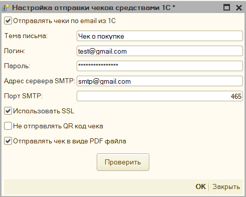
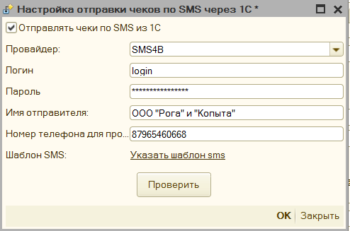

# Рассылка и передача данных покупателя

## Рассылка чеков средствами 1С по Email

В обработке предусмотрен механизм отправки чеков по Email, минуя ОФД, для этого необходимо в параметрах обработки заполнить данные для подключения. Чек отправляется в виде письма на почту, где содержимое чека может быть либо в теле
письма, либо прикреплено как вложение.

**«Тема письма»** - тема письма, которое будет отправлено клиенту.

**«Логин»** - email учетной записи, обязательно должен содержать символ \@.

**«Пароль»** - пароль учетной записи вашей почты

**«Адрес сервера SMTP» -** адрес сервера SMTP, например, для Gmail он будет smtp.gmail.com, этот параметр и порт можно посмотреть в интернете, на сайте, соответствующем вашей почте.

**«Порт SMPT»** - порт сервера SMTP.

**«Использовать SSL»** - указывает использовать ли защищенное соединение при отправке почты, в современных почтах SSL обычно всегда включен.

**«Не отправлять QR код чека»** - указывает, что при отправке чека по почте qr-код чека при этом не будет передаваться.

**«Отправлять чеки в виде PDF файла»** - доступно только для платформы 8.2 и 8.3, сохраняет чек в виде pdf файла и прикрепляет его к письму и отправляет его в качестве вложения.

«**Проверить**» - кнопка для проверки подключения к учетной записи вашей почты, при нажатии отправляет тестовое письмо на ваш email.

**Примечание**: если возникает вопрос откуда получить параметры подключения к почте, то можно посмотреть, как это реализовано у google: <https://support.google.com/mail/answer/7126229?visit_id=637102020096722822-631526299&p=syncdmail&rd=1>

## Рассылка чеков по SMS

В обработке предусмотрен механизм отправки чеков по SMS, минуя ОФД, для этого необходимо в параметрах обработки заполнить данные для подключения. Чек отправляется в виде простой строки, которая содержит данные по Регистрационному номеру ККТ, фискальному признаку чека, сумме оплаты, и дате покупки, а также включает в себя ссылку на сайт nalog.ru, где можно проверить чек по фискальному признаку, вы также можете настроить собственный шаблон такого sms сообщения через специальную форму. Обратите внимание, что для отправки чеков у вас должен быть заключен и оплачен договор с одним из sms-провайдеров.

**«Провайдер»** - фирма, предоставляющая услугу по SMS рассылки.

**«Логин»** - login для подключения сервису, для разных sms провайдеров данный параметр может меняться.

**«Пароль»** - пароль для подключения к сервису.

**«Имя отправителя» -** Имя организации, как она будет отображаться во входящей SMS.

**«Номер телефона для проверки»** - номер телефона, на который должно уйти тестовое SMS

**«Шаблон SMS»** - шаблон строки, которая будет передана для отправки по SMS.

«**Проверить**» - кнопка для проверки подключения к учетной записи SMS провайдера, при нажатии отправляет тестовое SMS на «номер для проверки».

Примечание: если возникает вопрос откуда получить параметры подключения к sms-рассылке, то можно посмотреть, как это реализовано у сервиса SMS-Центр <https://smsc.ru/api/?SE=9f54412c>

## Форма ввода Email и Номера телефона

Чтобы при печати появилась возможность вводить номер телефона или email клиента необходимо в параметрах обработки включить параметр «**Указывать номер или Email клиента»**. Одновременно в данную форму может быть введен только один вид
контактной информации.

Данные окно поддерживает «**горячие клавиши**»:

- кнопка «**1**» – открывает окно ввода email

    

- кнопка «**2**» – открывает окно ввода номера телефона

    

- кнопка «**3**» – можно изменить способ фискализации, если параметр «Электронно» включен и заполнен либо адрес электронной почты, либо телефон, то чек не будет выведен на печать, а отправится сразу в ОФД.

- кнопка «**Enter**» - продолжить печать с введенными данными.

- кнопка «**ESC**» - отменить печать.

Поддерживает работу со сканером штрих-кода или магнитным считыватель, если контактная информации закодирована в определенный штрихкод или магнитную карту, то ее можно прочитать, и она автоматически добавится в данную форму
