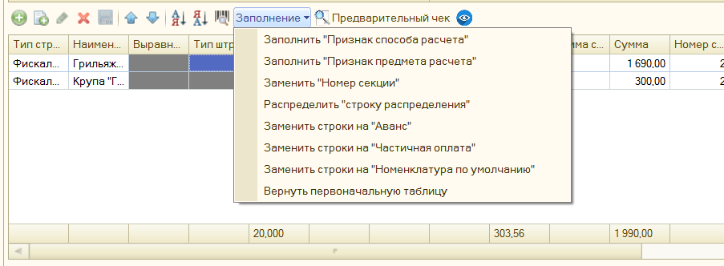
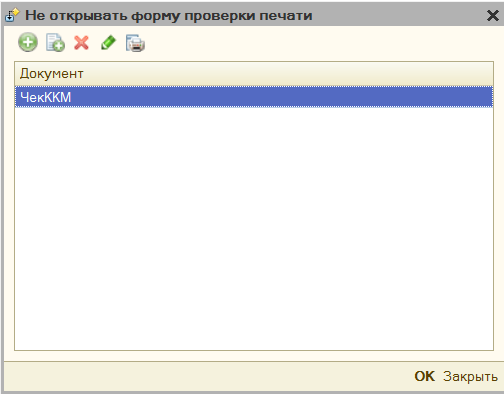
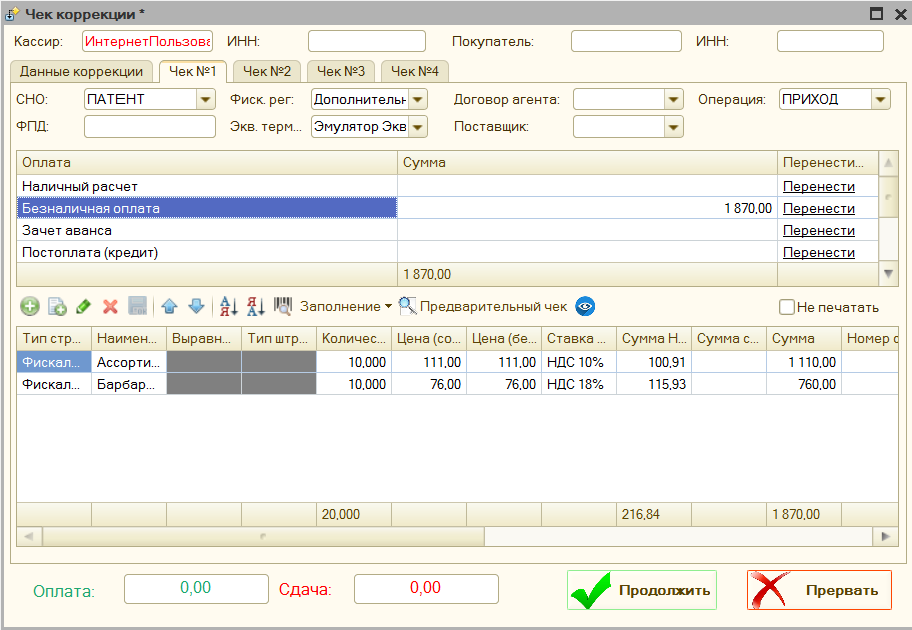

# Форма проверки печати (Рабочее место кассира) #

Форма проверки печати открывается автоматически, при печати любого документа.
Она используется для проверки содержимого фискального чека, а также при
необходимости его редактирования. Открытие данной формы можно отключить, для
этого в параметрах обработки есть соответствующий параметр. См. «**[Настройка
открытия формы](#_Настройка_открытия_формы)**»

1. **Основные реквизиты чека** – позволяет настроить основные реквизиты чека:
   

   К основным реквизитам чека относятся: Кассир, Инн кассира, Покупатель, ИНН Покупателя, Email покупателя, телефон покупателя, Имя реквизита пользователя (тег 1084), Значение реквизита пользователя (тег 1085), электронный чек.

   

   «**Реквизиты МДЛП**» - заполнить эти реквизиты можно при включении параметра «**Использовать маркировку лекарств**», в этом окне можно указать Процент льготы, Номер серии льготного рецепта, Номер льготного рецепта, Дата регистрации льготного рецепта, Идентификатор места деятельности МДЛП.

1. **СНО** – система налогообложения, под которой будет пробит чек.
1. **Фиск. рег.** – фискальный регистратор, на котором будет пробит чек.
1. **Договор агента** – имя заранее добавленного в параметры обработки договора агента.
1. **Операция** – операция фискального чека: приход, возврат прихода, расход или возврат расхода.
1. **ФПД (тег 1192)** – фискальный признак документа, используется для возвратов, когда нужно указать фискальный признак предыдущего документа, это тег 1192
1. **Экв. терминал** – эквайринговый терминал, на котором будет пробита безналичная информация.
1. **Поставщик** – имя заранее добавленного в параметры обработки поставщика, работает в паре с договором агента.
1. **Оплаты** – раздел оплаты, где можно вручную скорректировать суммы оплаты. Кнопка «Перенести» может переносить оплаты между фактическими суммами («наличные» и «безналичная оплата») и виртуальными («постоплата (кредит)», «зачет аванса», «встречное предоставление»)
1. «**Ввести код маркировки вручную**» - открывает форму, где можно указать штрихкод для маркировочного товара. Доступен вызов по кнопке F7
1. **Заполнение** – меню, где можно запустить команды для редактирования позиций чека: 

   - Заполнить «Признак способа расчета» - позволяет указать для всех позиций чека «Признак способа расчета»
   - Заполнить «Признак предмета расчета» - позволяет указать для всех позиций чека «Признак предмета расчета»
   - Заполнить «Номер секции» - позволяет указать для всех позиций чека Номер секции
   - Распределить «строку распределения» - если в чеке присутствует строка с отрицательной суммой с наименованием «Строка распределения», то будет автоматически разнесена на остальные строки, путем уменьшения количества и суммы по остальным позициям чека.
   - Заменить строки на «Аванс» - заменяет все строки чека на одну строку с наименование «Оплата по Покупатель основание такое-то», признаком способа расчета «Аванс», признаком предмета расчета «Платеж», и удаляются виртуальные оплаты: «Зачет аванса» и «Постоплата»
   - Заменить строки на «Частичная оплата» - заменяет все строки чека на одну строку с наименование «Оплата по Покупатель основание такое-то», признаком способа расчета «Предоплата частичная», признаком предмета расчета «Платеж», и удаляются виртуальные оплаты: «Зачет аванса» и «Постоплата»
   - Заменить строки на «Номенклатура по умолчанию» - заменяет все строки чека на одну строку с наименование указанным в параметре обработки «Номенклатура по умолчанию», признаком способа расчета «Передача с полной оплатой», признаком предмета расчета «Товар», и удаляются виртуальные оплаты: «Зачет аванса» и «Постоплата»
   - Вернуть первоначальную таблицу – отменяет все внесенные изменения и восстанавливает таблицу с позициями чека.

1. «**Предварительный чек**» - формирует на основании текущих данных предварительный чек и выводит его на экран. 

1. «**Настройка видимости колонок**» – позволяет настроить видимость колонок, в таблице позиции чека, например, можно отключить видимость данных о договоре агента, если он не используется. 

1. «**Не печатать**» - позволяет отключить печать выбранного чека, данный флажок доступен, когда при печати получается 2 и более чеков.

1. «**Позиции чека**» - таблица, которая содержит фискальные строки чека, их можно отредактировать вручную

## Настройка открытия формы проверки печати ##

Для того, чтобы для определенных документов не открывалась «форма проверки печати», необходимо это указать в параметре «**Настройка открытия формы проверки печати**» [обработки](#НастройкаОткрытияФорм). Сюда необходимо добавить имя документа, для которого не нужно открывать формы проверки печати.

## Настройка формы проверки печати ##

Данная форма позволяет настроить доступность полей «**формы проверки печати**», можно открыть через параметры обработки.

- **Редактировать позиции чека** – включает возможность редактировать позиции чека в форме проверки печати. По умолчанию, включено.

- **Редактировать позиции оплаты** – включает возможность редактировать данные об оплате в форме проверки печати. По умолчанию, включено.

- **Редактировать данные кассира** – включает возможность редактировать имя и инн кассира в форме проверки печати. По умолчанию, включено.

- **Редактировать систему налогообложения** – включает возможность редактировать систему налогообложения в форме проверки печати. По умолчанию, включено.

- **Редактировать тип операции** – включает возможность редактировать тип операции в форме проверки печати. По умолчанию, включено.

- **Редактировать дополнительные поля** - включает возможность редактирования полей «Фиск. рег», «Экв. терминал», «ФПД», «Поставщик», «Договор агента» в форме проверки печати. По умолчанию, включено.

- **Редактировать данные маркировки** - включает возможность редактирования
    полей «Тип маркировки», «GTIN», «Серийный номер», «Маркировка BASE64». По
    умолчанию, включено.

## Чек коррекции ##

>Не путайте чек коррекции и чек на возврат. Чек коррекции отбивается, если нужно исправить ошибку (факт неприменения ККТ), а если нужно оформить возврат
товара, то нужно отбить обычный кассовый чек с указанием признака расчета «возврат прихода».

Обработка поддерживает использование чека коррекции. Если ваша конфигурация содержит в себе такой документ, то печать можно произвести из него. Если же нет,
то печать данного чека можно сделать из параметров обработки – Ручное управление. См. [Чек коррекции](#ЧекКоррекции)

Также вы можете добавить чек коррекции в ваш документ, подключив к нему внешнюю печатную форму «ВПФ_ЧекКоррекции», которая находится вместе с основной
обработкой.

Обязательными для заполнения являются поля «Основание коррекции» (можно указать
числовой номер документа), «номер» и «дата коррекции».

>**Обратите внимание**: что полноценная работа с чеком коррекции доступна для более новых компонент оборудования (ревизии 3000 и выше), поэтому для старых компонент, если Тип коррекции «Неприменение ККТ», будет сформирован чек коррекции без указания номенклатуры, для типа коррекции «Исправление ошибок» - будет сформировано 2 чека: обычный чек возврата и уже корректный чек прихода.

### Форма чека коррекции ###

Чек коррекции сохраняется в каталог «[Куда сохранять чек](#КудаСохранятьЧек)»
